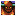

Shiren DS2's version of the series favorite unidentified items post-game dungeon. The first clear only requires you to reach 30F, and then the full 99F version is unlocked. An Escape Scroll can be found on 20F, 40F, and 60F.

<ul class="quickLinksUL">
  <li><a href="#overview">Overview</a></li>
  <li><a href="#strategy">Strategy</a></li>
  <li><a href="#floor-guide">Floor Guide</a></li>
  <li><a href="#monsters">Monsters</a></li>
  <li><a href="#items">Items</a></li>
  <li><a href="#traps">Traps</a></li>
</ul>

# Overview

<table class="dungeonOverview">
  <tr>
    <th>Unlock</th>
    <td class="highlightYellow">Clear Pot Cave.</td>
  </tr>
  <tr>
    <th>Entrance</th>
    <td class="highlightYellow">Town of Ilpa (South exit)</td>
  </tr>
</table>

<table class="dungeonTable">
  <tr>
    <th>JP Name</th>
    <td colspan="3">奈落の果て</td>
  </tr>
  <tr>
    <th>Floors</th>
    <td colspan="3">30F (first) / 99F</td>
  </tr>
  <tr>
    <th>Bring Items</th>
    <td>No</td>
    <th>Allies</th>
    <td>No</td>
  </tr>
  <tr>
    <th>Bring Gitan</th>
    <td>No</td>
    <th>Bring Level Ups</th>
    <td>No</td>
  </tr>
  <tr>
    <th>Starting Item</th>
    <td colspan="3">Onigiri</td>
  </tr>
  <tr>
    <th>Unidentified</th>
    <td colspan="3">All categories</td>
  </tr>
  <tr>
    <th>Shops</th>
    <td>6-84F ※1</td>
    <th>Monster Houses</th>
    <td>6-98F ※1</td>
  </tr>
  <tr>
    <th>Clear Icon</th>
    <td class="clearIcon"></td>
    <th>Reward</th>
    <td>Wanderer's Mark</td>
  </tr>
</table>

※1 - No Shops or Monster Houses on 20F, 40F, or 60F.

# Strategy

### General

Read through the [Tips and Tricks](/guides/tips-and-tricks) page to gain some general knowledge related to this game. The [Identification](/guides/identifying-items) page will teach you how to identify items.

#### Blank Scroll

Blank Scroll is an item that lets you write the name of any scroll you've read in the past. It's recommended to read the following scrolls prior to attempting this dungeon if possible:

<table>
  <thead>
    <tr>
      <th>Tier</th>
      <th>Scroll</th>
    </tr>
  </thead>
  <tbody>
    <tr>
      <td>S</td>
      <td>Extinction, Explosion</td>
    </tr>
    <tr>
      <td>A</td>
      <td>Pot God, Plating, Heaven, Earth</td>
    </tr>
    <tr>
      <td>B</td>
      <td>Sanctuary, Navigation, Confusion, Purify</td>
    </tr>
  </tbody>
</table>

#### Wily Tanuki

See [Wily Tanuki](/guides/tips-and-tricks#wily-tanuki) to learn how to deal with disguised Wily Tanukis.

- Wily Tanuki - 4-9F
- Tricky Tanuki - 47-56F
- Crafty Tanuki - 77-88F

#### Pitcher Plant

Pitcher Plant monsters have an ability where items they eat get modified in various ways based on their level. Upgrade Plant doesn't spawn naturally, so you'll need to save a Happy Staff for Blessing Plant floors. It's best to save an Absorb Pot to make the most out of any Upgrade Plants you create.

- Lv1 Pitcher Plant (6-9F) - Transforms the item into a grass item.
- Lv2 Identify Plant (50-52F) - Identifies the item.
- Lv3 Blessing Plant (31-35F and 50-52F) - Blesses the item.
- Lv4 Upgrade Plant (Doesn't spawn naturally) - Upgrades the item.
    - Weapon or Shield - Upgrade value +5.
    - Bracelet - Repairs the bracelet if it's cracked.
    - Staff - Remaining use count +5.
    - Pot - Capacity increases to 5.
    - Scroll - Turns the scroll into a Blank Scroll.
    - Onigiri - The onigiri item gets bigger.
    - Spoiled Onigiri - Turns the item into a Huge Onigiri.
    - Arrow - Arrow count +5.

### Items

#### Weapon

##### Main Weapon

<table class="dungeonTable">
  <thead>
    <tr>
      <th>Name</th>
      <th>Atk</th>
      <th>Max</th>
      <th>Slot</th>
      <th>Notes</th>
    </tr>
  </thead>
  <tbody>
    <tr>
      <td class="highlightGray">Kabura's Blade</td>
      <td class="centeredText">18</td>
      <td class="centeredText">50</td>
      <td class="centeredText">2</td>
      <td>Few rune slots, but strong resonance if you can activate it. Kabura's Guard: Attack damage +5.</td>
    </tr>
    <tr>
      <td class="highlightGray">Fuuma Katana</td>
      <td class="centeredText">15</td>
      <td class="centeredText">30</td>
      <td class="centeredText">3</td>
      <td>Higher base attack, but lower upgrade limit and rune slots. Fuuma Shield: Max strength +5.</td>
    </tr>
    <tr>
      <td class="highlightGray">Demon Slayer</td>
      <td class="centeredText">13</td>
      <td class="centeredText">35</td>
      <td class="centeredText">4</td>
      <td>Likely your best choice unless you get lucky with resonance. Demon Shield: Max strength +4.</td>
    </tr>
    <tr>
      <td class="highlightGray">Katana</td>
      <td class="centeredText">9</td>
      <td class="centeredText">30</td>
      <td class="centeredText">5</td>
      <td>Low base attack, but lots of rune slots and nice resonance. Iron Shield: Max HP +20.</td>
    </tr>
    <tr>
      <td class="highlightGray">Beetle Axe</td>
      <td class="centeredText">12</td>
      <td class="centeredText">30</td>
      <td class="centeredText">4</td>
      <td>Slightly weaker Demon Slayer, basically. Beetle Shield: Max strength +3.</td>
    </tr>
    <tr>
      <td class="highlightGray">Dotanuki</td>
      <td class="centeredText">12</td>
      <td class="centeredText">40</td>
      <td class="centeredText">3</td>
      <td>Higher upgrade limit, but lower rune slot count. Diet Shield: Attack and defense +3.</td>
    </tr>
  </tbody>
</table>

##### Runes

Aim to synthesize any type-effective weapons you find, and also keep an eye out for Spark Sword (shop-exclusive). Priority: Spark Sword = Cyclops Killer = Sky Splitter &ge; Ghost Sickle &gt; Dragon Killer &gt;&gt; Drain Buster &gt;&gt; Crescent Arm ※ Ghost and Floating types often overlap, so some players prefer to synthesize only 1 of those 2 runes.

- Spark Sword - Critical hit after 2 missed attacks.
    - Critical hit is effective against Spry Hermit.
- Cyclops Killer - Deal more damage to Cyclops types.
    - Gazer, Ironhead, Sip Leech, Doze Mage, Explochin, Scurry Egg.
- Sky Splitter - Deal more damage to Floating types.
    - Pumphantasm, Death Reaper, Skull Mage, Ether Devil, Shady Wisp, Cell Armor, Gyadon, Zen Guru, Alert Fly.
- Ghost Sickle - Deal more damage to Ghost types.
    - Pumphantasm, Death Reaper, Skull Mage, Ether Devil, Shady Wisp, Ghost Warrior, Vampire Baron, Dark Vassal.
- Dragon Killer - Deal more damage to Dragon types.
    - Dragon, Floor Dragon, Dagyan, Glare Snake.
- Drain Buster - Deal more damage to Drain types.
    - Twisty Hani, Sip Leech, Slime, Fog Hermit, Sheep Priest, Lamp Puffer.
- Crescent Arm - Deal more damage to Bomb types.
    - Pop Tank, Wolf Droid, Explochin.

#### Shield

##### Main Shield

<table class="dungeonTable">
  <thead>
    <tr>
      <th>Name</th>
      <th>Def</th>
      <th>Max</th>
      <th>Slot</th>
      <th>Notes</th>
    </tr>
  </thead>
  <tbody>
    <tr>
      <td class="highlightGray">Kabura's Guard</td>
      <td class="centeredText">20</td>
      <td class="centeredText">35</td>
      <td class="centeredText">4</td>
      <td>Best shield in the dungeon, no contest. Kabura's Blade: Attack damage +5.</td>
    </tr>
    <tr>
      <td class="highlightGray">Fuuma Shield</td>
      <td class="centeredText">16</td>
      <td class="centeredText">30</td>
      <td class="centeredText">2</td>
      <td>High defense and upgrade limit, but few rune slots. Fuuma Katana: Max strength +5.</td>
    </tr>
    <tr>
      <td class="highlightGray">Iron Shield</td>
      <td class="centeredText">9</td>
      <td class="centeredText">35</td>
      <td class="centeredText">5</td>
      <td>Low base defense, but high upgrade limit and rune slots. Katana: Max HP +20</td>
    </tr>
    <tr>
      <td class="highlightGray">Beetle Shield</td>
      <td class="centeredText">13</td>
      <td class="centeredText">15</td>
      <td class="centeredText">6</td>
      <td>Good defense and rune slot count, but low upgrade limit. Beetle Axe: Max strength +3.</td>
    </tr>
    <tr>
      <td class="highlightGray">Demon Shield</td>
      <td class="centeredText">14</td>
      <td class="centeredText">10</td>
      <td class="centeredText">2</td>
      <td>Good defense, but very low upgrade limit and rune slots. Demon Slayer: Max strength +4.</td>
    </tr>
  </tbody>
</table>

##### Runes

Aim to synthesize any shields with useful runes you find from the following list. Priority: Power Shield &gt;&gt; Blast Shield = Holy Shield &gt; Dragon Shield = Diet Shield &gt; Counter Shield &gt; Wood Shield

- Power Shield - Increases your attack power.
    - Makes a significant difference in the amount of damage you deal as you progress.
- Blast Shield - Reduces explosion damage.
    - Useful against both Bomb type monsters and landmines.
- Holy Shield - Prevents your items from getting cursed.
    - Useful against both Curse Girls and Curse Traps.
- Dragon Shield - Reduces fire damage.
    - Not necessary if Sky Dragons are extinct.
- Diet Shield - 1/2 hunger rate (20 turns to deplete 1 fullness).
    - Significantly alleviates hunger concerns.
- Counter Shield - Reflects a portion of damage received back at an enemy.
    - Unlike GB2, Shiren won't face toward invisible monsters who attack, so it's a lower priority.
- Wood Shield - The shield will never rust.
    - It's usually better to use a Plating Scroll instead of synthesizing this.

#### Bracelet

<table class="dungeonTable">
  <thead>
    <tr>
      <th>Name</th>
      <th>Slot</th>
      <th>Notes</th>
    </tr>
  </thead>
  <tbody>
    <tr>
      <td class="highlightGray">Scout Bracelet</td>
      <td class="centeredText">2</td>
      <td>Reveals the locations of characters and items.</td>
    </tr>
    <tr>
      <td class="highlightGray">Vision Bracelet</td>
      <td class="centeredText">3</td>
      <td>Lets you see hidden traps and invisible monsters.</td>
    </tr>
    <tr>
      <td class="highlightGray">Heal Bracelet</td>
      <td class="centeredText">2</td>
      <td>Restore 5 HP per turn, but also doubles hunger rate.</td>
    </tr>
    <tr>
      <td class="highlightGray">Nirvana Bracelet</td>
      <td class="centeredText">3</td>
      <td>Stops natural fullness depletion.</td>
    </tr>
    <tr>
      <td class="highlightGray">Strider Bracelet</td>
      <td class="centeredText">2</td>
      <td>Lets you walk on water tiles.</td>
    </tr>
  </tbody>
</table>

##### Synthesis

1. Nirvana Bracelet + Heal Bracelet
2. Strider Bracelet + Vision Bracelet + Scout Bracelet

#### Other Items

<table class="dungeonTable">
  <thead>
    <tr>
      <th>Name</th>
      <th>Notes</th>
    </tr>
  </thead>
  <tbody>
    <tr>
      <td class="highlightGray">Plating Scroll</td>
      <td>Makes a weapon or shield rustproof, or repairs a cracked bracelet. Bless it before reading it so that it doesn't get consumed.</td>
    </tr>
    <tr>
      <td class="highlightGray">Earth Scroll</td>
      <td>Increases upgrade value of your equipped shield by 1. (+3 if lucky) Bless it before reading it so that it doesn't get consumed.</td>
    </tr>
    <tr>
      <td class="highlightGray">Happy Staff</td>
      <td>Increases a target's level by 1. Use it to level up early game, or create Blessing Plants or Upgrade Plants.</td>
    </tr>
    <tr>
      <td class="highlightGray">Decoy Staff</td>
      <td>Inflicts Decoy status. (Can be used as a pseudo Happy Staff)</td>
    </tr>
    <tr>
      <td class="highlightGray">Blessing Pot</td>
      <td>Blesses inserted items. (Cracked bracelets will also be repaired) Insert Sight Grass, Earth Scroll, Plating Scroll, etc.</td>
    </tr>
    <tr>
      <td class="highlightGray">Heal Pot</td>
      <td>Insert an item to restore all of your HP. (The inserted item is lost) One of the few ways to deal with ranged attackers like Porkon.</td>
    </tr>
    <tr>
      <td class="highlightGray">Synthesis Pot</td>
      <td>Synthesizes inserted weapons, shields, bracelets, or staves. Mini Mixer first appears on 27F, so you need this for early game synthesis.</td>
    </tr>
    <tr>
      <td class="highlightGray">Sight Grass</td>
      <td>Lets you see hidden traps and invisible monsters. Grants Identifier status when blessed.</td>
    </tr>
  </tbody>
</table>

# Floor Guide

### General

If you only pick up items and defeat enemies you encounter on the way to the stairs, you'll likely struggle from \~20F. Therefore, you'll want to utilize key monsters and certain techniques to prepare for stronger enemies.

Early game level up targets, if you find a Happy Staff or Decoy Staff:

- Mamel (1-2F) → Pit Mamel (1-2F) → Cave Mamel (1900 exp) - Knockback Staff, Gitan
- Teaser Monkey (2-3F) → Derider Monkey (1250 exp) - Defeat it in a hallway
- Dark Slasher (12-14F) → Sneaky Slasher → Shadow Slasher (1800 exp) - Shoot arrows
- Vampire Baron (13-16F) → Vampire Duke → Vampire Tyrant (4600 exp) - Throw Otogiriso
- Pumphantasm (6-8F) → Pumphantom (17F) → Pumpanshee (3400 exp) - Throw Otogiriso
- Nigiri Morph (17-20F) → Nigiri Boss → Nigiri Master (2600 exp) - Throw any onigiri

### 1-2F

Pit Mamel (1-2F), Baby Mage (1-2F), Teaser Monkey (2-3F), etc.

Explore every room and collect items before advancing to the next floor. In terms of Shiren's level, try to maintain "current floor + 2" for a while - so reach Lv3 before advancing to 2F. If you find a Decoy Staff or Happy Staff, use it to hunt a Cave Mamel and level up.

### 3-4F

Curse Girl (3-4F), Impact Boar (3-4F), Fog Hermit (3-4F), Wily Tanuki (4-9F), Death Reaper (4-5F), etc.

Go ahead and use items to progress identification instead of waiting for Identify Scrolls.

Fight Impact Boars with your back against a wall to avoid dropping items from being tripped. Use arrows against Curse Girls if you found some, but otherwise be prepared to have some items get cursed. ※ Purify Scroll purifies all items in your inventory in DS2, so it's not as bad as it might seem.

Wily Tanuki has 20 attack which is very high for 4F, so you really don't want to get hit by a surprise attack. Either wait to use new items until the next floor, or position Shiren so there's a water tile above him. ※ When there's a water tile above Shiren, a revealed Wily Tanuki will warp to a different room.

### 5-9F

Wily Tanuki (4-9F), Gazer (5-7F), Pumphantasm (6-8F), Wolf Droid (7-9F), Pitcher Plant (6-9F), Bat Kangaroo (8-10F), etc.

Shops and Monster Houses have a chance to be generated starting from 6F.

Gazers have a lower special attack usage rate than in DS1, but can still be a menace with forced item usage. Wolf Droid's bomb toss deals damage in a 1 tile radius, so be careful not to let it defeat other monsters and level up. Bat Kangaroo grants Enraged status to other monsters - Listen for a sound effect to see if one has spawned.

Throw unneeded items (ex: cursed items) or arrows at Pitcher Plants to transform them into grass items. Sight Grass can be blessed later on to gain Identifier status, so keep 1 on hand if possible. Don't eat Otogiriso to raise max HP - It can be thrown at Vampire Tyrant for 4600 exp between 13-14F, and it's also useful as a healing item for upcoming Porko floors.

### 10-11F

Ether Devil (10-11F), Pot Fisher (10-14F), Crossbow Boy (10-11F), Floor Dragon (10-11F), etc.

Monsters have higher average attack power than previous floors, so you might start to struggle with weaker equipment. A defense value around Fuuma Shield (16) or so makes it much easier to explore these floors.

Ether Devils are invisible unless you use Sight Grass or equip a Vision Bracelet. Therefore, if your HP gets low, it's best to use a healing item instead of stepping in place.

### 12-14F

Demon Warrior (12-14F), Dark Slasher (12-14F), Porko (12-15F), Vampire Baron (13-16F), Schubell (13-17F), etc.

Porko (60 HP, 15 atk, 18 def) throws rocks within a 5 tile radius, making it quite dangerous without healing items. Don't hesitate to use items like Heal Pot or Otogiriso if your HP gets low. ※ Unlike later games, rocks don't deal fixed damage in DS2.

Demon Warrior turns into Ghost Warrior when defeated, who then tries to level up a different monster. This is very bad if it results in a Porkon, but can be used to hunt a Shadow Slasher or Vampire Tyrant for lots of exp. ※ You'll likely need a Paralysis or Transient staff if you want to hunt a Vampire Tyrant.

Shadow Slasher (1800 exp) - Shoot arrows to safely defeat it from a distance. Vampire Tyrant (4600 exp) - It's a Ghost type, so throw Otogiriso to one-shot it.

If a Demon Warrior levels up into a Hannya Warrior, you'll need to use items to deal with it. Hannya Warrior (and Ghost Hannya) reflect direct attacks, so never use direct attacks against it. ※ Use items like Gitan, Herb, or Knockback Staff to one-shot Ghost Warrior if there's risk of a level up.

### 15-16F

Porko (12-15F), Schubell (13-17F), Trap Chunin (15-18F), Lobber Beetle (15-18F), Captain Ant (15-19F), etc.

Porko is still around on 15F, but otherwise nothing should be too threatening if you leveled up. Lure Trap Chunin onto an item before defeating it if you want to avoid its trap. Lobber Beetle can throw Shiren or other creatures, and has a 5 tile throwing range.

### 17-20F

Nigiri Morph (17-20F), Dark Vassal (18-20F), Demon Vassal (18-20F), Gyadon (19-22F), Campbellan (20-24F), etc.

Nigiri Morph can turn an inventory item into a Large Onigiri, which is nice if you're low on food. However, it has higher stats (50 HP, 40 atk, 30 def), so it's not really practical to utilize it to stock up on onigiri. If you have important items like Storage Pots, use arrows or staves (ex: Mage Staff) to avoid its special attack. Keeping your inventory full by removing items from pots reduces risk as well.

Gyadon can peck staves that aren't in pots, which reduces remaining use count to 0, so keep staves in pots. Campbellan can steal an inventory item and toss it behind itself, which causes pots to shatter. Scold Hermit (17-19F) can inflict Asleep status when adjacent, so beware if other enemies are nearby.

Dark Vassal is immune to staff magic, and Demon Vassal is immune to scrolls (Bomber Scroll is effective).

### 21-24F

Gyadon (19-22F), Goat Pastor (19-24F), Campbellan (20-24F), Dragon (21-24F), Grime (22-27F), etc.

Dragons (70 HP, 37 atk, 38 def) are a major threat on these floors - recommended to rush stairs. They can spew flames that deal 30 damage in a straight line, so avoid lining up with them from a distance. Use items to give yourself an advantage, or you likely won't make it past these floors.

Grime can lower the upgrade value of a weapon or shield by 2 if the item isn't plated. Goat Pastor's spell halves your attack power for a while, making it harder to quickly defeat enemies. Gyadon and Campbellan are still around as well, so there's no reason to linger on these floors.

### 25-30F

Grime (22-27F), Slurp Leech (25-30F), Lantern Puffer (25-30F), Mini Mixer (27-30F), Super Gazer (28-33F), etc.

Lots of Drain types with special attacks that lower your stats - Equip a No Drain Bracelet if you have one. Lantern Puffers reduce fullness by 30 when adjacent, but are always asleep when they're generated. Slurp Leeches reduce strength by 2 when adjacent - Save Antidote Grass until 31F. Haze Hermits (25-30F) casts a HP draining spell from a distance if you're lined up.

Mini Mixers (62 HP, 30 atk, 35 def) provide a chance to synthesize items without a Synthesis Pot. Their attack power increases when they eat items, so use items to ensure safety when synthesizing your shield. ※ If you're aiming for the 1st clear, it's fine to skip synthesis here since you're so close to the goal.

### 31-35F

### 36-40F

### 41-49F

### 50-52F

### 53-59F

### 60-66F

### 67-89F

### 90-98F

### 99F

# Monsters

F Colors: Shop is possible H Colors: Monster House is possible Spawn Rates: Low Medium High Enemy Colors: Farming Useful Destroys Items Dangerous Very Dangerous

<table class="monsterTable">
  <thead>
    <tr>
      <th class="highlightPurple">F</th>
      <th class="highlightPurple">H</th>
      <th colspan="9" class="highlightPurple">Monsters</th>
    </tr>
  </thead>
  <tbody>
    <tr>
      <th rowspan="2">1</th>
      <th rowspan="2"></th>
      <td class="mid">Minion Mouse</td>
      <td class="high">Pit Mamel</td>
      <td class="high">Mamel</td>
      <td class="mid">Baby Mage</td>
      <td class="highlightGray"></td>
      <td class="highlightGray"></td>
    </tr>
    <tr>
      <td class="highlightGray">&nbsp;</td>
      <td class="highlightGray"></td>
      <td class="highlightGray"></td>
      <td class="highlightGray"></td>
      <td class="highlightGray"></td>
      <td class="highlightGray"></td>
    </tr>
    <tr>
      <th colspan="8"></th>
    </tr>
    <tr>
      <th rowspan="2">2</th>
      <th rowspan="2"></th>
      <td class="highlightGray"></td>
      <td class="high">Pit Mamel</td>
      <td class="mid">Mamel</td>
      <td class="mid">Baby Mage</td>
      <td class="mid">Shady Wisp</td>
      <td class="high">Teaser Monkey</td>
    </tr>
    <tr>
      <td class="low">Fog Hermit</td>
      <td class="highlightGray"></td>
      <td class="highlightGray"></td>
      <td class="highlightGray"></td>
      <td class="highlightGray"></td>
      <td class="highlightGray"></td>
    </tr>
    <tr>
      <th colspan="8"></th>
    </tr>
    <tr>
      <th rowspan="2">3</th>
      <th rowspan="2"></th>
      <td class="low">Curse Girl</td>
      <td class="highlightGray"></td>
      <td class="highlightGray"></td>
      <td class="highlightGray"></td>
      <td class="mid">Shady Wisp</td>
      <td class="mid">Teaser Monkey</td>
    </tr>
    <tr>
      <td class="mid">Fog Hermit</td>
      <td class="mid">Impact Boar</td>
      <td class="high">Chintala</td>
      <td class="high">Mobster Mouse</td>
      <td class="highlightGray"></td>
      <td class="highlightGray"></td>
    </tr>
    <tr>
      <th colspan="8"></th>
    </tr>
    <tr>
      <th rowspan="2">4</th>
      <th rowspan="2"></th>
      <td class="mid">Curse Girl</td>
      <td class="mid">Death Reaper</td>
      <td class="mid">Dagyan</td>
      <td class="low">Wily Tanuki</td>
      <td class="highlightGray"></td>
      <td class="highlightGray"></td>
    </tr>
    <tr>
      <td class="mid">Fog Hermit</td>
      <td class="mid">Impact Boar</td>
      <td class="high">Chintala</td>
      <td class="mid">Mobster Mouse</td>
      <td class="highlightGray"></td>
      <td class="highlightGray"></td>
    </tr>
    <tr>
      <th colspan="8"></th>
    </tr>
    <tr>
      <th rowspan="2">5</th>
      <th rowspan="2"></th>
      <td class="highlightGray"></td>
      <td class="mid">Death Reaper</td>
      <td class="mid">Dagyan</td>
      <td class="low">Wily Tanuki</td>
      <td class="high">Glare Snake</td>
      <td class="mid">Sheep Priest</td>
    </tr>
    <tr>
      <td class="mid">Trap Genin</td>
      <td class="mid">Gazer</td>
      <td class="highlightGray"></td>
      <td class="highlightGray"></td>
      <td class="highlightGray"></td>
      <td class="highlightGray"></td>
    </tr>
    <tr>
      <th colspan="8"></th>
    </tr>
    <tr>
      <th rowspan="2" class="highlightShop">6</th>
      <th rowspan="2" class="highlightMH"></th>
      <td class="highlightGray"></td>
      <td class="highlightGray"></td>
      <td class="mid">Dagyan</td>
      <td class="mid">Wily Tanuki</td>
      <td class="high">Glare Snake</td>
      <td class="mid">Sheep Priest</td>
    </tr>
    <tr>
      <td class="mid">Trap Genin</td>
      <td class="mid">Gazer</td>
      <td class="mid">Pumphantasm</td>
      <td class="mid">Pitcher Plant</td>
      <td class="highlightGray"></td>
      <td class="highlightGray"></td>
    </tr>
    <tr>
      <th colspan="8"></th>
    </tr>
    <tr>
      <th rowspan="2" class="highlightShop">7</th>
      <th rowspan="2" class="highlightMH"></th>
      <td class="low">Wolf Droid</td>
      <td class="mid">Doze Mage</td>
      <td class="highlightGray"></td>
      <td class="mid">Wily Tanuki</td>
      <td class="highlightGray"></td>
      <td class="highlightGray"></td>
    </tr>
    <tr>
      <td class="highlightGray"></td>
      <td class="mid">Gazer</td>
      <td class="high">Pumphantasm</td>
      <td class="mid">Pitcher Plant</td>
      <td class="highlightGray"></td>
      <td class="highlightGray"></td>
    </tr>
    <tr>
      <th colspan="8"></th>
    </tr>
    <tr>
      <th rowspan="2" class="highlightShop">8</th>
      <th rowspan="2" class="highlightMH"></th>
      <td class="mid">Wolf Droid</td>
      <td class="mid">Doze Mage</td>
      <td class="mid">Dozy Genie</td>
      <td class="low">Wily Tanuki</td>
      <td class="mid">Bat Kangaroo</td>
      <td class="highlightGray"></td>
    </tr>
    <tr>
      <td class="highlightGray"></td>
      <td class="highlightGray"></td>
      <td class="high">Pumphantasm</td>
      <td class="mid">Pitcher Plant</td>
      <td class="highlightGray"></td>
      <td class="highlightGray"></td>
    </tr>
    <tr>
      <th colspan="8"></th>
    </tr>
    <tr>
      <th rowspan="2" class="highlightShop">9</th>
      <th rowspan="2" class="highlightMH"></th>
      <td class="high">Wolf Droid</td>
      <td class="mid">Doze Mage</td>
      <td class="mid">Dozy Genie</td>
      <td class="low">Wily Tanuki</td>
      <td class="mid">Bat Kangaroo</td>
      <td class="mid">Bow Boy</td>
    </tr>
    <tr>
      <td class="highlightGray"></td>
      <td class="highlightGray"></td>
      <td class="highlightGray"></td>
      <td class="mid">Pitcher Plant</td>
      <td class="highlightGray"></td>
      <td class="highlightGray"></td>
    </tr>
    <tr>
      <th colspan="8"></th>
    </tr>
    <tr>
      <th rowspan="2" class="highlightShop">10</th>
      <th rowspan="2" class="highlightMH"></th>
      <td class="high">Warabi</td>
      <td class="mid">Zen Guru</td>
      <td class="mid">Dozy Genie</td>
      <td class="low">Pot Fisher</td>
      <td class="mid">Bat Kangaroo</td>
      <td class="highlightGray"></td>
    </tr>
    <tr>
      <td class="mid">Ether Devil</td>
      <td class="mid">Crossbow Boy</td>
      <td class="high">Goggler</td>
      <td class="mid">Floor Dragon</td>
      <td class="highlightGray"></td>
      <td class="highlightGray"></td>
    </tr>
    <tr>
      <th colspan="8"></th>
    </tr>
    <tr>
      <th rowspan="2" class="highlightShop">11</th>
      <th rowspan="2" class="highlightMH"></th>
      <td class="high">Warabi</td>
      <td class="high">Zen Guru</td>
      <td class="highlightGray"></td>
      <td class="mid">Pot Fisher</td>
      <td class="highlightGray"></td>
      <td class="highlightGray"></td>
    </tr>
    <tr>
      <td class="high">Ether Devil</td>
      <td class="mid">Crossbow Boy</td>
      <td class="mid">Goggler</td>
      <td class="high">Floor Dragon</td>
      <td class="highlightGray"></td>
      <td class="highlightGray"></td>
    </tr>
    <tr>
      <th colspan="8"></th>
    </tr>
    <tr>
      <th rowspan="2" class="highlightShop">12</th>
      <th rowspan="2" class="highlightMH"></th>
      <td class="highlightGray"></td>
      <td class="mid">Zen Guru</td>
      <td class="highlightGray"></td>
      <td class="low">Pot Fisher</td>
      <td class="low">Healer Rabbit</td>
      <td class="mid">Demon Warrior</td>
    </tr>
    <tr>
      <td class="mid">Dark Slasher</td>
      <td class="high">Porko</td>
      <td class="highlightGray"></td>
      <td class="highlightGray"></td>
      <td class="highlightGray"></td>
      <td class="highlightGray"></td>
    </tr>
    <tr>
      <th colspan="8"></th>
    </tr>
    <tr>
      <th rowspan="2" class="highlightShop">13</th>
      <th rowspan="2" class="highlightMH"></th>
      <td class="mid">Schubell</td>
      <td class="highlightGray"></td>
      <td class="highlightGray"></td>
      <td class="mid">Pot Fisher</td>
      <td class="low">Healer Rabbit</td>
      <td class="high">Demon Warrior</td>
    </tr>
    <tr>
      <td class="high">Dark Slasher</td>
      <td class="high">Porko</td>
      <td class="high">Vampire Baron</td>
      <td class="low">Alert Fly</td>
      <td class="highlightGray"></td>
      <td class="highlightGray"></td>
    </tr>
    <tr>
      <th colspan="8"></th>
    </tr>
    <tr>
      <th rowspan="2" class="highlightShop">14</th>
      <th rowspan="2" class="highlightMH"></th>
      <td class="mid">Schubell</td>
      <td class="highlightGray"></td>
      <td class="highlightGray"></td>
      <td class="mid">Pot Fisher</td>
      <td class="low">Healer Rabbit</td>
      <td class="high">Demon Warrior</td>
    </tr>
    <tr>
      <td class="high">Dark Slasher</td>
      <td class="high">Porko</td>
      <td class="high">Vampire Baron</td>
      <td class="low">Alert Fly</td>
      <td class="highlightGray"></td>
      <td class="highlightGray"></td>
    </tr>
    <tr>
      <th colspan="8"></th>
    </tr>
    <tr>
      <th rowspan="2" class="highlightShop">15</th>
      <th rowspan="2" class="highlightMH"></th>
      <td class="mid">Schubell</td>
      <td class="high">Lobber Beetle</td>
      <td class="high">Trap Chunin</td>
      <td class="low">Captain Ant</td>
      <td class="highlightGray"></td>
      <td class="highlightGray"></td>
    </tr>
    <tr>
      <td class="highlightGray"></td>
      <td class="high">Porko</td>
      <td class="high">Vampire Baron</td>
      <td class="low">Alert Fly</td>
      <td class="highlightGray"></td>
      <td class="highlightGray"></td>
    </tr>
    <tr>
      <th colspan="8"></th>
    </tr>
    <tr>
      <th rowspan="2" class="highlightShop">16</th>
      <th rowspan="2" class="highlightMH"></th>
      <td class="mid">Schubell</td>
      <td class="high">Lobber Beetle</td>
      <td class="high">Trap Chunin</td>
      <td class="low">Captain Ant</td>
      <td class="highlightGray"></td>
      <td class="highlightGray"></td>
    </tr>
    <tr>
      <td class="highlightGray"></td>
      <td class="highlightGray"></td>
      <td class="high">Vampire Baron</td>
      <td class="low">Alert Fly</td>
      <td class="highlightGray"></td>
      <td class="highlightGray"></td>
    </tr>
    <tr>
      <th colspan="8"></th>
    </tr>
    <tr>
      <th rowspan="2" class="highlightShop">17</th>
      <th rowspan="2" class="highlightMH"></th>
      <td class="low">Schubell</td>
      <td class="high">Lobber Beetle</td>
      <td class="high">Trap Chunin</td>
      <td class="low">Captain Ant</td>
      <td class="high">Pumphantom</td>
      <td class="high">Scold Hermit</td>
    </tr>
    <tr>
      <td class="high">Nigiri Morph</td>
      <td class="highlightGray"></td>
      <td class="highlightGray"></td>
      <td class="highlightGray"></td>
      <td class="highlightGray"></td>
      <td class="highlightGray"></td>
    </tr>
    <tr>
      <th colspan="8"></th>
    </tr>
    <tr>
      <th rowspan="2" class="highlightShop">18</th>
      <th rowspan="2" class="highlightMH"></th>
      <td class="highlightGray"></td>
      <td class="mid">Lobber Beetle</td>
      <td class="high">Trap Chunin</td>
      <td class="low">Captain Ant</td>
      <td class="highlightGray"></td>
      <td class="high">Scold Hermit</td>
    </tr>
    <tr>
      <td class="mid">Nigiri Morph</td>
      <td class="mid">Dark Vassal</td>
      <td class="mid">Demon Vassal</td>
      <td class="high">Leer Snake</td>
      <td class="highlightGray"></td>
      <td class="highlightGray"></td>
    </tr>
    <tr>
      <th colspan="8"></th>
    </tr>
    <tr>
      <th rowspan="2" class="highlightShop">19</th>
      <th rowspan="2" class="highlightMH"></th>
      <td class="mid">Gyadon</td>
      <td class="mid">Goat Pastor</td>
      <td class="highlightGray"></td>
      <td class="low">Captain Ant</td>
      <td class="highlightGray"></td>
      <td class="high">Scold Hermit</td>
    </tr>
    <tr>
      <td class="high">Nigiri Morph</td>
      <td class="mid">Dark Vassal</td>
      <td class="mid">Demon Vassal</td>
      <td class="high">Leer Snake</td>
      <td class="highlightGray"></td>
      <td class="highlightGray"></td>
    </tr>
    <tr>
      <th colspan="8"></th>
    </tr>
    <tr>
      <th rowspan="2">20</th>
      <th rowspan="2"></th>
      <td class="low">Gyadon</td>
      <td class="mid">Goat Pastor</td>
      <td class="high">Sneaky Slasher</td>
      <td class="low">Campbellan</td>
      <td class="highlightGray"></td>
      <td class="highlightGray"></td>
    </tr>
    <tr>
      <td class="high">Nigiri Morph</td>
      <td class="mid">Dark Vassal</td>
      <td class="mid">Demon Vassal</td>
      <td class="high">Leer Snake</td>
      <td class="highlightGray"></td>
      <td class="highlightGray"></td>
    </tr>
    <tr>
      <th colspan="8"></th>
    </tr>
    <tr>
      <th rowspan="2" class="highlightShop">21</th>
      <th rowspan="2" class="highlightMH"></th>
      <td class="low">Gyadon</td>
      <td class="mid">Goat Pastor</td>
      <td class="high">Sneaky Slasher</td>
      <td class="low">Campbellan</td>
      <td class="high">Dragon</td>
      <td class="highlightGray"></td>
    </tr>
    <tr>
      <td class="highlightGray"></td>
      <td class="highlightGray"></td>
      <td class="highlightGray"></td>
      <td class="high">Leer Snake</td>
      <td class="highlightGray"></td>
      <td class="highlightGray"></td>
    </tr>
    <tr>
      <th colspan="8"></th>
    </tr>
    <tr>
      <th rowspan="2" class="highlightShop">22</th>
      <th rowspan="2" class="highlightMH"></th>
      <td class="low">Gyadon</td>
      <td class="low">Goat Pastor</td>
      <td class="high">Sneaky Slasher</td>
      <td class="low">Campbellan</td>
      <td class="high">Dragon</td>
      <td class="mid">Grime</td>
    </tr>
    <tr>
      <td class="highlightGray">&nbsp;</td>
      <td class="highlightGray"></td>
      <td class="highlightGray"></td>
      <td class="highlightGray"></td>
      <td class="highlightGray"></td>
      <td class="highlightGray"></td>
    </tr>
    <tr>
      <th colspan="8"></th>
    </tr>
    <tr>
      <th rowspan="2" class="highlightShop">23</th>
      <th rowspan="2" class="highlightMH"></th>
      <td class="highlightGray"></td>
      <td class="low">Goat Pastor</td>
      <td class="high">Sneaky Slasher</td>
      <td class="low">Campbellan</td>
      <td class="high">Dragon</td>
      <td class="mid">Grime</td>
    </tr>
    <tr>
      <td class="highlightGray">&nbsp;</td>
      <td class="highlightGray"></td>
      <td class="highlightGray"></td>
      <td class="highlightGray"></td>
      <td class="highlightGray"></td>
      <td class="highlightGray"></td>
    </tr>
    <tr>
      <th colspan="8"></th>
    </tr>
    <tr>
      <th rowspan="2" class="highlightShop">24</th>
      <th rowspan="2" class="highlightMH"></th>
      <td class="highlightGray"></td>
      <td class="low">Goat Pastor</td>
      <td class="highlightGray"></td>
      <td class="low">Campbellan</td>
      <td class="high">Dragon</td>
      <td class="mid">Grime</td>
    </tr>
    <tr>
      <td class="highlightGray">&nbsp;</td>
      <td class="highlightGray"></td>
      <td class="highlightGray"></td>
      <td class="highlightGray"></td>
      <td class="highlightGray"></td>
      <td class="highlightGray"></td>
    </tr>
    <tr>
      <th colspan="8"></th>
    </tr>
    <tr>
      <th rowspan="2" class="highlightShop">25</th>
      <th rowspan="2" class="highlightMH"></th>
      <td class="low">Snacky</td>
      <td class="highlightGray"></td>
      <td class="highlightGray"></td>
      <td class="highlightGray"></td>
      <td class="highlightGray"></td>
      <td class="high">Grime</td>
    </tr>
    <tr>
      <td class="high">Sleep Warlock</td>
      <td class="high">Lantern Puffer</td>
      <td class="high">Slurp Leech</td>
      <td class="high">Haze Hermit</td>
      <td class="highlightGray"></td>
      <td class="highlightGray"></td>
    </tr>
    <tr>
      <th colspan="8"></th>
    </tr>
    <tr>
      <th rowspan="2" class="highlightShop">26</th>
      <th rowspan="2" class="highlightMH"></th>
      <td class="low">Snacky</td>
      <td class="highlightGray"></td>
      <td class="highlightGray"></td>
      <td class="highlightGray"></td>
      <td class="highlightGray"></td>
      <td class="high">Grime</td>
    </tr>
    <tr>
      <td class="high">Sleep Warlock</td>
      <td class="high">Lantern Puffer</td>
      <td class="high">Slurp Leech</td>
      <td class="high">Haze Hermit</td>
      <td class="highlightGray"></td>
      <td class="highlightGray"></td>
    </tr>
    <tr>
      <th colspan="8"></th>
    </tr>
    <tr>
      <th rowspan="2" class="highlightShop">27</th>
      <th rowspan="2" class="highlightMH"></th>
      <td class="low">Snacky</td>
      <td class="high">Takabi</td>
      <td class="mid">Mini Mixer</td>
      <td class="low">Vampire Duke</td>
      <td class="highlightGray"></td>
      <td class="mid">Grime</td>
    </tr>
    <tr>
      <td class="mid">Sleep Warlock</td>
      <td class="mid">Lantern Puffer</td>
      <td class="mid">Slurp Leech</td>
      <td class="mid">Haze Hermit</td>
      <td class="highlightGray"></td>
      <td class="highlightGray"></td>
    </tr>
    <tr>
      <th colspan="8"></th>
    </tr>
    <tr>
      <th rowspan="2" class="highlightShop">28</th>
      <th rowspan="2" class="highlightMH"></th>
      <td class="low">Snacky</td>
      <td class="high">Takabi</td>
      <td class="mid">Mini Mixer</td>
      <td class="low">Vampire Duke</td>
      <td class="mid">Fink Fly</td>
      <td class="mid">Super Gazer</td>
    </tr>
    <tr>
      <td class="highlightGray"></td>
      <td class="mid">Lantern Puffer</td>
      <td class="mid">Slurp Leech</td>
      <td class="mid">Haze Hermit</td>
      <td class="highlightGray"></td>
      <td class="highlightGray"></td>
    </tr>
    <tr>
      <th colspan="8"></th>
    </tr>
    <tr>
      <th rowspan="2" class="highlightShop">29</th>
      <th rowspan="2" class="highlightMH"></th>
      <td class="low">Snacky</td>
      <td class="high">Takabi</td>
      <td class="mid">Mini Mixer</td>
      <td class="low">Vampire Duke</td>
      <td class="mid">Fink Fly</td>
      <td class="mid">Super Gazer</td>
    </tr>
    <tr>
      <td class="highlightGray"></td>
      <td class="mid">Lantern Puffer</td>
      <td class="mid">Slurp Leech</td>
      <td class="mid">Haze Hermit</td>
      <td class="highlightGray"></td>
      <td class="highlightGray"></td>
    </tr>
    <tr>
      <th colspan="8"></th>
    </tr>
    <tr>
      <td>30</td>
      <td></td>
      <td colspan="6" class="highlightLightblue">Goal (1st Clear)</td>
    </tr>
    <tr>
      <th colspan="8"></th>
    </tr>
    <tr>
      <th rowspan="2" class="highlightShop">30</th>
      <th rowspan="2" class="highlightMH"></th>
      <td class="low">Snacky</td>
      <td class="high">Takabi</td>
      <td class="mid">Mini Mixer</td>
      <td class="low">Vampire Duke</td>
      <td class="mid">Fink Fly</td>
      <td class="mid">Super Gazer</td>
    </tr>
    <tr>
      <td class="highlightGray"></td>
      <td class="mid">Lantern Puffer</td>
      <td class="mid">Slurp Leech</td>
      <td class="mid">Haze Hermit</td>
      <td class="highlightGray"></td>
      <td class="highlightGray"></td>
    </tr>
    <tr>
      <th colspan="8"></th>
    </tr>
    <tr>
      <th rowspan="2" class="highlightShop">31</th>
      <th rowspan="2" class="highlightMH"></th>
      <td class="low">Snacky</td>
      <td class="high">Crash Boar</td>
      <td class="highlightGray"></td>
      <td class="mid">Vampire Duke</td>
      <td class="low">Blessing Plant</td>
      <td class="high">Super Gazer</td>
    </tr>
    <tr>
      <td class="high">Bad Froggucci</td>
      <td class="high">Porkon</td>
      <td class="high">Monarch Tusker</td>
      <td class="high">Ironhead</td>
      <td class="highlightGray"></td>
      <td class="highlightGray"></td>
    </tr>
    <tr>
      <th colspan="8"></th>
    </tr>
    <tr>
      <th rowspan="2" class="highlightShop">32</th>
      <th rowspan="2" class="highlightMH"></th>
      <td class="low">Snacky</td>
      <td class="high">Crash Boar</td>
      <td class="highlightGray"></td>
      <td class="mid">Vampire Duke</td>
      <td class="low">Blessing Plant</td>
      <td class="high">Super Gazer</td>
    </tr>
    <tr>
      <td class="high">Bad Froggucci</td>
      <td class="high">Porkon</td>
      <td class="high">Monarch Tusker</td>
      <td class="high">Ironhead</td>
      <td class="highlightGray"></td>
      <td class="highlightGray"></td>
    </tr>
    <tr>
      <th colspan="8"></th>
    </tr>
    <tr>
      <th rowspan="2" class="highlightShop">33</th>
      <th rowspan="2" class="highlightMH"></th>
      <td class="high">Gang Zalokleft</td>
      <td class="high">Crash Boar</td>
      <td class="low">Falcon Tengu</td>
      <td class="mid">Vampire Duke</td>
      <td class="low">Blessing Plant</td>
      <td class="high">Super Gazer</td>
    </tr>
    <tr>
      <td class="highlightGray"></td>
      <td class="high">Porkon</td>
      <td class="high">Monarch Tusker</td>
      <td class="high">Ironhead</td>
      <td class="highlightGray"></td>
      <td class="highlightGray"></td>
    </tr>
    <tr>
      <th colspan="8"></th>
    </tr>
    <tr>
      <th rowspan="2" class="highlightShop">34</th>
      <th rowspan="2" class="highlightMH"></th>
      <td class="highlightGray"></td>
      <td class="high">Crash Boar</td>
      <td class="mid">Falcon Tengu</td>
      <td class="high">Evil Kangaroo</td>
      <td class="low">Blessing Plant</td>
      <td class="high">Boy Tank</td>
    </tr>
    <tr>
      <td class="mid">Bad Froggucci</td>
      <td class="high">Mocker Monkey</td>
      <td class="highlightGray"></td>
      <td class="high">Ironhead</td>
      <td class="highlightGray"></td>
      <td class="highlightGray"></td>
    </tr>
    <tr>
      <th colspan="8"></th>
    </tr>
    <tr>
      <th rowspan="2" class="highlightShop">35</th>
      <th rowspan="2" class="highlightMH"></th>
      <td class="mid">Gang Zalokleft</td>
      <td class="high">Crash Boar</td>
      <td class="mid">Falcon Tengu</td>
      <td class="high">Evil Kangaroo</td>
      <td class="low">Blessing Plant</td>
      <td class="high">Boy Tank</td>
    </tr>
    <tr>
      <td class="highlightGray"></td>
      <td class="high">Mocker Monkey</td>
      <td class="highlightGray"></td>
      <td class="high">Ironhead</td>
      <td class="highlightGray"></td>
      <td class="highlightGray"></td>
    </tr>
    <tr>
      <th colspan="8"></th>
    </tr>
    <tr>
      <th rowspan="2" class="highlightShop">36</th>
      <th rowspan="2" class="highlightMH"></th>
      <td class="highlightGray"></td>
      <td class="highlightGray"></td>
      <td class="mid">Falcon Tengu</td>
      <td class="highlightGray"></td>
      <td class="highlightGray"></td>
      <td class="mid">Boy Tank</td>
    </tr>
    <tr>
      <td class="mid">Bad Froggucci</td>
      <td class="mid">Mocker Monkey</td>
      <td class="high">Bellthoven</td>
      <td class="highlightGray"></td>
      <td class="highlightGray"></td>
      <td class="highlightGray"></td>
    </tr>
    <tr>
      <th colspan="8"></th>
    </tr>
    <tr>
      <th rowspan="2" class="highlightShop">37</th>
      <th rowspan="2" class="highlightMH"></th>
      <td class="mid">Gang Zalokleft</td>
      <td class="highlightGray"></td>
      <td class="mid">Falcon Tengu</td>
      <td class="highlightGray"></td>
      <td class="highlightGray"></td>
      <td class="mid">Boy Tank</td>
    </tr>
    <tr>
      <td class="highlightGray"></td>
      <td class="mid">Mocker Monkey</td>
      <td class="high">Bellthoven</td>
      <td class="highlightGray"></td>
      <td class="highlightGray"></td>
      <td class="highlightGray"></td>
    </tr>
    <tr>
      <th colspan="8"></th>
    </tr>
    <tr>
      <th rowspan="2" class="highlightShop">38</th>
      <th rowspan="2" class="highlightMH"></th>
      <td class="high">Wild Slasher</td>
      <td class="highlightGray"></td>
      <td class="mid">Falcon Tengu</td>
      <td class="highlightGray"></td>
      <td class="highlightGray"></td>
      <td class="mid">Fink Fly</td>
    </tr>
    <tr>
      <td class="highlightGray"></td>
      <td class="highlightGray"></td>
      <td class="highlightGray"></td>
      <td class="mid">Skull Wraith</td>
      <td class="highlightGray"></td>
      <td class="highlightGray"></td>
    </tr>
    <tr>
      <th colspan="8"></th>
    </tr>
    <tr>
      <th rowspan="2" class="highlightShop">39</th>
      <th rowspan="2" class="highlightMH"></th>
      <td class="high">Wild Slasher</td>
      <td class="highlightGray"></td>
      <td class="mid">Falcon Tengu</td>
      <td class="highlightGray"></td>
      <td class="highlightGray"></td>
      <td class="mid">Fink Fly</td>
    </tr>
    <tr>
      <td class="highlightGray"></td>
      <td class="highlightGray"></td>
      <td class="highlightGray"></td>
      <td class="mid">Skull Wraith</td>
      <td class="highlightGray"></td>
      <td class="highlightGray"></td>
    </tr>
    <tr>
      <th colspan="8"></th>
    </tr>
    <tr>
      <th rowspan="2">40</th>
      <th rowspan="2"></th>
      <td class="high">Wild Slasher</td>
      <td class="highlightGray"></td>
      <td class="highlightGray"></td>
      <td class="highlightGray"></td>
      <td class="highlightGray"></td>
      <td class="mid">Fink Fly</td>
    </tr>
    <tr>
      <td class="highlightGray"></td>
      <td class="highlightGray"></td>
      <td class="highlightGray"></td>
      <td class="mid">Skull Wraith</td>
      <td class="highlightGray"></td>
      <td class="highlightGray"></td>
    </tr>
    <tr>
      <th colspan="8"></th>
    </tr>
    <tr>
      <th rowspan="2" class="highlightShop">41</th>
      <th rowspan="2" class="highlightMH"></th>
      <td class="highlightGray"></td>
      <td class="mid">Sleepy Genie</td>
      <td class="mid">Spry Hermit</td>
      <td class="mid">Mutaikon</td>
      <td class="mid">Taishodon</td>
      <td class="mid">Trap Jonin</td>
    </tr>
    <tr>
      <td class="high">Shogun</td>
      <td class="low">General Ant</td>
      <td class="highlightGray"></td>
      <td class="highlightGray"></td>
      <td class="highlightGray"></td>
      <td class="highlightGray"></td>
    </tr>
    <tr>
      <th colspan="8"></th>
    </tr>
    <tr>
      <th rowspan="2" class="highlightShop">42</th>
      <th rowspan="2" class="highlightMH"></th>
      <td class="highlightGray"></td>
      <td class="mid">Sleepy Genie</td>
      <td class="mid">Spry Hermit</td>
      <td class="mid">Mutaikon</td>
      <td class="mid">Taishodon</td>
      <td class="mid">Trap Jonin</td>
    </tr>
    <tr>
      <td class="high">Shogun</td>
      <td class="low">General Ant</td>
      <td class="highlightGray"></td>
      <td class="highlightGray"></td>
      <td class="highlightGray"></td>
      <td class="highlightGray"></td>
    </tr>
    <tr>
      <th colspan="8"></th>
    </tr>
    <tr>
      <th rowspan="2" class="highlightShop">43</th>
      <th rowspan="2" class="highlightMH"></th>
      <td class="highlightGray"></td>
      <td class="mid">Sleepy Genie</td>
      <td class="mid">Spry Hermit</td>
      <td class="mid">Mutaikon</td>
      <td class="mid">Taishodon</td>
      <td class="mid">Trap Jonin</td>
    </tr>
    <tr>
      <td class="high">Shogun</td>
      <td class="low">General Ant</td>
      <td class="highlightGray"></td>
      <td class="highlightGray"></td>
      <td class="highlightGray"></td>
      <td class="highlightGray"></td>
    </tr>
    <tr>
      <th colspan="8"></th>
    </tr>
    <tr>
      <th rowspan="2" class="highlightShop">44</th>
      <th rowspan="2" class="highlightMH"></th>
      <td class="highlightGray"></td>
      <td class="highlightGray"></td>
      <td class="mid">Spry Hermit</td>
      <td class="mid">Mutaikon</td>
      <td class="mid">Taishodon</td>
      <td class="mid">Trap Jonin</td>
    </tr>
    <tr>
      <td class="high">Shogun</td>
      <td class="low">General Ant</td>
      <td class="highlightGray"></td>
      <td class="highlightGray"></td>
      <td class="highlightGray"></td>
      <td class="highlightGray"></td>
    </tr>
    <tr>
      <th colspan="8"></th>
    </tr>
    <tr>
      <th rowspan="2" class="highlightShop">45</th>
      <th rowspan="2" class="highlightMH"></th>
      <td class="highlightGray"></td>
      <td class="highlightGray"></td>
      <td class="mid">Spry Hermit</td>
      <td class="mid">Mutaikon</td>
      <td class="mid">Taishodon</td>
      <td class="mid">Trap Jonin</td>
    </tr>
    <tr>
      <td class="high">Shogun</td>
      <td class="low">General Ant</td>
      <td class="highlightGray"></td>
      <td class="highlightGray"></td>
      <td class="highlightGray"></td>
      <td class="highlightGray"></td>
    </tr>
    <tr>
      <th colspan="8"></th>
    </tr>
    <tr>
      <th rowspan="2" class="highlightShop">46</th>
      <th rowspan="2" class="highlightMH"></th>
      <td class="highlightGray"></td>
      <td class="highlightGray"></td>
      <td class="highlightGray"></td>
      <td class="mid">Mutaikon</td>
      <td class="mid">Taishodon</td>
      <td class="mid">Trap Jonin</td>
    </tr>
    <tr>
      <td class="high">Shogun</td>
      <td class="low">General Ant</td>
      <td class="highlightGray"></td>
      <td class="highlightGray"></td>
      <td class="highlightGray"></td>
      <td class="highlightGray"></td>
    </tr>
    <tr>
      <th colspan="8"></th>
    </tr>
    <tr>
      <th rowspan="2" class="highlightShop">47</th>
      <th rowspan="2" class="highlightMH"></th>
      <td class="mid">Kappa Pest</td>
      <td class="low">Tricky Tanuki</td>
      <td class="highlightGray"></td>
      <td class="highlightGray"></td>
      <td class="highlightGray"></td>
      <td class="highlightGray"></td>
    </tr>
    <tr>
      <td class="high">Shogun</td>
      <td class="low">General Ant</td>
      <td class="high">Tonosamadon</td>
      <td class="high">Dazikon</td>
      <td class="highlightGray"></td>
      <td class="highlightGray"></td>
    </tr>
    <tr>
      <th colspan="8"></th>
    </tr>
    <tr>
      <th rowspan="2" class="highlightShop">48</th>
      <th rowspan="2" class="highlightMH"></th>
      <td class="mid">Kappa Pest</td>
      <td class="low">Tricky Tanuki</td>
      <td class="highlightGray"></td>
      <td class="highlightGray"></td>
      <td class="highlightGray"></td>
      <td class="highlightGray"></td>
    </tr>
    <tr>
      <td class="high">Shogun</td>
      <td class="low">General Ant</td>
      <td class="high">Tonosamadon</td>
      <td class="high">Dazikon</td>
      <td class="highlightGray"></td>
      <td class="highlightGray"></td>
    </tr>
    <tr>
      <th colspan="8"></th>
    </tr>
    <tr>
      <th rowspan="2" class="highlightShop">49</th>
      <th rowspan="2" class="highlightMH"></th>
      <td class="mid">Kappa Pest</td>
      <td class="low">Tricky Tanuki</td>
      <td class="highlightGray"></td>
      <td class="highlightGray"></td>
      <td class="highlightGray"></td>
      <td class="highlightGray"></td>
    </tr>
    <tr>
      <td class="high">Shogun</td>
      <td class="low">General Ant</td>
      <td class="high">Tonosamadon</td>
      <td class="high">Dazikon</td>
      <td class="highlightGray"></td>
      <td class="highlightGray"></td>
    </tr>
    <tr>
      <th colspan="8"></th>
    </tr>
    <tr>
      <th rowspan="2" class="highlightShop">50</th>
      <th rowspan="2" class="highlightMH"></th>
      <td class="mid">Kappa Pest</td>
      <td class="low">Tricky Tanuki</td>
      <td class="low">Blessing Plant</td>
      <td class="low">Identify Plant</td>
      <td class="mid">Mini Mixermon</td>
      <td class="high">Phantom Devil</td>
    </tr>
    <tr>
      <td class="highlightGray">&nbsp;</td>
      <td class="highlightGray"></td>
      <td class="highlightGray"></td>
      <td class="highlightGray"></td>
      <td class="highlightGray"></td>
      <td class="highlightGray"></td>
    </tr>
    <tr>
      <th colspan="8"></th>
    </tr>
    <tr>
      <th rowspan="2" class="highlightShop">51</th>
      <th rowspan="2" class="highlightMH"></th>
      <td class="mid">Kappa Pest</td>
      <td class="low">Tricky Tanuki</td>
      <td class="low">Blessing Plant</td>
      <td class="low">Identify Plant</td>
      <td class="mid">Mini Mixermon</td>
      <td class="high">Phantom Devil</td>
    </tr>
    <tr>
      <td class="highlightGray">&nbsp;</td>
      <td class="highlightGray"></td>
      <td class="highlightGray"></td>
      <td class="highlightGray"></td>
      <td class="highlightGray"></td>
      <td class="highlightGray"></td>
    </tr>
    <tr>
      <th colspan="8"></th>
    </tr>
    <tr>
      <th rowspan="2" class="highlightShop">52</th>
      <th rowspan="2" class="highlightMH"></th>
      <td class="highlightGray"></td>
      <td class="low">Tricky Tanuki</td>
      <td class="low">Blessing Plant</td>
      <td class="low">Identify Plant</td>
      <td class="mid">Mini Mixermon</td>
      <td class="high">Phantom Devil</td>
    </tr>
    <tr>
      <td class="highlightGray">&nbsp;</td>
      <td class="highlightGray"></td>
      <td class="highlightGray"></td>
      <td class="highlightGray"></td>
      <td class="highlightGray"></td>
      <td class="highlightGray"></td>
    </tr>
    <tr>
      <th colspan="8"></th>
    </tr>
    <tr>
      <th rowspan="2" class="highlightShop">53</th>
      <th rowspan="2" class="highlightMH"></th>
      <td class="highlightGray"></td>
      <td class="low">Tricky Tanuki</td>
      <td class="highlightGray"></td>
      <td class="highlightGray"></td>
      <td class="mid">Mini Mixermon</td>
      <td class="high">Phantom Devil</td>
    </tr>
    <tr>
      <td class="mid">Chainhead</td>
      <td class="mid">Mini Tank</td>
      <td class="high">Master Chicken</td>
      <td class="highlightGray"></td>
      <td class="highlightGray"></td>
      <td class="highlightGray"></td>
    </tr>
    <tr>
      <th colspan="8"></th>
    </tr>
    <tr>
      <th rowspan="2" class="highlightShop">54</th>
      <th rowspan="2" class="highlightMH"></th>
      <td class="highlightGray"></td>
      <td class="low">Tricky Tanuki</td>
      <td class="highlightGray"></td>
      <td class="highlightGray"></td>
      <td class="mid">Mini Mixermon</td>
      <td class="high">Phantom Devil</td>
    </tr>
    <tr>
      <td class="mid">Chainhead</td>
      <td class="mid">Mini Tank</td>
      <td class="high">Master Chicken</td>
      <td class="highlightGray"></td>
      <td class="highlightGray"></td>
      <td class="highlightGray"></td>
    </tr>
    <tr>
      <th colspan="8"></th>
    </tr>
    <tr>
      <th rowspan="2" class="highlightShop">55</th>
      <th rowspan="2" class="highlightMH"></th>
      <td class="highlightGray"></td>
      <td class="low">Tricky Tanuki</td>
      <td class="highlightGray"></td>
      <td class="highlightGray"></td>
      <td class="highlightGray"></td>
      <td class="high">Phantom Devil</td>
    </tr>
    <tr>
      <td class="mid">Chainhead</td>
      <td class="mid">Mini Tank</td>
      <td class="high">Master Chicken</td>
      <td class="mid">Mob Zalokleft</td>
      <td class="highlightGray"></td>
      <td class="highlightGray"></td>
    </tr>
    <tr>
      <th colspan="8"></th>
    </tr>
    <tr>
      <th rowspan="2" class="highlightShop">56</th>
      <th rowspan="2" class="highlightMH"></th>
      <td class="mid">Beacon Puffer</td>
      <td class="low">Tricky Tanuki</td>
      <td class="high">Squid Emperor</td>
      <td class="mid">Gigahead</td>
      <td class="mid">Killer Gyaza</td>
      <td class="highlightGray"></td>
    </tr>
    <tr>
      <td class="highlightGray"></td>
      <td class="highlightGray"></td>
      <td class="highlightGray"></td>
      <td class="mid">Mob Zalokleft</td>
      <td class="highlightGray"></td>
      <td class="highlightGray"></td>
    </tr>
    <tr>
      <th colspan="8"></th>
    </tr>
    <tr>
      <th rowspan="2" class="highlightShop">57</th>
      <th rowspan="2" class="highlightMH"></th>
      <td class="mid">Beacon Puffer</td>
      <td class="highlightGray"></td>
      <td class="high">Squid Emperor</td>
      <td class="mid">Gigahead</td>
      <td class="mid">Killer Gyaza</td>
      <td class="highlightGray"></td>
    </tr>
    <tr>
      <td class="highlightGray"></td>
      <td class="highlightGray"></td>
      <td class="highlightGray"></td>
      <td class="mid">Mob Zalokleft</td>
      <td class="highlightGray"></td>
      <td class="highlightGray"></td>
    </tr>
    <tr>
      <th colspan="8"></th>
    </tr>
    <tr>
      <th rowspan="2" class="highlightShop">58</th>
      <th rowspan="2" class="highlightMH"></th>
      <td class="highlightGray"></td>
      <td class="highlightGray"></td>
      <td class="high">Squid Emperor</td>
      <td class="mid">Gigahead</td>
      <td class="mid">Killer Gyaza</td>
      <td class="mid">Fulminachin</td>
    </tr>
    <tr>
      <td class="highlightGray"></td>
      <td class="highlightGray"></td>
      <td class="highlightGray"></td>
      <td class="mid">Mob Zalokleft</td>
      <td class="highlightGray"></td>
      <td class="highlightGray"></td>
    </tr>
    <tr>
      <th colspan="8"></th>
    </tr>
    <tr>
      <th rowspan="2" class="highlightShop">59</th>
      <th rowspan="2" class="highlightMH"></th>
      <td class="highlightGray"></td>
      <td class="highlightGray"></td>
      <td class="high">Squid Emperor</td>
      <td class="mid">Gigahead</td>
      <td class="mid">Killer Gyaza</td>
      <td class="mid">Fulminachin</td>
    </tr>
    <tr>
      <td class="highlightGray"></td>
      <td class="highlightGray"></td>
      <td class="highlightGray"></td>
      <td class="mid">Mob Zalokleft</td>
      <td class="highlightGray"></td>
      <td class="highlightGray"></td>
    </tr>
    <tr>
      <th colspan="8"></th>
    </tr>
    <tr>
      <th rowspan="2">60</th>
      <th rowspan="2"></th>
      <td class="highlightGray"></td>
      <td class="highlightGray"></td>
      <td class="highlightGray"></td>
      <td class="highlightGray"></td>
      <td class="highlightGray"></td>
      <td class="mid">Fulminachin</td>
    </tr>
    <tr>
      <td class="mid">Pop Tank</td>
      <td class="low">Scurry Egg</td>
      <td class="mid">Bear Borg</td>
      <td class="highlightGray"></td>
      <td class="highlightGray"></td>
      <td class="highlightGray"></td>
    </tr>
    <tr>
      <th colspan="8"></th>
    </tr>
    <tr>
      <th rowspan="2" class="highlightShop">61</th>
      <th rowspan="2" class="highlightMH"></th>
      <td class="highlightGray"></td>
      <td class="highlightGray"></td>
      <td class="highlightGray"></td>
      <td class="highlightGray"></td>
      <td class="highlightGray"></td>
      <td class="mid">Fulminachin</td>
    </tr>
    <tr>
      <td class="mid">Pop Tank</td>
      <td class="low">Scurry Egg</td>
      <td class="mid">Bear Borg</td>
      <td class="highlightGray"></td>
      <td class="highlightGray"></td>
      <td class="highlightGray"></td>
    </tr>
    <tr>
      <th colspan="8"></th>
    </tr>
    <tr>
      <th rowspan="2" class="highlightShop">62</th>
      <th rowspan="2" class="highlightMH"></th>
      <td class="low">Ooze</td>
      <td class="mid">Demon Rock</td>
      <td class="mid">Hawkulus</td>
      <td class="highlightGray"></td>
      <td class="highlightGray"></td>
      <td class="mid">Fulminachin</td>
    </tr>
    <tr>
      <td class="high">Pop Tank</td>
      <td class="low">Scurry Egg</td>
      <td class="high">Bear Borg</td>
      <td class="low">Bat Kangaroo</td>
      <td class="highlightGray"></td>
      <td class="highlightGray"></td>
    </tr>
    <tr>
      <th colspan="8"></th>
    </tr>
    <tr>
      <th rowspan="2" class="highlightShop">63</th>
      <th rowspan="2" class="highlightMH"></th>
      <td class="low">Ooze</td>
      <td class="mid">Demon Rock</td>
      <td class="mid">Hawkulus</td>
      <td class="low">Evil Kangaroo</td>
      <td class="highlightGray"></td>
      <td class="mid">Fulminachin</td>
    </tr>
    <tr>
      <td class="high">Pop Tank</td>
      <td class="low">Scurry Egg</td>
      <td class="high">Bear Borg</td>
      <td class="highlightGray"></td>
      <td class="highlightGray"></td>
      <td class="highlightGray"></td>
    </tr>
    <tr>
      <th colspan="8"></th>
    </tr>
    <tr>
      <th rowspan="2" class="highlightShop">64</th>
      <th rowspan="2" class="highlightMH"></th>
      <td class="low">Ooze</td>
      <td class="mid">Demon Rock</td>
      <td class="mid">Hawkulus</td>
      <td class="highlightGray"></td>
      <td class="mid">Grampa Tank</td>
      <td class="highlightGray"></td>
    </tr>
    <tr>
      <td class="highlightGray"></td>
      <td class="low">Scurry Egg</td>
      <td class="high">Bear Borg</td>
      <td class="mid">Bat Kangaroo</td>
      <td class="highlightGray"></td>
      <td class="highlightGray"></td>
    </tr>
    <tr>
      <th colspan="8"></th>
    </tr>
    <tr>
      <th rowspan="2" class="highlightShop">65</th>
      <th rowspan="2" class="highlightMH"></th>
      <td class="low">Ooze</td>
      <td class="mid">Demon Rock</td>
      <td class="mid">Hawkulus</td>
      <td class="mid">Evil Kangaroo</td>
      <td class="mid">Grampa Tank</td>
      <td class="highlightGray"></td>
    </tr>
    <tr>
      <td class="highlightGray"></td>
      <td class="low">Scurry Egg</td>
      <td class="high">Bear Borg</td>
      <td class="highlightGray"></td>
      <td class="highlightGray"></td>
      <td class="highlightGray"></td>
    </tr>
    <tr>
      <th colspan="8"></th>
    </tr>
    <tr>
      <th rowspan="2" class="highlightShop">66</th>
      <th rowspan="2" class="highlightMH"></th>
      <td class="low">Ooze</td>
      <td class="mid">Demon Rock</td>
      <td class="mid">Hawkulus</td>
      <td class="highlightGray"></td>
      <td class="mid">Grampa Tank</td>
      <td class="highlightGray"></td>
    </tr>
    <tr>
      <td class="highlightGray"></td>
      <td class="low">Scurry Egg</td>
      <td class="high">Bear Borg</td>
      <td class="mid">Bat Kangaroo</td>
      <td class="highlightGray"></td>
      <td class="highlightGray"></td>
    </tr>
    <tr>
      <th colspan="8"></th>
    </tr>
    <tr>
      <th rowspan="2" class="highlightShop">67</th>
      <th rowspan="2" class="highlightMH"></th>
      <td class="highlightGray">&nbsp;</td>
      <td class="highlightGray"></td>
      <td class="highlightGray"></td>
      <td class="highlightGray"></td>
      <td class="highlightGray"></td>
      <td class="highlightGray"></td>
    </tr>
    <tr>
      <td class="mid">Ogle Snake</td>
      <td class="high">Dragon Head</td>
      <td class="mid">Eagle Tengu</td>
      <td class="low">Life Rabbit</td>
      <td class="highlightGray"></td>
      <td class="highlightGray"></td>
    </tr>
    <tr>
      <th colspan="8"></th>
    </tr>
    <tr>
      <th rowspan="2" class="highlightShop">68</th>
      <th rowspan="2" class="highlightMH"></th>
      <td class="mid">Mini Mixergon</td>
      <td class="highlightGray"></td>
      <td class="highlightGray"></td>
      <td class="highlightGray"></td>
      <td class="highlightGray"></td>
      <td class="highlightGray"></td>
    </tr>
    <tr>
      <td class="high">Ogle Snake</td>
      <td class="high">Dragon Head</td>
      <td class="mid">Eagle Tengu</td>
      <td class="low">Snacky</td>
      <td class="highlightGray"></td>
      <td class="highlightGray"></td>
    </tr>
    <tr>
      <th colspan="8"></th>
    </tr>
    <tr>
      <th rowspan="2" class="highlightShop">69</th>
      <th rowspan="2" class="highlightMH"></th>
      <td class="mid">Mini Mixergon</td>
      <td class="highlightGray"></td>
      <td class="highlightGray"></td>
      <td class="highlightGray"></td>
      <td class="highlightGray"></td>
      <td class="highlightGray"></td>
    </tr>
    <tr>
      <td class="high">Ogle Snake</td>
      <td class="high">Dragon Head</td>
      <td class="mid">Eagle Tengu</td>
      <td class="low">Life Rabbit</td>
      <td class="highlightGray"></td>
      <td class="highlightGray"></td>
    </tr>
    <tr>
      <th colspan="8"></th>
    </tr>
    <tr>
      <th rowspan="2" class="highlightShop">70</th>
      <th rowspan="2" class="highlightMH"></th>
      <td class="highlightGray"></td>
      <td class="high">Sable Vassal</td>
      <td class="high">Vampire Tyrant</td>
      <td class="high">Emperor Tusker</td>
      <td class="high">Gazelle Pope</td>
      <td class="highlightGray"></td>
    </tr>
    <tr>
      <td class="mid">Slinger Beetle</td>
      <td class="highlightGray"></td>
      <td class="mid">Eagle Tengu</td>
      <td class="low">Snacky</td>
      <td class="highlightGray"></td>
      <td class="highlightGray"></td>
    </tr>
    <tr>
      <th colspan="8"></th>
    </tr>
    <tr>
      <th rowspan="2" class="highlightShop">71</th>
      <th rowspan="2" class="highlightMH"></th>
      <td class="mid">Mini Mixergon</td>
      <td class="high">Sable Vassal</td>
      <td class="high">Vampire Tyrant</td>
      <td class="high">Emperor Tusker</td>
      <td class="high">Gazelle Pope</td>
      <td class="highlightGray"></td>
    </tr>
    <tr>
      <td class="mid">Slinger Beetle</td>
      <td class="highlightGray"></td>
      <td class="mid">Eagle Tengu</td>
      <td class="low">Life Rabbit</td>
      <td class="highlightGray"></td>
      <td class="highlightGray"></td>
    </tr>
    <tr>
      <th colspan="8"></th>
    </tr>
    <tr>
      <th rowspan="2" class="highlightShop">72</th>
      <th rowspan="2" class="highlightMH"></th>
      <td class="highlightGray"></td>
      <td class="high">Sable Vassal</td>
      <td class="high">Vampire Tyrant</td>
      <td class="high">Emperor Tusker</td>
      <td class="high">Gazelle Pope</td>
      <td class="highlightGray"></td>
    </tr>
    <tr>
      <td class="mid">Slinger Beetle</td>
      <td class="highlightGray"></td>
      <td class="highlightGray"></td>
      <td class="low">Snacky</td>
      <td class="highlightGray"></td>
      <td class="highlightGray"></td>
    </tr>
    <tr>
      <th colspan="8"></th>
    </tr>
    <tr>
      <th rowspan="2" class="highlightShop">73</th>
      <th rowspan="2" class="highlightMH"></th>
      <td class="highlightGray"></td>
      <td class="mid">Sable Vassal</td>
      <td class="mid">Vampire Tyrant</td>
      <td class="mid">Emperor Tusker</td>
      <td class="mid">Gazelle Pope</td>
      <td class="highlightGray"></td>
    </tr>
    <tr>
      <td class="mid">Slinger Beetle</td>
      <td class="highlightGray"></td>
      <td class="highlightGray"></td>
      <td class="low">Life Rabbit</td>
      <td class="highlightGray"></td>
      <td class="highlightGray"></td>
    </tr>
    <tr>
      <th colspan="8"></th>
    </tr>
    <tr>
      <th rowspan="2" class="highlightShop">74</th>
      <th rowspan="2" class="highlightMH"></th>
      <td class="highlightGray"></td>
      <td class="mid">Sable Vassal</td>
      <td class="mid">Vampire Tyrant</td>
      <td class="high">Emperor Tusker</td>
      <td class="mid">Gazelle Pope</td>
      <td class="highlightGray"></td>
    </tr>
    <tr>
      <td class="mid">Slinger Beetle</td>
      <td class="highlightGray"></td>
      <td class="highlightGray"></td>
      <td class="low">Snacky</td>
      <td class="highlightGray"></td>
      <td class="highlightGray"></td>
    </tr>
    <tr>
      <th colspan="8"></th>
    </tr>
    <tr>
      <th rowspan="2" class="highlightShop">75</th>
      <th rowspan="2" class="highlightMH"></th>
      <td class="mid">Gulp Leech</td>
      <td class="high">Dagyagyagan</td>
      <td class="mid">Vampire Tyrant</td>
      <td class="mid">Gyandora</td>
      <td class="mid">Kicker Scarab</td>
      <td class="highlightGray"></td>
    </tr>
    <tr>
      <td class="mid">Slinger Beetle</td>
      <td class="low">Blackbelly</td>
      <td class="highlightGray"></td>
      <td class="low">Life Rabbit</td>
      <td class="mid">Curse Mom</td>
      <td class="highlightGray"></td>
    </tr>
    <tr>
      <th colspan="8"></th>
    </tr>
    <tr>
      <th rowspan="2" class="highlightShop">76</th>
      <th rowspan="2" class="highlightMH"></th>
      <td class="mid">Gulp Leech</td>
      <td class="high">Dagyagyagan</td>
      <td class="mid">Vampire Tyrant</td>
      <td class="mid">Gyandora</td>
      <td class="high">Kicker Scarab</td>
      <td class="low">Devil Kangaroo</td>
    </tr>
    <tr>
      <td class="mid">Slinger Beetle</td>
      <td class="low">Pot Giller</td>
      <td class="highlightGray"></td>
      <td class="low">Snacky</td>
      <td class="mid">Curse Mom</td>
      <td class="highlightGray"></td>
    </tr>
    <tr>
      <th colspan="8"></th>
    </tr>
    <tr>
      <th rowspan="2" class="highlightShop">77</th>
      <th rowspan="2" class="highlightMH"></th>
      <td class="mid">Gulp Leech</td>
      <td class="high">Dagyagyagan</td>
      <td class="low">Crafty Tanuki</td>
      <td class="mid">Gyandora</td>
      <td class="mid">Kicker Scarab</td>
      <td class="low">Devil Kangaroo</td>
    </tr>
    <tr>
      <td class="mid">Slinger Beetle</td>
      <td class="highlightGray"></td>
      <td class="mid">Hyper Gazer</td>
      <td class="low">Life Rabbit</td>
      <td class="mid">Curse Mom</td>
      <td class="highlightGray"></td>
    </tr>
    <tr>
      <th colspan="8"></th>
    </tr>
    <tr>
      <th rowspan="2" class="highlightShop">78</th>
      <th rowspan="2" class="highlightMH"></th>
      <td class="mid">Gulp Leech</td>
      <td class="high">Dagyagyagan</td>
      <td class="low">Crafty Tanuki</td>
      <td class="mid">Gyandora</td>
      <td class="mid">Kicker Scarab</td>
      <td class="low">Devil Kangaroo</td>
    </tr>
    <tr>
      <td class="mid">Slinger Beetle</td>
      <td class="low">Blackbelly</td>
      <td class="mid">Hyper Gazer</td>
      <td class="low">Life Rabbit</td>
      <td class="mid">Curse Mom</td>
      <td class="highlightGray"></td>
    </tr>
    <tr>
      <th colspan="8"></th>
    </tr>
    <tr>
      <th rowspan="2" class="highlightShop">79</th>
      <th rowspan="2" class="highlightMH"></th>
      <td class="mid">Gulp Leech</td>
      <td class="high">Dagyagyagan</td>
      <td class="low">Crafty Tanuki</td>
      <td class="mid">Gyandora</td>
      <td class="high">Kicker Scarab</td>
      <td class="low">Devil Kangaroo</td>
    </tr>
    <tr>
      <td class="mid">Slinger Beetle</td>
      <td class="low">Pot Giller</td>
      <td class="mid">Hyper Gazer</td>
      <td class="low">Snacky</td>
      <td class="highlightGray"></td>
      <td class="highlightGray"></td>
    </tr>
    <tr>
      <th colspan="8"></th>
    </tr>
    <tr>
      <th rowspan="2" class="highlightShop">80</th>
      <th rowspan="2" class="highlightMH"></th>
      <td class="high">Megataur</td>
      <td class="high">Mirage Devil</td>
      <td class="low">Crafty Tanuki</td>
      <td class="high">Gyandora</td>
      <td class="highlightGray"></td>
      <td class="low">Devil Kangaroo</td>
    </tr>
    <tr>
      <td class="high">Slinger Beetle</td>
      <td class="highlightGray"></td>
      <td class="high">Hyper Gazer</td>
      <td class="low">Life Rabbit</td>
      <td class="highlightGray"></td>
      <td class="highlightGray"></td>
    </tr>
    <tr>
      <th colspan="8"></th>
    </tr>
    <tr>
      <th rowspan="2" class="highlightShop">81</th>
      <th rowspan="2" class="highlightMH"></th>
      <td class="high">Megataur</td>
      <td class="high">Mirage Devil</td>
      <td class="low">Crafty Tanuki</td>
      <td class="high">Gyandora</td>
      <td class="highlightGray"></td>
      <td class="low">Devil Kangaroo</td>
    </tr>
    <tr>
      <td class="high">Slinger Beetle</td>
      <td class="low">Blackbelly</td>
      <td class="highlightGray"></td>
      <td class="low">Snacky</td>
      <td class="highlightGray"></td>
      <td class="highlightGray"></td>
    </tr>
    <tr>
      <th colspan="8"></th>
    </tr>
    <tr>
      <th rowspan="2" class="highlightShop">82</th>
      <th rowspan="2" class="highlightMH"></th>
      <td class="high">Megataur</td>
      <td class="high">Mirage Devil</td>
      <td class="low">Crafty Tanuki</td>
      <td class="mid">Gyandora</td>
      <td class="highlightGray"></td>
      <td class="highlightGray"></td>
    </tr>
    <tr>
      <td class="mid">Slinger Beetle</td>
      <td class="low">Pot Giller</td>
      <td class="mid">Pumpanshee</td>
      <td class="low">Life Rabbit</td>
      <td class="highlightGray"></td>
      <td class="highlightGray"></td>
    </tr>
    <tr>
      <th colspan="8"></th>
    </tr>
    <tr>
      <th rowspan="2" class="highlightShop">83</th>
      <th rowspan="2" class="highlightMH"></th>
      <td class="high">Megataur</td>
      <td class="mid">Mirage Devil</td>
      <td class="low">Crafty Tanuki</td>
      <td class="mid">Gyandora</td>
      <td class="highlightGray"></td>
      <td class="highlightGray"></td>
    </tr>
    <tr>
      <td class="mid">Slinger Beetle</td>
      <td class="low">Blackbelly</td>
      <td class="mid">Pumpanshee</td>
      <td class="low">Snacky</td>
      <td class="highlightGray"></td>
      <td class="highlightGray"></td>
    </tr>
    <tr>
      <th colspan="8"></th>
    </tr>
    <tr>
      <th rowspan="2" class="highlightShop">84</th>
      <th rowspan="2" class="highlightMH"></th>
      <td class="high">Megataur</td>
      <td class="mid">Mirage Devil</td>
      <td class="low">Crafty Tanuki</td>
      <td class="mid">Gyandora</td>
      <td class="highlightGray"></td>
      <td class="highlightGray"></td>
    </tr>
    <tr>
      <td class="mid">Slinger Beetle</td>
      <td class="low">Pot Giller</td>
      <td class="mid">Pumpanshee</td>
      <td class="low">Life Rabbit</td>
      <td class="highlightGray"></td>
      <td class="highlightGray"></td>
    </tr>
    <tr>
      <th colspan="8"></th>
    </tr>
    <tr>
      <th rowspan="2">85</th>
      <th rowspan="2" class="highlightMH"></th>
      <td class="high">Megataur</td>
      <td class="mid">Mirage Devil</td>
      <td class="low">Crafty Tanuki</td>
      <td class="mid">Nark Fly</td>
      <td class="high">Nigiri Master</td>
      <td class="mid">Eagle Tengu</td>
    </tr>
    <tr>
      <td class="low">Droopy Hani</td>
      <td class="highlightGray"></td>
      <td class="mid">Pumpanshee</td>
      <td class="low">Snacky</td>
      <td class="highlightGray"></td>
      <td class="highlightGray"></td>
    </tr>
    <tr>
      <th colspan="8"></th>
    </tr>
    <tr>
      <th rowspan="2">86</th>
      <th rowspan="2" class="highlightMH"></th>
      <td class="high">Megataur</td>
      <td class="mid">Mirage Devil</td>
      <td class="low">Crafty Tanuki</td>
      <td class="mid">Nark Fly</td>
      <td class="high">Nigiri Master</td>
      <td class="highlightGray"></td>
    </tr>
    <tr>
      <td class="low">Droopy Hani</td>
      <td class="low">Blackbelly</td>
      <td class="mid">Pumpanshee</td>
      <td class="low">Snacky</td>
      <td class="highlightGray"></td>
      <td class="highlightGray"></td>
    </tr>
    <tr>
      <th colspan="8"></th>
    </tr>
    <tr>
      <th rowspan="2">87</th>
      <th rowspan="2" class="highlightMH"></th>
      <td class="high">Megataur</td>
      <td class="mid">Mirage Devil</td>
      <td class="low">Crafty Tanuki</td>
      <td class="highlightGray"></td>
      <td class="high">Nigiri Master</td>
      <td class="mid">Eagle Tengu</td>
    </tr>
    <tr>
      <td class="low">Droopy Hani</td>
      <td class="low">Pot Giller</td>
      <td class="mid">Pumpanshee</td>
      <td class="low">Snacky</td>
      <td class="highlightGray"></td>
      <td class="highlightGray"></td>
    </tr>
    <tr>
      <th colspan="8"></th>
    </tr>
    <tr>
      <th rowspan="2">88</th>
      <th rowspan="2" class="highlightMH"></th>
      <td class="high">Megataur</td>
      <td class="mid">Mirage Devil</td>
      <td class="low">Crafty Tanuki</td>
      <td class="highlightGray"></td>
      <td class="mid">Nigiri Master</td>
      <td class="highlightGray"></td>
    </tr>
    <tr>
      <td class="mid">Droopy Hani</td>
      <td class="highlightGray"></td>
      <td class="highlightGray"></td>
      <td class="low">Snacky</td>
      <td class="highlightGray"></td>
      <td class="highlightGray"></td>
    </tr>
    <tr>
      <th colspan="8"></th>
    </tr>
    <tr>
      <th rowspan="2">89</th>
      <th rowspan="2" class="highlightMH"></th>
      <td class="high">Megataur</td>
      <td class="mid">Mirage Devil</td>
      <td class="highlightGray"></td>
      <td class="highlightGray"></td>
      <td class="mid">Nigiri Master</td>
      <td class="mid">Eagle Tengu</td>
    </tr>
    <tr>
      <td class="mid">Droopy Hani</td>
      <td class="low">Pot Giller</td>
      <td class="highlightGray"></td>
      <td class="low">Snacky</td>
      <td class="highlightGray"></td>
      <td class="highlightGray"></td>
    </tr>
    <tr>
      <th colspan="8"></th>
    </tr>
    <tr>
      <th rowspan="2">90</th>
      <th rowspan="2" class="highlightMH"></th>
      <td class="highlightGray"></td>
      <td class="highlightGray"></td>
      <td class="highlightGray"></td>
      <td class="mid">Nark Fly</td>
      <td class="highlightGray"></td>
      <td class="high">Hell Gyaza</td>
    </tr>
    <tr>
      <td class="mid">Droopy Hani</td>
      <td class="low">Blackbelly</td>
      <td class="high">Sky Dragon</td>
      <td class="low">Snacky</td>
      <td class="highlightGray"></td>
      <td class="highlightGray"></td>
    </tr>
    <tr>
      <th colspan="8"></th>
    </tr>
    <tr>
      <th rowspan="2">91</th>
      <th rowspan="2" class="highlightMH"></th>
      <td class="highlightGray"></td>
      <td class="highlightGray"></td>
      <td class="mid">Eagle Tengu</td>
      <td class="mid">Nark Fly</td>
      <td class="highlightGray"></td>
      <td class="high">Hell Gyaza</td>
    </tr>
    <tr>
      <td class="mid">Droopy Hani</td>
      <td class="highlightGray"></td>
      <td class="high">Sky Dragon</td>
      <td class="low">Snacky</td>
      <td class="highlightGray"></td>
      <td class="highlightGray"></td>
    </tr>
    <tr>
      <th colspan="8"></th>
    </tr>
    <tr>
      <th rowspan="2">92</th>
      <th rowspan="2" class="highlightMH"></th>
      <td class="highlightGray"></td>
      <td class="highlightGray"></td>
      <td class="mid">Eagle Tengu</td>
      <td class="highlightGray"></td>
      <td class="highlightGray"></td>
      <td class="high">Hell Gyaza</td>
    </tr>
    <tr>
      <td class="mid">Droopy Hani</td>
      <td class="highlightGray"></td>
      <td class="high">Sky Dragon</td>
      <td class="low">Snacky</td>
      <td class="highlightGray"></td>
      <td class="highlightGray"></td>
    </tr>
    <tr>
      <th colspan="8"></th>
    </tr>
    <tr>
      <th rowspan="2">93</th>
      <th rowspan="2" class="highlightMH"></th>
      <td class="highlightGray"></td>
      <td class="highlightGray"></td>
      <td class="highlightGray"></td>
      <td class="highlightGray"></td>
      <td class="highlightGray"></td>
      <td class="high">Hell Gyaza</td>
    </tr>
    <tr>
      <td class="mid">Droopy Hani</td>
      <td class="highlightGray"></td>
      <td class="high">Sky Dragon</td>
      <td class="low">Snacky</td>
      <td class="highlightGray"></td>
      <td class="highlightGray"></td>
    </tr>
    <tr>
      <th colspan="8"></th>
    </tr>
    <tr>
      <th rowspan="2">94</th>
      <th rowspan="2" class="highlightMH"></th>
      <td class="mid">Devil Kangaroo</td>
      <td class="highlightGray"></td>
      <td class="highlightGray"></td>
      <td class="mid">Nark Fly</td>
      <td class="highlightGray"></td>
      <td class="high">Hell Gyaza</td>
    </tr>
    <tr>
      <td class="low">Droopy Hani</td>
      <td class="highlightGray"></td>
      <td class="high">Sky Dragon</td>
      <td class="low">Snacky</td>
      <td class="highlightGray"></td>
      <td class="highlightGray"></td>
    </tr>
    <tr>
      <th colspan="8"></th>
    </tr>
    <tr>
      <th rowspan="2">95</th>
      <th rowspan="2" class="highlightMH"></th>
      <td class="low">Devil Kangaroo</td>
      <td class="highlightGray"></td>
      <td class="highlightGray"></td>
      <td class="mid">Nark Fly</td>
      <td class="highlightGray"></td>
      <td class="high">Hell Gyaza</td>
    </tr>
    <tr>
      <td class="low">Droopy Hani</td>
      <td class="highlightGray"></td>
      <td class="high">Sky Dragon</td>
      <td class="low">Snacky</td>
      <td class="highlightGray"></td>
      <td class="highlightGray"></td>
    </tr>
    <tr>
      <th colspan="8"></th>
    </tr>
    <tr>
      <th rowspan="2">96</th>
      <th rowspan="2" class="highlightMH"></th>
      <td class="low">Devil Kangaroo</td>
      <td class="highlightGray"></td>
      <td class="highlightGray"></td>
      <td class="highlightGray"></td>
      <td class="highlightGray"></td>
      <td class="high">Hell Gyaza</td>
    </tr>
    <tr>
      <td class="highlightGray"></td>
      <td class="highlightGray"></td>
      <td class="high">Sky Dragon</td>
      <td class="low">Snacky</td>
      <td class="highlightGray"></td>
      <td class="highlightGray"></td>
    </tr>
    <tr>
      <th colspan="8"></th>
    </tr>
    <tr>
      <th rowspan="2">97</th>
      <th rowspan="2" class="highlightMH"></th>
      <td class="low">Devil Kangaroo</td>
      <td class="highlightGray"></td>
      <td class="highlightGray"></td>
      <td class="highlightGray"></td>
      <td class="highlightGray"></td>
      <td class="high">Hell Gyaza</td>
    </tr>
    <tr>
      <td class="highlightGray"></td>
      <td class="highlightGray"></td>
      <td class="high">Sky Dragon</td>
      <td class="low">Snacky</td>
      <td class="highlightGray"></td>
      <td class="highlightGray"></td>
    </tr>
    <tr>
      <th colspan="8"></th>
    </tr>
    <tr>
      <th rowspan="2">98</th>
      <th rowspan="2" class="highlightMH"></th>
      <td class="low">Devil Kangaroo</td>
      <td class="highlightGray"></td>
      <td class="highlightGray"></td>
      <td class="mid">Nark Fly</td>
      <td class="highlightGray"></td>
      <td class="high">Hell Gyaza</td>
    </tr>
    <tr>
      <td class="highlightGray"></td>
      <td class="highlightGray"></td>
      <td class="high">Sky Dragon</td>
      <td class="low">Snacky</td>
      <td class="highlightGray"></td>
      <td class="highlightGray"></td>
    </tr>
    <tr>
      <th colspan="8"></th>
    </tr>
    <tr>
      <th>99</th>
      <th></th>
      <td colspan="6" class="highlightLightblue">Goal</td>
    </tr>
  </tbody>
</table>

# Items

The values like "1-98" in columns represent the floor range where the item can appear.

- F = Floor
- S = Shop
- M = Monster
- P = Presto Pot

 

<table class="dungeonItemTable">
  <tr>
    <th colspan="5" class="highlightLightblue">Weapon</th>
    <th rowspan="91"></th>
    <th colspan="5" class="highlightLightblue">Grass</th>
  </tr>
  <tr>
    <th>Name</th>
    <th>F</th>
    <th>S</th>
    <th>M</th>
    <th>P</th>
    <th>Name</th>
    <th>F</th>
    <th>S</th>
    <th>M</th>
    <th>P</th>
  </tr>
  <tr>
    <td class="leftText">Beetle Axe</td>
    <td>1-98 ※1</td>
    <td>6-84 ※1</td>
    <td></td>
    <td>1-98</td>
    <td class="leftText">Expand Seed</td>
    <td>1-98 ※1</td>
    <td>6-84 ※1</td>
    <td></td>
    <td>1-98</td>
  </tr>
  <tr>
    <td class="leftText">Katana</td>
    <td>1-98 ※1</td>
    <td>6-84 ※1</td>
    <td></td>
    <td>1-98</td>
    <td class="leftText">Shrink Seed</td>
    <td>1-98 ※1</td>
    <td>6-84 ※1</td>
    <td></td>
    <td>1-98</td>
  </tr>
  <tr>
    <td class="leftText">Mallet</td>
    <td>1-98 ※1</td>
    <td>6-84 ※1</td>
    <td></td>
    <td>1-98</td>
    <td class="leftText">Life Grass</td>
    <td>1-98 ※1</td>
    <td>6-84 ※1</td>
    <td></td>
    <td>1-98</td>
  </tr>
  <tr>
    <td class="leftText">Kabura's Blade</td>
    <td>1-98 ※1</td>
    <td></td>
    <td></td>
    <td>1-98</td>
    <td class="leftText">Otogiriso</td>
    <td>1-98 ※1</td>
    <td>6-84 ※1</td>
    <td></td>
    <td>1-98</td>
  </tr>
  <tr>
    <td class="leftText">Club</td>
    <td>1-98 ※1</td>
    <td></td>
    <td></td>
    <td>1-98</td>
    <td class="leftText">Dizzy Grass</td>
    <td>1-98 ※1</td>
    <td>6-84 ※1</td>
    <td></td>
    <td>1-98</td>
  </tr>
  <tr>
    <td class="leftText">Sky Splitter</td>
    <td>6-98 ※1</td>
    <td>6-84 ※1</td>
    <td></td>
    <td>1-98</td>
    <td class="leftText">Happy Grass</td>
    <td>1-98 ※1</td>
    <td>6-84 ※1</td>
    <td></td>
    <td>1-98</td>
  </tr>
  <tr>
    <td class="leftText">Ghost Sickle</td>
    <td>1-98 ※1</td>
    <td>6-84 ※1</td>
    <td></td>
    <td>1-98</td>
    <td class="leftText">Sleep Grass</td>
    <td>1-98 ※1</td>
    <td>6-84 ※1</td>
    <td></td>
    <td>1-98</td>
  </tr>
  <tr>
    <td class="leftText">Spark Sword</td>
    <td></td>
    <td>6-84 ※1</td>
    <td></td>
    <td></td>
    <td class="leftText">Swift Grass</td>
    <td>1-98 ※1</td>
    <td>6-84 ※1</td>
    <td></td>
    <td>1-98</td>
  </tr>
  <tr>
    <td class="leftText">Bronze Sword</td>
    <td>1-98 ※1</td>
    <td></td>
    <td></td>
    <td>1-98</td>
    <td class="leftText">Warp Grass</td>
    <td>1-98 ※1</td>
    <td></td>
    <td></td>
    <td>1-98</td>
  </tr>
  <tr>
    <td class="leftText">Shoddy Sword</td>
    <td>1-98 ※1</td>
    <td>6-84 ※1</td>
    <td></td>
    <td>1-98</td>
    <td class="leftText">Strength Grass</td>
    <td>1-98 ※1</td>
    <td>6-84 ※1</td>
    <td></td>
    <td>1-98</td>
  </tr>
  <tr>
    <td class="leftText">Pickaxe</td>
    <td>1-98 ※1</td>
    <td></td>
    <td></td>
    <td>1-98</td>
    <td class="leftText">Antidote Grass</td>
    <td>1-98 ※1</td>
    <td>6-84 ※1</td>
    <td></td>
    <td>1-98</td>
  </tr>
  <tr>
    <td class="leftText">Dotanuki</td>
    <td>1-98 ※1</td>
    <td>6-84 ※1</td>
    <td></td>
    <td>1-98</td>
    <td class="leftText">Poison Grass</td>
    <td>1-98 ※1</td>
    <td>6-84 ※1</td>
    <td></td>
    <td>1-98</td>
  </tr>
  <tr>
    <td class="leftText">Dragon Killer</td>
    <td></td>
    <td>6-84 ※1</td>
    <td></td>
    <td></td>
    <td class="leftText">Dragon Grass</td>
    <td>1-98 ※1</td>
    <td>6-84 ※1</td>
    <td></td>
    <td>1-98</td>
  </tr>
  <tr>
    <td class="leftText">Drain Buster</td>
    <td>1-98 ※1</td>
    <td>6-84 ※1</td>
    <td></td>
    <td>1-98</td>
    <td class="leftText">Unlucky Seed</td>
    <td>1-98 ※1</td>
    <td>6-84 ※1</td>
    <td></td>
    <td>1-98</td>
  </tr>
  <tr>
    <td class="leftText">Hidamari Sword</td>
    <td></td>
    <td></td>
    <td></td>
    <td>99</td>
    <td class="leftText">Revival Grass</td>
    <td></td>
    <td>6-84 ※1</td>
    <td></td>
    <td></td>
  </tr>
  <tr>
    <td class="leftText">Cyclops Killer</td>
    <td>1-98 ※1</td>
    <td>6-84 ※1</td>
    <td></td>
    <td>1-98</td>
    <td class="leftText">Sight Grass</td>
    <td>1-98 ※1</td>
    <td></td>
    <td></td>
    <td>1-98</td>
  </tr>
  <tr>
    <td class="leftText">Demon Slayer</td>
    <td>1-98 ※1</td>
    <td></td>
    <td></td>
    <td>1-98</td>
    <td class="leftText">Herb</td>
    <td>1-29 ※1</td>
    <td></td>
    <td></td>
    <td>1-98</td>
  </tr>
  <tr>
    <td class="leftText">Fuuma Katana</td>
    <td>6-98 ※1</td>
    <td>6-84 ※1</td>
    <td></td>
    <td>1-98</td>
    <td class="leftText">Ranzan Grass</td>
    <td></td>
    <td></td>
    <td></td>
    <td>99</td>
  </tr>
  <tr>
    <td class="leftText">Bufu's Cleaver</td>
    <td></td>
    <td>6-84 ※1</td>
    <td></td>
    <td></td>
    <th colspan="5" class="highlightLightblue">Scroll</th>
  </tr>
  <tr>
    <td class="leftText">Crescent Arm</td>
    <td></td>
    <td>6-84 ※1</td>
    <td></td>
    <td>1-98</td>
    <th>Name</th>
    <th>F</th>
    <th>S</th>
    <th>M</th>
    <th>P</th>
  </tr>
  <tr>
    <th colspan="5" class="highlightLightblue">Shield</th>
    <td class="leftText">Navigation Scroll</td>
    <td>1-98 ※1</td>
    <td>6-84 ※1</td>
    <td></td>
    <td>1-98</td>
  </tr>
  <tr>
    <th>Name</th>
    <th>F</th>
    <th>S</th>
    <th>M</th>
    <th>P</th>
    <td class="leftText">Great Hall Scroll</td>
    <td>1-98 ※1</td>
    <td></td>
    <td></td>
    <td>1-98</td>
  </tr>
  <tr>
    <td class="leftText">Beetle Shield</td>
    <td>1-98 ※1</td>
    <td>6-84 ※1</td>
    <td></td>
    <td>1-98</td>
    <td class="leftText">Purify Scroll</td>
    <td>1-98 ※1</td>
    <td>6-84 ※1</td>
    <td></td>
    <td>1-98</td>
  </tr>
  <tr>
    <td class="leftText">Keshin Shield</td>
    <td></td>
    <td></td>
    <td></td>
    <td>99</td>
    <td class="leftText">Muzzled Scroll</td>
    <td>1-98 ※1</td>
    <td>6-84 ※1</td>
    <td></td>
    <td>1-98</td>
  </tr>
  <tr>
    <td class="leftText">Happy Shield</td>
    <td>1-98 ※1</td>
    <td>6-84 ※1</td>
    <td></td>
    <td>1-98</td>
    <td class="leftText">Confusion Scroll</td>
    <td>1-98 ※1</td>
    <td>6-84 ※1</td>
    <td></td>
    <td>1-98</td>
  </tr>
  <tr>
    <td class="leftText">Heavy Shield</td>
    <td>1-98 ※1</td>
    <td>6-84 ※1</td>
    <td></td>
    <td>1-98</td>
    <td class="leftText">Identify Scroll</td>
    <td>1-98 ※1</td>
    <td>6-49 ※1</td>
    <td></td>
    <td>1-98</td>
  </tr>
  <tr>
    <td class="leftText">Blast Shield</td>
    <td>1-98 ※1</td>
    <td>6-84 ※1</td>
    <td></td>
    <td>1-98</td>
    <td class="leftText">Bomber Scroll</td>
    <td>1-98 ※1</td>
    <td>6-84 ※1</td>
    <td></td>
    <td>1-98</td>
  </tr>
  <tr>
    <td class="leftText">Bronze Shield</td>
    <td>1-98 ※1</td>
    <td></td>
    <td></td>
    <td>1-98</td>
    <td class="leftText">Air Slash Scroll</td>
    <td>1-98 ※1</td>
    <td>6-84 ※1</td>
    <td></td>
    <td>1-98</td>
  </tr>
  <tr>
    <td class="leftText">Kabura's Guard</td>
    <td>6-98 ※1</td>
    <td>6-84 ※1</td>
    <td></td>
    <td>1-98</td>
    <td class="leftText">Sumeragi Scroll</td>
    <td></td>
    <td></td>
    <td></td>
    <td>99</td>
  </tr>
  <tr>
    <td class="leftText">Shoddy Shield</td>
    <td>1-98 ※1</td>
    <td>6-84 ※1</td>
    <td></td>
    <td>1-98</td>
    <td class="leftText">Sanctuary Scroll</td>
    <td>1-98 ※1</td>
    <td></td>
    <td></td>
    <td>1-98</td>
  </tr>
  <tr>
    <td class="leftText">Iron Shield</td>
    <td>1-98 ※1</td>
    <td>6-84 ※1</td>
    <td></td>
    <td>1-98</td>
    <td class="leftText">Fear Scroll</td>
    <td>1-98 ※1</td>
    <td>6-84 ※1</td>
    <td></td>
    <td>1-98</td>
  </tr>
  <tr>
    <td class="leftText">Dragon Shield</td>
    <td></td>
    <td>6-84 ※1</td>
    <td></td>
    <td></td>
    <td class="leftText">Altruism Scroll</td>
    <td>1-98 ※1</td>
    <td>6-84 ※1</td>
    <td></td>
    <td>1-98</td>
  </tr>
  <tr>
    <td class="leftText">Holy Shield</td>
    <td>1-98 ※1</td>
    <td>6-84 ※1</td>
    <td></td>
    <td>1-98</td>
    <td class="leftText">Earth Scroll</td>
    <td>6-98 ※1</td>
    <td>6-84 ※1</td>
    <td></td>
    <td>1-98</td>
  </tr>
  <tr>
    <td class="leftText">Counter Shield</td>
    <td>1-98 ※1</td>
    <td>6-84 ※1</td>
    <td></td>
    <td>1-98</td>
    <td class="leftText">Pot God Scroll</td>
    <td>6-98 ※1</td>
    <td>6-84 ※1</td>
    <td></td>
    <td>1-98</td>
  </tr>
  <tr>
    <td class="leftText">Diet Shield</td>
    <td>1-98 ※1</td>
    <td>6-84 ※1</td>
    <td></td>
    <td>1-98</td>
    <td class="leftText">Heaven Scroll</td>
    <td>6-98 ※1</td>
    <td>6-84 ※1</td>
    <td></td>
    <td>1-98</td>
  </tr>
  <tr>
    <td class="leftText">Power Shield</td>
    <td>1-98 ※1</td>
    <td>6-84 ※1</td>
    <td></td>
    <td>1-98</td>
    <td class="leftText">Extinction Scroll</td>
    <td></td>
    <td>6-49 ※1</td>
    <td></td>
    <td></td>
  </tr>
  <tr>
    <td class="leftText">Demon Shield</td>
    <td>1-98 ※1</td>
    <td>6-84 ※1</td>
    <td></td>
    <td>1-98</td>
    <td class="leftText">Swift Scroll</td>
    <td>1-98 ※1</td>
    <td>6-84 ※1</td>
    <td></td>
    <td>1-98</td>
  </tr>
  <tr>
    <td class="leftText">Fuuma Shield</td>
    <td>1-98 ※1</td>
    <td>6-84 ※1</td>
    <td></td>
    <td>1-98</td>
    <td class="leftText">Blank Scroll</td>
    <td>1-98 ※1</td>
    <td></td>
    <td></td>
    <td>1-98</td>
  </tr>
  <tr>
    <td class="leftText">Wood Shield</td>
    <td>1-98 ※1</td>
    <td>6-84 ※1</td>
    <td></td>
    <td>1-98</td>
    <td class="leftText">Slumber Scroll</td>
    <td>1-98 ※1</td>
    <td>6-84 ※1</td>
    <td></td>
    <td>1-98</td>
  </tr>
  <tr>
    <th colspan="5" class="highlightLightblue">Bracelet</th>
    <td class="leftText">Power Up Scroll</td>
    <td>1-98 ※1</td>
    <td>6-84 ※1</td>
    <td></td>
    <td>1-98</td>
  </tr>
  <tr>
    <th>Name</th>
    <th>F</th>
    <th>S</th>
    <th>M</th>
    <th>P</th>
    <td class="leftText">Attraction Scroll</td>
    <td>1-98 ※1</td>
    <td></td>
    <td></td>
    <td>1-98</td>
  </tr>
  <tr>
    <td class="leftText">Bad Aim Bracelet</td>
    <td>1-98 ※1</td>
    <td>6-84 ※1</td>
    <td></td>
    <td>1-98</td>
    <td class="leftText">Grounded Scroll</td>
    <td>1-98 ※1</td>
    <td>6-84 ※1</td>
    <td></td>
    <td>1-98</td>
  </tr>
  <tr>
    <td class="leftText">Pierce Bracelet</td>
    <td>1-98 ※1</td>
    <td>6-84 ※1</td>
    <td></td>
    <td>1-98</td>
    <td class="leftText">Damp Scroll</td>
    <td>1-98 ※1</td>
    <td>6-84 ※1</td>
    <td></td>
    <td>1-98</td>
  </tr>
  <tr>
    <td class="leftText">Heal Bracelet</td>
    <td>1-98 ※1</td>
    <td>6-84 ※1</td>
    <td></td>
    <td>1-98</td>
    <td class="leftText">Inaccurate Scroll</td>
    <td>1-98 ※1</td>
    <td>6-84 ※1</td>
    <td></td>
    <td>1-98</td>
  </tr>
  <tr>
    <td class="leftText">Calm Bracelet</td>
    <td>1-98 ※1</td>
    <td>6-84 ※1</td>
    <td></td>
    <td>1-98</td>
    <td class="leftText">Plating Scroll</td>
    <td>1-98 ※1</td>
    <td>6-84 ※1</td>
    <td></td>
    <td>1-98</td>
  </tr>
  <tr>
    <td class="leftText">Warp Bracelet</td>
    <td>1-98 ※1</td>
    <td></td>
    <td></td>
    <td></td>
    <td class="leftText">Escape Scroll</td>
    <td>20/40/60</td>
    <td></td>
    <td></td>
    <td></td>
  </tr>
  <tr>
    <td class="leftText">Clumsy Bracelet</td>
    <td>1-98 ※1</td>
    <td>6-84 ※1</td>
    <td></td>
    <td>1-98</td>
    <td class="leftText">Monster Scroll</td>
    <td>36-98 ※1</td>
    <td></td>
    <td></td>
    <td></td>
  </tr>
  <tr>
    <td class="leftText">Strength Bracelet</td>
    <td>1-98 ※1</td>
    <td>6-84 ※1</td>
    <td></td>
    <td>1-98</td>
    <td class="leftText">Trap Erase Scroll</td>
    <td>1-98 ※1</td>
    <td>6-84 ※1</td>
    <td></td>
    <td>1-98</td>
  </tr>
  <tr>
    <td class="leftText">Strider Bracelet</td>
    <td>1-98 ※1</td>
    <td>6-84 ※1</td>
    <td></td>
    <td>1-98</td>
    <td class="leftText">Trap Scroll</td>
    <td>1-98 ※1</td>
    <td>6-84 ※1</td>
    <td></td>
    <td>1-98</td>
  </tr>
  <tr>
    <td class="leftText">Regret Bracelet</td>
    <td>1-98 ※1</td>
    <td>6-84 ※1</td>
    <td></td>
    <td>1-98</td>
    <th colspan="5" class="highlightLightblue">Staff</th>
  </tr>
  <tr>
    <td class="leftText">Scout Bracelet</td>
    <td>1-98 ※1</td>
    <td>6-84 ※1</td>
    <td></td>
    <td>1-98</td>
    <th>Name</th>
    <th>F</th>
    <th>S</th>
    <th>M</th>
    <th>P</th>
  </tr>
  <tr>
    <td class="leftText">No Drain Bracelet</td>
    <td>1-98 ※1</td>
    <td>6-84 ※1</td>
    <td></td>
    <td>1-98</td>
    <td class="leftText">Rage Staff</td>
    <td>1-98 ※1</td>
    <td>6-84 ※1</td>
    <td></td>
    <td>1-98</td>
  </tr>
  <tr>
    <td class="leftText">No Control Bracelet</td>
    <td>1-98 ※1</td>
    <td>6-84 ※1</td>
    <td></td>
    <td>1-98</td>
    <td class="leftText">Empathy Staff</td>
    <td>1-98 ※1</td>
    <td>6-84 ※1</td>
    <td></td>
    <td>1-98</td>
  </tr>
  <tr>
    <td class="leftText">Holy Bracelet</td>
    <td>1-98 ※1</td>
    <td>6-84 ※1</td>
    <td></td>
    <td>1-98</td>
    <td class="leftText">Transient Staff</td>
    <td>1-98 ※1</td>
    <td>6-84 ※1</td>
    <td></td>
    <td>1-98</td>
  </tr>
  <tr>
    <td class="leftText">Explosion Bracelet</td>
    <td>1-98 ※1</td>
    <td>6-84 ※1</td>
    <td></td>
    <td>1-98</td>
    <td class="leftText">Paralysis Staff</td>
    <td>1-98 ※1</td>
    <td>6-84 ※1</td>
    <td></td>
    <td>1-98</td>
  </tr>
  <tr>
    <td class="leftText">Nirvana Bracelet</td>
    <td>1-98 ※1</td>
    <td>6-84 ※1</td>
    <td></td>
    <td>1-98</td>
    <td class="leftText">Miss Staff</td>
    <td>1-98 ※1</td>
    <td>6-84 ※1</td>
    <td></td>
    <td>1-98</td>
  </tr>
  <tr>
    <td class="leftText">Hunger Bracelet</td>
    <td>1-98 ※1</td>
    <td>6-84 ※1</td>
    <td></td>
    <td>1-98</td>
    <td class="leftText">Quarter Staff</td>
    <td></td>
    <td></td>
    <td>70-74</td>
    <td></td>
  </tr>
  <tr>
    <td class="leftText">Bend Bracelet</td>
    <td>1-98 ※1</td>
    <td>6-84 ※1</td>
    <td></td>
    <td>1-98</td>
    <td class="leftText">Balance Staff</td>
    <td>1-98 ※1</td>
    <td>6-84 ※1</td>
    <td></td>
    <td>1-98</td>
  </tr>
  <tr>
    <td class="leftText">Alarm Bracelet</td>
    <td>1-98 ※1</td>
    <td>6-84 ※1</td>
    <td></td>
    <td>1-98</td>
    <td class="leftText">Happy Staff</td>
    <td>1-98 ※1</td>
    <td>6-84 ※1</td>
    <td></td>
    <td>1-98</td>
  </tr>
  <tr>
    <td class="leftText">Vision Bracelet</td>
    <td>1-98 ※1</td>
    <td>6-84 ※1</td>
    <td></td>
    <td>1-98</td>
    <td class="leftText">Tenjin Staff</td>
    <td></td>
    <td></td>
    <td></td>
    <td>99</td>
  </tr>
  <tr>
    <td class="leftText">Cleansing Bracelet</td>
    <td>1-98 ※1</td>
    <td>6-84 ※1</td>
    <td></td>
    <td>1-98</td>
    <td class="leftText">Invisible Staff</td>
    <td>1-98 ※1</td>
    <td>6-84 ※1</td>
    <td></td>
    <td>1-98</td>
  </tr>
  <tr>
    <td class="leftText">Trapper Bracelet</td>
    <td></td>
    <td>6-84 ※1</td>
    <td></td>
    <td></td>
    <td class="leftText">Pinning Staff</td>
    <td>1-98 ※1</td>
    <td>6-84 ※1</td>
    <td></td>
    <td>1-98</td>
  </tr>
  <tr>
    <td class="leftText">Nfuu Bracelet</td>
    <td></td>
    <td></td>
    <td></td>
    <td>99</td>
    <td class="leftText">Tunnel Staff</td>
    <td>1-98 ※1</td>
    <td></td>
    <td></td>
    <td>1-98</td>
  </tr>
  <tr>
    <th colspan="5" class="highlightLightblue">Projectile</th>
    <td class="leftText">Swift Staff</td>
    <td>1-98 ※1</td>
    <td>6-84 ※1</td>
    <td></td>
    <td>1-98</td>
  </tr>
  <tr>
    <th>Name</th>
    <th>F</th>
    <th>S</th>
    <th>M</th>
    <th>P</th>
    <td class="leftText">Swap Staff</td>
    <td>1-98 ※1</td>
    <td>6-84 ※1</td>
    <td></td>
    <td>1-98</td>
  </tr>
  <tr>
    <td class="leftText">Karanba Arrow</td>
    <td></td>
    <td></td>
    <td></td>
    <td>99</td>
    <td class="leftText">Pull Staff</td>
    <td>1-98 ※1</td>
    <td>6-84 ※1</td>
    <td></td>
    <td>1-98</td>
  </tr>
  <tr>
    <td class="leftText">Wood Arrow</td>
    <td>1-98 ※1</td>
    <td>6-84 ※1</td>
    <td>9</td>
    <td>1-98</td>
    <td class="leftText">Seal Staff</td>
    <td>1-98 ※1</td>
    <td>6-84 ※1</td>
    <td></td>
    <td>1-98</td>
  </tr>
  <tr>
    <td class="leftText">Silver Arrow</td>
    <td>1-98 ※1</td>
    <td>6-84 ※1</td>
    <td>53-55</td>
    <td>1-98</td>
    <td class="leftText">Knockback Staff</td>
    <td>1-98 ※1</td>
    <td>6-84 ※1</td>
    <td></td>
    <td>1-98</td>
  </tr>
  <tr>
    <td class="leftText">Iron Arrow</td>
    <td>1-98 ※1</td>
    <td>6-84 ※1</td>
    <td>10-11 34-37</td>
    <td>1-98</td>
    <td class="leftText">Unlucky Staff</td>
    <td>1-98 ※1</td>
    <td>6-84 ※1</td>
    <td></td>
    <td>1-98</td>
  </tr>
  <tr>
    <td class="leftText">Poison Arrow</td>
    <td></td>
    <td>6-84 ※1</td>
    <td></td>
    <td></td>
    <td class="leftText">Presto Staff</td>
    <td>1-98 ※1</td>
    <td>6-84 ※1</td>
    <td></td>
    <td>1-98</td>
  </tr>
  <tr>
    <td class="leftText">Killer Arrow</td>
    <td>6-98 ※1</td>
    <td>6-84 ※1</td>
    <td></td>
    <td>1-98</td>
    <td class="leftText">Mage Staff</td>
    <td>1-98 ※1</td>
    <td>6-84 ※1</td>
    <td></td>
    <td>1-98</td>
  </tr>
  <tr>
    <td class="leftText">Force Arrow</td>
    <td></td>
    <td></td>
    <td></td>
    <td>1-98</td>
    <td class="leftText">Decoy Staff</td>
    <td>1-98 ※1</td>
    <td>6-84 ※1</td>
    <td></td>
    <td>1-98</td>
  </tr>
  <tr>
    <th colspan="5" class="highlightLightblue">Food</th>
    <th colspan="5" class="highlightLightblue">Pot</th>
  </tr>
  <tr>
    <th>Name</th>
    <th>F</th>
    <th>S</th>
    <th>M</th>
    <th>P</th>
    <th>Name</th>
    <th>F</th>
    <th>S</th>
    <th>M</th>
    <th>P</th>
  </tr>
  <tr>
    <td class="leftText">Large Onigiri</td>
    <td>1-98 ※1</td>
    <td>6-84 ※1</td>
    <td></td>
    <td>1-98</td>
    <td class="leftText">Heal Pot</td>
    <td>1-98 ※1</td>
    <td>6-84 ※1</td>
    <td></td>
    <td>1-98</td>
  </tr>
  <tr>
    <td class="leftText">Onigiri</td>
    <td>1-98 ※1</td>
    <td>6-84 ※1</td>
    <td>60-66</td>
    <td>1-98</td>
    <td class="leftText">Gimensha Pot</td>
    <td></td>
    <td></td>
    <td></td>
    <td>99</td>
  </tr>
  <tr>
    <td class="leftText">Huge Onigiri</td>
    <td>1-98 ※1</td>
    <td>6-84 ※1</td>
    <td></td>
    <td>1-98</td>
    <td class="leftText">Absorb Pot</td>
    <td>1-98 ※1</td>
    <td>6-84 ※1</td>
    <td></td>
    <td>1-98</td>
  </tr>
  <tr>
    <td class="leftText">Bufu's Onigiri</td>
    <td></td>
    <td></td>
    <td></td>
    <td>99</td>
    <td class="leftText">Upgrade Pot</td>
    <td></td>
    <td>6-84 ※1</td>
    <td></td>
    <td></td>
  </tr>
  <tr>
    <td class="leftText">Spoiled Onigiri</td>
    <td>1-98 ※1</td>
    <td></td>
    <td></td>
    <td>1-98</td>
    <td class="leftText">Teleport Pot</td>
    <td>1-98 ※1</td>
    <td></td>
    <td></td>
    <td></td>
  </tr>
  <tr>
    <td rowspan="10" colspan="5"></td>
    <td class="leftText">Synthesis Pot</td>
    <td>1-98 ※1</td>
    <td>6-84 ※1</td>
    <td></td>
    <td>1-98</td>
  </tr>
  <tr>
    <td class="leftText">Identify Pot</td>
    <td>1-98 ※1</td>
    <td>6-84 ※1</td>
    <td></td>
    <td>1-98</td>
  </tr>
  <tr>
    <td class="leftText">Degrade Pot</td>
    <td>1-98 ※1</td>
    <td>6-84 ※1</td>
    <td></td>
    <td>1-98</td>
  </tr>
  <tr>
    <td class="leftText">Blessing Pot</td>
    <td>1-98 ※1</td>
    <td>6-84 ※1</td>
    <td></td>
    <td>1-98</td>
  </tr>
  <tr>
    <td class="leftText">Cannon Pot</td>
    <td>1-98 ※1</td>
    <td>6-84 ※1</td>
    <td></td>
    <td>1-98</td>
  </tr>
  <tr>
    <td class="leftText">Imprison Pot</td>
    <td>1-98 ※1</td>
    <td>6-84 ※1</td>
    <td></td>
    <td>1-98</td>
  </tr>
  <tr>
    <td class="leftText">Curse Pot</td>
    <td>1-98 ※1</td>
    <td>6-84 ※1</td>
    <td></td>
    <td>1-98</td>
  </tr>
  <tr>
    <td class="leftText">Presto Pot</td>
    <td>1-98 ※1</td>
    <td>6-84 ※1</td>
    <td></td>
    <td>1-98</td>
  </tr>
  <tr>
    <td class="leftText">Storage Pot</td>
    <td>1-98 ※1</td>
    <td>6-84 ※1</td>
    <td></td>
    <td>1-98</td>
  </tr>
  <tr>
    <td class="leftText">Water Pot</td>
    <td>1-98 ※1</td>
    <td>6-84 ※1</td>
    <td></td>
    <td>1-98</td>
  </tr>
</table>

※1 - Never found on 20F, 40F, or 60F. ※ Wood Arrow - Bow Boy (9F) ※ Iron Arrow - Crossbow Boy (10-11F), Boy Tank (34-37F) ※ Silver Arrow - Mini Tank (53-55F) ※ Onigiri - Scurry Egg (60-66F) ※ Quarter Staff - Emperor Tusker (70-74F)

# Traps

|F|Traps|
|-|-|
|1-2|Spin, Spring, Log|
|3-5|Spin, Hunger, Trip Stone, Landmine, Slow, Spring, Log|
|6-9|Bind, Hunger, Landmine, Strip, Slow, Curse, Spring, Log|
|10-14|Bind, Wood Arrow, Hunger, Landmine, Strip, Spoil, Slow, Curse, Spring|
|15-19|Spin, Bind, Trip Stone, Summon, Sleep, Strip, Slow, Curse, Spring|
|20-24|Spin, Alert, Trip Stone, Summon, Sleep, Strip, Slow, Spring|
|25-29|Bind, Alert, Trip Stone, Summon, Sleep, Strip, Slow, Curse|
|30-35|Bind, Alert, Trip Stone, Rust, Sleep, Strip, Slow, Curse, Spring|
|36-39|Pit, Spin, Bind, Alert, Rust, Strip, Poison Arrow, Curse, Spring|
|40-49|Pit, Spin, Bind, Alert, Trip Stone, Rust, Strip, Curse, Spring|
|50-59|Big Landmine, Spin, Hunger, Landmine, Spoil, Slow, Spring|
|60-69|Big Landmine, Summon, Landmine|
|70-74|Big Landmine, Hunger, Sleep, Strip, Spoil, Slow, Spring, Rockfall|
|75-84|Spin, Trip Stone, Summon, Sleep, Strip, Slow, Spring, Rockfall|
|85-89|Rage, Spin, Bind, Trip Stone, Summon, Strip, Slow, Curse, Spring|
|90-98|Rage, Spin, Trip Stone, Sleep, Strip, Slow, Spring|
