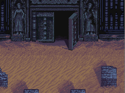
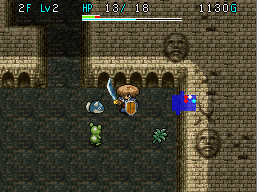

  

First real dungeon of the game after escaping from the castle. Spring is the only trap that gets generated, and most items are found identified. An explanation is displayed when you pick an item up for the first time.

<ul class="quickLinksUL">
  <li><a href="#overview">Overview</a></li>
  <li><a href="#strategy">Strategy</a></li>
  <li><a href="#floor-guide">Floor Guide</a></li>
  <li><a href="#monsters">Monsters</a></li>
  <li><a href="#monster-table">Monster Table</a></li>
  <li><a href="#items">Items</a></li>
  <li><a href="#traps">Traps</a></li>
</ul>

# Overview

<table class="dungeonOverview">
  <tr>
    <th>Unlock</th>
    <td class="highlightYellow">Visit Tonfan (restaurant) after arriving in Town of Ilpa.</td>
  </tr>
  <tr>
    <th>Entrance</th>
    <td class="highlightYellow">Town of Ilpa (South exit)</td>
  </tr>
</table>

<table class="dungeonTable">
  <tr>
    <th>JP Name</th>
    <td colspan="3">古代遺跡</td>
  </tr>
  <tr>
    <th>Floors</th>
    <td>8F</td>
    <th>Allies</th>
    <td>Yes</td>
  </tr>
  <tr>
    <th>Bring Items</th>
    <td>Yes</td>
    <th>Bring Level Ups</th>
    <td>Yes</td>
  </tr>
  <tr>
    <th>Bring Gitan</th>
    <td>Yes</td>
    <th>Starting Item</th>
    <td>Onigiri</td>
  </tr>
  <tr>
    <th>Unidentified</th>
    <td colspan="3">Weapons, Shields</td>
  </tr>
  <tr>
    <th>Shops</th>
    <td>No</td>
    <th>Monster Houses</th>
    <td>No</td>
  </tr>
  <tr>
    <th>Clear Icon</th>
    <td>None</td>
    <th>Reward</th>
    <td>None</td>
  </tr>
</table>

# Strategy

Not a whole lot to say since monsters that appear mostly lack special attacks. Your attack power increases as you level up, so it should be easy if you take your time. Linger and hunt Rock Heads (6-8F) if you want to collect some Escape Scrolls for later.

# Floor Guide

### 1-2F

Check every room while picking up all items, then proceed to the next floor. It's recommended to linger on 2F until you reach Lv3\~4 before advancing to 3F.

### 3-5F

Monsters have higher stats, but they're still pretty weak - You shouldn't have issues if you found equipment. Impact Boar (4-5F) can make you trip and drop items if your back isn't against a wall.

### 6-8F

Trading hits with monsters becomes a bit painful, but you likely have no other options. Hunt Rock Heads (6-8F) for Escape Scrolls if you want, but keep an eye on your HP. Don't hesitate to use items if your HP gets low.

# Monsters

<table class="dungeonMonsterList monsterListDay">
  <thead>
    <tr>
      <th>F</th>
      <th>Name</th>
      <th>HP</th>
      <th>Atk</th>
      <th>Def</th>
      <th>Exp</th>
      <th>Type</th>
      <th>Notes</th>
    </tr>
  </thead>
  <tbody>
    <tr>
      <td>1-2</td>
      <td>Mamel</td>
      <td>5</td>
      <td>2</td>
      <td>5</td>
      <td>2</td>
      <td>-</td>
      <td>-</td>
    </tr>
    <tr>
      <td>1-2</td>
      <td>Minion Mouse</td>
      <td>6</td>
      <td>3</td>
      <td>6</td>
      <td>4</td>
      <td>-</td>
      <td>-</td>
    </tr>
    <tr>
      <td>3-4</td>
      <td>Mobster Mouse</td>
      <td>10</td>
      <td>4</td>
      <td>6</td>
      <td>7</td>
      <td>-</td>
      <td>-</td>
    </tr>
    <tr>
      <td>3-5</td>
      <td>Chintala</td>
      <td>11</td>
      <td>4</td>
      <td>11</td>
      <td>6</td>
      <td>-</td>
      <td>-</td>
    </tr>
    <tr>
      <td>3-5</td>
      <td>Teaser Monkey</td>
      <td>12</td>
      <td>5</td>
      <td>12</td>
      <td>10</td>
      <td>-</td>
      <td>Doesn't approach you inside rooms.</td>
    </tr>
    <tr>
      <td>4-5</td>
      <td>Impact Boar</td>
      <td>15</td>
      <td>7</td>
      <td>12</td>
      <td>8</td>
      <td>-</td>
      <td>Makes Shiren trip and drop items.</td>
    </tr>
    <tr>
      <td>5-7</td>
      <td>Dagyan</td>
      <td>18</td>
      <td>9</td>
      <td>14</td>
      <td>13</td>
      <td>Dragon</td>
      <td>-</td>
    </tr>
    <tr>
      <td>6-8</td>
      <td>Pitcher Plant</td>
      <td>20</td>
      <td>6</td>
      <td>18</td>
      <td>10</td>
      <td>-</td>
      <td>Eats a thrown item and turns it into grass.</td>
    </tr>
    <tr>
      <td>6-8</td>
      <td>Glare Snake</td>
      <td>24</td>
      <td>10</td>
      <td>6</td>
      <td>17</td>
      <td>Dragon</td>
      <td>-</td>
    </tr>
    <tr>
      <td>6-8</td>
      <td>Rock Head</td>
      <td>25</td>
      <td>12</td>
      <td>12</td>
      <td>21</td>
      <td>-</td>
      <td>Occasionally drops an Escape Scroll.</td>
    </tr>
    <tr>
      <td>7-8</td>
      <td>Sheep Priest</td>
      <td>20</td>
      <td>9</td>
      <td>18</td>
      <td>15</td>
      <td>Drain</td>
      <td>Casts magic that halves an adjacent target's attack power.</td>
    </tr>
    <tr>
      <td>7-8</td>
      <td>Pumphantasm</td>
      <td>30</td>
      <td>13</td>
      <td>8</td>
      <td>22</td>
      <td>Floating Ghost</td>
      <td>Moves through walls, unpredictable movement.</td>
    </tr>
  </tbody>
</table>

# Monster Table

Spawn Rates: Low Medium High Enemy Colors: Farming Useful

<table class="monsterTable">
  <thead>
    <tr>
      <th class="highlightPurple">F</th>
      <th colspan="6" class="highlightPurple">Monsters</th>
    </tr>
  </thead>
  <tbody>
    <tr>
      <th>1</th>
      <td class="high">Mamel</td>
      <td class="mid">Minion Mouse</td>
      <td class="highlightGray"></td>
      <td class="highlightGray"></td>
      <td class="highlightGray"></td>
      <td class="highlightGray"></td>
    </tr>
    <tr>
      <th>2</th>
      <td class="mid">Mamel</td>
      <td class="high">Minion Mouse</td>
      <td class="highlightGray"></td>
      <td class="highlightGray"></td>
      <td class="highlightGray"></td>
      <td class="highlightGray"></td>
    </tr>
    <tr>
      <th>3</th>
      <td class="high">Chintala</td>
      <td class="mid">Mobster Mouse</td>
      <td class="mid">Teaser Monkey</td>
      <td class="highlightGray"></td>
      <td class="highlightGray"></td>
      <td class="highlightGray"></td>
    </tr>
    <tr>
      <th>4</th>
      <td class="high">Chintala</td>
      <td class="mid">Mobster Mouse</td>
      <td class="mid">Teaser Monkey</td>
      <td class="high">Impact Boar</td>
      <td class="highlightGray"></td>
      <td class="highlightGray"></td>
    </tr>
    <tr>
      <th>5</th>
      <td class="mid">Chintala</td>
      <td class="mid">Dagyan</td>
      <td class="mid">Teaser Monkey</td>
      <td class="high">Impact Boar</td>
      <td class="highlightGray"></td>
      <td class="highlightGray"></td>
    </tr>
    <tr>
      <th>6</th>
      <td class="high">Glare Snake</td>
      <td class="high">Dagyan</td>
      <td class="high">Pitcher Plant</td>
      <td class="mid">Rock Head</td>
      <td class="highlightGray"></td>
      <td class="highlightGray"></td>
    </tr>
    <tr>
      <th>7</th>
      <td class="high">Glare Snake</td>
      <td class="high">Dagyan</td>
      <td class="high">Pitcher Plant</td>
      <td class="high">Rock Head</td>
      <td class="high">Sheep Priest</td>
      <td class="mid">Pumphantasm</td>
    </tr>
    <tr>
      <th>8</th>
      <td class="mid">Glare Snake</td>
      <td class="highlightGray"></td>
      <td class="mid">Pitcher Plant</td>
      <td class="high">Rock Head</td>
      <td class="high">Sheep Priest</td>
      <td class="high">Pumphantasm</td>
    </tr>
  </tbody>
</table>

# Items

The values like "1-8" in columns represent the floor range where the item can appear.

- F = Floor
- M = Monster
- P = Presto Pot

 

<table class="dungeonItemTable">
  <tr>
    <th colspan="4" class="highlightLightblue">Weapon</th>
    <th rowspan="15"></th>
    <th colspan="4" class="highlightLightblue">Grass</th>
  </tr>
  <tr>
    <th>Name</th>
    <th>F</th>
    <th>M</th>
    <th>P</th>
    <th>Name</th>
    <th>F</th>
    <th>M</th>
    <th>P</th>
  </tr>
  <tr>
    <td class="leftText">Club</td>
    <td>1-8</td>
    <td></td>
    <td></td>
    <td class="leftText">Life Grass</td>
    <td>1-8</td>
    <td></td>
    <td></td>
  </tr>
  <tr>
    <td class="leftText">Bronze Sword</td>
    <td>1-8</td>
    <td></td>
    <td></td>
    <td class="leftText">Otogiriso</td>
    <td>1-8</td>
    <td></td>
    <td></td>
  </tr>
  <tr>
    <td class="leftText">Demon Slayer</td>
    <td>6-8</td>
    <td></td>
    <td></td>
    <td class="leftText">Dizzy Grass</td>
    <td>1-8</td>
    <td></td>
    <td></td>
  </tr>
  <tr>
    <th colspan="4" class="highlightLightblue">Shield</th>
    <td class="leftText">Weeds</td>
    <td></td>
    <td></td>
    <td>1-8</td>
  </tr>
  <tr>
    <th>Name</th>
    <th>F</th>
    <th>M</th>
    <th>P</th>
    <td class="leftText">Swift Grass</td>
    <td>1-8</td>
    <td></td>
    <td></td>
  </tr>
  <tr>
    <td class="leftText">Iron Shield</td>
    <td>6-8</td>
    <td></td>
    <td></td>
    <td class="leftText">Dragon Grass</td>
    <td>1-8</td>
    <td></td>
    <td></td>
  </tr>
  <tr>
    <td class="leftText">Wood Shield</td>
    <td>1-8</td>
    <td></td>
    <td></td>
    <td class="leftText">Revival Grass</td>
    <td>1-5</td>
    <td></td>
    <td></td>
  </tr>
  <tr>
    <th colspan="4" class="highlightLightblue">Bracelet</th>
    <td class="leftText">Herb</td>
    <td>1-8</td>
    <td></td>
    <td></td>
  </tr>
  <tr>
    <th>Name</th>
    <th>F</th>
    <th>M</th>
    <th>P</th>
    <th colspan="4" class="highlightLightblue">Scroll</th>
  </tr>
  <tr>
    <td class="leftText">Strength Bracelet</td>
    <td>1-8</td>
    <td></td>
    <td></td>
    <th>Name</th>
    <th>F</th>
    <th>M</th>
    <th>P</th>
  </tr>
  <tr>
    <th colspan="4" class="highlightLightblue">Food</th>
    <td class="leftText">Air Slash Scroll</td>
    <td>4-8</td>
    <td></td>
    <td></td>
  </tr>
  <tr>
    <th>Name</th>
    <th>F</th>
    <th>M</th>
    <th>P</th>
    <td class="leftText">Slumber Scroll</td>
    <td>4-8</td>
    <td></td>
    <td></td>
  </tr>
  <tr>
    <td class="leftText">Onigiri</td>
    <td>1-8</td>
    <td></td>
    <td></td>
    <td class="leftText">Escape Scroll</td>
    <td></td>
    <td>6-8</td>
    <td></td>
  </tr>
</table>

※ Escape Scroll - Rock Head (6-8F)

# Traps

|F|Traps|
|-|-|
|1-8|Spring|
