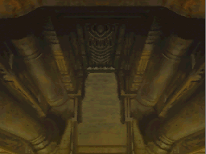
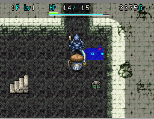

  

Second dungeon of the game which is unlocked after clearing Ancient Ruins. Traps are generated from this dungeon onward, and tutorial messages no longer appear. It's still on the easy side, but hunger can be an issue if you don't bring extra onigiri. There's a trivial boss fight at the end of the dungeon.

<ul class="quickLinksUL">
  <li><a href="#overview">Overview</a></li>
  <li><a href="#strategy">Strategy</a></li>
  <li><a href="#floor-guide">Floor Guide</a></li>
  <li><a href="#monsters">Monsters</a></li>
  <li><a href="#monster-table">Monster Table</a></li>
  <li><a href="#items">Items</a></li>
</ul>

# Overview

<table class="dungeonOverview">
  <tr>
    <th>Unlock</th>
    <td class="highlightYellow">Clear Ancient Ruins.</td>
  </tr>
  <tr>
    <th>Entrance</th>
    <td class="highlightYellow">Town of Ilpa (South exit)</td>
  </tr>
</table>

<table class="dungeonTable">
  <tr>
    <th>JP Name</th>
    <td colspan="3">魔城東小天守</td>
  </tr>
  <tr>
    <th>Floors</th>
    <td>12F</td>
    <th>Allies</th>
    <td>Yes</td>
  </tr>
  <tr>
    <th>Bring Items</th>
    <td>Yes</td>
    <th>Bring Level Ups</th>
    <td>Yes</td>
  </tr>
  <tr>
    <th>Unidentified</th>
    <td colspan="3">Weapons, Shields</td>
  </tr>
  <tr>
    <th>Shops</th>
    <td>1~5F</td>
    <th>Monster Houses</th>
    <td>No</td>
  </tr>
  <tr>
    <th>Clear Icon</th>
    <td></td>
    <th>Reward</th>
    <td>None</td>
  </tr>
</table>

# Strategy

This dungeon is easy enough to clear without bringing any items, but extra onigiri is nice. Level up at the Training Hall before entering if you want an easier time.

Linger and hunt Dragon Guards (6-8F) if you want to collect some Escape Scrolls for later.

# Floor Guide

### 1-5F

Fog Hermit (3-5F) stops natural HP regen for 10 turns, which changes to HP Drain if you get hit a 2nd time. Otherwise, most monsters in this floor range don't have threatening special attacks.

Death Reaper (4-6F) moves 2 times and attacks 1 time per turn, so be careful about bracelet damage caused by them rushing at you if you're stepping in place to hunt enemies using a Nirvana Bracelet.

### 6-12F

Grass items mostly exit the item table from this point, so conserve Otogiriso as much as possible. Heal Pot and Heal Bracelet can be used to recover HP, but keep an eye on fullness if you use Heal Bracelet.

Doze Mage (6-8F) can put you to sleep, so try to defeat it in a single hit. Porky (7-8F) and Wolf Droid (9-12F) throw projectiles from 2 tiles away, so step toward them. Slime (10-12F) lowers your equipped weapon or shield's upgrade value by 1, so unequip items beforehand.

### Boss

Zagan only uses direct attacks, and you can circle around a pillar to safely regen HP during the fight. Sanctuary Scroll is also effective, though honestly it's wasteful since it's such an easy fight.

<table class="monsterPageTable">
  <tr>
    <th>Name</th>
    <th>HP</th>
    <th>Atk</th>
    <th>Def</th>
    <th>Exp</th>
    <th>Elem.</th>
    <th>Notes</th>
  </tr>
  <tr>
    <td>Zagan</td>
    <td>151</td>
    <td>30</td>
    <td>35</td>
    <td>0</td>
    <td>-</td>
    <td>Direct attacks only. Nullifies projectiles, reflects magic bullets. Powers up when hit by Dragon Grass.</td>
  </tr>
</table>

# Monsters

<table class="dungeonMonsterList monsterListDay">
  <thead>
    <tr>
      <th>F</th>
      <th>Name</th>
      <th>HP</th>
      <th>Atk</th>
      <th>Def</th>
      <th>Exp</th>
      <th>Type</th>
      <th>Notes</th>
    </tr>
  </thead>
  <tbody>
    <tr>
      <td>1-2</td>
      <td>Mamel</td>
      <td>5</td>
      <td>2</td>
      <td>5</td>
      <td>2</td>
      <td>-</td>
      <td>-</td>
    </tr>
    <tr>
      <td>1-2</td>
      <td>Pit Mamel</td>
      <td>6</td>
      <td>4</td>
      <td>6</td>
      <td>3</td>
      <td>-</td>
      <td>-</td>
    </tr>
    <tr>
      <td>1-2</td>
      <td>Baby Mage</td>
      <td>7</td>
      <td>4</td>
      <td>5</td>
      <td>5</td>
      <td>-</td>
      <td>Swings a Swap Staff.</td>
    </tr>
    <tr>
      <td>1-2</td>
      <td>Minion Mouse</td>
      <td>6</td>
      <td>3</td>
      <td>6</td>
      <td>4</td>
      <td>-</td>
      <td>-</td>
    </tr>
    <tr>
      <td>1-2</td>
      <td>Rookie Guard</td>
      <td>5</td>
      <td>1</td>
      <td>1</td>
      <td>0</td>
      <td>-</td>
      <td>-</td>
    </tr>
    <tr>
      <td>1-3</td>
      <td>Bad Froggo</td>
      <td>13</td>
      <td>0</td>
      <td>5</td>
      <td>5</td>
      <td>-</td>
      <td>Steals Gitan and warps.</td>
    </tr>
    <tr>
      <td>2-3</td>
      <td>Teaser Monkey</td>
      <td>12</td>
      <td>5</td>
      <td>12</td>
      <td>10</td>
      <td>-</td>
      <td>Doesn't approach you inside rooms.</td>
    </tr>
    <tr>
      <td>2-3</td>
      <td>Mobster Mouse</td>
      <td>10</td>
      <td>4</td>
      <td>6</td>
      <td>7</td>
      <td>-</td>
      <td>-</td>
    </tr>
    <tr>
      <td>3-4</td>
      <td>Chintala</td>
      <td>11</td>
      <td>4</td>
      <td>11</td>
      <td>6</td>
      <td>-</td>
      <td>-</td>
    </tr>
    <tr>
      <td>3-5</td>
      <td>Fog Hermit</td>
      <td>13</td>
      <td>6</td>
      <td>8</td>
      <td>8</td>
      <td>Drain</td>
      <td>Stops HP regen for 10 turns when adjacent. Changes to HP drain if hit by spell again.</td>
    </tr>
    <tr>
      <td>4-5</td>
      <td>Dagyan</td>
      <td>18</td>
      <td>9</td>
      <td>14</td>
      <td>13</td>
      <td>Dragon</td>
      <td>-</td>
    </tr>
    <tr>
      <td>4-5</td>
      <td>Morabi</td>
      <td>20</td>
      <td>10</td>
      <td>14</td>
      <td>14</td>
      <td>-</td>
      <td>-</td>
    </tr>
    <tr>
      <td>4-6</td>
      <td>Death Reaper</td>
      <td>17</td>
      <td>6</td>
      <td>13</td>
      <td>12</td>
      <td>Floating Ghost</td>
      <td>Double speed, 1 attack.</td>
    </tr>
    <tr>
      <td>5</td>
      <td>Glare Snake</td>
      <td>24</td>
      <td>10</td>
      <td>6</td>
      <td>17</td>
      <td>Dragon</td>
      <td>-</td>
    </tr>
    <tr>
      <td>6-7</td>
      <td>Porky</td>
      <td>20</td>
      <td>10</td>
      <td>15</td>
      <td>18</td>
      <td>-</td>
      <td>Throws rocks within 2 tiles.</td>
    </tr>
    <tr>
      <td>6-8</td>
      <td>Pumphantasm</td>
      <td>30</td>
      <td>13</td>
      <td>8</td>
      <td>22</td>
      <td>Floating Ghost</td>
      <td>Moves through walls, unpredictable movement.</td>
    </tr>
    <tr>
      <td>6-8</td>
      <td>Dragon Guard</td>
      <td>50</td>
      <td>1</td>
      <td>30</td>
      <td>0</td>
      <td>Dragon</td>
      <td>Drops an Escape Scroll.</td>
    </tr>
    <tr>
      <td>6-8</td>
      <td>Doze Mage</td>
      <td>16</td>
      <td>5</td>
      <td>7</td>
      <td>15</td>
      <td>Cyclops</td>
      <td>Inflicts Asleep status when adjacent.</td>
    </tr>
    <tr>
      <td>7-10</td>
      <td>Dozy Genie</td>
      <td>20</td>
      <td>4</td>
      <td>50</td>
      <td>23</td>
      <td>-</td>
      <td>Occasionally falls asleep in hallways. (5 turns)</td>
    </tr>
    <tr>
      <td>7-10</td>
      <td>Zen Guru</td>
      <td>40</td>
      <td>14</td>
      <td>18</td>
      <td>22</td>
      <td>Floating</td>
      <td>-</td>
    </tr>
    <tr>
      <td>7-10</td>
      <td>Trap Genin</td>
      <td>24</td>
      <td>11</td>
      <td>15</td>
      <td>18</td>
      <td>-</td>
      <td>Occasionally places a trap when defeated.</td>
    </tr>
    <tr>
      <td>9-12</td>
      <td>Wolf Droid</td>
      <td>30</td>
      <td>15</td>
      <td>20</td>
      <td>35</td>
      <td>Bomb</td>
      <td>Throws bombs within 2 tiles. (10 damage)</td>
    </tr>
    <tr>
      <td>9-12</td>
      <td>Bow Boy</td>
      <td>28</td>
      <td>12</td>
      <td>18</td>
      <td>28</td>
      <td>-</td>
      <td>Shoots Wood Arrows.</td>
    </tr>
    <tr>
      <td>10-12</td>
      <td>Slime</td>
      <td>35</td>
      <td>0</td>
      <td>15</td>
      <td>30</td>
      <td>Drain</td>
      <td>Lowers weapon or shield upgrade value by 1.</td>
    </tr>
    <tr>
      <td>11-12</td>
      <td>Floor Dragon</td>
      <td>36</td>
      <td>18</td>
      <td>21</td>
      <td>30</td>
      <td>Dragon</td>
      <td>Tunnels underground to try and corner you.</td>
    </tr>
  </tbody>
</table>

# Monster Table

Enemy Colors: Farming Destroys Items

<table class="monsterTable">
  <thead>
    <tr>
      <th>F</th>
      <th colspan="8">Monsters</th>
    </tr>
  </thead>
  <tbody>
    <tr>
      <th>1</th>
      <td>Mamel</td>
      <td>Pit Mamel</td>
      <td>Baby Mage</td>
      <td>Minion Mouse</td>
      <td>Rookie Guard</td>
      <td>Bad Froggo</td>
      <td class="highlightGray"></td>
      <td class="highlightGray"></td>
    </tr>
    <tr>
      <th>2</th>
      <td>Mamel</td>
      <td>Pit Mamel</td>
      <td>Baby Mage</td>
      <td>Minion Mouse</td>
      <td>Rookie Guard</td>
      <td>Bad Froggo</td>
      <td>Teaser Monkey</td>
      <td>Mobster Mouse</td>
    </tr>
    <tr>
      <th>3</th>
      <td>Chintala</td>
      <td>Fog Hermit</td>
      <td class="highlightGray"></td>
      <td class="highlightGray"></td>
      <td class="highlightGray"></td>
      <td>Bad Froggo</td>
      <td>Teaser Monkey</td>
      <td>Mobster Mouse</td>
    </tr>
    <tr>
      <th>4</th>
      <td>Chintala</td>
      <td>Fog Hermit</td>
      <td>Dagyan</td>
      <td>Morabi</td>
      <td>Death Reaper</td>
      <td class="highlightGray"></td>
      <td class="highlightGray"></td>
      <td class="highlightGray"></td>
    </tr>
    <tr>
      <th>5</th>
      <td>Glare Snake</td>
      <td>Fog Hermit</td>
      <td>Dagyan</td>
      <td>Morabi</td>
      <td>Death Reaper</td>
      <td class="highlightGray"></td>
      <td class="highlightGray"></td>
      <td class="highlightGray"></td>
    </tr>
    <tr>
      <th>6</th>
      <td>Porky</td>
      <td>Doze Mage</td>
      <td>Dragon Guard</td>
      <td>Pumphantasm</td>
      <td>Death Reaper</td>
      <td class="highlightGray"></td>
      <td class="highlightGray"></td>
      <td class="highlightGray"></td>
    </tr>
    <tr>
      <th>7</th>
      <td>Porky</td>
      <td>Doze Mage</td>
      <td>Dragon Guard</td>
      <td>Pumphantasm</td>
      <td>Dozy Genie</td>
      <td>Zen Guru</td>
      <td>Trap Genin</td>
      <td class="highlightGray"></td>
    </tr>
    <tr>
      <th>8</th>
      <td class="highlightGray"></td>
      <td>Doze Mage</td>
      <td>Dragon Guard</td>
      <td>Pumphantasm</td>
      <td>Dozy Genie</td>
      <td>Zen Guru</td>
      <td>Trap Genin</td>
      <td class="highlightGray"></td>
    </tr>
    <tr>
      <th>9</th>
      <td>Wolf Droid</td>
      <td>Bow Boy</td>
      <td class="highlightGray"></td>
      <td class="highlightGray"></td>
      <td>Dozy Genie</td>
      <td>Zen Guru</td>
      <td>Trap Genin</td>
      <td class="highlightGray"></td>
    </tr>
    <tr>
      <th>10</th>
      <td>Wolf Droid</td>
      <td>Bow Boy</td>
      <td>Slime</td>
      <td class="highlightGray"></td>
      <td>Dozy Genie</td>
      <td>Zen Guru</td>
      <td>Trap Genin</td>
      <td class="highlightGray"></td>
    </tr>
    <tr>
      <th>11</th>
      <td>Wolf Droid</td>
      <td>Bow Boy</td>
      <td>Slime</td>
      <td>Floor Dragon</td>
      <td class="highlightGray"></td>
      <td class="highlightGray"></td>
      <td class="highlightGray"></td>
      <td class="highlightGray"></td>
    </tr>
    <tr>
      <th>12</th>
      <td>Wolf Droid</td>
      <td>Bow Boy</td>
      <td>Slime</td>
      <td>Floor Dragon</td>
      <td class="highlightGray"></td>
      <td class="highlightGray"></td>
      <td class="highlightGray"></td>
      <td class="highlightGray"></td>
    </tr>
    <tr>
      <th>13</th>
      <td colspan="8" class="highlightOrange">Boss</td>
    </tr>
  </tbody>
</table>

# Items

The values like "1-5" and "6+" in columns represent the floor range where the item can appear.

- F = Floor
- S = Shop (1-5F)
- P = Presto Pot
- M = Monster

 

<table class="dungeonItemTable">
  <tr>
    <th colspan="5" class="highlightLightblue">Weapon</th>
    <th rowspan="24"></th>
    <th colspan="5" class="highlightLightblue">Scroll</th>
    <th rowspan="24"></th>
    <th colspan="5" class="highlightLightblue">Grass</th>
  </tr>
  <tr>
    <th>Name</th>
    <th>F</th>
    <th>S</th>
    <th>P</th>
    <th>M</th>
    <th>Name</th>
    <th>F</th>
    <th>S</th>
    <th>P</th>
    <th>M</th>
    <th>Name</th>
    <th>F</th>
    <th>S</th>
    <th>P</th>
    <th>M</th>
  </tr>
  <tr>
    <td class="leftText">Club</td>
    <td>1-5</td>
    <td></td>
    <td></td>
    <td></td>
    <td class="leftText">Navigation Scroll</td>
    <td>X</td>
    <td></td>
    <td></td>
    <td></td>
    <td class="leftText">Weeds</td>
    <td></td>
    <td></td>
    <td>X</td>
    <td></td>
  </tr>
  <tr>
    <td class="leftText">Bronze Sword</td>
    <td>X</td>
    <td></td>
    <td></td>
    <td></td>
    <td class="leftText">Confusion Scroll</td>
    <td>X</td>
    <td></td>
    <td></td>
    <td></td>
    <td class="leftText">Herb</td>
    <td>X</td>
    <td></td>
    <td></td>
    <td></td>
  </tr>
  <tr>
    <td class="leftText">Katana</td>
    <td>X</td>
    <td></td>
    <td></td>
    <td></td>
    <td class="leftText">Air Slash Scroll</td>
    <td>X</td>
    <td></td>
    <td></td>
    <td></td>
    <td class="leftText">Life Grass</td>
    <td>1-5</td>
    <td></td>
    <td></td>
    <td></td>
  </tr>
  <tr>
    <td class="leftText">Beetle Axe</td>
    <td>X</td>
    <td></td>
    <td></td>
    <td></td>
    <td class="leftText">Sanctuary Scroll</td>
    <td>X</td>
    <td></td>
    <td></td>
    <td></td>
    <td class="leftText">Otogiriso</td>
    <td>1-5</td>
    <td></td>
    <td></td>
    <td></td>
  </tr>
  <tr>
    <td class="leftText">Demon Slayer</td>
    <td></td>
    <td>X</td>
    <td></td>
    <td></td>
    <td class="leftText">Slumber Scroll</td>
    <td>X</td>
    <td></td>
    <td></td>
    <td></td>
    <td class="leftText">Dizzy Grass</td>
    <td>1-5</td>
    <td></td>
    <td></td>
    <td></td>
  </tr>
  <tr>
    <td class="leftText">Cyclops Killer</td>
    <td></td>
    <td>X</td>
    <td></td>
    <td></td>
    <td class="leftText">Power Up Scroll</td>
    <td>X</td>
    <td></td>
    <td></td>
    <td></td>
    <td class="leftText">Warp Grass</td>
    <td>1-5</td>
    <td></td>
    <td></td>
    <td></td>
  </tr>
  <tr>
    <td class="leftText">Mallet</td>
    <td></td>
    <td>X</td>
    <td></td>
    <td></td>
    <td class="leftText">Trap Erase Scroll</td>
    <td>X</td>
    <td></td>
    <td></td>
    <td></td>
    <td class="leftText">Strength Grass</td>
    <td>1-5</td>
    <td></td>
    <td></td>
    <td></td>
  </tr>
  <tr>
    <th colspan="5" class="highlightLightblue">Shield</th>
    <td class="leftText">Heaven Scroll</td>
    <td>6+</td>
    <td></td>
    <td></td>
    <td></td>
    <td class="leftText">Antidote Grass</td>
    <td>1-5</td>
    <td></td>
    <td></td>
    <td></td>
  </tr>
  <tr>
    <th>Name</th>
    <th>F</th>
    <th>S</th>
    <th>P</th>
    <th>M</th>
    <td class="leftText">Earth Scroll</td>
    <td>6+</td>
    <td></td>
    <td></td>
    <td></td>
    <td class="leftText">Poison Grass</td>
    <td>1-5</td>
    <td></td>
    <td></td>
    <td></td>
  </tr>
  <tr>
    <td class="leftText">Wood Shield</td>
    <td>X</td>
    <td></td>
    <td></td>
    <td></td>
    <td class="leftText">Escape Scroll</td>
    <td></td>
    <td></td>
    <td></td>
    <td>※</td>
    <td class="leftText">Dragon Grass</td>
    <td>1-5</td>
    <td></td>
    <td></td>
    <td></td>
  </tr>
  <tr>
    <td class="leftText">Bronze Shield</td>
    <td>X</td>
    <td></td>
    <td></td>
    <td></td>
    <td class="leftText">Sumeragi Scroll</td>
    <td></td>
    <td></td>
    <td>13</td>
    <td></td>
    <td class="leftText">Revival Grass</td>
    <td>1-5</td>
    <td></td>
    <td></td>
    <td></td>
  </tr>
  <tr>
    <td class="leftText">Iron Shield</td>
    <td></td>
    <td>X</td>
    <td></td>
    <td></td>
    <th colspan="5" class="highlightLightblue">Pot</th>
    <td class="leftText">Sight Grass</td>
    <td>1-5</td>
    <td></td>
    <td></td>
    <td></td>
  </tr>
  <tr>
    <td class="leftText">Demon Shield</td>
    <td>X</td>
    <td></td>
    <td></td>
    <td></td>
    <th>Name</th>
    <th>F</th>
    <th>S</th>
    <th>P</th>
    <th>M</th>
    <th colspan="5" class="highlightLightblue">Staff</th>
  </tr>
  <tr>
    <td class="leftText">Counter Shield</td>
    <td>X</td>
    <td></td>
    <td></td>
    <td></td>
    <td class="leftText">Storage Pot</td>
    <td>X</td>
    <td></td>
    <td></td>
    <td></td>
    <th>Name</th>
    <th>F</th>
    <th>S</th>
    <th>P</th>
    <th>M</th>
  </tr>
  <tr>
    <td class="leftText">Blast Shield</td>
    <td></td>
    <td>X</td>
    <td></td>
    <td></td>
    <td class="leftText">Heal Pot</td>
    <td>6+</td>
    <td>X</td>
    <td></td>
    <td></td>
    <td class="leftText">Tenjin Staff</td>
    <td></td>
    <td></td>
    <td>13</td>
    <td></td>
  </tr>
  <tr>
    <th colspan="5" class="highlightLightblue">Bracelet</th>
    <th colspan="5" class="highlightLightblue">Food</th>
    <th colspan="5" class="highlightLightblue">Projectile</th>
  </tr>
  <tr>
    <th>Name</th>
    <th>F</th>
    <th>S</th>
    <th>P</th>
    <th>M</th>
    <th>Name</th>
    <th>F</th>
    <th>S</th>
    <th>P</th>
    <th>M</th>
    <th>Name</th>
    <th>F</th>
    <th>S</th>
    <th>P</th>
    <th>M</th>
  </tr>
  <tr>
    <td class="leftText">Heal Bracelet</td>
    <td>X</td>
    <td></td>
    <td></td>
    <td></td>
    <td class="leftText">Onigiri</td>
    <td>X</td>
    <td></td>
    <td></td>
    <td></td>
    <td class="leftText">Karanba Arrow</td>
    <td></td>
    <td></td>
    <td>13</td>
    <td></td>
  </tr>
  <tr>
    <td class="leftText">Strength Bracelet</td>
    <td>X</td>
    <td></td>
    <td></td>
    <td></td>
    <td class="leftText">Large Onigiri</td>
    <td>X</td>
    <td></td>
    <td></td>
    <td></td>
    <td rowspan="4" colspan="5" class="leftText"></td>
  </tr>
  <tr>
    <td class="leftText">Scout Bracelet</td>
    <td>X</td>
    <td></td>
    <td></td>
    <td></td>
    <td rowspan="3" colspan="5" class="leftText"></td>
  </tr>
  <tr>
    <td class="leftText">Nirvana Bracelet</td>
    <td>X</td>
    <td></td>
    <td></td>
    <td></td>
  </tr>
  <tr>
    <td class="leftText">Nfuu Bracelet</td>
    <td></td>
    <td></td>
    <td>13</td>
    <td></td>
  </tr>
</table>

※ Escape Scroll - Dragon Guard (6-8F)
