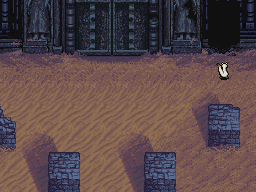
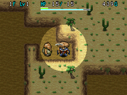

  

Dungeon where the map is disabled, and there are no hallways between rooms. You start with 3 Pickaxes, but if they break and you don't find other digging items, it's game over. However, you're allowed to bring items, so the main gimmick isn't actually that difficult. Bring a Warp Bracelet and you won't have to dig at all.

<ul class="quickLinksUL">
  <li><a href="#overview">Overview</a></li>
  <li><a href="#strategy">Strategy</a></li>
  <li><a href="#floor-guide">Floor Guide</a></li>
  <li><a href="#monsters">Monsters</a></li>
  <li><a href="#items">Items</a></li>
  <li><a href="#traps">Traps</a></li>
</ul>

# Overview

<table class="dungeonOverview">
  <tr>
    <th>Unlock</th>
    <td class="highlightYellow">1. Clear Depths of the Abyss. 2. Complete one of the following: &nbsp;&nbsp;&nbsp;&nbsp;- Reach 1000 or more Shiren 3 Points. &nbsp;&nbsp;&nbsp;&nbsp;- Receive 10 Reward Letters from rescues. &nbsp;&nbsp;&nbsp;&nbsp;- Store 20 Pickaxes inside the storehouse. 3. Enter a dungeon → Return to town. 4. Go downstairs and listen to what Lord says.</td>
  </tr>
  <tr>
    <th>Entrance</th>
    <td class="highlightYellow">Town of Ilpa (South exit)</td>
  </tr>
</table>

<table class="dungeonTable">
  <tr>
    <th>JP Name</th>
    <td colspan="3">遺跡の奥底</td>
  </tr>
  <tr>
    <th>Floors</th>
    <td colspan="3">20F (first) / 99F</td>
  </tr>
  <tr>
    <th>Bring Items</th>
    <td>Yes</td>
    <th>Allies</th>
    <td>Yes</td>
  </tr>
  <tr>
    <th>Bring Gitan</th>
    <td>No</td>
    <th>Bring Level Ups</th>
    <td>Yes</td>
  </tr>
  <tr>
    <th>Starting Item</th>
    <td colspan="3">Onigiri, Pickaxe x 3</td>
  </tr>
  <tr>
    <th>Unidentified</th>
    <td colspan="3">All categories</td>
  </tr>
  <tr>
    <th>Shops</th>
    <td>No</td>
    <th>Monster Houses</th>
    <td>6-98F</td>
  </tr>
  <tr>
    <th>Clear Icon</th>
    <td class="clearIcon"></td>
    <th>Reward</th>
    <td>Wonder Pick</td>
  </tr>
</table>

# Strategy

### Dungeon Mechanics

Special Monster Houses can be generated, so Warp Bracelet and Great Hall Scroll carry some risk. That said, digging out wall tiles 1 tile at a time gets tiring, so it's still recommended to use these items. You can also reduce risk by bringing items like Explosion Scroll into the dungeon.

#### Rules

1. There are no hallways between rooms.
    - You're given 3 Pickaxes at the start, which can be used to dig out wall tiles.
2. Once the player digs out 250 wall tiles, all remaining walls break.
    - Basically like reading a Great Hall Scroll.
3. The map is disabled at all times.
    - Scout Bracelet and Navigation Scroll have no effect.

### Warp Method

For players who just want to get the dungeon over with quickly for the reward.

1. Obtain a Warp Bracelet in Jahannam's Gate.
2. Equip your strongest weapon and shield + Warp Bracelet.
3. Warp from room to room until you find the stairs.
4. Repeat step 3 until you reach the goal.

### Regular Method (1st Clear)

Stock up on the following items and have fun locating the stairs without a map over and over.

|Item|Notes|
|-|-|
|Pickaxe|Digs out the wall tile in front of you. Can break from usage.|
|Tunnel Staff|Digs out wall tiles in a straight line.|
|Great Hall Scroll|Turns the floor into a single large room.|

### Regular Method (2nd Clear)

Synthesize the Wonder Pick you got from the 1st clear to avoid having to use regular Pickaxes. Otherwise, the Prism Shield rune is a significant help on end game floors, along with Extinction Scrolls.

# Floor Guide

### 1-20F

There's really not much to say if you bring strong equipment and a Warp Bracelet.

### 21-80F

Continue warping if you want, but consider digging normally on floors where dangerous monsters appear. 

#### 21-24F

Ooze can potentially erase your Wonder Pick rune, so it's best not to warp.

#### 46-51F

Kappa Pest or Kappa Troll have the possibility of throwing blessed Gitan or an Extinction Scroll. This isn't a problem if you synthesized a Dodge Shield, but otherwise leave some room open in pots. ※ Items thrown by Bored Kappa types can sometimes fall into open pots instead of hitting Shiren.

#### 52-60F

Hades Kangaroo appears, who grants Enraged + Swift status to other monsters.

#### 62-66F

Ooze returns for a while, so avoid warping to reduce risk of losing runes.

#### 72-80F

Kicker Scarab (72-80F) makes locating the stairs extremely difficult if the floor is a single room. This isn't an understatement - There's a legitimate chance to fail the run due to Winds of Kron. Don't use Great Hall Scrolls on these floors.

Devil Kangaroo (76-81F) appears, who grants Enraged + Swift status to other monsters.

### 81-98F

Gitan Mamel, Devil Kangaroo, Sky Dragon, Nigiri Master, Crafty Tanuki, Mirage Devil, etc.

Rare equipment can be found on the ground between 81-98F, so explore if possible. Read Monster Scrolls to generate more items if you want, but be prepared to deal with tough monsters. It's best not to use Great Hall Scrolls on these floors - If you want to expand a room, use your weapon.

Throw an Extinction Scroll at Crafty Tanuki before clearing the dungeon to ensure items you picked up are real. The reward for reaching 99F again is another Wonder Pick.

# Monsters

H Colors: Monster House is possible Spawn Rates: Low Medium High Enemy Colors: Farming Useful Destroys Items Dangerous Very Dangerous

<table class="monsterTable">
  <thead>
    <tr>
      <th class="highlightPurple">F</th>
      <th class="highlightPurple">H</th>
      <th colspan="9" class="highlightPurple">Monsters</th>
    </tr>
  </thead>
  <tbody>
    <tr>
      <th rowspan="2">1</th>
      <th rowspan="2"></th>
      <td>Baby Mage</td>
      <td>Shady Wisp</td>
      <td>Mamel</td>
      <td>Pit Mamel</td>
      <td class="highlightGray"></td>
      <td class="highlightGray"></td>
      <td class="highlightGray"></td>
    </tr>
    <tr>
      <td class="highlightGray">&nbsp;</td>
      <td class="highlightGray"></td>
      <td class="highlightGray"></td>
      <td class="highlightGray"></td>
      <td class="highlightGray"></td>
      <td class="highlightGray"></td>
      <td class="highlightGray"></td>
    </tr>
    <tr>
      <th colspan="9"></th>
    </tr>
    <tr>
      <th rowspan="2">2</th>
      <th rowspan="2"></th>
      <td>Baby Mage</td>
      <td>Shady Wisp</td>
      <td>Mamel</td>
      <td>Pit Mamel</td>
      <td>Teaser Monkey</td>
      <td>Fog Hermit</td>
      <td class="highlightGray"></td>
    </tr>
    <tr>
      <td class="highlightGray">&nbsp;</td>
      <td class="highlightGray"></td>
      <td class="highlightGray"></td>
      <td class="highlightGray"></td>
      <td class="highlightGray"></td>
      <td class="highlightGray"></td>
      <td class="highlightGray"></td>
    </tr>
    <tr>
      <th colspan="9"></th>
    </tr>
    <tr>
      <th rowspan="2">3</th>
      <th rowspan="2"></th>
      <td class="highlightGray"></td>
      <td>Shady Wisp</td>
      <td>Mamel</td>
      <td>Pit Mamel</td>
      <td>Teaser Monkey</td>
      <td>Fog Hermit</td>
      <td>Chintala</td>
    </tr>
    <tr>
      <td>Mobster Mouse</td>
      <td>Curse Girl</td>
      <td class="highlightGray"></td>
      <td class="highlightGray"></td>
      <td class="highlightGray"></td>
      <td class="highlightGray"></td>
      <td class="highlightGray"></td>
    </tr>
    <tr>
      <th colspan="9"></th>
    </tr>
    <tr>
      <th rowspan="2">4</th>
      <th rowspan="2"></th>
      <td>Dagyan</td>
      <td class="highlightGray"></td>
      <td class="highlightGray"></td>
      <td>Pit Mamel</td>
      <td>Teaser Monkey</td>
      <td>Fog Hermit</td>
      <td>Chintala</td>
    </tr>
    <tr>
      <td>Mobster Mouse</td>
      <td>Curse Girl</td>
      <td>Death Reaper</td>
      <td class="highlightGray"></td>
      <td class="highlightGray"></td>
      <td class="highlightGray"></td>
      <td class="highlightGray"></td>
    </tr>
    <tr>
      <th colspan="9"></th>
    </tr>
    <tr>
      <th rowspan="2">5</th>
      <th rowspan="2"></th>
      <td>Dagyan</td>
      <td>Scurry Egg</td>
      <td>Glare Snake</td>
      <td>Pit Mamel</td>
      <td>Sheep Priest</td>
      <td>Soldier Ant</td>
      <td class="highlightGray"></td>
    </tr>
    <tr>
      <td class="highlightGray"></td>
      <td>Curse Girl</td>
      <td>Death Reaper</td>
      <td class="highlightGray"></td>
      <td class="highlightGray"></td>
      <td class="highlightGray"></td>
      <td class="highlightGray"></td>
    </tr>
    <tr>
      <th colspan="9"></th>
    </tr>
    <tr>
      <th rowspan="2">6</th>
      <th rowspan="2" class="highlightMH"></th>
      <td>Dagyan</td>
      <td class="highlightGray"></td>
      <td>Glare Snake</td>
      <td class="highlightGray"></td>
      <td>Sheep Priest</td>
      <td>Soldier Ant</td>
      <td>Pumphantasm</td>
    </tr>
    <tr>
      <td>Pitcher Plant</td>
      <td>Curse Girl</td>
      <td>Death Reaper</td>
      <td class="highlightGray"></td>
      <td class="highlightGray"></td>
      <td class="highlightGray"></td>
      <td class="highlightGray"></td>
    </tr>
    <tr>
      <th colspan="9"></th>
    </tr>
    <tr>
      <th rowspan="2">7</th>
      <th rowspan="2" class="highlightMH"></th>
      <td>Bat Kangaroo</td>
      <td>Doze Mage</td>
      <td>Bad Zalokleft</td>
      <td class="highlightGray"></td>
      <td class="highlightGray"></td>
      <td>Soldier Ant</td>
      <td>Pumphantasm</td>
    </tr>
    <tr>
      <td>Pitcher Plant</td>
      <td>Wolf Droid</td>
      <td>Gazer</td>
      <td class="highlightGray"></td>
      <td class="highlightGray"></td>
      <td class="highlightGray"></td>
      <td class="highlightGray"></td>
    </tr>
    <tr>
      <th colspan="9"></th>
    </tr>
    <tr>
      <th rowspan="2">8</th>
      <th rowspan="2" class="highlightMH"></th>
      <td>Bat Kangaroo</td>
      <td>Doze Mage</td>
      <td>Bad Zalokleft</td>
      <td>Dozy Genie</td>
      <td class="highlightGray"></td>
      <td>Soldier Ant</td>
      <td>Pumphantasm</td>
    </tr>
    <tr>
      <td>Pitcher Plant</td>
      <td>Wolf Droid</td>
      <td>Gazer</td>
      <td class="highlightGray"></td>
      <td class="highlightGray"></td>
      <td class="highlightGray"></td>
      <td class="highlightGray"></td>
    </tr>
    <tr>
      <th colspan="9"></th>
    </tr>
    <tr>
      <th rowspan="2">9</th>
      <th rowspan="2" class="highlightMH"></th>
      <td>Bat Kangaroo</td>
      <td>Doze Mage</td>
      <td>Bad Zalokleft</td>
      <td>Dozy Genie</td>
      <td class="highlightGray"></td>
      <td>Soldier Ant</td>
      <td>Goggler</td>
    </tr>
    <tr>
      <td>Pitcher Plant</td>
      <td>Wolf Droid</td>
      <td>Gazer</td>
      <td class="highlightGray"></td>
      <td class="highlightGray"></td>
      <td class="highlightGray"></td>
      <td class="highlightGray"></td>
    </tr>
    <tr>
      <th colspan="9"></th>
    </tr>
    <tr>
      <th rowspan="2">10</th>
      <th rowspan="2" class="highlightMH"></th>
      <td>Warabi</td>
      <td>Pot Fisher</td>
      <td>Bad Zalokleft</td>
      <td>Dozy Genie</td>
      <td>Wily Tanuki</td>
      <td>Soldier Ant</td>
      <td>Goggler</td>
    </tr>
    <tr>
      <td>Scurry Egg</td>
      <td>Crossbow Boy</td>
      <td>Floor Dragon</td>
      <td class="highlightGray"></td>
      <td class="highlightGray"></td>
      <td class="highlightGray"></td>
      <td class="highlightGray"></td>
    </tr>
    <tr>
      <th colspan="9"></th>
    </tr>
    <tr>
      <th rowspan="2">11</th>
      <th rowspan="2" class="highlightMH"></th>
      <td>Warabi</td>
      <td>Pot Fisher</td>
      <td>Bad Zalokleft</td>
      <td class="highlightGray"></td>
      <td>Wily Tanuki</td>
      <td>Soldier Ant</td>
      <td>Goggler</td>
    </tr>
    <tr>
      <td>Healer Rabbit</td>
      <td>Crossbow Boy</td>
      <td>Floor Dragon</td>
      <td>Skull Mage</td>
      <td class="highlightGray"></td>
      <td class="highlightGray"></td>
      <td class="highlightGray"></td>
    </tr>
    <tr>
      <th colspan="9"></th>
    </tr>
    <tr>
      <th rowspan="2">12</th>
      <th rowspan="2" class="highlightMH"></th>
      <td>Warabi</td>
      <td>Pot Fisher</td>
      <td>Bad Zalokleft</td>
      <td class="highlightGray"></td>
      <td>Wily Tanuki</td>
      <td>Soldier Ant</td>
      <td>Goggler</td>
    </tr>
    <tr>
      <td>Healer Rabbit</td>
      <td>Crossbow Boy</td>
      <td>Floor Dragon</td>
      <td>Skull Mage</td>
      <td class="highlightGray"></td>
      <td class="highlightGray"></td>
      <td class="highlightGray"></td>
    </tr>
    <tr>
      <th colspan="9"></th>
    </tr>
    <tr>
      <th rowspan="2">13</th>
      <th rowspan="2" class="highlightMH"></th>
      <td>Warabi</td>
      <td>Pot Fisher</td>
      <td>Bad Zalokleft</td>
      <td>Demon Warrior</td>
      <td>Wily Tanuki</td>
      <td>Soldier Ant</td>
      <td>Goggler</td>
    </tr>
    <tr>
      <td>Healer Rabbit</td>
      <td>Crossbow Boy</td>
      <td>Floor Dragon</td>
      <td>Skull Mage</td>
      <td class="highlightGray"></td>
      <td class="highlightGray"></td>
      <td class="highlightGray"></td>
    </tr>
    <tr>
      <th colspan="9"></th>
    </tr>
    <tr>
      <th rowspan="2">14</th>
      <th rowspan="2" class="highlightMH"></th>
      <td>Vampire Baron</td>
      <td>Pot Fisher</td>
      <td>Bad Zalokleft</td>
      <td>Demon Warrior</td>
      <td>Wily Tanuki</td>
      <td>Soldier Ant</td>
      <td>Porko</td>
    </tr>
    <tr>
      <td>Healer Rabbit</td>
      <td>Schubell</td>
      <td>Lobber Beetle</td>
      <td>Skull Mage</td>
      <td class="highlightGray"></td>
      <td class="highlightGray"></td>
      <td class="highlightGray"></td>
    </tr>
    <tr>
      <th colspan="9"></th>
    </tr>
    <tr>
      <th rowspan="2">15</th>
      <th rowspan="2" class="highlightMH"></th>
      <td>Vampire Baron</td>
      <td>Trap Chunin</td>
      <td>Scold Hermit</td>
      <td>Demon Warrior</td>
      <td>Wily Tanuki</td>
      <td>Soldier Ant</td>
      <td>Porko</td>
    </tr>
    <tr>
      <td>Scurry Egg</td>
      <td>Schubell</td>
      <td>Lobber Beetle</td>
      <td>Skull Mage</td>
      <td class="highlightGray"></td>
      <td class="highlightGray"></td>
      <td class="highlightGray"></td>
    </tr>
    <tr>
      <th colspan="9"></th>
    </tr>
    <tr>
      <th rowspan="2">16</th>
      <th rowspan="2" class="highlightMH"></th>
      <td>Vampire Baron</td>
      <td>Trap Chunin</td>
      <td>Scold Hermit</td>
      <td>Demon Warrior</td>
      <td>Wily Tanuki</td>
      <td>Soldier Ant</td>
      <td>Porko</td>
    </tr>
    <tr>
      <td>Dark Vassal</td>
      <td>Schubell</td>
      <td>Lobber Beetle</td>
      <td>Gang Zalokleft</td>
      <td class="highlightGray"></td>
      <td class="highlightGray"></td>
      <td class="highlightGray"></td>
    </tr>
    <tr>
      <th colspan="9"></th>
    </tr>
    <tr>
      <th rowspan="2">17</th>
      <th rowspan="2" class="highlightMH"></th>
      <td>Vampire Baron</td>
      <td>Trap Chunin</td>
      <td>Scold Hermit</td>
      <td>Demon Warrior</td>
      <td>Wily Tanuki</td>
      <td>Soldier Ant</td>
      <td>Bad Froggucci</td>
    </tr>
    <tr>
      <td>Dark Vassal</td>
      <td>Schubell</td>
      <td>Lobber Beetle</td>
      <td>Gang Zalokleft</td>
      <td class="highlightGray"></td>
      <td class="highlightGray"></td>
      <td class="highlightGray"></td>
    </tr>
    <tr>
      <th colspan="9"></th>
    </tr>
    <tr>
      <th rowspan="2">18</th>
      <th rowspan="2" class="highlightMH"></th>
      <td>Vampire Baron</td>
      <td>Trap Chunin</td>
      <td>Scold Hermit</td>
      <td>Demon Vassal</td>
      <td>Wily Tanuki</td>
      <td>Soldier Ant</td>
      <td>Bad Froggucci</td>
    </tr>
    <tr>
      <td>Dark Vassal</td>
      <td>Leer Snake</td>
      <td>Lobber Beetle</td>
      <td>Gang Zalokleft</td>
      <td class="highlightGray"></td>
      <td class="highlightGray"></td>
      <td class="highlightGray"></td>
    </tr>
    <tr>
      <th colspan="9"></th>
    </tr>
    <tr>
      <th rowspan="2">19</th>
      <th rowspan="2" class="highlightMH"></th>
      <td>Vampire Baron</td>
      <td>Gyadon</td>
      <td>Scold Hermit</td>
      <td>Demon Vassal</td>
      <td>Wily Tanuki</td>
      <td>Soldier Ant</td>
      <td>Bad Froggucci</td>
    </tr>
    <tr>
      <td>Dark Vassal</td>
      <td>Leer Snake</td>
      <td>Goat Pastor</td>
      <td>Gang Zalokleft</td>
      <td class="highlightGray"></td>
      <td class="highlightGray"></td>
      <td class="highlightGray"></td>
    </tr>
    <tr>
      <th colspan="9"></th>
    </tr>
    <tr>
      <th rowspan="2">20</th>
      <th rowspan="2" class="highlightMH"></th>
      <td>Scurry Egg</td>
      <td>Gyadon</td>
      <td>Campbellan</td>
      <td>Demon Vassal</td>
      <td>Wily Tanuki</td>
      <td>Sneaky Slasher</td>
      <td>Bad Froggucci</td>
    </tr>
    <tr>
      <td>Dark Vassal</td>
      <td>Leer Snake</td>
      <td>Goat Pastor</td>
      <td>Gang Zalokleft</td>
      <td class="highlightGray"></td>
      <td class="highlightGray"></td>
      <td class="highlightGray"></td>
    </tr>
    <tr>
      <th colspan="9"></th>
    </tr>
    <tr>
      <th rowspan="2">21</th>
      <th rowspan="2" class="highlightMH"></th>
      <td>Ooze</td>
      <td>Gyadon</td>
      <td>Campbellan</td>
      <td>Dragon</td>
      <td>Wily Tanuki</td>
      <td>Sneaky Slasher</td>
      <td>Bad Froggucci</td>
    </tr>
    <tr>
      <td>Captain Ant</td>
      <td>Leer Snake</td>
      <td>Goat Pastor</td>
      <td>Gang Zalokleft</td>
      <td class="highlightGray"></td>
      <td class="highlightGray"></td>
      <td class="highlightGray"></td>
    </tr>
    <tr>
      <th colspan="9"></th>
    </tr>
    <tr>
      <th rowspan="2">22</th>
      <th rowspan="2" class="highlightMH"></th>
      <td>Ooze</td>
      <td>Gyadon</td>
      <td>Campbellan</td>
      <td>Dragon</td>
      <td>Wily Tanuki</td>
      <td>Sneaky Slasher</td>
      <td>Bad Froggucci</td>
    </tr>
    <tr>
      <td>Captain Ant</td>
      <td>Alert Fly</td>
      <td>Goat Pastor</td>
      <td>Gang Zalokleft</td>
      <td class="highlightGray"></td>
      <td class="highlightGray"></td>
      <td class="highlightGray"></td>
    </tr>
    <tr>
      <th colspan="9"></th>
    </tr>
    <tr>
      <th rowspan="2">23</th>
      <th rowspan="2" class="highlightMH"></th>
      <td>Ooze</td>
      <td>Mid Chintala</td>
      <td>Campbellan</td>
      <td>Dragon</td>
      <td>Wily Tanuki</td>
      <td>Sneaky Slasher</td>
      <td>Bad Froggucci</td>
    </tr>
    <tr>
      <td>Captain Ant</td>
      <td>Alert Fly</td>
      <td>Goat Pastor</td>
      <td>Gang Zalokleft</td>
      <td class="highlightGray"></td>
      <td class="highlightGray"></td>
      <td class="highlightGray"></td>
    </tr>
    <tr>
      <th colspan="9"></th>
    </tr>
    <tr>
      <th rowspan="2">24</th>
      <th rowspan="2" class="highlightMH"></th>
      <td>Ooze</td>
      <td>Mid Chintala</td>
      <td>Campbellan</td>
      <td>Dragon</td>
      <td>Wily Tanuki</td>
      <td>Sneaky Slasher</td>
      <td>Wailing Wisp</td>
    </tr>
    <tr>
      <td>Captain Ant</td>
      <td>Alert Fly</td>
      <td>Goat Pastor</td>
      <td>Gang Zalokleft</td>
      <td class="highlightGray"></td>
      <td class="highlightGray"></td>
      <td class="highlightGray"></td>
    </tr>
    <tr>
      <th colspan="9"></th>
    </tr>
    <tr>
      <th rowspan="2">25</th>
      <th rowspan="2" class="highlightMH"></th>
      <td>Lantern Puffer</td>
      <td>Mid Chintala</td>
      <td>Slurp Leech</td>
      <td>Haze Hermit</td>
      <td>Snacky</td>
      <td class="highlightGray"></td>
      <td>Wailing Wisp</td>
    </tr>
    <tr>
      <td>Captain Ant</td>
      <td>Scamper Egg</td>
      <td>Sleep Warlock</td>
      <td>Gang Zalokleft</td>
      <td class="highlightGray"></td>
      <td class="highlightGray"></td>
      <td class="highlightGray"></td>
    </tr>
    <tr>
      <th colspan="9"></th>
    </tr>
    <tr>
      <th rowspan="2">26</th>
      <th rowspan="2" class="highlightMH"></th>
      <td>Lantern Puffer</td>
      <td>Mid Chintala</td>
      <td>Slurp Leech</td>
      <td>Haze Hermit</td>
      <td>Snacky</td>
      <td>Vampire Duke</td>
      <td>Wailing Wisp</td>
    </tr>
    <tr>
      <td>Captain Ant</td>
      <td class="highlightGray"></td>
      <td>Sleep Warlock</td>
      <td>Takabi</td>
      <td class="highlightGray"></td>
      <td class="highlightGray"></td>
      <td class="highlightGray"></td>
    </tr>
    <tr>
      <th colspan="9"></th>
    </tr>
    <tr>
      <th rowspan="2">27</th>
      <th rowspan="2" class="highlightMH"></th>
      <td>Lantern Puffer</td>
      <td>Super Gazer</td>
      <td>Slurp Leech</td>
      <td>Haze Hermit</td>
      <td>Snacky</td>
      <td>Vampire Duke</td>
      <td>Wailing Wisp</td>
    </tr>
    <tr>
      <td>Captain Ant</td>
      <td class="highlightGray"></td>
      <td>Sleep Warlock</td>
      <td>Takabi</td>
      <td class="highlightGray"></td>
      <td class="highlightGray"></td>
      <td class="highlightGray"></td>
    </tr>
    <tr>
      <th colspan="9"></th>
    </tr>
    <tr>
      <th rowspan="2">28</th>
      <th rowspan="2" class="highlightMH"></th>
      <td>Lantern Puffer</td>
      <td>Super Gazer</td>
      <td>Slurp Leech</td>
      <td>Haze Hermit</td>
      <td>Snacky</td>
      <td>Vampire Duke</td>
      <td>Wailing Wisp</td>
    </tr>
    <tr>
      <td>Captain Ant</td>
      <td class="highlightGray"></td>
      <td>Fink Fly</td>
      <td>Takabi</td>
      <td class="highlightGray"></td>
      <td class="highlightGray"></td>
      <td class="highlightGray"></td>
    </tr>
    <tr>
      <th colspan="9"></th>
    </tr>
    <tr>
      <th rowspan="2">29</th>
      <th rowspan="2" class="highlightMH"></th>
      <td>Lantern Puffer</td>
      <td>Super Gazer</td>
      <td>Slurp Leech</td>
      <td>Haze Hermit</td>
      <td>Snacky</td>
      <td>Vampire Duke</td>
      <td>Crash Boar</td>
    </tr>
    <tr>
      <td>Captain Ant</td>
      <td class="highlightGray"></td>
      <td>Fink Fly</td>
      <td>Takabi</td>
      <td class="highlightGray"></td>
      <td class="highlightGray"></td>
      <td class="highlightGray"></td>
    </tr>
    <tr>
      <th colspan="9"></th>
    </tr>
    <tr>
      <th rowspan="2">30</th>
      <th rowspan="2" class="highlightMH"></th>
      <td>Lantern Puffer</td>
      <td>Super Gazer</td>
      <td>Slurp Leech</td>
      <td>Haze Hermit</td>
      <td>Snacky</td>
      <td>Vampire Duke</td>
      <td>Crash Boar</td>
    </tr>
    <tr>
      <td class="highlightGray"></td>
      <td>Scamper Egg</td>
      <td>Fink Fly</td>
      <td>Takabi</td>
      <td class="highlightGray"></td>
      <td class="highlightGray"></td>
      <td class="highlightGray"></td>
    </tr>
    <tr>
      <th colspan="9"></th>
    </tr>
    <tr>
      <th rowspan="2">31</th>
      <th rowspan="2" class="highlightMH"></th>
      <td>Ironhead</td>
      <td>Super Gazer</td>
      <td>Identify Plant</td>
      <td>Bad Froggon</td>
      <td>Snacky</td>
      <td>Vampire Duke</td>
      <td>Crash Boar</td>
    </tr>
    <tr>
      <td>Porkon</td>
      <td class="highlightGray"></td>
      <td>Monarch Tusker</td>
      <td>Takabi</td>
      <td class="highlightGray"></td>
      <td class="highlightGray"></td>
      <td class="highlightGray"></td>
    </tr>
    <tr>
      <th colspan="9"></th>
    </tr>
    <tr>
      <th rowspan="2">32</th>
      <th rowspan="2" class="highlightMH"></th>
      <td>Ironhead</td>
      <td>Super Gazer</td>
      <td>Identify Plant</td>
      <td>Bad Froggon</td>
      <td>Snacky</td>
      <td>Vampire Duke</td>
      <td>Crash Boar</td>
    </tr>
    <tr>
      <td>Porkon</td>
      <td class="highlightGray"></td>
      <td>Monarch Tusker</td>
      <td>Takabi</td>
      <td class="highlightGray"></td>
      <td class="highlightGray"></td>
      <td class="highlightGray"></td>
    </tr>
    <tr>
      <th colspan="9"></th>
    </tr>
    <tr>
      <th rowspan="2">33</th>
      <th rowspan="2" class="highlightMH"></th>
      <td>Ironhead</td>
      <td>Super Gazer</td>
      <td>Identify Plant</td>
      <td>Bad Froggon</td>
      <td>Falcon Tengu</td>
      <td>Vampire Duke</td>
      <td>Crash Boar</td>
    </tr>
    <tr>
      <td>Porkon</td>
      <td class="highlightGray"></td>
      <td>Monarch Tusker</td>
      <td>Takabi</td>
      <td class="highlightGray"></td>
      <td class="highlightGray"></td>
      <td class="highlightGray"></td>
    </tr>
    <tr>
      <th colspan="9"></th>
    </tr>
    <tr>
      <th rowspan="2">34</th>
      <th rowspan="2" class="highlightMH"></th>
      <td>Ironhead</td>
      <td>Super Gazer</td>
      <td>Identify Plant</td>
      <td>Bad Froggon</td>
      <td>Falcon Tengu</td>
      <td>Beacon Puffer</td>
      <td>Crash Boar</td>
    </tr>
    <tr>
      <td>Boy Tank</td>
      <td class="highlightGray"></td>
      <td>Mocker Monkey</td>
      <td>Takabi</td>
      <td class="highlightGray"></td>
      <td class="highlightGray"></td>
      <td class="highlightGray"></td>
    </tr>
    <tr>
      <th colspan="9"></th>
    </tr>
    <tr>
      <th rowspan="2">35</th>
      <th rowspan="2" class="highlightMH"></th>
      <td>Ironhead</td>
      <td>Super Gazer</td>
      <td>Identify Plant</td>
      <td>Bad Froggon</td>
      <td>Falcon Tengu</td>
      <td>Beacon Puffer</td>
      <td class="highlightGray"></td>
    </tr>
    <tr>
      <td>Boy Tank</td>
      <td>Scamper Egg</td>
      <td>Mocker Monkey</td>
      <td>Takabi</td>
      <td class="highlightGray"></td>
      <td class="highlightGray"></td>
      <td class="highlightGray"></td>
    </tr>
    <tr>
      <th colspan="9"></th>
    </tr>
    <tr>
      <th rowspan="2">36</th>
      <th rowspan="2" class="highlightMH"></th>
      <td>Skull Wraith</td>
      <td>Shadow Slasher</td>
      <td>Identify Plant</td>
      <td>Bad Froggon</td>
      <td>Falcon Tengu</td>
      <td>Beacon Puffer</td>
      <td class="highlightGray"></td>
    </tr>
    <tr>
      <td>Boy Tank</td>
      <td class="highlightGray"></td>
      <td>Mocker Monkey</td>
      <td>Takabi</td>
      <td>Fink Fly</td>
      <td class="highlightGray"></td>
      <td class="highlightGray"></td>
    </tr>
    <tr>
      <th colspan="9"></th>
    </tr>
    <tr>
      <th rowspan="2">37</th>
      <th rowspan="2" class="highlightMH"></th>
      <td>Skull Wraith</td>
      <td>Shadow Slasher</td>
      <td>Identify Plant</td>
      <td>Bad Froggon</td>
      <td>Falcon Tengu</td>
      <td>Beacon Puffer</td>
      <td class="highlightGray"></td>
    </tr>
    <tr>
      <td>Boy Tank</td>
      <td class="highlightGray"></td>
      <td>Mocker Monkey</td>
      <td>Takabi</td>
      <td>Fink Fly</td>
      <td class="highlightGray"></td>
      <td class="highlightGray"></td>
    </tr>
    <tr>
      <th colspan="9"></th>
    </tr>
    <tr>
      <th rowspan="2">38</th>
      <th rowspan="2" class="highlightMH"></th>
      <td>Skull Wraith</td>
      <td>Shadow Slasher</td>
      <td>Spry Hermit</td>
      <td>Bad Froggon</td>
      <td>Falcon Tengu</td>
      <td>Taishodon</td>
      <td>Trap Jonin</td>
    </tr>
    <tr>
      <td>General Ant</td>
      <td class="highlightGray"></td>
      <td class="highlightGray"></td>
      <td>Takabi</td>
      <td>Fink Fly</td>
      <td class="highlightGray"></td>
      <td class="highlightGray"></td>
    </tr>
    <tr>
      <th colspan="9"></th>
    </tr>
    <tr>
      <th rowspan="2">39</th>
      <th rowspan="2" class="highlightMH"></th>
      <td>Skull Wraith</td>
      <td>Shadow Slasher</td>
      <td>Spry Hermit</td>
      <td>Bad Froggon</td>
      <td>Falcon Tengu</td>
      <td>Taishodon</td>
      <td>Trap Jonin</td>
    </tr>
    <tr>
      <td>General Ant</td>
      <td class="highlightGray"></td>
      <td class="highlightGray"></td>
      <td>Takabi</td>
      <td>Fink Fly</td>
      <td class="highlightGray"></td>
      <td class="highlightGray"></td>
    </tr>
    <tr>
      <th colspan="9"></th>
    </tr>
    <tr>
      <th rowspan="2">40</th>
      <th rowspan="2" class="highlightMH"></th>
      <td>Skull Wraith</td>
      <td>Shadow Slasher</td>
      <td>Spry Hermit</td>
      <td class="highlightGray"></td>
      <td class="highlightGray"></td>
      <td>Taishodon</td>
      <td>Trap Jonin</td>
    </tr>
    <tr>
      <td>General Ant</td>
      <td>Scamper Egg</td>
      <td>Chrome Armor</td>
      <td>Takabi</td>
      <td>Fink Fly</td>
      <td class="highlightGray"></td>
      <td class="highlightGray"></td>
    </tr>
    <tr>
      <th colspan="9"></th>
    </tr>
    <tr>
      <th rowspan="2">41</th>
      <th rowspan="2" class="highlightMH"></th>
      <td>Squid Lord</td>
      <td>Mutaikon</td>
      <td>Spry Hermit</td>
      <td>Shogun</td>
      <td>Tricky Tanuki</td>
      <td>Taishodon</td>
      <td>Trap Jonin</td>
    </tr>
    <tr>
      <td>General Ant</td>
      <td>Sleepy Genie</td>
      <td>Chrome Armor</td>
      <td>Takabi</td>
      <td class="highlightGray"></td>
      <td class="highlightGray"></td>
      <td class="highlightGray"></td>
    </tr>
    <tr>
      <th colspan="9"></th>
    </tr>
    <tr>
      <th rowspan="2">42</th>
      <th rowspan="2" class="highlightMH"></th>
      <td>Squid Lord</td>
      <td>Mutaikon</td>
      <td>Spry Hermit</td>
      <td>Shogun</td>
      <td>Tricky Tanuki</td>
      <td>Taishodon</td>
      <td>Trap Jonin</td>
    </tr>
    <tr>
      <td>General Ant</td>
      <td>Sleepy Genie</td>
      <td>Chrome Armor</td>
      <td>Mini Mixergon</td>
      <td class="highlightGray"></td>
      <td class="highlightGray"></td>
      <td class="highlightGray"></td>
    </tr>
    <tr>
      <th colspan="9"></th>
    </tr>
    <tr>
      <th rowspan="2">43</th>
      <th rowspan="2" class="highlightMH"></th>
      <td>Squid Lord</td>
      <td>Mutaikon</td>
      <td>Spry Hermit</td>
      <td>Shogun</td>
      <td>Tricky Tanuki</td>
      <td>Taishodon</td>
      <td>Trap Jonin</td>
    </tr>
    <tr>
      <td>General Ant</td>
      <td>Sleepy Genie</td>
      <td>Chrome Armor</td>
      <td>Mini Mixergon</td>
      <td class="highlightGray"></td>
      <td class="highlightGray"></td>
      <td class="highlightGray"></td>
    </tr>
    <tr>
      <th colspan="9"></th>
    </tr>
    <tr>
      <th rowspan="2">44</th>
      <th rowspan="2" class="highlightMH"></th>
      <td>Squid Lord</td>
      <td>Mutaikon</td>
      <td>Spry Hermit</td>
      <td>Shogun</td>
      <td>Tricky Tanuki</td>
      <td>Taishodon</td>
      <td>Trap Jonin</td>
    </tr>
    <tr>
      <td>General Ant</td>
      <td class="highlightGray"></td>
      <td>Chrome Armor</td>
      <td>Mini Mixergon</td>
      <td>Marshal Ant</td>
      <td class="highlightGray"></td>
      <td class="highlightGray"></td>
    </tr>
    <tr>
      <th colspan="9"></th>
    </tr>
    <tr>
      <th rowspan="2">45</th>
      <th rowspan="2" class="highlightMH"></th>
      <td>Squid Lord</td>
      <td>Mutaikon</td>
      <td>Spry Hermit</td>
      <td>Shogun</td>
      <td>Tricky Tanuki</td>
      <td>Taishodon</td>
      <td>Trap Jonin</td>
    </tr>
    <tr>
      <td>General Ant</td>
      <td>Scamper Egg</td>
      <td class="highlightGray"></td>
      <td>Mini Mixergon</td>
      <td>Marshal Ant</td>
      <td class="highlightGray"></td>
      <td class="highlightGray"></td>
    </tr>
    <tr>
      <th colspan="9"></th>
    </tr>
    <tr>
      <th rowspan="2">46</th>
      <th rowspan="2" class="highlightMH"></th>
      <td>Kappa Troll</td>
      <td>Mutaikon</td>
      <td>Scorner Monkey</td>
      <td>Shogun</td>
      <td>Tricky Tanuki</td>
      <td>Taishodon</td>
      <td>Trap Jonin</td>
    </tr>
    <tr>
      <td>General Ant</td>
      <td>Gulp Leech</td>
      <td>Tonosamadon</td>
      <td class="highlightGray"></td>
      <td>Marshal Ant</td>
      <td class="highlightGray"></td>
      <td class="highlightGray"></td>
    </tr>
    <tr>
      <th colspan="9"></th>
    </tr>
    <tr>
      <th rowspan="2">47</th>
      <th rowspan="2" class="highlightMH"></th>
      <td>Kappa Troll</td>
      <td>Dazikon</td>
      <td>Scorner Monkey</td>
      <td>Shogun</td>
      <td>Tricky Tanuki</td>
      <td>Kappa Pest</td>
      <td class="highlightGray"></td>
    </tr>
    <tr>
      <td>General Ant</td>
      <td>Gulp Leech</td>
      <td>Tonosamadon</td>
      <td class="highlightGray"></td>
      <td>Marshal Ant</td>
      <td class="highlightGray"></td>
      <td class="highlightGray"></td>
    </tr>
    <tr>
      <th colspan="9"></th>
    </tr>
    <tr>
      <th rowspan="2">48</th>
      <th rowspan="2" class="highlightMH"></th>
      <td>Kappa Troll</td>
      <td>Dazikon</td>
      <td>Scorner Monkey</td>
      <td>Shogun</td>
      <td>Tricky Tanuki</td>
      <td>Kappa Pest</td>
      <td class="highlightGray"></td>
    </tr>
    <tr>
      <td>General Ant</td>
      <td>Gulp Leech</td>
      <td>Tonosamadon</td>
      <td class="highlightGray"></td>
      <td>Marshal Ant</td>
      <td class="highlightGray"></td>
      <td class="highlightGray"></td>
    </tr>
    <tr>
      <th colspan="9"></th>
    </tr>
    <tr>
      <th rowspan="2">49</th>
      <th rowspan="2" class="highlightMH"></th>
      <td>Kappa Troll</td>
      <td>Dazikon</td>
      <td>Scorner Monkey</td>
      <td>Shogun</td>
      <td>Tricky Tanuki</td>
      <td>Kappa Pest</td>
      <td class="highlightGray"></td>
    </tr>
    <tr>
      <td>General Ant</td>
      <td>Gulp Leech</td>
      <td>Tonosamadon</td>
      <td>Chainhead</td>
      <td>Marshal Ant</td>
      <td class="highlightGray"></td>
      <td class="highlightGray"></td>
    </tr>
    <tr>
      <th colspan="9"></th>
    </tr>
    <tr>
      <th rowspan="2">50</th>
      <th rowspan="2" class="highlightMH"></th>
      <td>Scamper Egg</td>
      <td class="highlightGray"></td>
      <td class="highlightGray"></td>
      <td>Shogun</td>
      <td>Tricky Tanuki</td>
      <td>Kappa Pest</td>
      <td>Blessing Plant</td>
    </tr>
    <tr>
      <td>Groggy Genie</td>
      <td>Gulp Leech</td>
      <td>Phantom Devil</td>
      <td>Chainhead</td>
      <td>Marshal Ant</td>
      <td class="highlightGray"></td>
      <td class="highlightGray"></td>
    </tr>
    <tr>
      <th colspan="9"></th>
    </tr>
    <tr>
      <th rowspan="2">51</th>
      <th rowspan="2" class="highlightMH"></th>
      <td>Snacky</td>
      <td>Menbell</td>
      <td>Huge Chintala</td>
      <td class="highlightGray"></td>
      <td>Tricky Tanuki</td>
      <td>Kappa Pest</td>
      <td>Blessing Plant</td>
    </tr>
    <tr>
      <td>Groggy Genie</td>
      <td class="highlightGray"></td>
      <td>Phantom Devil</td>
      <td>Chainhead</td>
      <td>Marshal Ant</td>
      <td class="highlightGray"></td>
      <td class="highlightGray"></td>
    </tr>
    <tr>
      <th colspan="9"></th>
    </tr>
    <tr>
      <th rowspan="2">52</th>
      <th rowspan="2" class="highlightMH"></th>
      <td class="highlightGray"></td>
      <td>Menbell</td>
      <td>Huge Chintala</td>
      <td>Master Chicken</td>
      <td>Tricky Tanuki</td>
      <td>Hades Kangaroo</td>
      <td>Blessing Plant</td>
    </tr>
    <tr>
      <td>Groggy Genie</td>
      <td class="highlightGray"></td>
      <td>Phantom Devil</td>
      <td>Chainhead</td>
      <td>Marshal Ant</td>
      <td class="highlightGray"></td>
      <td class="highlightGray"></td>
    </tr>
    <tr>
      <th colspan="9"></th>
    </tr>
    <tr>
      <th rowspan="2">53</th>
      <th rowspan="2" class="highlightMH"></th>
      <td class="highlightGray"></td>
      <td>Menbell</td>
      <td>Huge Chintala</td>
      <td>Master Chicken</td>
      <td>Tricky Tanuki</td>
      <td>Hades Kangaroo</td>
      <td>Pot Piscator</td>
    </tr>
    <tr>
      <td>Groggy Genie</td>
      <td class="highlightGray"></td>
      <td>Phantom Devil</td>
      <td>Chainhead</td>
      <td>Marshal Ant</td>
      <td class="highlightGray"></td>
      <td class="highlightGray"></td>
    </tr>
    <tr>
      <th colspan="9"></th>
    </tr>
    <tr>
      <th rowspan="2">54</th>
      <th rowspan="2" class="highlightMH"></th>
      <td>Snacky</td>
      <td>Menbell</td>
      <td>Huge Chintala</td>
      <td>Master Chicken</td>
      <td>Tricky Tanuki</td>
      <td>Hades Kangaroo</td>
      <td>Pot Piscator</td>
    </tr>
    <tr>
      <td>Groggy Genie</td>
      <td class="highlightGray"></td>
      <td>Phantom Devil</td>
      <td>Chainhead</td>
      <td>Marshal Ant</td>
      <td class="highlightGray"></td>
      <td class="highlightGray"></td>
    </tr>
    <tr>
      <th colspan="9"></th>
    </tr>
    <tr>
      <th rowspan="2">55</th>
      <th rowspan="2" class="highlightMH"></th>
      <td>Leaping Egg</td>
      <td class="highlightGray"></td>
      <td>Huge Chintala</td>
      <td>Master Chicken</td>
      <td>Tricky Tanuki</td>
      <td>Hades Kangaroo</td>
      <td>Pot Piscator</td>
    </tr>
    <tr>
      <td class="highlightGray"></td>
      <td>Drowsy Genie</td>
      <td>Phantom Devil</td>
      <td>Chainhead</td>
      <td>Marshal Ant</td>
      <td class="highlightGray"></td>
      <td class="highlightGray"></td>
    </tr>
    <tr>
      <th colspan="9"></th>
    </tr>
    <tr>
      <th rowspan="2">56</th>
      <th rowspan="2" class="highlightMH"></th>
      <td>Snacky</td>
      <td>Killer Gyaza</td>
      <td>Huge Chintala</td>
      <td>Squid Emperor</td>
      <td>Tricky Tanuki</td>
      <td>Hades Kangaroo</td>
      <td>Pot Piscator</td>
    </tr>
    <tr>
      <td class="highlightGray"></td>
      <td>Drowsy Genie</td>
      <td>Bear Borg</td>
      <td>Gigahead</td>
      <td>Marshal Ant</td>
      <td class="highlightGray"></td>
      <td class="highlightGray"></td>
    </tr>
    <tr>
      <th colspan="9"></th>
    </tr>
    <tr>
      <th rowspan="2">57</th>
      <th rowspan="2" class="highlightMH"></th>
      <td class="highlightGray"></td>
      <td>Killer Gyaza</td>
      <td>Huge Chintala</td>
      <td>Squid Emperor</td>
      <td>Tricky Tanuki</td>
      <td>Hades Kangaroo</td>
      <td>Pot Piscator</td>
    </tr>
    <tr>
      <td>Fulminachin</td>
      <td>Drowsy Genie</td>
      <td>Bear Borg</td>
      <td>Gigahead</td>
      <td>Marshal Ant</td>
      <td class="highlightGray"></td>
      <td class="highlightGray"></td>
    </tr>
    <tr>
      <th colspan="9"></th>
    </tr>
    <tr>
      <th rowspan="2">58</th>
      <th rowspan="2" class="highlightMH"></th>
      <td class="highlightGray"></td>
      <td>Killer Gyaza</td>
      <td>Huge Chintala</td>
      <td>Squid Emperor</td>
      <td>Tricky Tanuki</td>
      <td>Hades Kangaroo</td>
      <td>Pot Piscator</td>
    </tr>
    <tr>
      <td>Fulminachin</td>
      <td>Drowsy Genie</td>
      <td>Bear Borg</td>
      <td>Gigahead</td>
      <td>Marshal Ant</td>
      <td class="highlightGray"></td>
      <td class="highlightGray"></td>
    </tr>
    <tr>
      <th colspan="9"></th>
    </tr>
    <tr>
      <th rowspan="2">59</th>
      <th rowspan="2" class="highlightMH"></th>
      <td>Snacky</td>
      <td>Killer Gyaza</td>
      <td>Demon Rock</td>
      <td>Squid Emperor</td>
      <td>Tricky Tanuki</td>
      <td>Hades Kangaroo</td>
      <td>Pot Piscator</td>
    </tr>
    <tr>
      <td>Fulminachin</td>
      <td class="highlightGray"></td>
      <td>Bear Borg</td>
      <td>Gigahead</td>
      <td>Marshal Ant</td>
      <td class="highlightGray"></td>
      <td class="highlightGray"></td>
    </tr>
    <tr>
      <th colspan="9"></th>
    </tr>
    <tr>
      <th rowspan="2">60</th>
      <th rowspan="2" class="highlightMH"></th>
      <td>Leaping Egg</td>
      <td>Mini Tank</td>
      <td>Demon Rock</td>
      <td>Squid Emperor</td>
      <td>Tricky Tanuki</td>
      <td>Hades Kangaroo</td>
      <td>Miracle Chicken</td>
    </tr>
    <tr>
      <td>Fulminachin</td>
      <td class="highlightGray"></td>
      <td>Bear Borg</td>
      <td>Gigahead</td>
      <td>Marshal Ant</td>
      <td class="highlightGray"></td>
      <td class="highlightGray"></td>
    </tr>
    <tr>
      <th colspan="9"></th>
    </tr>
    <tr>
      <th rowspan="2">61</th>
      <th rowspan="2" class="highlightMH"></th>
      <td>Snacky</td>
      <td>Mini Tank</td>
      <td>Demon Rock</td>
      <td>Dragon Head</td>
      <td>Tricky Tanuki</td>
      <td>Grampa Tank</td>
      <td>Miracle Chicken</td>
    </tr>
    <tr>
      <td>Fulminachin</td>
      <td class="highlightGray"></td>
      <td>Bear Borg</td>
      <td>Gigahead</td>
      <td>Marshal Ant</td>
      <td class="highlightGray"></td>
      <td class="highlightGray"></td>
    </tr>
    <tr>
      <th colspan="9"></th>
    </tr>
    <tr>
      <th rowspan="2">62</th>
      <th rowspan="2" class="highlightMH"></th>
      <td class="highlightGray"></td>
      <td>Mini Tank</td>
      <td>Demon Rock</td>
      <td>Dragon Head</td>
      <td>Tricky Tanuki</td>
      <td>Grampa Tank</td>
      <td>Miracle Chicken</td>
    </tr>
    <tr>
      <td>Fulminachin</td>
      <td>Bat Kangaroo</td>
      <td>Bear Borg</td>
      <td>Gigahead</td>
      <td>Ooze</td>
      <td class="highlightGray"></td>
      <td class="highlightGray"></td>
    </tr>
    <tr>
      <th colspan="9"></th>
    </tr>
    <tr>
      <th rowspan="2">63</th>
      <th rowspan="2" class="highlightMH"></th>
      <td class="highlightGray"></td>
      <td>Mini Tank</td>
      <td>Demon Rock</td>
      <td>Dragon Head</td>
      <td>Tricky Tanuki</td>
      <td>Grampa Tank</td>
      <td>Miracle Chicken</td>
    </tr>
    <tr>
      <td>Fulminachin</td>
      <td>Bat Kangaroo</td>
      <td>Bear Borg</td>
      <td>Gigahead</td>
      <td>Ooze</td>
      <td class="highlightGray"></td>
      <td class="highlightGray"></td>
    </tr>
    <tr>
      <th colspan="9"></th>
    </tr>
    <tr>
      <th rowspan="2">64</th>
      <th rowspan="2" class="highlightMH"></th>
      <td>Snacky</td>
      <td>Mini Tank</td>
      <td>Demon Rock</td>
      <td>Dragon Head</td>
      <td>Tricky Tanuki</td>
      <td>Grampa Tank</td>
      <td>Miracle Chicken</td>
    </tr>
    <tr>
      <td>Life Rabbit</td>
      <td>Bat Kangaroo</td>
      <td class="highlightGray"></td>
      <td>Gigahead</td>
      <td>Ooze</td>
      <td class="highlightGray"></td>
      <td class="highlightGray"></td>
    </tr>
    <tr>
      <th colspan="9"></th>
    </tr>
    <tr>
      <th rowspan="2">65</th>
      <th rowspan="2" class="highlightMH"></th>
      <td>Leaping Egg</td>
      <td>Mini Tank</td>
      <td>Demon Rock</td>
      <td>Dragon Head</td>
      <td>Tricky Tanuki</td>
      <td>Grampa Tank</td>
      <td>Miracle Chicken</td>
    </tr>
    <tr>
      <td>Life Rabbit</td>
      <td>Bat Kangaroo</td>
      <td class="highlightGray"></td>
      <td>Gigahead</td>
      <td>Ooze</td>
      <td class="highlightGray"></td>
      <td class="highlightGray"></td>
    </tr>
    <tr>
      <th colspan="9"></th>
    </tr>
    <tr>
      <th rowspan="2">66</th>
      <th rowspan="2" class="highlightMH"></th>
      <td>Snacky</td>
      <td>Mini Tank</td>
      <td>Demon Rock</td>
      <td>Dragon Head</td>
      <td>Tricky Tanuki</td>
      <td>Grampa Tank</td>
      <td>Miracle Chicken</td>
    </tr>
    <tr>
      <td>Life Rabbit</td>
      <td>Bat Kangaroo</td>
      <td>Squid Kaiser</td>
      <td class="highlightGray"></td>
      <td>Ooze</td>
      <td class="highlightGray"></td>
      <td class="highlightGray"></td>
    </tr>
    <tr>
      <th colspan="9"></th>
    </tr>
    <tr>
      <th rowspan="2">67</th>
      <th rowspan="2" class="highlightMH"></th>
      <td class="highlightGray"></td>
      <td>Mini Tank</td>
      <td>Demon Rock</td>
      <td>Dragon Head</td>
      <td>Tricky Tanuki</td>
      <td>Grampa Tank</td>
      <td>Miracle Chicken</td>
    </tr>
    <tr>
      <td>Life Rabbit</td>
      <td>Mini Mixergon</td>
      <td>Squid Kaiser</td>
      <td>Eagle Tengu</td>
      <td>Vampire Tyrant</td>
      <td class="highlightGray"></td>
      <td class="highlightGray"></td>
    </tr>
    <tr>
      <th colspan="9"></th>
    </tr>
    <tr>
      <th rowspan="2">68</th>
      <th rowspan="2" class="highlightMH"></th>
      <td class="highlightGray"></td>
      <td>Mini Tank</td>
      <td>Demon Rock</td>
      <td>Dragon Head</td>
      <td>Tricky Tanuki</td>
      <td>Grampa Tank</td>
      <td>Miracle Chicken</td>
    </tr>
    <tr>
      <td>Life Rabbit</td>
      <td>Mini Mixergon</td>
      <td>Squid Kaiser</td>
      <td>Eagle Tengu</td>
      <td>Vampire Tyrant</td>
      <td class="highlightGray"></td>
      <td class="highlightGray"></td>
    </tr>
    <tr>
      <th colspan="9"></th>
    </tr>
    <tr>
      <th rowspan="2">69</th>
      <th rowspan="2" class="highlightMH"></th>
      <td>Snacky</td>
      <td>Mini Tank</td>
      <td class="highlightGray"></td>
      <td>Dragon Head</td>
      <td>Tricky Tanuki</td>
      <td>Grampa Tank</td>
      <td>Miracle Chicken</td>
    </tr>
    <tr>
      <td>Life Rabbit</td>
      <td>Mini Mixergon</td>
      <td>Squid Kaiser</td>
      <td>Eagle Tengu</td>
      <td>Vampire Tyrant</td>
      <td class="highlightGray"></td>
      <td class="highlightGray"></td>
    </tr>
    <tr>
      <th colspan="9"></th>
    </tr>
    <tr>
      <th rowspan="2">70</th>
      <th rowspan="2" class="highlightMH"></th>
      <td>Leaping Egg</td>
      <td>Mini Tank</td>
      <td>Gazelle Pope</td>
      <td>Mob Zalokleft</td>
      <td>Tricky Tanuki</td>
      <td>Grampa Tank</td>
      <td>Miracle Chicken</td>
    </tr>
    <tr>
      <td>Slinger Beetle</td>
      <td class="highlightGray"></td>
      <td>Squid Kaiser</td>
      <td>Eagle Tengu</td>
      <td>Vampire Tyrant</td>
      <td class="highlightGray"></td>
      <td class="highlightGray"></td>
    </tr>
    <tr>
      <th colspan="9"></th>
    </tr>
    <tr>
      <th rowspan="2">71</th>
      <th rowspan="2" class="highlightMH"></th>
      <td>Snacky</td>
      <td>Ultra Gazer</td>
      <td>Gazelle Pope</td>
      <td>Mob Zalokleft</td>
      <td class="highlightGray"></td>
      <td>Grampa Tank</td>
      <td>Miracle Chicken</td>
    </tr>
    <tr>
      <td>Slinger Beetle</td>
      <td class="highlightGray"></td>
      <td>Squid Kaiser</td>
      <td>Eagle Tengu</td>
      <td>Vampire Tyrant</td>
      <td class="highlightGray"></td>
      <td class="highlightGray"></td>
    </tr>
    <tr>
      <th colspan="9"></th>
    </tr>
    <tr>
      <th rowspan="2">72</th>
      <th rowspan="2" class="highlightMH"></th>
      <td class="highlightGray"></td>
      <td>Ultra Gazer</td>
      <td>Gazelle Pope</td>
      <td>Mob Zalokleft</td>
      <td>Kicker Scarab</td>
      <td>Life Rabbit</td>
      <td>Miracle Chicken</td>
    </tr>
    <tr>
      <td>Slinger Beetle</td>
      <td class="highlightGray"></td>
      <td>Squid Kaiser</td>
      <td>Pot Giller</td>
      <td>Vampire Tyrant</td>
      <td class="highlightGray"></td>
      <td class="highlightGray"></td>
    </tr>
    <tr>
      <th colspan="9"></th>
    </tr>
    <tr>
      <th rowspan="2">73</th>
      <th rowspan="2" class="highlightMH"></th>
      <td class="highlightGray"></td>
      <td>Ultra Gazer</td>
      <td>Gazelle Pope</td>
      <td>Mob Zalokleft</td>
      <td>Kicker Scarab</td>
      <td>Life Rabbit</td>
      <td>Miracle Chicken</td>
    </tr>
    <tr>
      <td>Slinger Beetle</td>
      <td class="highlightGray"></td>
      <td>Squid Kaiser</td>
      <td>Pot Giller</td>
      <td>Vampire Tyrant</td>
      <td class="highlightGray"></td>
      <td class="highlightGray"></td>
    </tr>
    <tr>
      <th colspan="9"></th>
    </tr>
    <tr>
      <th rowspan="2">74</th>
      <th rowspan="2" class="highlightMH"></th>
      <td>Snacky</td>
      <td>Ultra Gazer</td>
      <td>Gazelle Pope</td>
      <td>Mob Zalokleft</td>
      <td>Kicker Scarab</td>
      <td class="highlightGray"></td>
      <td>Miracle Chicken</td>
    </tr>
    <tr>
      <td>Slinger Beetle</td>
      <td class="highlightGray"></td>
      <td>Squid Kaiser</td>
      <td>Pot Giller</td>
      <td>Vampire Tyrant</td>
      <td class="highlightGray"></td>
      <td class="highlightGray"></td>
    </tr>
    <tr>
      <th colspan="9"></th>
    </tr>
    <tr>
      <th rowspan="2">75</th>
      <th rowspan="2" class="highlightMH"></th>
      <td>Leaping Egg</td>
      <td>Ultra Gazer</td>
      <td>Gulp Leech</td>
      <td>Mob Zalokleft</td>
      <td>Kicker Scarab</td>
      <td>Curse Mom</td>
      <td>Miracle Chicken</td>
    </tr>
    <tr>
      <td>Slinger Beetle</td>
      <td class="highlightGray"></td>
      <td class="highlightGray"></td>
      <td>Pot Giller</td>
      <td>Vampire Tyrant</td>
      <td class="highlightGray"></td>
      <td class="highlightGray"></td>
    </tr>
    <tr>
      <th colspan="9"></th>
    </tr>
    <tr>
      <th rowspan="2">76</th>
      <th rowspan="2" class="highlightMH"></th>
      <td>Snacky</td>
      <td>Ultra Gazer</td>
      <td>Gulp Leech</td>
      <td>Mob Zalokleft</td>
      <td>Kicker Scarab</td>
      <td>Curse Mom</td>
      <td>Miracle Chicken</td>
    </tr>
    <tr>
      <td>Slinger Beetle</td>
      <td class="highlightGray"></td>
      <td class="highlightGray"></td>
      <td>Pot Giller</td>
      <td>Devil Kangaroo</td>
      <td class="highlightGray"></td>
      <td class="highlightGray"></td>
    </tr>
    <tr>
      <th colspan="9"></th>
    </tr>
    <tr>
      <th rowspan="2">77</th>
      <th rowspan="2" class="highlightMH"></th>
      <td class="highlightGray"></td>
      <td>Ultra Gazer</td>
      <td>Gulp Leech</td>
      <td>Mob Zalokleft</td>
      <td>Kicker Scarab</td>
      <td>Curse Mom</td>
      <td>Miracle Chicken</td>
    </tr>
    <tr>
      <td>Slinger Beetle</td>
      <td>Hyper Gazer</td>
      <td>Gyandora</td>
      <td class="highlightGray"></td>
      <td>Devil Kangaroo</td>
      <td class="highlightGray"></td>
      <td class="highlightGray"></td>
    </tr>
    <tr>
      <th colspan="9"></th>
    </tr>
    <tr>
      <th rowspan="2">78</th>
      <th rowspan="2" class="highlightMH"></th>
      <td class="highlightGray"></td>
      <td>Ultra Gazer</td>
      <td>Gulp Leech</td>
      <td>Mob Zalokleft</td>
      <td>Kicker Scarab</td>
      <td>Curse Mom</td>
      <td>Miracle Chicken</td>
    </tr>
    <tr>
      <td>Slinger Beetle</td>
      <td>Hyper Gazer</td>
      <td>Gyandora</td>
      <td class="highlightGray"></td>
      <td>Devil Kangaroo</td>
      <td class="highlightGray"></td>
      <td class="highlightGray"></td>
    </tr>
    <tr>
      <th colspan="9"></th>
    </tr>
    <tr>
      <th rowspan="2">79</th>
      <th rowspan="2" class="highlightMH"></th>
      <td>Snacky</td>
      <td>Ultra Gazer</td>
      <td class="highlightGray"></td>
      <td>Mob Zalokleft</td>
      <td>Kicker Scarab</td>
      <td>Life Rabbit</td>
      <td>Miracle Chicken</td>
    </tr>
    <tr>
      <td>Slinger Beetle</td>
      <td>Hyper Gazer</td>
      <td>Gyandora</td>
      <td class="highlightGray"></td>
      <td>Devil Kangaroo</td>
      <td class="highlightGray"></td>
      <td class="highlightGray"></td>
    </tr>
    <tr>
      <th colspan="9"></th>
    </tr>
    <tr>
      <th rowspan="2">80</th>
      <th rowspan="2" class="highlightMH"></th>
      <td>Leaping Egg</td>
      <td>Ultra Gazer</td>
      <td class="highlightGray"></td>
      <td class="highlightGray"></td>
      <td>Kicker Scarab</td>
      <td>Life Rabbit</td>
      <td>Megataur</td>
    </tr>
    <tr>
      <td>Slinger Beetle</td>
      <td>Hyper Gazer</td>
      <td>Gyandora</td>
      <td>Nigiri Master</td>
      <td>Devil Kangaroo</td>
      <td class="highlightGray"></td>
      <td class="highlightGray"></td>
    </tr>
    <tr>
      <th colspan="9"></th>
    </tr>
    <tr>
      <th rowspan="2">81</th>
      <th rowspan="2" class="highlightMH"></th>
      <td>Snacky</td>
      <td>Ultra Gazer</td>
      <td>Gitan Mamel</td>
      <td>Tunnel Dragon</td>
      <td>Crafty Tanuki</td>
      <td>Life Rabbit</td>
      <td>Megataur</td>
    </tr>
    <tr>
      <td>Slinger Beetle</td>
      <td>Hyper Gazer</td>
      <td>Gyandora</td>
      <td class="highlightGray"></td>
      <td>Devil Kangaroo</td>
      <td class="highlightGray"></td>
      <td class="highlightGray"></td>
    </tr>
    <tr>
      <th colspan="9"></th>
    </tr>
    <tr>
      <th rowspan="2">82</th>
      <th rowspan="2" class="highlightMH"></th>
      <td>Snacky</td>
      <td>Ultra Gazer</td>
      <td>Gitan Mamel</td>
      <td>Tunnel Dragon</td>
      <td>Crafty Tanuki</td>
      <td>Pot Giller</td>
      <td>Megataur</td>
    </tr>
    <tr>
      <td>Slinger Beetle</td>
      <td>Hyper Gazer</td>
      <td>Gyandora</td>
      <td class="highlightGray"></td>
      <td>Pumpanshee</td>
      <td class="highlightGray"></td>
      <td class="highlightGray"></td>
    </tr>
    <tr>
      <th colspan="9"></th>
    </tr>
    <tr>
      <th rowspan="2">83</th>
      <th rowspan="2" class="highlightMH"></th>
      <td>Snacky</td>
      <td>Ultra Gazer</td>
      <td>Gitan Mamel</td>
      <td>Tunnel Dragon</td>
      <td>Crafty Tanuki</td>
      <td class="highlightGray"></td>
      <td>Megataur</td>
    </tr>
    <tr>
      <td>Slinger Beetle</td>
      <td>Mirage Devil</td>
      <td>Gyandora</td>
      <td>Nigiri Master</td>
      <td>Pumpanshee</td>
      <td class="highlightGray"></td>
      <td class="highlightGray"></td>
    </tr>
    <tr>
      <th colspan="9"></th>
    </tr>
    <tr>
      <th rowspan="2">84</th>
      <th rowspan="2" class="highlightMH"></th>
      <td>Snacky</td>
      <td>Ultra Gazer</td>
      <td>Gitan Mamel</td>
      <td>Tunnel Dragon</td>
      <td>Crafty Tanuki</td>
      <td>Pot Giller</td>
      <td>Megataur</td>
    </tr>
    <tr>
      <td>Slinger Beetle</td>
      <td>Mirage Devil</td>
      <td>Gyandora</td>
      <td class="highlightGray"></td>
      <td>Pumpanshee</td>
      <td class="highlightGray"></td>
      <td class="highlightGray"></td>
    </tr>
    <tr>
      <th colspan="9"></th>
    </tr>
    <tr>
      <th rowspan="2">85</th>
      <th rowspan="2" class="highlightMH"></th>
      <td>Leaping Egg</td>
      <td>Eagle Tengu</td>
      <td>Gitan Mamel</td>
      <td>Tunnel Dragon</td>
      <td>Crafty Tanuki</td>
      <td>Nark Fly</td>
      <td>Megataur</td>
    </tr>
    <tr>
      <td>Slinger Beetle</td>
      <td>Mirage Devil</td>
      <td>Twisty Hani</td>
      <td class="highlightGray"></td>
      <td>Pumpanshee</td>
      <td class="highlightGray"></td>
      <td class="highlightGray"></td>
    </tr>
    <tr>
      <th colspan="9"></th>
    </tr>
    <tr>
      <th rowspan="2">86</th>
      <th rowspan="2" class="highlightMH"></th>
      <td>Snacky</td>
      <td>Eagle Tengu</td>
      <td>Gitan Mamel</td>
      <td>Tunnel Dragon</td>
      <td>Crafty Tanuki</td>
      <td>Nark Fly</td>
      <td>Megataur</td>
    </tr>
    <tr>
      <td class="highlightGray"></td>
      <td>Mirage Devil</td>
      <td>Twisty Hani</td>
      <td>Nigiri Master</td>
      <td>Pumpanshee</td>
      <td class="highlightGray"></td>
      <td class="highlightGray"></td>
    </tr>
    <tr>
      <th colspan="9"></th>
    </tr>
    <tr>
      <th rowspan="2">87</th>
      <th rowspan="2" class="highlightMH"></th>
      <td>Snacky</td>
      <td>Eagle Tengu</td>
      <td>Gitan Mamel</td>
      <td>Tunnel Dragon</td>
      <td>Crafty Tanuki</td>
      <td>Pot Giller</td>
      <td>Megataur</td>
    </tr>
    <tr>
      <td class="highlightGray"></td>
      <td>Mirage Devil</td>
      <td>Twisty Hani</td>
      <td class="highlightGray"></td>
      <td>Pumpanshee</td>
      <td class="highlightGray"></td>
      <td class="highlightGray"></td>
    </tr>
    <tr>
      <th colspan="9"></th>
    </tr>
    <tr>
      <th rowspan="2">88</th>
      <th rowspan="2" class="highlightMH"></th>
      <td>Snacky</td>
      <td>Eagle Tengu</td>
      <td>Gitan Mamel</td>
      <td>Tunnel Dragon</td>
      <td>Crafty Tanuki</td>
      <td>Pot Giller</td>
      <td>Megataur</td>
    </tr>
    <tr>
      <td class="highlightGray"></td>
      <td>Mirage Devil</td>
      <td>Twisty Hani</td>
      <td class="highlightGray"></td>
      <td class="highlightGray"></td>
      <td class="highlightGray"></td>
      <td class="highlightGray"></td>
    </tr>
    <tr>
      <th colspan="9"></th>
    </tr>
    <tr>
      <th rowspan="2">89</th>
      <th rowspan="2" class="highlightMH"></th>
      <td>Snacky</td>
      <td>Eagle Tengu</td>
      <td>Gitan Mamel</td>
      <td>Tunnel Dragon</td>
      <td>Crafty Tanuki</td>
      <td>Pot Giller</td>
      <td>Megataur</td>
    </tr>
    <tr>
      <td class="highlightGray"></td>
      <td>Mirage Devil</td>
      <td>Twisty Hani</td>
      <td>Nigiri Master</td>
      <td class="highlightGray"></td>
      <td class="highlightGray"></td>
      <td class="highlightGray"></td>
    </tr>
    <tr>
      <th colspan="9"></th>
    </tr>
    <tr>
      <th rowspan="2">90</th>
      <th rowspan="2" class="highlightMH"></th>
      <td>Leaping Egg</td>
      <td>Eagle Tengu</td>
      <td>Gitan Mamel</td>
      <td>Tunnel Dragon</td>
      <td>Crafty Tanuki</td>
      <td>Nark Fly</td>
      <td>Devil Kangaroo</td>
    </tr>
    <tr>
      <td>Droopy Hani</td>
      <td>Sky Dragon</td>
      <td>Twisty Hani</td>
      <td>Don Zalokleft</td>
      <td>Hell Gyaza</td>
      <td class="highlightGray"></td>
      <td class="highlightGray"></td>
    </tr>
    <tr>
      <th colspan="9"></th>
    </tr>
    <tr>
      <th rowspan="2">91</th>
      <th rowspan="2" class="highlightMH"></th>
      <td>Snacky</td>
      <td>Eagle Tengu</td>
      <td>Gitan Mamel</td>
      <td>Tunnel Dragon</td>
      <td>Crafty Tanuki</td>
      <td>Nark Fly</td>
      <td>Devil Kangaroo</td>
    </tr>
    <tr>
      <td>Droopy Hani</td>
      <td>Sky Dragon</td>
      <td>Twisty Hani</td>
      <td>Don Zalokleft</td>
      <td>Hell Gyaza</td>
      <td class="highlightGray"></td>
      <td class="highlightGray"></td>
    </tr>
    <tr>
      <th colspan="9"></th>
    </tr>
    <tr>
      <th rowspan="2">92</th>
      <th rowspan="2" class="highlightMH"></th>
      <td>Snacky</td>
      <td>Eagle Tengu</td>
      <td>Gitan Mamel</td>
      <td>Tunnel Dragon</td>
      <td>Crafty Tanuki</td>
      <td>Nark Fly</td>
      <td>Devil Kangaroo</td>
    </tr>
    <tr>
      <td>Droopy Hani</td>
      <td>Sky Dragon</td>
      <td>Twisty Hani</td>
      <td>Don Zalokleft</td>
      <td>Hell Gyaza</td>
      <td>Nigiri Master</td>
      <td class="highlightGray"></td>
    </tr>
    <tr>
      <th colspan="9"></th>
    </tr>
    <tr>
      <th rowspan="2">93</th>
      <th rowspan="2" class="highlightMH"></th>
      <td>Snacky</td>
      <td class="highlightGray"></td>
      <td>Gitan Mamel</td>
      <td>Tunnel Dragon</td>
      <td>Crafty Tanuki</td>
      <td>Nark Fly</td>
      <td>Devil Kangaroo</td>
    </tr>
    <tr>
      <td>Droopy Hani</td>
      <td>Sky Dragon</td>
      <td>Twisty Hani</td>
      <td>Don Zalokleft</td>
      <td>Hell Gyaza</td>
      <td class="highlightGray"></td>
      <td class="highlightGray"></td>
    </tr>
    <tr>
      <th colspan="9"></th>
    </tr>
    <tr>
      <th rowspan="2">94</th>
      <th rowspan="2" class="highlightMH"></th>
      <td>Snacky</td>
      <td class="highlightGray"></td>
      <td>Gitan Mamel</td>
      <td>Tunnel Dragon</td>
      <td>Crafty Tanuki</td>
      <td>Nark Fly</td>
      <td>Devil Kangaroo</td>
    </tr>
    <tr>
      <td>Droopy Hani</td>
      <td>Sky Dragon</td>
      <td>Twisty Hani</td>
      <td>Don Zalokleft</td>
      <td>Hell Gyaza</td>
      <td class="highlightGray"></td>
      <td class="highlightGray"></td>
    </tr>
    <tr>
      <th colspan="9"></th>
    </tr>
    <tr>
      <th rowspan="2">95</th>
      <th rowspan="2" class="highlightMH"></th>
      <td>Leaping Egg</td>
      <td class="highlightGray"></td>
      <td>Gitan Mamel</td>
      <td>Tunnel Dragon</td>
      <td>Crafty Tanuki</td>
      <td>Nark Fly</td>
      <td>Devil Kangaroo</td>
    </tr>
    <tr>
      <td>Droopy Hani</td>
      <td>Sky Dragon</td>
      <td>Twisty Hani</td>
      <td>Don Zalokleft</td>
      <td>Hell Gyaza</td>
      <td>Nigiri Master</td>
      <td class="highlightGray"></td>
    </tr>
    <tr>
      <th colspan="9"></th>
    </tr>
    <tr>
      <th rowspan="2">96</th>
      <th rowspan="2" class="highlightMH"></th>
      <td>Snacky</td>
      <td class="highlightGray"></td>
      <td>Gitan Mamel</td>
      <td>Tunnel Dragon</td>
      <td>Crafty Tanuki</td>
      <td>Nark Fly</td>
      <td>Devil Kangaroo</td>
    </tr>
    <tr>
      <td>Droopy Hani</td>
      <td>Sky Dragon</td>
      <td class="highlightGray"></td>
      <td>Don Zalokleft</td>
      <td>Hell Gyaza</td>
      <td class="highlightGray"></td>
      <td class="highlightGray"></td>
    </tr>
    <tr>
      <th colspan="9"></th>
    </tr>
    <tr>
      <th rowspan="2">97</th>
      <th rowspan="2" class="highlightMH"></th>
      <td>Snacky</td>
      <td class="highlightGray"></td>
      <td>Gitan Mamel</td>
      <td>Tunnel Dragon</td>
      <td>Crafty Tanuki</td>
      <td>Nark Fly</td>
      <td>Devil Kangaroo</td>
    </tr>
    <tr>
      <td>Droopy Hani</td>
      <td>Sky Dragon</td>
      <td class="highlightGray"></td>
      <td>Don Zalokleft</td>
      <td>Hell Gyaza</td>
      <td class="highlightGray"></td>
      <td class="highlightGray"></td>
    </tr>
    <tr>
      <th colspan="9"></th>
    </tr>
    <tr>
      <th rowspan="2">98</th>
      <th rowspan="2" class="highlightMH"></th>
      <td>Snacky</td>
      <td class="highlightGray"></td>
      <td>Gitan Mamel</td>
      <td>Tunnel Dragon</td>
      <td>Crafty Tanuki</td>
      <td>Nark Fly</td>
      <td>Devil Kangaroo</td>
    </tr>
    <tr>
      <td>Droopy Hani</td>
      <td>Sky Dragon</td>
      <td class="highlightGray"></td>
      <td>Don Zalokleft</td>
      <td>Hell Gyaza</td>
      <td class="highlightGray"></td>
      <td class="highlightGray"></td>
    </tr>
    <tr>
      <th>99</th>
      <th></th>
      <td colspan="7" class="highlightLightblue">Goal</td>
    </tr>
  </tbody>
</table>

# Items

The values like "1-98" in columns represent the floor range where the item can appear.

- F = Floor
- M = Monster
- P = Presto Pot

 

<table class="dungeonItemTable">
  <tr>
    <th colspan="4" class="highlightLightblue">Weapon</th>
    <th rowspan="67"></th>
    <th colspan="4" class="highlightLightblue">Scroll</th>
  </tr>
  <tr>
    <th>Name</th>
    <th>F</th>
    <th>M</th>
    <th>P</th>
    <th>Name</th>
    <th>F</th>
    <th>M</th>
    <th>P</th>
  </tr>
  <tr>
    <td class="leftText">Kabura's Blade</td>
    <td>81-98</td>
    <td></td>
    <td></td>
    <td class="leftText">Great Hall Scroll</td>
    <td>1-98</td>
    <td></td>
    <td></td>
  </tr>
  <tr>
    <td class="leftText">Chaos Axe</td>
    <td>81-98</td>
    <td></td>
    <td></td>
    <td class="leftText">Confusion Scroll</td>
    <td>1-98</td>
    <td></td>
    <td></td>
  </tr>
  <tr>
    <td class="leftText">Sky Splitter</td>
    <td>81-98</td>
    <td></td>
    <td></td>
    <td class="leftText">Identify Scroll</td>
    <td>1-98</td>
    <td></td>
    <td></td>
  </tr>
  <tr>
    <td class="leftText">Ghost Sickle</td>
    <td>81-98</td>
    <td></td>
    <td></td>
    <td class="leftText">Air Slash Scroll</td>
    <td>1-98</td>
    <td></td>
    <td></td>
  </tr>
  <tr>
    <td class="leftText">Spark Sword</td>
    <td>81-98</td>
    <td></td>
    <td></td>
    <td class="leftText">Sanctuary Scroll</td>
    <td>61-98</td>
    <td></td>
    <td></td>
  </tr>
  <tr>
    <td class="leftText">Cell Armor Sword</td>
    <td>81-98</td>
    <td>40-44</td>
    <td></td>
    <td class="leftText">Earth Scroll</td>
    <td>1-98</td>
    <td></td>
    <td></td>
  </tr>
  <tr>
    <td class="leftText">Soul Sickle</td>
    <td>81-98</td>
    <td></td>
    <td></td>
    <td class="leftText">Pot God Scroll</td>
    <td>1-98</td>
    <td></td>
    <td></td>
  </tr>
  <tr>
    <td class="leftText">Pickaxe</td>
    <td>1-98</td>
    <td></td>
    <td></td>
    <td class="leftText">Heaven Scroll</td>
    <td>1-98</td>
    <td></td>
    <td></td>
  </tr>
  <tr>
    <td class="leftText">Dragon Killer</td>
    <td>81-98</td>
    <td></td>
    <td></td>
    <td class="leftText">Extinction Scroll</td>
    <td>1-98</td>
    <td></td>
    <td></td>
  </tr>
  <tr>
    <td class="leftText">Drain Buster</td>
    <td>81-98</td>
    <td></td>
    <td></td>
    <td class="leftText">Blank Scroll</td>
    <td>61-98</td>
    <td></td>
    <td></td>
  </tr>
  <tr>
    <td class="leftText">Power Pole</td>
    <td>81-98</td>
    <td></td>
    <td></td>
    <td class="leftText">Slumber Scroll</td>
    <td>1-98</td>
    <td></td>
    <td></td>
  </tr>
  <tr>
    <td class="leftText">Cyclops Killer</td>
    <td>81-98</td>
    <td></td>
    <td></td>
    <td class="leftText">Attraction Scroll</td>
    <td>1-98</td>
    <td></td>
    <td></td>
  </tr>
  <tr>
    <td class="leftText">Bufu's Cleaver</td>
    <td>81-98</td>
    <td></td>
    <td></td>
    <td class="leftText">Escape Scroll</td>
    <td>1-98</td>
    <td></td>
    <td></td>
  </tr>
  <tr>
    <td class="leftText">Crescent Arm</td>
    <td>81-98</td>
    <td></td>
    <td></td>
    <td class="leftText">Monster Scroll</td>
    <td>1-98</td>
    <td></td>
    <td></td>
  </tr>
  <tr>
    <td class="leftText">Minotaur's Axe</td>
    <td>81-98</td>
    <td></td>
    <td></td>
    <th colspan="4" class="highlightLightblue">Staff</th>
  </tr>
  <tr>
    <td class="leftText">Aura Spear</td>
    <td>81-98</td>
    <td></td>
    <td></td>
    <th>Name</th>
    <th>F</th>
    <th>M</th>
    <th>P</th>
  </tr>
  <tr>
    <th colspan="4" class="highlightLightblue">Shield</th>
    <td class="leftText">Empathy Staff</td>
    <td>1-98</td>
    <td></td>
    <td></td>
  </tr>
  <tr>
    <th>Name</th>
    <th>F</th>
    <th>M</th>
    <th>P</th>
    <td class="leftText">Transient Staff</td>
    <td>1-98</td>
    <td></td>
    <td></td>
  </tr>
  <tr>
    <td class="leftText">Froggo Shield</td>
    <td>81-98</td>
    <td></td>
    <td></td>
    <td class="leftText">Paralysis Staff</td>
    <td>1-98</td>
    <td></td>
    <td></td>
  </tr>
  <tr>
    <td class="leftText">Traproid Shield</td>
    <td>81-98</td>
    <td></td>
    <td></td>
    <td class="leftText">Miss Staff</td>
    <td>1-98</td>
    <td></td>
    <td></td>
  </tr>
  <tr>
    <td class="leftText">Nirvana Shield</td>
    <td>81-98</td>
    <td></td>
    <td></td>
    <td class="leftText">Grass Gainer</td>
    <td>1-98</td>
    <td></td>
    <td></td>
  </tr>
  <tr>
    <td class="leftText">Happy Shield</td>
    <td>81-98</td>
    <td></td>
    <td></td>
    <td class="leftText">Grass Tosser</td>
    <td>1-98</td>
    <td></td>
    <td></td>
  </tr>
  <tr>
    <td class="leftText">Blast Shield</td>
    <td>81-98</td>
    <td></td>
    <td></td>
    <td class="leftText">Happy Staff</td>
    <td>61-98</td>
    <td></td>
    <td></td>
  </tr>
  <tr>
    <td class="leftText">Kabura's Guard</td>
    <td>81-98</td>
    <td></td>
    <td></td>
    <td class="leftText">Invisible Staff</td>
    <td>1-98</td>
    <td></td>
    <td></td>
  </tr>
  <tr>
    <td class="leftText">Shoddy Shield</td>
    <td>81-98</td>
    <td></td>
    <td></td>
    <td class="leftText">Tunnel Staff</td>
    <td>1-98</td>
    <td></td>
    <td></td>
  </tr>
  <tr>
    <td class="leftText">Walrus Shield</td>
    <td>81-98</td>
    <td></td>
    <td></td>
    <td class="leftText">Swift Staff</td>
    <td>1-98</td>
    <td></td>
    <td></td>
  </tr>
  <tr>
    <td class="leftText">Dragon Shield</td>
    <td>81-98</td>
    <td></td>
    <td></td>
    <td class="leftText">Pull Staff</td>
    <td>41-98</td>
    <td></td>
    <td></td>
  </tr>
  <tr>
    <td class="leftText">Holy Shield</td>
    <td>81-98</td>
    <td></td>
    <td></td>
    <td class="leftText">Seal Staff</td>
    <td>1-98</td>
    <td></td>
    <td></td>
  </tr>
  <tr>
    <td class="leftText">Counter Shield</td>
    <td>81-98</td>
    <td></td>
    <td></td>
    <td class="leftText">Knockback Staff</td>
    <td>1-10</td>
    <td></td>
    <td></td>
  </tr>
  <tr>
    <td class="leftText">Reflect Shield</td>
    <td>81-98</td>
    <td></td>
    <td></td>
    <td class="leftText">Presto Staff</td>
    <td>61-99</td>
    <td></td>
    <td></td>
  </tr>
  <tr>
    <td class="leftText">Diet Shield</td>
    <td>81-98</td>
    <td></td>
    <td></td>
    <th colspan="4" class="highlightLightblue">Pot</th>
  </tr>
  <tr>
    <td class="leftText">Power Shield</td>
    <td>81-98</td>
    <td></td>
    <td></td>
    <th>Name</th>
    <th>F</th>
    <th>M</th>
    <th>P</th>
  </tr>
  <tr>
    <td class="leftText">Fuuma Shield</td>
    <td>81-98</td>
    <td></td>
    <td></td>
    <td class="leftText">Heal Pot</td>
    <td>1-98</td>
    <td></td>
    <td></td>
  </tr>
  <tr>
    <td class="leftText">Prism Shield</td>
    <td>81-98</td>
    <td></td>
    <td></td>
    <td class="leftText">Absorb Pot</td>
    <td>81-98</td>
    <td></td>
    <td></td>
  </tr>
  <tr>
    <td class="leftText">Dodge Shield</td>
    <td>81-98</td>
    <td></td>
    <td></td>
    <td class="leftText">Upgrade Pot</td>
    <td>1-98</td>
    <td></td>
    <td></td>
  </tr>
  <tr>
    <td class="leftText">Spry Shield</td>
    <td>81-98</td>
    <td></td>
    <td></td>
    <td class="leftText">Teleport Pot</td>
    <td>1-98</td>
    <td></td>
    <td></td>
  </tr>
  <tr>
    <td class="leftText">Echo Shield</td>
    <td>81-98</td>
    <td></td>
    <td></td>
    <td class="leftText">Synthesis Pot</td>
    <td>11-98</td>
    <td></td>
    <td></td>
  </tr>
  <tr>
    <th colspan="4" class="highlightLightblue">Projectile</th>
    <td class="leftText">Identify Pot</td>
    <td>1-98</td>
    <td></td>
    <td></td>
  </tr>
  <tr>
    <th>Name</th>
    <th>F</th>
    <th>M</th>
    <th>P</th>
    <td class="leftText">Degrade Pot</td>
    <td>1-98</td>
    <td></td>
    <td></td>
  </tr>
  <tr>
    <td class="leftText">Silver Arrow</td>
    <td></td>
    <td>60-70</td>
    <td></td>
    <td class="leftText">Blessing Pot</td>
    <td>81-98</td>
    <td></td>
    <td></td>
  </tr>
  <tr>
    <td class="leftText">Iron Arrow</td>
    <td></td>
    <td>10-13 34-37</td>
    <td></td>
    <td class="leftText">Cannon Pot</td>
    <td>81-98</td>
    <td></td>
    <td></td>
  </tr>
  <tr>
    <th colspan="4" class="highlightLightblue">Food</th>
    <td class="leftText">Curse Pot</td>
    <td>1-98</td>
    <td></td>
    <td></td>
  </tr>
  <tr>
    <th>Name</th>
    <th>F</th>
    <th>M</th>
    <th>P</th>
    <td class="leftText">Presto Pot</td>
    <td>1-98</td>
    <td></td>
    <td></td>
  </tr>
  <tr>
    <td class="leftText">Large Onigiri</td>
    <td></td>
    <td>※1</td>
    <td>1-98</td>
    <td class="leftText">Storage Pot</td>
    <td>1-98</td>
    <td></td>
    <td></td>
  </tr>
  <tr>
    <td class="leftText">Onigiri</td>
    <td></td>
    <td>※2</td>
    <td>1-98</td>
    <td class="leftText">Water Pot</td>
    <td>81-98</td>
    <td></td>
    <td></td>
  </tr>
  <tr>
    <td class="leftText">Huge Onigiri</td>
    <td></td>
    <td></td>
    <td>1-98</td>
    <td class="leftText">Pricy Pot</td>
    <td>11-98</td>
    <td></td>
    <td></td>
  </tr>
  <tr>
    <td class="leftText">Special Onigiri</td>
    <td></td>
    <td></td>
    <td>1-98</td>
    <th colspan="4" class="highlightLightblue">Meat</th>
  </tr>
  <tr>
    <td class="leftText">Spoiled Onigiri</td>
    <td></td>
    <td></td>
    <td>1-98</td>
    <th>Name</th>
    <th>F</th>
    <th>M</th>
    <th>P</th>
  </tr>
  <tr>
    <th colspan="4" class="highlightLightblue">Grass</th>
    <td class="leftText">Crossbow Boy</td>
    <td></td>
    <td></td>
    <td>41-98</td>
  </tr>
  <tr>
    <th>Name</th>
    <th>F</th>
    <th>M</th>
    <th>P</th>
    <td class="leftText">Boy Tank</td>
    <td></td>
    <td></td>
    <td>81-98</td>
  </tr>
  <tr>
    <td class="leftText">Expand Seed</td>
    <td></td>
    <td></td>
    <td>1-98</td>
    <td class="leftText">General Ant</td>
    <td></td>
    <td></td>
    <td>81-98</td>
  </tr>
  <tr>
    <td class="leftText">Life Grass</td>
    <td>1-98</td>
    <td></td>
    <td></td>
    <td class="leftText">Captain Ant</td>
    <td></td>
    <td></td>
    <td>41-98</td>
  </tr>
  <tr>
    <td class="leftText">Otogiriso</td>
    <td>1-98</td>
    <td></td>
    <td></td>
    <td class="leftText">Pot Angler</td>
    <td></td>
    <td></td>
    <td>41-98</td>
  </tr>
  <tr>
    <td class="leftText">Weeds</td>
    <td></td>
    <td></td>
    <td>1-98</td>
    <td class="leftText">Pot Fisher</td>
    <td></td>
    <td></td>
    <td>1-80</td>
  </tr>
  <tr>
    <td class="leftText">Happy Grass</td>
    <td>21-98</td>
    <td></td>
    <td>1-98</td>
    <td class="leftText">Pot Giller</td>
    <td></td>
    <td></td>
    <td>81-98</td>
  </tr>
  <tr>
    <td class="leftText">Sleep Grass</td>
    <td>1-98</td>
    <td></td>
    <td></td>
    <td class="leftText">Scamper Egg</td>
    <td></td>
    <td></td>
    <td>41-98</td>
  </tr>
  <tr>
    <td class="leftText">Swift Grass</td>
    <td>1-98</td>
    <td></td>
    <td></td>
    <td class="leftText">Pumphantom</td>
    <td></td>
    <td></td>
    <td>41-98</td>
  </tr>
  <tr>
    <td class="leftText">Warp Grass</td>
    <td>1-98</td>
    <td></td>
    <td></td>
    <td class="leftText">Pumpanshee</td>
    <td></td>
    <td></td>
    <td>81-98</td>
  </tr>
  <tr>
    <td class="leftText">Strength Grass</td>
    <td>1-98</td>
    <td></td>
    <td></td>
    <td class="leftText">Pumphantasm</td>
    <td></td>
    <td></td>
    <td>1-80</td>
  </tr>
  <tr>
    <td class="leftText">Angel Seed</td>
    <td></td>
    <td></td>
    <td>1-98</td>
    <td class="leftText">Scurry Egg</td>
    <td></td>
    <td></td>
    <td>1-98</td>
  </tr>
  <tr>
    <td class="leftText">Antidote Grass</td>
    <td>1-98</td>
    <td></td>
    <td></td>
    <td class="leftText">Soldier Ant</td>
    <td></td>
    <td></td>
    <td>1-80</td>
  </tr>
  <tr>
    <td class="leftText">Poison Grass</td>
    <td>1-98</td>
    <td></td>
    <td></td>
    <td class="leftText">Bow Boy</td>
    <td></td>
    <td></td>
    <td>1-80</td>
  </tr>
  <tr>
    <td class="leftText">Dragon Grass</td>
    <td>1-98</td>
    <td></td>
    <td></td>
    <td rowspan="3" colspan="4"></td>
  </tr>
  <tr>
    <td class="leftText">Revival Grass</td>
    <td>1-98</td>
    <td></td>
    <td></td>
  </tr>
  <tr>
    <td class="leftText">Herb</td>
    <td>1-98</td>
    <td></td>
    <td></td>
  </tr>
</table>

※ Cell Armor Sword - Chrome Armor (40-44F) ※ Iron Arrow - Crossbow Boy (10-13F), Boy Tank (34-37F) ※ Silver Arrow - Mini Tank (60-70F) ※1 Onigiri - Scurry Egg (5F, 10F, 15F, 20F) ※2 Large Onigiri - Scamper Egg (25F, 30F, 35F, 40F, 45F, 50F)

# Traps

|F|Traps|
|-|-|
|1-10|Wood Arrow, Alert, Landmine, Curse, Spring, Rockfall|
|11-20|Wood Arrow, Hunger, Alert, Landmine, Curse, Spring, Rockfall|
|21-30|Hunger, Alert, Rust, Landmine, Iron Arrow, Curse, Spring, Rockfall|
|31-40|Rage, Big Landmine, Alert, Rust, Summon, Landmine, Iron Arrow, Curse, Spring|
|41-98|Rage, Big Landmine, Alert, Rust, Summon, Landmine, Poison Arrow, Curse, Spring, Rockfall|
