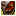

Final dungeon of the main story which is unlocked after clearing Castle Keep. Pekeji or Oryu can be brought along if you'd like - They can also be recruited inside the dungeon. Pots and staves are found unidentified, and blessed or cursed items can be generated. Overall, the dungeon portion isn't very difficult with carry-in items, but the 2 boss fights at the end can be tricky.

<ul class="quickLinksUL">
  <li><a href="#overview">Overview</a></li>
  <li><a href="#strategy">Strategy</a></li>
  <li><a href="#floor-guide">Floor Guide</a></li>
  <li><a href="#monsters">Monsters</a></li>
  <li><a href="#monster-table">Monster Table</a></li>
  <li><a href="#items">Items</a></li>
  <li><a href="#traps">Traps</a></li>
</ul>

# Overview

<table class="dungeonOverview">
  <tr>
    <th>Unlock</th>
    <td class="highlightYellow">Clear Castle Keep.</td>
  </tr>
  <tr>
    <th>Entrance</th>
    <td class="highlightYellow">Town of Ilpa (South exit)</td>
  </tr>
</table>

<table class="dungeonTable">
  <tr>
    <th>JP Name</th>
    <td colspan="3">ジャハンナムの扉</td>
  </tr>
  <tr>
    <th>Floors</th>
    <td>23F</td>
    <th>Allies</th>
    <td>Yes</td>
  </tr>
  <tr>
    <th>Bring Items</th>
    <td>Yes</td>
    <th>Bring Level Ups</th>
    <td>Yes</td>
  </tr>
  <tr>
    <th>Bring Gitan</th>
    <td>Yes</td>
    <th>Starting Item</th>
    <td>Onigiri</td>
  </tr>
  <tr>
    <th>Unidentified</th>
    <td colspan="3">Weapons, Shields, Pots, Staves</td>
  </tr>
  <tr>
    <th>Shops</th>
    <td>3-19F</td>
    <th>Monster Houses</th>
    <td>3-19F</td>
  </tr>
  <tr>
    <th>Clear Icon</th>
    <td class="clearIcon"></td>
    <th>Reward</th>
    <td>None</td>
  </tr>
</table>

# Strategy

### General

Level up at the Training Hall before entering if you want an easier time.

Staves can be identified by swinging them at a monster from a distance, so save Identify Scrolls for pots. It's best to name unidentified items once you recognize their effects.

Don't equip unidentified weapons and shields unless you didn't bring equipment or you come across a Strip Trap. If an item is cursed, you won't be able to unequip it unless you purify it or step on a Strip Trap.

Mini Mixers can be found between 17-18F, allowing for equipment synthesis. Unlike other games in the series, Mini Mixers don't have different item category recipes for runes in this game, so you can only synthesize runes via weapons + weapons, shields + shields, or bracelets + bracelets.

### Carry-In Items

You don't necessarily need all of these items, but they definitely help make for a smoother run.

#### Equipment

A weapon and shield set that grants a resonance effect gives you a greater advantage.

|Weapon|Shield|Effect|
|-|-|-|
|Katana|Iron Shield|Max HP +20|
|Demon Slayer|Demon Shield|Max strength +4|
|Beetle Axe|Beetle Shield|Max strength +3|

※ Iron Shield can be purchased in Town of Ilpa.

Nice bracelets to have on hand:

|Bracelet|Notes|
|-|-|
|Scout Bracelet|Reveals the locations of characters and items.|
|Vision Bracelet|Lets you see hidden traps and invisible monsters.|
|Heal Bracelet|Restore 5 HP per turn, but also doubles hunger rate.|
|Nirvana Bracelet|Stops natural fullness depletion.|

※ Unequip bracelets when fighting monsters to prevent them from breaking.

#### Other Items

|Item|Notes|
|-|-|
|Revival Grass|Revives you if you collapse.|
|Swift Grass|Bring 2~3 for the boss fights.|
|Dragon Grass|Bring 4 for the 1st boss.|
|Slumber Scroll Confusion Scroll|Nice for Monster Houses.|
|Escape Scroll|Return to Town of Ilpa with your items.|
|Decoy Staff Paralysis Staff|Useful in various situations.|
|Storage Pot|Carry more items.|
|Heal Pot|Insert an item to restore all of your HP.|
|Food|Keep onigiri in Storage Pots.|

# Floor Guide

### 1-9F

Regular shops can be generated between 3-9F, so check every room.

Enemies shouldn't be much of a threat if you brought items as suggested. If you have a Nirvana Bracelet, feel free to farm monsters for experience points until the wind blows. However, Curse Girl (3-4F) and Gazer (5-7F) can destroy items, so you might want to rush stairs on those floors.

If you forgot to bring an Escape Scroll, hunt Rock Heads (6-7F) until you obtain one.

### 10-14F

Specialty shops that only sell monster meat can be generated between 10-14F. Bow Boy, Pumphantasm, and Chicken meat can be useful, but none are essential, so rush stairs if you want.

Curse Sister (11-14F), Daze Hermit (12-14F), and Demon Warrior (12-14F) are the only notable threats. Daze Hermit's Inaccurate status lasts for 5 turns. Use items if a Ghost Warrior levels up a different monster.

### 15-22F

Regular shops can be generated between 15-19F - If you see a Sturdy Bracelet, do everything you can to buy it. ※ Sturdy Bracelet never breaks (under most circumstances) - Use it as a base for synthesis.

Explochins (16-18F) deal damage equal to 50% of your current HP when they explode, so avoid being adjacent. If an important item gets stolen by a Bad Zalokleft (16-18F), go hunt it down to reclaim it. Gyaza (16-19F) is basically immune to most attacks other than direct attacks.

Throw 2 items at a Mini Mixer (17-18F) to synthesize them. (Weapon + weapon, shield + shield, or bracelet + bracelet) ※ Mini Mixer's attack power increases each time it eats an item, so use a scroll or staff to safely defeat it.

Gyadon (19-21F) reduces a staff's use count to 0, but it can't peck staves inside pots. Dark Vassal (19-22F) is immune to magic bullets, and Demon Vassal (19-22F) is immune to scroll effects. Dragon (20-22F) breathes fire in a straight line which deals 30 damage - Use Mage Staff or such instead of trading hits. Overall, it's best to rush stairs between 20-22F.

### Boss 1

Curas nullifies scrolls, staves, and projectiles - This significantly limits your options. The easiest strategy is to use Swift Grass → Dragon Grass x 4 → Finish with a direct attack. Otherwise, you'll probably just have to trade hits while relying on healing items.

<table class="monsterPageTable">
  <tr>
    <th>Name</th>
    <th>HP</th>
    <th>Atk</th>
    <th>Def</th>
    <th>Exp</th>
    <th>Elem.</th>
    <th>Notes</th>
  </tr>
  <tr>
    <td>Curas</td>
    <td>201</td>
    <td>50</td>
    <td>60</td>
    <td>0</td>
    <td>-</td>
    <td>Nullifies scrolls, staves, and projectiles. Deals knockback, and can drain 25 HP from Shiren. Eaten items like Swift Grass and Dragon Grass are effective.</td>
  </tr>
</table>

### Boss 2

This fight is usually much easier, as long as your damage output isn't very low. The main gimmick is that while Evil God doesn't attack, if you take too long to defeat it, you get an auto game over. Koppa will warn you if you're nearing the bad ending, and you kind of have to do nothing for a while to have it happen, so don't feel too pressured about it.

Otherwise, the only threats are the Dark Vassals and Demon Vassals that spawn whenever you defeat a part. Remember that Dark Vassals are immune to staves, and Demon Vassals are immune to scrolls. Just keep attacking and aim straight for the blue core, and you should be fine.

<table class="monsterPageTable">
  <tr>
    <th>Name</th>
    <th>HP</th>
    <th>Atk</th>
    <th>Def</th>
    <th>Exp</th>
    <th>Elem.</th>
    <th>Notes</th>
  </tr>
  <tr>
    <td>Evil God (Part A)</td>
    <td>80</td>
    <td>0</td>
    <td>33</td>
    <td>0</td>
    <td rowspan="3">-</td>
    <td rowspan="2">Evil God doesn't attack. Dark Vassal type monsters appear when a part is destroyed.</td>
  </tr>
  <tr>
    <td>Evil God (Part B)</td>
    <td>120</td>
    <td>0</td>
    <td>40</td>
    <td>0</td>
  </tr>
  <tr>
    <td>Evil God (Core)</td>
    <td>201</td>
    <td>1</td>
    <td>20</td>
    <td>0</td>
    <td>The fight ends once the core is destroyed.</td>
  </tr>
</table>

# Monsters

# Monster Table

F Colors: Shop is possible Specialty Shop is possible H Colors: Monster House is possible Spawn Rates: Low Medium High Enemy Colors: Farming Useful Destroys Items Dangerous

<table class="monsterTable">
  <thead>
    <tr>
      <th class="highlightPurple">F</th>
      <th class="highlightPurple">H</th>
      <th colspan="9" class="highlightPurple">Monsters</th>
    </tr>
  </thead>
  <tbody>
    <tr>
      <th>1</th>
      <th></th>
      <td class="high">Mamel</td>
      <td class="high">Pit Mamel</td>
      <td class="mid">Baby Mage</td>
      <td class="highlightGray"></td>
      <td class="highlightGray"></td>
      <td class="highlightGray"></td>
      <td class="highlightGray"></td>
      <td class="highlightGray"></td>
      <td class="highlightGray"></td>
    </tr>
    <tr>
      <th>2</th>
      <th></th>
      <td class="high">Mamel</td>
      <td class="high">Pit Mamel</td>
      <td class="mid">Baby Mage</td>
      <td class="mid">Fog Hermit</td>
      <td class="mid">Shady Wisp</td>
      <td class="high">Teaser Monkey</td>
      <td class="highlightGray"></td>
      <td class="highlightGray"></td>
      <td class="highlightGray"></td>
    </tr>
    <tr>
      <th class="highlightShop">3</th>
      <th class="highlightMH"></th>
      <td class="high">Chintala</td>
      <td class="low">Curse Girl</td>
      <td class="high">Boy Mage</td>
      <td class="mid">Fog Hermit</td>
      <td class="mid">Shady Wisp</td>
      <td class="mid">Teaser Monkey</td>
      <td class="highlightGray"></td>
      <td class="highlightGray"></td>
      <td class="highlightGray"></td>
    </tr>
    <tr>
      <th class="highlightShop">4</th>
      <th class="highlightMH"></th>
      <td class="high">Chintala</td>
      <td class="mid">Curse Girl</td>
      <td class="high">Boy Mage</td>
      <td class="mid">Fog Hermit</td>
      <td class="mid">Dagyan</td>
      <td class="mid">Death Reaper</td>
      <td class="highlightGray"></td>
      <td class="highlightGray"></td>
      <td class="highlightGray"></td>
    </tr>
    <tr>
      <th class="highlightShop">5</th>
      <th class="highlightMH"></th>
      <td class="high">Gazer</td>
      <td class="high">Glare Snake</td>
      <td class="mid">Boy Mage</td>
      <td class="high">Trap Genin</td>
      <td class="high">Dagyan</td>
      <td class="high">Death Reaper</td>
      <td class="mid">Sheep Priest</td>
      <td class="highlightGray"></td>
      <td class="highlightGray"></td>
    </tr>
    <tr>
      <th class="highlightShop">6</th>
      <th class="highlightMH"></th>
      <td class="high">Gazer</td>
      <td class="high">Glare Snake</td>
      <td class="high">Rock Head</td>
      <td class="high">Trap Genin</td>
      <td class="high">Dagyan</td>
      <td class="high">Death Reaper</td>
      <td class="high">Sheep Priest</td>
      <td class="high">Pumphantasm</td>
      <td class="high">Pitcher Plant</td>
    </tr>
    <tr>
      <th class="highlightShop">7</th>
      <th class="highlightMH"></th>
      <td class="high">Gazer</td>
      <td class="mid">Wolf Droid</td>
      <td class="high">Rock Head</td>
      <td class="high">Trap Genin</td>
      <td class="high">Doze Mage</td>
      <td class="mid">Soldier Ant</td>
      <td class="high">Sheep Priest</td>
      <td class="high">Pumphantasm</td>
      <td class="high">Pitcher Plant</td>
    </tr>
    <tr>
      <th class="highlightShop">8</th>
      <th class="highlightMH"></th>
      <td class="highlightGray"></td>
      <td class="mid">Wolf Droid</td>
      <td class="high">Dozy Genie</td>
      <td class="highlightGray"></td>
      <td class="high">Doze Mage</td>
      <td class="mid">Soldier Ant</td>
      <td class="high">Floor Dragon</td>
      <td class="high">Pumphantasm</td>
      <td class="high">Pitcher Plant</td>
    </tr>
    <tr>
      <th class="highlightShop">9</th>
      <th class="highlightMH"></th>
      <td class="high">Bow Boy</td>
      <td class="mid">Wolf Droid</td>
      <td class="high">Dozy Genie</td>
      <td class="high">Zen Guru</td>
      <td class="high">Doze Mage</td>
      <td class="mid">Soldier Ant</td>
      <td class="high">Floor Dragon</td>
      <td class="high">Samuraidon</td>
      <td class="high">Pitcher Plant</td>
    </tr>
    <tr>
      <th class="highlightGreen">10</th>
      <th class="highlightMH"></th>
      <td class="high">Warabi</td>
      <td class="high">Crossbow Boy</td>
      <td class="high">Dozy Genie</td>
      <td class="high">Zen Guru</td>
      <td class="highlightGray"></td>
      <td class="highlightGray"></td>
      <td class="high">Floor Dragon</td>
      <td class="high">Samuraidon</td>
      <td class="highlightGray"></td>
    </tr>
    <tr>
      <th class="highlightGreen">11</th>
      <th class="highlightMH"></th>
      <td class="high">Warabi</td>
      <td class="high">Crossbow Boy</td>
      <td class="mid">Curse Sister</td>
      <td class="high">Zen Guru</td>
      <td class="highlightGray"></td>
      <td class="low">Healer Rabbit</td>
      <td class="highlightGray"></td>
      <td class="high">Samuraidon</td>
      <td class="highlightGray"></td>
    </tr>
    <tr>
      <th class="highlightGreen">12</th>
      <th class="highlightMH"></th>
      <td class="high">Warabi</td>
      <td class="high">Dark Slasher</td>
      <td class="mid">Curse Sister</td>
      <td class="high">Daze Hermit</td>
      <td class="low">Alert Fly</td>
      <td class="low">Healer Rabbit</td>
      <td class="high">Demon Warrior</td>
      <td class="highlightGray"></td>
      <td class="highlightGray"></td>
    </tr>
    <tr>
      <th class="highlightGreen">13</th>
      <th class="highlightMH"></th>
      <td class="highlightGray"></td>
      <td class="high">Dark Slasher</td>
      <td class="mid">Curse Sister</td>
      <td class="high">Daze Hermit</td>
      <td class="low">Alert Fly</td>
      <td class="low">Healer Rabbit</td>
      <td class="high">Demon Warrior</td>
      <td class="low">Punter Scarab</td>
      <td class="highlightGray"></td>
    </tr>
    <tr>
      <th class="highlightGreen">14</th>
      <th class="highlightMH"></th>
      <td class="highlightGray"></td>
      <td class="high">Dark Slasher</td>
      <td class="mid">Curse Sister</td>
      <td class="high">Daze Hermit</td>
      <td class="low">Alert Fly</td>
      <td class="low">Healer Rabbit</td>
      <td class="high">Demon Warrior</td>
      <td class="low">Punter Scarab</td>
      <td class="high">Vampire Baron</td>
    </tr>
    <tr>
      <th class="highlightShop">15</th>
      <th class="highlightMH"></th>
      <td class="highlightGray"></td>
      <td class="high">Groggy Genie</td>
      <td class="mid">Pumphantom</td>
      <td class="high">Lobber Beetle</td>
      <td class="highlightGray"></td>
      <td class="highlightGray"></td>
      <td class="highlightGray"></td>
      <td class="highlightGray"></td>
      <td class="high">Vampire Baron</td>
    </tr>
    <tr>
      <th class="highlightShop">16</th>
      <th class="highlightMH"></th>
      <td class="high">Gyaza</td>
      <td class="mid">Bored Kappa</td>
      <td class="mid">Pumphantom</td>
      <td class="high">Lobber Beetle</td>
      <td class="high">Explochin</td>
      <td class="mid">Bad Zalokleft</td>
      <td class="highlightGray"></td>
      <td class="highlightGray"></td>
      <td class="highlightGray"></td>
    </tr>
    <tr>
      <th class="highlightShop">17</th>
      <th class="highlightMH"></th>
      <td class="high">Gyaza</td>
      <td class="mid">Bored Kappa</td>
      <td class="high">Mini Mixer</td>
      <td class="mid">Lobber Beetle</td>
      <td class="high">Explochin</td>
      <td class="mid">Bad Zalokleft</td>
      <td class="mid">Lamp Puffer</td>
      <td class="high">Squid King</td>
      <td class="highlightGray"></td>
    </tr>
    <tr>
      <th class="highlightShop">18</th>
      <th class="highlightMH"></th>
      <td class="high">Gyaza</td>
      <td class="mid">Bored Kappa</td>
      <td class="high">Mini Mixer</td>
      <td class="highlightGray"></td>
      <td class="high">Explochin</td>
      <td class="mid">Bad Zalokleft</td>
      <td class="mid">Lamp Puffer</td>
      <td class="high">Squid King</td>
      <td class="highlightGray"></td>
    </tr>
    <tr>
      <th class="highlightShop">19</th>
      <th class="highlightMH"></th>
      <td class="high">Gyaza</td>
      <td class="high">Gyadon</td>
      <td class="high">Dark Vassal</td>
      <td class="high">Demon Vassal</td>
      <td class="high">Gawkulus</td>
      <td class="high">Sneaky Slasher</td>
      <td class="highlightGray"></td>
      <td class="highlightGray"></td>
      <td class="highlightGray"></td>
    </tr>
    <tr>
      <th>20</th>
      <th></th>
      <td class="high">Dragon</td>
      <td class="high">Gyadon</td>
      <td class="high">Dark Vassal</td>
      <td class="high">Demon Vassal</td>
      <td class="high">Gawkulus</td>
      <td class="high">Sneaky Slasher</td>
      <td class="high">Taur</td>
      <td class="highlightGray"></td>
      <td class="highlightGray"></td>
    </tr>
    <tr>
      <th>21</th>
      <th></th>
      <td class="high">Dragon</td>
      <td class="high">Gyadon</td>
      <td class="high">Dark Vassal</td>
      <td class="high">Demon Vassal</td>
      <td class="high">Gawkulus</td>
      <td class="high">Sneaky Slasher</td>
      <td class="high">Taur</td>
      <td class="highlightGray"></td>
      <td class="highlightGray"></td>
    </tr>
    <tr>
      <th>22</th>
      <th></th>
      <td class="high">Dragon</td>
      <td class="highlightGray"></td>
      <td class="low">Dark Vassal</td>
      <td class="low">Demon Vassal</td>
      <td class="highlightGray"></td>
      <td class="low">Healer Rabbit</td>
      <td class="high">Taur</td>
      <td class="highlightGray"></td>
      <td class="highlightGray"></td>
    </tr>
    <tr>
      <th>23</th>
      <th></th>
      <td colspan="9" class="highlightOffense">Boss</td>
    </tr>
  </tbody>
</table>

# Items

The values like "1-22" in columns represent the floor range where the item can appear.

- F = Floor
- S = Shop
- M = Monster
- P = Presto Pot

 

<table class="dungeonItemTable">
  <tr>
    <th colspan="5" class="highlightLightblue">Weapon</th>
    <th rowspan="64"></th>
    <th colspan="5" class="highlightLightblue">Grass</th>
  </tr>
  <tr>
    <th>Name</th>
    <th>F</th>
    <th>S</th>
    <th>M</th>
    <th>P</th>
    <th>Name</th>
    <th>F</th>
    <th>S</th>
    <th>M</th>
    <th>P</th>
  </tr>
  <tr>
    <td class="leftText">Beetle Axe</td>
    <td>1-22</td>
    <td></td>
    <td></td>
    <td>1-22</td>
    <td class="leftText">Expand Seed</td>
    <td>1-22</td>
    <td>3-19 ※1</td>
    <td></td>
    <td>1-22</td>
  </tr>
  <tr>
    <td class="leftText">Katana</td>
    <td>1-22</td>
    <td></td>
    <td></td>
    <td>1-22</td>
    <td class="leftText">Life Grass</td>
    <td>1-22</td>
    <td>3-19 ※1</td>
    <td></td>
    <td>1-22</td>
  </tr>
  <tr>
    <td class="leftText">Mallet</td>
    <td>1-22</td>
    <td></td>
    <td></td>
    <td>1-22</td>
    <td class="leftText">Otogiriso</td>
    <td>1-22</td>
    <td>3-19 ※1</td>
    <td></td>
    <td>1-22</td>
  </tr>
  <tr>
    <td class="leftText">Kabura's Blade</td>
    <td></td>
    <td></td>
    <td></td>
    <td>1-22</td>
    <td class="leftText">Dizzy Grass</td>
    <td>1-22</td>
    <td></td>
    <td></td>
    <td>1-22</td>
  </tr>
  <tr>
    <td class="leftText">Club</td>
    <td>1-14</td>
    <td></td>
    <td></td>
    <td>1-22</td>
    <td class="leftText">Weeds</td>
    <td></td>
    <td></td>
    <td></td>
    <td>23</td>
  </tr>
  <tr>
    <td class="leftText">Sky Splitter</td>
    <td></td>
    <td>15-19</td>
    <td></td>
    <td>1-22</td>
    <td class="leftText">Happy Grass</td>
    <td></td>
    <td>3-19 ※1</td>
    <td></td>
    <td>1-22</td>
  </tr>
  <tr>
    <td class="leftText">Ghost Sickle</td>
    <td></td>
    <td>3-19 ※1</td>
    <td></td>
    <td></td>
    <td class="leftText">Sleep Grass</td>
    <td>1-22</td>
    <td></td>
    <td></td>
    <td>1-22</td>
  </tr>
  <tr>
    <td class="leftText">Spark Sword</td>
    <td></td>
    <td>3-9</td>
    <td></td>
    <td>1-22</td>
    <td class="leftText">Swift Grass</td>
    <td>1-22</td>
    <td>3-19 ※1</td>
    <td></td>
    <td>1-22</td>
  </tr>
  <tr>
    <td class="leftText">Bronze Sword</td>
    <td>1-22</td>
    <td></td>
    <td></td>
    <td>1-22</td>
    <td class="leftText">Warp Grass</td>
    <td>1-22</td>
    <td></td>
    <td></td>
    <td></td>
  </tr>
  <tr>
    <td class="leftText">Pickaxe</td>
    <td>1-22</td>
    <td></td>
    <td></td>
    <td>1-22</td>
    <td class="leftText">Strength Grass</td>
    <td>1-22</td>
    <td>3-19 ※1</td>
    <td></td>
    <td>1-22</td>
  </tr>
  <tr>
    <td class="leftText">Dotanuki</td>
    <td></td>
    <td></td>
    <td></td>
    <td>1-22</td>
    <td class="leftText">Antidote Grass</td>
    <td>1-22</td>
    <td>3-19 ※1</td>
    <td></td>
    <td>1-22</td>
  </tr>
  <tr>
    <td class="leftText">Dragon Killer</td>
    <td></td>
    <td>3-19 ※1</td>
    <td></td>
    <td></td>
    <td class="leftText">Poison Grass</td>
    <td>1-22</td>
    <td></td>
    <td></td>
    <td>1-22</td>
  </tr>
  <tr>
    <td class="leftText">Demon Slayer</td>
    <td>1-22</td>
    <td>3-9</td>
    <td></td>
    <td>1-22</td>
    <td class="leftText">Dragon Grass</td>
    <td>1-22</td>
    <td></td>
    <td></td>
    <td>1-22</td>
  </tr>
  <tr>
    <td class="leftText">Crescent Arm</td>
    <td></td>
    <td>3-9</td>
    <td></td>
    <td></td>
    <td class="leftText">Revival Grass</td>
    <td>1-22</td>
    <td>3-19 ※1</td>
    <td></td>
    <td>1-22</td>
  </tr>
  <tr>
    <td class="leftText">Aura Spear</td>
    <td></td>
    <td>15-19</td>
    <td></td>
    <td></td>
    <td class="leftText">Sight Grass</td>
    <td>1-22</td>
    <td>3-19 ※1</td>
    <td></td>
    <td>1-22</td>
  </tr>
  <tr>
    <th colspan="5" class="highlightLightblue">Shield</th>
    <td class="leftText">Herb</td>
    <td>1-22</td>
    <td></td>
    <td></td>
    <td>1-22</td>
  </tr>
  <tr>
    <th>Name</th>
    <th>F</th>
    <th>S</th>
    <th>M</th>
    <th>P</th>
    <th colspan="5" class="highlightLightblue">Scroll</th>
  </tr>
  <tr>
    <td class="leftText">Beetle Shield</td>
    <td>1-22</td>
    <td></td>
    <td></td>
    <td>1-22</td>
    <th>Name</th>
    <th>F</th>
    <th>S</th>
    <th>M</th>
    <th>P</th>
  </tr>
  <tr>
    <td class="leftText">Froggo Shield</td>
    <td></td>
    <td>15-19</td>
    <td></td>
    <td></td>
    <td class="leftText">Navigation Scroll</td>
    <td>1-22</td>
    <td>3-19 ※1</td>
    <td></td>
    <td>1-22</td>
  </tr>
  <tr>
    <td class="leftText">Happy Shield</td>
    <td></td>
    <td>15-19</td>
    <td></td>
    <td></td>
    <td class="leftText">Great Hall Scroll</td>
    <td>1-22</td>
    <td></td>
    <td></td>
    <td></td>
  </tr>
  <tr>
    <td class="leftText">Blast Shield</td>
    <td>1-22</td>
    <td>3-19 ※1</td>
    <td></td>
    <td>1-22</td>
    <td class="leftText">Purify Scroll</td>
    <td></td>
    <td>3-19 ※1</td>
    <td></td>
    <td>1-22</td>
  </tr>
  <tr>
    <td class="leftText">Bronze Shield</td>
    <td>1-22</td>
    <td></td>
    <td></td>
    <td>1-22</td>
    <td class="leftText">Confusion Scroll</td>
    <td>1-22</td>
    <td></td>
    <td></td>
    <td>1-22</td>
  </tr>
  <tr>
    <td class="leftText">Kabura's Guard</td>
    <td></td>
    <td></td>
    <td></td>
    <td>1-22</td>
    <td class="leftText">Identify Scroll</td>
    <td>1-22</td>
    <td></td>
    <td></td>
    <td>1-22</td>
  </tr>
  <tr>
    <td class="leftText">Iron Shield</td>
    <td>1-22</td>
    <td></td>
    <td></td>
    <td>1-22</td>
    <td class="leftText">Air Slash Scroll</td>
    <td>1-22</td>
    <td>3-19 ※1</td>
    <td></td>
    <td>1-22</td>
  </tr>
  <tr>
    <td class="leftText">Walrus Shield</td>
    <td></td>
    <td>15-19</td>
    <td></td>
    <td></td>
    <td class="leftText">Sanctuary Scroll</td>
    <td>1-22</td>
    <td></td>
    <td></td>
    <td></td>
  </tr>
  <tr>
    <td class="leftText">Dragon Shield</td>
    <td></td>
    <td>3-9</td>
    <td></td>
    <td>1-22</td>
    <td class="leftText">Fear Scroll</td>
    <td>1-22</td>
    <td></td>
    <td></td>
    <td>1-22</td>
  </tr>
  <tr>
    <td class="leftText">Holy Shield</td>
    <td></td>
    <td>15-19</td>
    <td></td>
    <td>1-22</td>
    <td class="leftText">Earth Scroll</td>
    <td>6-22</td>
    <td>3-19 ※1</td>
    <td></td>
    <td>1-22</td>
  </tr>
  <tr>
    <td class="leftText">Counter Shield</td>
    <td>1-22</td>
    <td>3-9</td>
    <td></td>
    <td>1-22</td>
    <td class="leftText">Heaven Scroll</td>
    <td>6-22</td>
    <td>3-19 ※1</td>
    <td></td>
    <td>1-22</td>
  </tr>
  <tr>
    <td class="leftText">Diet Shield</td>
    <td>1-22</td>
    <td>3-9</td>
    <td></td>
    <td>1-22</td>
    <td class="leftText">Slumber Scroll</td>
    <td>1-22</td>
    <td>3-19 ※1</td>
    <td></td>
    <td>1-22</td>
  </tr>
  <tr>
    <td class="leftText">Demon Shield</td>
    <td></td>
    <td>3-9</td>
    <td></td>
    <td></td>
    <td class="leftText">Power Up Scroll</td>
    <td>1-22</td>
    <td>3-19 ※1</td>
    <td></td>
    <td>1-22</td>
  </tr>
  <tr>
    <td class="leftText">Fuuma Shield</td>
    <td>1-22</td>
    <td>3-9</td>
    <td></td>
    <td>1-22</td>
    <td class="leftText">Plating Scroll</td>
    <td></td>
    <td>3-19 ※1</td>
    <td></td>
    <td>1-22</td>
  </tr>
  <tr>
    <td class="leftText">Wood Shield</td>
    <td>1-22</td>
    <td></td>
    <td></td>
    <td>1-22</td>
    <td class="leftText">Escape Scroll</td>
    <td>10-22</td>
    <td></td>
    <td>6-7</td>
    <td></td>
  </tr>
  <tr>
    <th colspan="5" class="highlightLightblue">Bracelet</th>
    <td class="leftText">Trap Erase Scroll</td>
    <td>1-22</td>
    <td>3-19 ※1</td>
    <td></td>
    <td>1-22</td>
  </tr>
  <tr>
    <th>Name</th>
    <th>F</th>
    <th>S</th>
    <th>M</th>
    <th>P</th>
    <th colspan="5" class="highlightLightblue">Staff</th>
  </tr>
  <tr>
    <td class="leftText">Heal Bracelet</td>
    <td>1-22</td>
    <td>3-19 ※1</td>
    <td></td>
    <td>1-22</td>
    <th>Name</th>
    <th>F</th>
    <th>S</th>
    <th>M</th>
    <th>P</th>
  </tr>
  <tr>
    <td class="leftText">Sturdy Bracelet</td>
    <td></td>
    <td>15-19</td>
    <td></td>
    <td></td>
    <td class="leftText">Empathy Staff</td>
    <td>1-22</td>
    <td></td>
    <td></td>
    <td>1-22</td>
  </tr>
  <tr>
    <td class="leftText">Calm Bracelet</td>
    <td>1-22</td>
    <td>3-19 ※1</td>
    <td></td>
    <td>1-22</td>
    <td class="leftText">Transient Staff</td>
    <td>1-22</td>
    <td>3-19 ※1</td>
    <td></td>
    <td>1-22</td>
  </tr>
  <tr>
    <td class="leftText">Warp Bracelet</td>
    <td>1-22</td>
    <td></td>
    <td></td>
    <td></td>
    <td class="leftText">Paralysis Staff</td>
    <td>1-22</td>
    <td>3-19 ※1</td>
    <td></td>
    <td>1-22</td>
  </tr>
  <tr>
    <td class="leftText">Strength Bracelet</td>
    <td>1-22</td>
    <td>3-9</td>
    <td></td>
    <td>1-22</td>
    <td class="leftText">Miss Staff</td>
    <td></td>
    <td>3-19 ※1</td>
    <td></td>
    <td>1-22</td>
  </tr>
  <tr>
    <td class="leftText">Strider Bracelet</td>
    <td>1-22</td>
    <td>3-19 ※1</td>
    <td></td>
    <td>1-22</td>
    <td class="leftText">Pinning Staff</td>
    <td>1-22</td>
    <td>3-19 ※1</td>
    <td></td>
    <td>1-22</td>
  </tr>
  <tr>
    <td class="leftText">Scout Bracelet</td>
    <td>1-22</td>
    <td>3-19 ※1</td>
    <td></td>
    <td>1-22</td>
    <td class="leftText">Swap Staff</td>
    <td>1-22</td>
    <td></td>
    <td></td>
    <td>1-22</td>
  </tr>
  <tr>
    <td class="leftText">Holy Bracelet</td>
    <td>1-22</td>
    <td>3-19 ※1</td>
    <td></td>
    <td>1-22</td>
    <td class="leftText">Seal Staff</td>
    <td>1-22</td>
    <td>3-19 ※1</td>
    <td></td>
    <td>1-22</td>
  </tr>
  <tr>
    <td class="leftText">Nirvana Bracelet</td>
    <td>1-22</td>
    <td>3-19 ※1</td>
    <td></td>
    <td>1-22</td>
    <td class="leftText">Knockback Staff</td>
    <td>1-22</td>
    <td></td>
    <td></td>
    <td>1-22</td>
  </tr>
  <tr>
    <td class="leftText">Vision Bracelet</td>
    <td>1-22</td>
    <td>3-19 ※1</td>
    <td></td>
    <td>1-22</td>
    <td class="leftText">Unlucky Staff</td>
    <td></td>
    <td>3-19 ※1</td>
    <td></td>
    <td></td>
  </tr>
  <tr>
    <td class="leftText">Cleansing Bracelet</td>
    <td>1-22</td>
    <td></td>
    <td></td>
    <td>1-22</td>
    <td class="leftText">Presto Staff</td>
    <td>1-22</td>
    <td></td>
    <td></td>
    <td>1-22</td>
  </tr>
  <tr>
    <th colspan="5" class="highlightLightblue">Projectile</th>
    <td class="leftText">Mage Staff</td>
    <td>1-22</td>
    <td></td>
    <td></td>
    <td>1-22</td>
  </tr>
  <tr>
    <th>Name</th>
    <th>F</th>
    <th>S</th>
    <th>M</th>
    <th>P</th>
    <td class="leftText">Decoy Staff</td>
    <td>6-22</td>
    <td>3-19 ※1</td>
    <td></td>
    <td>1-22</td>
  </tr>
  <tr>
    <td class="leftText">Wood Arrow</td>
    <td>1-22</td>
    <td></td>
    <td>9</td>
    <td></td>
    <th colspan="5" class="highlightLightblue">Pot</th>
  </tr>
  <tr>
    <td class="leftText">Iron Arrow</td>
    <td>6-22</td>
    <td>3-19 ※1</td>
    <td>10-11</td>
    <td>1-22</td>
    <th>Name</th>
    <th>F</th>
    <th>S</th>
    <th>M</th>
    <th>P</th>
  </tr>
  <tr>
    <th colspan="5" class="highlightLightblue">Food</th>
    <td class="leftText">Heal Pot</td>
    <td>6-22</td>
    <td>3-19 ※1</td>
    <td></td>
    <td>1-22</td>
  </tr>
  <tr>
    <th>Name</th>
    <th>F</th>
    <th>S</th>
    <th>M</th>
    <th>P</th>
    <td class="leftText">Synthesis Pot</td>
    <td>6-22</td>
    <td>3-19 ※1</td>
    <td></td>
    <td>1-22</td>
  </tr>
  <tr>
    <td class="leftText">Large Onigiri</td>
    <td>1-22</td>
    <td>15-19</td>
    <td></td>
    <td>1-22</td>
    <td class="leftText">Identify Pot</td>
    <td>1-22</td>
    <td></td>
    <td></td>
    <td>1-22</td>
  </tr>
  <tr>
    <td class="leftText">Onigiri</td>
    <td>1-22</td>
    <td></td>
    <td></td>
    <td>1-22</td>
    <td class="leftText">Blessing Pot</td>
    <td>6-22</td>
    <td>3-19 ※1</td>
    <td></td>
    <td></td>
  </tr>
  <tr>
    <td class="leftText">Huge Onigiri</td>
    <td></td>
    <td>3-9</td>
    <td></td>
    <td>1-22</td>
    <td class="leftText">Presto Pot</td>
    <td>1-22</td>
    <td></td>
    <td></td>
    <td></td>
  </tr>
  <tr>
    <td class="leftText">Special Onigiri</td>
    <td></td>
    <td>3-9</td>
    <td></td>
    <td>1-22</td>
    <td class="leftText">Storage Pot</td>
    <td>6-22</td>
    <td>3-19 ※1</td>
    <td></td>
    <td>1-22</td>
  </tr>
  <tr>
    <th colspan="5" class="highlightLightblue">Meat</th>
    <td class="leftText">Water Pot</td>
    <td>1-22</td>
    <td></td>
    <td></td>
    <td>1-22</td>
  </tr>
  <tr>
    <th>Name</th>
    <th>F</th>
    <th>S</th>
    <th>M</th>
    <th>P</th>
    <td rowspan="6" colspan="5"></td>
  </tr>
  <tr>
    <td class="leftText">Chicken</td>
    <td></td>
    <td>10-14</td>
    <td></td>
    <td></td>
  </tr>
  <tr>
    <td class="leftText">Porky</td>
    <td></td>
    <td>10-14</td>
    <td></td>
    <td></td>
  </tr>
  <tr>
    <td class="leftText">Pumphantasm</td>
    <td></td>
    <td>10-14</td>
    <td></td>
    <td></td>
  </tr>
  <tr>
    <td class="leftText">Bow Boy</td>
    <td></td>
    <td>10-14</td>
    <td></td>
    <td></td>
  </tr>
  <tr>
    <td class="leftText">Mamel</td>
    <td></td>
    <td>10-14</td>
    <td></td>
    <td></td>
  </tr>
</table>

※1 - Never in shops between 10-14F. ※ Escape Scroll - Rock Head (6-7F) ※ Wood Arrow - Bow Boy (9F) ※ Iron Arrow - Crossbow Boy (10-11F)

# Traps

|F|Traps|
|-|-|
|1-3|Pit, Bind, Trip Stone, Rust, Sleep, Curse, Spring, Log|
|4-9|Pit, Bind, Trip Stone, Rust, Sleep, Poison Arrow, Curse, Spring, Log|
|10-11|Bind, Hunger, Strip, Iron Arrow, Spoil, Slow, Spring|
|12|Trip Stone|
|13-18|Bind, Hunger, Strip, Iron Arrow, Spoil, Curse, Spring|
|19-22|Bind, Alert, Trip Stone, Sleep, Strip, Slow, Curse, Spring|
