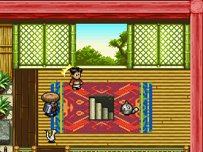
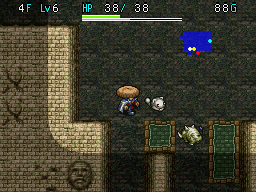
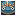

  

Dungeon where you progress through the floors with [Borg Mamel](/system/allies#borg-mamel) as a mandatory ally. You can bring items, but if Borg Mamel collapses, you'll lose all items and won't be able to request a rescue. However, this penalty is only the case for the 1st clear - afterwards, you can continue even if Borg Mamel collapses. The boss at the end can potentially one-shot Borg Mamel, so you need to use items to ensure their safety.

Overall, this dungeon has high potential for players to lose irreplaceable items like Fiery Fuuma if they're brought in, so it's strongly recommended to only bring replaceable items instead of your best items for the first clear.

<ul class="quickLinksUL">
  <li><a href="#overview">Overview</a></li>
  <li><a href="#strategy">Strategy</a></li>
  <li><a href="#floor-guide">Floor Guide</a></li>
  <li><a href="#monsters">Monsters</a></li>
  <li><a href="#items">Items</a></li>
  <li><a href="#traps">Traps</a></li>
</ul>

# Overview

<table class="dungeonOverview">
  <tr>
    <th>Unlock</th>
    <td class="highlightYellow">1. Clear Tonfan's Hole. 2. Complete one of the following: &nbsp;&nbsp;&nbsp;&nbsp;- Receive 10 rewards from Big Moai. &nbsp;&nbsp;&nbsp;&nbsp;- Clear Depths of the Abyss. 3. Talk to Big Moai in Ripishi's House. 4. Enter a dungeon → Return to town. 5. Return to Ripishi's House.</td>
  </tr>
  <tr>
    <th>Entrance</th>
    <td class="highlightYellow">Town of Ilpa (Ripishi's House)</td>
  </tr>
</table>

<table class="dungeonTable">
  <tr>
    <th>JP Name</th>
    <td colspan="3">マムルのほら穴</td>
  </tr>
  <tr>
    <th>Floors</th>
    <td colspan="3">30F (first) / 99F</td>
  </tr>
  <tr>
    <th>Bring Items</th>
    <td>Yes</td>
    <th>Allies</th>
    <td>Borg Mamel</td>
  </tr>
  <tr>
    <th>Bring Gitan</th>
    <td>Yes</td>
    <th>Bring Level Ups</th>
    <td>Yes</td>
  </tr>
  <tr>
    <th>Starting Item</th>
    <td colspan="3">Onigiri</td>
  </tr>
  <tr>
    <th>Unidentified</th>
    <td colspan="3">Weapons, Shields, Pots, Staves</td>
  </tr>
  <tr>
    <th>Shops</th>
    <td>1-98F</td>
    <th>Monster Houses</th>
    <td>1-98F</td>
  </tr>
  <tr>
    <th>Clear Icon</th>
    <td class="clearIcon"></td>
    <th>Reward</th>
    <td>Mamel Sword Mamel Shield</td>
  </tr>
</table>

※ The reward alternates between Mamel Sword → Mamel Shield each time you clear the dungeon.

# Strategy

### Borg Mamel

[Borg Mamel](/system/allies#borg-mamel) is a special ally who retains levels, but requires specific items to be thrown at it to level up. It has 75 max HP which never changes through level ups, but attack and defense increase when it levels up. That said, its stat growth rate is very slow due to having a max level of 99 - It's frankly not worth the effort. Another drawback is that Borg Mamel only uses direct attacks, and its AI rivals that of a caveman. It charges at any enemy, including Dark Slashers waiting to ambush and Pumphantasms in walls.

If that doesn't sound bad, consider that if Borg Mamel collapses during the story clear (30F), your run ends. That's right - You lose all of your items, and you can't request a rescue when the brilliant thing kicks the bucket. If Borg Mamel gets thrown onto a Hunger Trap or Spoil Trap by a Lobber Beetle (15-18F), it instantly collapses. Oh, and Nigiri Morph (18-20F) can one-shot Borg Mamel with its special attack too, because why not? And the boss? How about Swift 2 action speed and 100 attack, so it can one-shot Borg Mamel.

So yeah, you'll want to bring items like Invisible Staff and Explosion Scroll to try and keep Borg Mamel safe. And if you're caught in a bad situation like Borg Mamel being adjacent to a Nigiri Morph, read an Escape Scroll. You'll save more time escaping and restarting from 1F, compared to losing items and having to stock up again. (Or alternatively, just enter the dungeon without any items to minimize losses)

### Equipment

#### Weapon / Shield

Something around Katana + Iron Shield is fine for the first clear. You're going to need support items for the boss instead of strictly relying on strong equipment.

##### Weapon Runes

These runes can be obtained in Jahannam's Gate aside from 貫 (Town of Ilpa).

|Rune|Item|Notes|
|-|-|-|
|貫|Aura Spear|Attack up to 2 tiles ahead. (Pierces)|
|仏|Ghost Sickle|Deal more damage to Ghost types.|
|空|Sky Splitter|Deal more damage to Floating types.|
|目|Cyclops Killer|Deal more damage to Cyclops types.|
|竜|Dragon Killer|Deal more damage to Dragon types.|

##### Shield Runes

These runes can be obtained in Jahannam's Gate.

|Rune|Item|Notes|
|-|-|-|
|ト|Walrus Shield|Your items and Gitan will never be stolen.|
|竜|Dragon Shield|Reduces fire damage.|
|地|Blast Shield|Reduces explosion damage.|
|払|Holy Shield|Protects against curses.|
|腹|Diet Shield|Fullness depletes at half speed.|

#### Bracelets

Sturdy Bracelet as a base is effective of course, but you might not want to risk losing it. In that case, it's fine to use a more common bracelet as a base.

##### Bracelet 1 - Sturdy Bracelet (Scout + Vision)

|Rune|Item|Notes|
|-|-|-|
|見|Scout Bracelet|Reveals the locations of items and monsters.|
|目|Vision Bracelet|Lets you see things that are normally hidden.|

##### Bracelet 2 - Sturdy Bracelet (Nirvana + Heal)

|Rune|Item|Notes|
|-|-|-|
|悟|Nirvana Bracelet|Natural fullness depletion stops.|
|回|Heal Bracelet|Restore 5 HP per turn, but double hunger rate.|

### Other Items

##### General

|Item|Notes|
|-|-|
|Escape Scroll|Keep in a Storage Pot to protect against curses.|
|Revival Grass|Bless it to get 2 uses out of it.|
|Confusion Scroll|For Monster Houses or such.|
|Decoy Staff|Bring multiple of these.|
|Transient Staff|Use with a Scout Bracelet to quickly locate stairs.|
|Paralysis Staff|Bring multiple of these.|
|Storage Pot|Needed to bring lots of the above items.|

##### Mamel Cave Specific

|Item|Notes|
|-|-|
|Invisible Staff|Super important for keeping Borg Mamel safe.|
|Swap Staff|Switch positions with Borg Mamel if needed.|
|Explosion Scroll|Last resort for keeping Borg Mamel safe.|
|Miss Staff Seal Staff Poison Grass|For the boss fight. Seal Staff reduces its action speed to normal. Throw Poison Grass after swinging Seal Staff.|

# Floor Guide

### 1-6F

Baby Mage (1-2F), Curse Girl (3-4F), Impact Boar (3-4F), Gazer (5-7F), Pitcher Plant (6-9F), etc.

Monsters are weak, so you shouldn't really have problems. However, If you've synthesized Prism Shield, the 10 damage conversion can quickly put you in danger. So in that case, either equip a Heal Bracelet to recover HP, or let Borg Mamel fight.

Consider throwing unneeded items at Pitcher Plants to obtain grass if you're attempting a no carry-in items run. If you're lucky, you might get Revival Grass, Strength Grass, Otogiriso, or Life Grass.

### 7-11F

Gazer (5-7F), Bat Kangaroo (7-9F), Wolf Droid (7-9F), Twisty Hani (8-12F), Ether Devil (9-11F), etc.

Bat Kangaroo grants Enraged status, which boosts attack and raises special attack usage rate to 100%. This can be a problem with Gazer, Wolf Droid, and Twisty Hani in particular.

Wolf Droid's bomb toss has a range of 2 tiles, and deals a fixed 10 damage (5 with Blast Shield). Twisty Hani lowers a target's level by 1, but Borg Mamel converts the effect into 2 damage instead.

Equip a Vision Bracelet to check for invisible Ether Devils to avoid Borg Mamel getting hit by surprise attacks.

### 12-14F

Dark Slasher (12-14F), Demon Warrior (12-14F), Porko (12-15F), Schubell (13-17F), Healer Rabbit (12-15F), etc.

Borg Mamel will charge at Dark Slashers, so don't bother trying to level one up using Ghost Warriors. Porko's rock throw has a range of 5 tiles, so use items to disable it from a distance if necessary. Beware of disguised Wily Tanuki (11-20F) if you're attempting a no carry-in items run.

### 15-20F

Lobber Beetle (15-18F), Pumphantom (17-19F), Nigiri Morph (18-20F), Sneaky Slasher (20-23F), etc.

Extremely dangerous floor range during the first clear due to monsters that can one-shot Borg Mamel. Use Scout Bracelet + Transient Staff to quickly locate and rush to the stairs.

If Lobber Beetle throws Borg Mamel onto a Hunger or Spoil trap, Borg Mamel will instantly collapse. It has a throwing range of 5 tiles, but thankfully only throws characters onto traps that it can see, so it shouldn't be a problem if you use a Vision Bracelet to avoid stepping on traps.

Pumphantom doesn't have a special attack that can one-shot Borg Mamel, but is still quite dangerous. Borg Mamel will continue to chase Pumphantom even if the monster is in a wall and can't be reached, so there's risk of Borg Mamel collapsing unless you intervene such as using an Absorb Pot to remove Pumphantom's Wall Clip ability and forcing the monster to warp elsewhere.

The above two monsters are still in the realm of manageable, but the bigger concern is Nigiri Morph. Be warned - Borg Mamel will instantly collapse if Nigiri Morph uses its special attack on them. Don't let any Nigiri Morphs become adjacent to Borg Mamel, and use items to disable them as needed. Worst case, read an Escape Scroll and start over from 1F instead of gambling on a special attack chance.

### 21-24F

Sneaky Slasher (20-23F), Dragon (21-24F), Squid King (21-26F), Grime (22-27F), Taur (23-24F), etc.

Dragons breathe fire in a straight line, which deals 30 damage (15 with Dragon Shield). It's easy to avoid for Shiren, but Borg Mamel will move toward Dragons in a straight line if left alone. It's probably best to act with the assumption that red dots on the map in the distance are Dragons, and preemptively use items like Invisible Staff or Swap Staff to protect Borg Mamel.

Grime's special attack will lower Borg Mamel's defense for the duration of the current floor. Borg Mamel's bad AI often leads to it taking hits if you're not careful, and taking more damage is never good, so try to avoid letting it become adjacent to Grime monsters.

### 25-30F

Grime (22-27F), Sleep Warlock (25-27F), Haze Hermit (25-30F), Mini Mixer (27-30F), Super Gazer (28-33F), etc.

Lots of Drain types with annoying special attacks, but nothing exactly life threatening.

Slurp Leech (25-30F) lowers strength by 2 when adjacent - Save Antidote Grass until 31F, or 29F for 1st clear. Lantern Puffer (25-30F) reduces fullness by 30 when adjacent, but it's always asleep when it's generated. Haze Hermit casts a HP draining spell in a straight line, which lasts 20 turns. Sleep Warlock puts an adjacent target to sleep, so use items to disable it.

Mini Mixer provides a chance to synthesize items, but it's not necessary to do so for the first clear.

##### First Clear - 29F

Prepare Invisible Staff, Seal Staff, and Miss Staff before descending the stairs on 29F for the boss fight. Heal HP and use Antidote Grass if you have one on hand and lost strength earlier in the dungeon.

### Boss

Single enemy boss fight with Geronimamel. The boss only uses direct attacks, but acts 2 times per turn and has 100 attack. Geronimamel can potentially defeat Borg Mamel in a single turn, so do the following at the start:

1. Swing Invisible Staff at Borg Mamel to prevent them from being targeted.
2. Swing Miss Staff to make all of Geronimamel's attacks miss.
3. Swing Seal Staff to reduce Geronimamel's action speed to normal.
4. Throw Poison Grass to further reduce Geronimamel's action speed.

After the above, you're pretty much free to use direct attacks until Geronimamel is defeated. ※ If your attack power is low, you might need to refresh Miss Staff.

<table class="monsterPageTable">
  <tr>
    <th>Name</th>
    <th>HP</th>
    <th>Atk</th>
    <th>Def</th>
    <th>Exp</th>
    <th>Elem.</th>
    <th>Notes</th>
  </tr>
  <tr>
    <td>Geronimamel</td>
    <td>500</td>
    <td>100</td>
    <td>45</td>
    <td>0</td>
    <td>Swift 2</td>
    <td>Direct attacks only. Double speed, 2 attacks.</td>
  </tr>
</table>

### 31-99F

# Monsters

F Colors: Shop is possible H Colors: Monster House is possible Spawn Rates: Low Medium High Enemy Colors: Farming Useful Destroys Items Dangerous Very Dangerous

<table class="monsterTable">
  <thead>
    <tr>
      <th class="highlightPurple">F</th>
      <th class="highlightPurple">H</th>
      <th colspan="9" class="highlightPurple">Monsters</th>
    </tr>
  </thead>
  <tbody>
    <tr>
      <th rowspan="2" class="highlightShop">1</th>
      <th rowspan="2" class="highlightMH"></th>
      <td class="mid">Minion Mouse</td>
      <td class="high">Mamel</td>
      <td class="high">Pit Mamel</td>
      <td class="mid">Baby Mage</td>
      <td class="mid">Shady Wisp</td>
    </tr>
    <tr>
      <td class="highlightGray">&nbsp;</td>
      <td class="highlightGray"></td>
      <td class="highlightGray"></td>
      <td class="highlightGray"></td>
      <td class="highlightGray"></td>
    </tr>
    <tr>
      <th colspan="7"></th>
    </tr>
    <tr>
      <th rowspan="2" class="highlightShop">2</th>
      <th rowspan="2" class="highlightMH"></th>
      <td class="highlightGray"></td>
      <td class="highlightGray"></td>
      <td class="high">Pit Mamel</td>
      <td class="mid">Baby Mage</td>
      <td class="mid">Shady Wisp</td>
    </tr>
    <tr>
      <td class="high">Teaser Monkey</td>
      <td class="low">Fog Hermit</td>
      <td class="mid">Mobster Mouse</td>
      <td class="highlightGray"></td>
      <td class="highlightGray"></td>
    </tr>
    <tr>
      <th colspan="7"></th>
    </tr>
    <tr>
      <th rowspan="2" class="highlightShop">3</th>
      <th rowspan="2" class="highlightMH"></th>
      <td class="low">Curse Girl</td>
      <td class="highlightGray"></td>
      <td class="highlightGray"></td>
      <td class="highlightGray"></td>
      <td class="mid">Shady Wisp</td>
    </tr>
    <tr>
      <td class="mid">Teaser Monkey</td>
      <td class="mid">Fog Hermit</td>
      <td class="high">Mobster Mouse</td>
      <td class="mid">Impact Boar</td>
      <td class="high">Chintala</td>
    </tr>
    <tr>
      <th colspan="7"></th>
    </tr>
    <tr>
      <th rowspan="2" class="highlightShop">4</th>
      <th rowspan="2" class="highlightMH"></th>
      <td class="mid">Curse Girl</td>
      <td class="mid">Death Reaper</td>
      <td class="mid">Dagyan</td>
      <td class="highlightGray"></td>
      <td class="highlightGray"></td>
    </tr>
    <tr>
      <td class="highlightGray"></td>
      <td class="mid">Fog Hermit</td>
      <td class="mid">Mobster Mouse</td>
      <td class="mid">Impact Boar</td>
      <td class="high">Chintala</td>
    </tr>
    <tr>
      <th colspan="7"></th>
    </tr>
    <tr>
      <th rowspan="2" class="highlightShop">5</th>
      <th rowspan="2" class="highlightMH"></th>
      <td class="highlightGray"></td>
      <td class="mid">Death Reaper</td>
      <td class="mid">Dagyan</td>
      <td class="high">Glare Snake</td>
      <td class="mid">Sheep Priest</td>
    </tr>
    <tr>
      <td class="mid">Trap Genin</td>
      <td class="mid">Gazer</td>
      <td class="mid">Skipper Mouse</td>
      <td class="highlightGray"></td>
      <td class="highlightGray"></td>
    </tr>
    <tr>
      <th colspan="7"></th>
    </tr>
    <tr>
      <th rowspan="2" class="highlightShop">6</th>
      <th rowspan="2" class="highlightMH"></th>
      <td class="highlightGray"></td>
      <td class="highlightGray"></td>
      <td class="mid">Dagyan</td>
      <td class="high">Glare Snake</td>
      <td class="mid">Sheep Priest</td>
    </tr>
    <tr>
      <td class="mid">Trap Genin</td>
      <td class="mid">Gazer</td>
      <td class="mid">Skipper Mouse</td>
      <td class="mid">Pitcher Plant</td>
      <td class="highlightGray"></td>
    </tr>
    <tr>
      <th colspan="7"></th>
    </tr>
    <tr>
      <th rowspan="2" class="highlightShop">7</th>
      <th rowspan="2" class="highlightMH"></th>
      <td class="mid">Bat Kangaroo</td>
      <td class="mid">Bow Boy</td>
      <td class="mid">Doze Mage</td>
      <td class="highlightGray"></td>
      <td class="highlightGray"></td>
    </tr>
    <tr>
      <td class="highlightGray"></td>
      <td class="mid">Gazer</td>
      <td class="high">Skipper Mouse</td>
      <td class="mid">Pitcher Plant</td>
      <td class="low">Wolf Droid</td>
    </tr>
    <tr>
      <th colspan="7"></th>
    </tr>
    <tr>
      <th rowspan="2" class="highlightShop">8</th>
      <th rowspan="2" class="highlightMH"></th>
      <td class="mid">Bat Kangaroo</td>
      <td class="mid">Bow Boy</td>
      <td class="mid">Doze Mage</td>
      <td class="mid">Dozy Genie</td>
      <td class="mid">Twisty Hani</td>
    </tr>
    <tr>
      <td class="highlightGray"></td>
      <td class="highlightGray"></td>
      <td class="high">Skipper Mouse</td>
      <td class="mid">Pitcher Plant</td>
      <td class="mid">Wolf Droid</td>
    </tr>
    <tr>
      <th colspan="7"></th>
    </tr>
    <tr>
      <th rowspan="2" class="highlightShop">9</th>
      <th rowspan="2" class="highlightMH"></th>
      <td class="mid">Bat Kangaroo</td>
      <td class="mid">Bow Boy</td>
      <td class="mid">Doze Mage</td>
      <td class="mid">Dozy Genie</td>
      <td class="mid">Twisty Hani</td>
    </tr>
    <tr>
      <td class="mid">Ether Devil</td>
      <td class="highlightGray"></td>
      <td class="highlightGray"></td>
      <td class="mid">Pitcher Plant</td>
      <td class="high">Wolf Droid</td>
    </tr>
    <tr>
      <th colspan="7"></th>
    </tr>
    <tr>
      <th rowspan="2" class="highlightShop">10</th>
      <th rowspan="2" class="highlightMH"></th>
      <td class="high">Zen Guru</td>
      <td class="mid">Pot Fisher</td>
      <td class="highlightGray"></td>
      <td class="mid">Dozy Genie</td>
      <td class="mid">Twisty Hani</td>
    </tr>
    <tr>
      <td class="high">Ether Devil</td>
      <td class="mid">Crossbow Boy</td>
      <td class="high">Floor Dragon</td>
      <td class="high">Warabi</td>
      <td class="mid">Goggler</td>
    </tr>
    <tr>
      <th colspan="7"></th>
    </tr>
    <tr>
      <th rowspan="2" class="highlightShop">11</th>
      <th rowspan="2" class="highlightMH"></th>
      <td class="high">Zen Guru</td>
      <td class="mid">Pot Fisher</td>
      <td class="mid">Wily Tanuki</td>
      <td class="highlightGray"></td>
      <td class="mid">Twisty Hani</td>
    </tr>
    <tr>
      <td class="high">Ether Devil</td>
      <td class="mid">Crossbow Boy</td>
      <td class="high">Floor Dragon</td>
      <td class="high">Warabi</td>
      <td class="mid">Goggler</td>
    </tr>
    <tr>
      <th colspan="7"></th>
    </tr>
    <tr>
      <th rowspan="2" class="highlightShop">12</th>
      <th rowspan="2" class="highlightMH"></th>
      <td class="mid">Zen Guru</td>
      <td class="low">Pot Fisher</td>
      <td class="mid">Wily Tanuki</td>
      <td class="mid">Demon Warrior</td>
      <td class="mid">Twisty Hani</td>
    </tr>
    <tr>
      <td class="mid">Dark Slasher</td>
      <td class="low">Healer Rabbit</td>
      <td class="high">Porko</td>
      <td class="highlightGray"></td>
      <td class="mid">Goggler</td>
    </tr>
    <tr>
      <th colspan="7"></th>
    </tr>
    <tr>
      <th rowspan="2" class="highlightShop">13</th>
      <th rowspan="2" class="highlightMH"></th>
      <td class="mid">Schubell</td>
      <td class="mid">Pot Fisher</td>
      <td class="mid">Wily Tanuki</td>
      <td class="high">Demon Warrior</td>
      <td class="highlightGray"></td>
    </tr>
    <tr>
      <td class="high">Dark Slasher</td>
      <td class="low">Healer Rabbit</td>
      <td class="high">Porko</td>
      <td class="high">Vampire Baron</td>
      <td class="low">Alert Fly</td>
    </tr>
    <tr>
      <th colspan="7"></th>
    </tr>
    <tr>
      <th rowspan="2" class="highlightShop">14</th>
      <th rowspan="2" class="highlightMH"></th>
      <td class="mid">Schubell</td>
      <td class="mid">Pot Fisher</td>
      <td class="mid">Wily Tanuki</td>
      <td class="high">Demon Warrior</td>
      <td class="highlightGray"></td>
    </tr>
    <tr>
      <td class="high">Dark Slasher</td>
      <td class="low">Healer Rabbit</td>
      <td class="high">Porko</td>
      <td class="high">Vampire Baron</td>
      <td class="low">Alert Fly</td>
    </tr>
    <tr>
      <th colspan="7"></th>
    </tr>
    <tr>
      <th rowspan="2" class="highlightShop">15</th>
      <th rowspan="2" class="highlightMH"></th>
      <td class="mid">Schubell</td>
      <td class="high">Lobber Beetle</td>
      <td class="mid">Wily Tanuki</td>
      <td class="high">Trap Chunin</td>
      <td class="low">Captain Ant</td>
    </tr>
    <tr>
      <td class="highlightGray"></td>
      <td class="low">Healer Rabbit</td>
      <td class="high">Porko</td>
      <td class="high">Vampire Baron</td>
      <td class="low">Alert Fly</td>
    </tr>
    <tr>
      <th colspan="7"></th>
    </tr>
    <tr>
      <th rowspan="2" class="highlightShop">16</th>
      <th rowspan="2" class="highlightMH"></th>
      <td class="mid">Schubell</td>
      <td class="high">Lobber Beetle</td>
      <td class="mid">Wily Tanuki</td>
      <td class="high">Trap Chunin</td>
      <td class="low">Captain Ant</td>
    </tr>
    <tr>
      <td class="high">Nigiri Novice</td>
      <td class="highlightGray"></td>
      <td class="highlightGray"></td>
      <td class="high">Vampire Baron</td>
      <td class="low">Alert Fly</td>
    </tr>
    <tr>
      <th colspan="7"></th>
    </tr>
    <tr>
      <th rowspan="2" class="highlightShop">17</th>
      <th rowspan="2" class="highlightMH"></th>
      <td class="low">Schubell</td>
      <td class="high">Lobber Beetle</td>
      <td class="mid">Wily Tanuki</td>
      <td class="high">Trap Chunin</td>
      <td class="low">Captain Ant</td>
    </tr>
    <tr>
      <td class="high">Nigiri Novice</td>
      <td class="high">Scold Hermit</td>
      <td class="high">Pumphantom</td>
      <td class="highlightGray"></td>
      <td class="highlightGray"></td>
    </tr>
    <tr>
      <th colspan="7"></th>
    </tr>
    <tr>
      <th rowspan="2" class="highlightShop">18</th>
      <th rowspan="2" class="highlightMH"></th>
      <td class="mid">Demon Vassal</td>
      <td class="mid">Lobber Beetle</td>
      <td class="mid">Wily Tanuki</td>
      <td class="high">Trap Chunin</td>
      <td class="low">Captain Ant</td>
    </tr>
    <tr>
      <td class="high">Leer Snake</td>
      <td class="mid">Scold Hermit</td>
      <td class="high">Pumphantom</td>
      <td class="mid">Dark Vassal</td>
      <td class="high">Nigiri Morph</td>
    </tr>
    <tr>
      <th colspan="7"></th>
    </tr>
    <tr>
      <th rowspan="2" class="highlightShop">19</th>
      <th rowspan="2" class="highlightMH"></th>
      <td class="mid">Demon Vassal</td>
      <td class="mid">Gyadon</td>
      <td class="mid">Wily Tanuki</td>
      <td class="mid">Goat Pastor</td>
      <td class="low">Captain Ant</td>
    </tr>
    <tr>
      <td class="high">Leer Snake</td>
      <td class="mid">Scold Hermit</td>
      <td class="high">Pumphantom</td>
      <td class="mid">Dark Vassal</td>
      <td class="high">Nigiri Morph</td>
    </tr>
    <tr>
      <th colspan="7"></th>
    </tr>
    <tr>
      <th rowspan="2" class="highlightShop">20</th>
      <th rowspan="2" class="highlightMH"></th>
      <td class="mid">Demon Vassal</td>
      <td class="low">Gyadon</td>
      <td class="mid">Wily Tanuki</td>
      <td class="mid">Goat Pastor</td>
      <td class="high">Sneaky Slasher</td>
    </tr>
    <tr>
      <td class="high">Leer Snake</td>
      <td class="low">Campbellan</td>
      <td class="highlightGray"></td>
      <td class="highlightGray"></td>
      <td class="high">Nigiri Morph</td>
    </tr>
    <tr>
      <th colspan="7"></th>
    </tr>
    <tr>
      <th rowspan="2" class="highlightShop">21</th>
      <th rowspan="2" class="highlightMH"></th>
      <td class="highlightGray"></td>
      <td class="low">Gyadon</td>
      <td class="highlightGray"></td>
      <td class="mid">Goat Pastor</td>
      <td class="high">Sneaky Slasher</td>
    </tr>
    <tr>
      <td class="high">Leer Snake</td>
      <td class="low">Campbellan</td>
      <td class="mid">Dragon</td>
      <td class="mid">Squid King</td>
      <td class="low">Bored Kappa</td>
    </tr>
    <tr>
      <th colspan="7"></th>
    </tr>
    <tr>
      <th rowspan="2" class="highlightShop">22</th>
      <th rowspan="2" class="highlightMH"></th>
      <td class="mid">Grime</td>
      <td class="low">Gyadon</td>
      <td class="highlightGray"></td>
      <td class="low">Goat Pastor</td>
      <td class="high">Sneaky Slasher</td>
    </tr>
    <tr>
      <td class="highlightGray"></td>
      <td class="low">Campbellan</td>
      <td class="mid">Dragon</td>
      <td class="mid">Squid King</td>
      <td class="low">Bored Kappa</td>
    </tr>
    <tr>
      <th colspan="7"></th>
    </tr>
    <tr>
      <th rowspan="2" class="highlightShop">23</th>
      <th rowspan="2" class="highlightMH"></th>
      <td class="mid">Grime</td>
      <td class="mid">Taur</td>
      <td class="highlightGray"></td>
      <td class="low">Goat Pastor</td>
      <td class="high">Sneaky Slasher</td>
    </tr>
    <tr>
      <td class="highlightGray"></td>
      <td class="low">Campbellan</td>
      <td class="mid">Dragon</td>
      <td class="mid">Squid King</td>
      <td class="mid">Bored Kappa</td>
    </tr>
    <tr>
      <th colspan="7"></th>
    </tr>
    <tr>
      <th rowspan="2" class="highlightShop">24</th>
      <th rowspan="2" class="highlightMH"></th>
      <td class="mid">Grime</td>
      <td class="mid">Taur</td>
      <td class="high">Haze Hermit</td>
      <td class="low">Goat Pastor</td>
      <td class="highlightGray"></td>
    </tr>
    <tr>
      <td class="highlightGray"></td>
      <td class="low">Campbellan</td>
      <td class="mid">Dragon</td>
      <td class="mid">Squid King</td>
      <td class="mid">Bored Kappa</td>
    </tr>
    <tr>
      <th colspan="7"></th>
    </tr>
    <tr>
      <th rowspan="2" class="highlightShop">25</th>
      <th rowspan="2" class="highlightMH"></th>
      <td class="high">Grime</td>
      <td class="highlightGray"></td>
      <td class="high">Haze Hermit</td>
      <td class="high">Sleep Warlock</td>
      <td class="high">Lantern Puffer</td>
    </tr>
    <tr>
      <td class="high">Slurp Leech</td>
      <td class="low">Snacky</td>
      <td class="highlightGray"></td>
      <td class="mid">Squid King</td>
      <td class="mid">Bored Kappa</td>
    </tr>
    <tr>
      <th colspan="7"></th>
    </tr>
    <tr>
      <th rowspan="2" class="highlightShop">26</th>
      <th rowspan="2" class="highlightMH"></th>
      <td class="high">Grime</td>
      <td class="highlightGray"></td>
      <td class="high">Haze Hermit</td>
      <td class="high">Sleep Warlock</td>
      <td class="high">Lantern Puffer</td>
    </tr>
    <tr>
      <td class="high">Slurp Leech</td>
      <td class="low">Snacky</td>
      <td class="highlightGray"></td>
      <td class="mid">Squid King</td>
      <td class="mid">Bored Kappa</td>
    </tr>
    <tr>
      <th colspan="7"></th>
    </tr>
    <tr>
      <th rowspan="2" class="highlightShop">27</th>
      <th rowspan="2" class="highlightMH"></th>
      <td class="mid">Grime</td>
      <td class="high">Takabi</td>
      <td class="mid">Haze Hermit</td>
      <td class="mid">Sleep Warlock</td>
      <td class="mid">Lantern Puffer</td>
    </tr>
    <tr>
      <td class="mid">Slurp Leech</td>
      <td class="low">Snacky</td>
      <td class="low">Mini Mixer</td>
      <td class="low">Vampire Duke</td>
      <td class="highlightGray"></td>
    </tr>
    <tr>
      <th colspan="7"></th>
    </tr>
    <tr>
      <th rowspan="2" class="highlightShop">28</th>
      <th rowspan="2" class="highlightMH"></th>
      <td class="mid">Super Gazer</td>
      <td class="high">Takabi</td>
      <td class="mid">Haze Hermit</td>
      <td class="highlightGray"></td>
      <td class="mid">Lantern Puffer</td>
    </tr>
    <tr>
      <td class="mid">Slurp Leech</td>
      <td class="low">Snacky</td>
      <td class="low">Mini Mixer</td>
      <td class="low">Vampire Duke</td>
      <td class="mid">Fink Fly</td>
    </tr>
    <tr>
      <th colspan="7"></th>
    </tr>
    <tr>
      <th rowspan="2" class="highlightShop">29</th>
      <th rowspan="2" class="highlightMH"></th>
      <td class="mid">Super Gazer</td>
      <td class="high">Takabi</td>
      <td class="mid">Haze Hermit</td>
      <td class="highlightGray"></td>
      <td class="mid">Lantern Puffer</td>
    </tr>
    <tr>
      <td class="mid">Slurp Leech</td>
      <td class="low">Snacky</td>
      <td class="low">Mini Mixer</td>
      <td class="low">Vampire Duke</td>
      <td class="mid">Fink Fly</td>
    </tr>
    <tr>
      <th colspan="7"></th>
    </tr>
    <tr>
      <th>30</th>
      <th></th>
      <td colspan="5" class="highlightOffense">Boss (1st Clear)</td>
    </tr>
    <tr>
      <th colspan="7"></th>
    </tr>
    <tr>
      <th rowspan="2" class="highlightShop">30</th>
      <th rowspan="2" class="highlightMH"></th>
      <td class="mid">Super Gazer</td>
      <td class="high">Takabi</td>
      <td class="mid">Haze Hermit</td>
      <td class="highlightGray"></td>
      <td class="mid">Lantern Puffer</td>
    </tr>
    <tr>
      <td class="mid">Slurp Leech</td>
      <td class="low">Snacky</td>
      <td class="low">Mini Mixer</td>
      <td class="low">Vampire Duke</td>
      <td class="mid">Fink Fly</td>
    </tr>
    <tr>
      <th colspan="7"></th>
    </tr>
    <tr>
      <th rowspan="2" class="highlightShop">31</th>
      <th rowspan="2" class="highlightMH"></th>
      <td class="high">Super Gazer</td>
      <td class="high">Bad Froggucci</td>
      <td class="high">Porkon</td>
      <td class="high">Monarch Tusker</td>
      <td class="high">Ironhead</td>
    </tr>
    <tr>
      <td class="high">Crash Boar</td>
      <td class="low">Snacky</td>
      <td class="low">Identify Plant</td>
      <td class="mid">Vampire Duke</td>
      <td class="highlightGray"></td>
    </tr>
    <tr>
      <th colspan="7"></th>
    </tr>
    <tr>
      <th rowspan="2" class="highlightShop">32</th>
      <th rowspan="2" class="highlightMH"></th>
      <td class="high">Super Gazer</td>
      <td class="high">Bad Froggucci</td>
      <td class="high">Porkon</td>
      <td class="high">Monarch Tusker</td>
      <td class="high">Ironhead</td>
    </tr>
    <tr>
      <td class="high">Crash Boar</td>
      <td class="low">Snacky</td>
      <td class="low">Identify Plant</td>
      <td class="mid">Vampire Duke</td>
      <td class="highlightGray"></td>
    </tr>
    <tr>
      <th colspan="7"></th>
    </tr>
    <tr>
      <th rowspan="2" class="highlightShop">33</th>
      <th rowspan="2" class="highlightMH"></th>
      <td class="high">Super Gazer</td>
      <td class="highlightGray"></td>
      <td class="high">Porkon</td>
      <td class="high">Monarch Tusker</td>
      <td class="high">Ironhead</td>
    </tr>
    <tr>
      <td class="high">Crash Boar</td>
      <td class="low">Falcon Tengu</td>
      <td class="low">Identify Plant</td>
      <td class="mid">Vampire Duke</td>
      <td class="high">Gang Zalokleft</td>
    </tr>
    <tr>
      <th colspan="7"></th>
    </tr>
    <tr>
      <th rowspan="2" class="highlightShop">34</th>
      <th rowspan="2" class="highlightMH"></th>
      <td class="highlightGray"></td>
      <td class="mid">Bad Froggucci</td>
      <td class="high">Evil Kangaroo</td>
      <td class="high">Boy Tank</td>
      <td class="high">Ironhead</td>
    </tr>
    <tr>
      <td class="high">Crash Boar</td>
      <td class="mid">Falcon Tengu</td>
      <td class="low">Identify Plant</td>
      <td class="high">Mocker Monkey</td>
      <td class="highlightGray"></td>
    </tr>
    <tr>
      <th colspan="7"></th>
    </tr>
    <tr>
      <th rowspan="2" class="highlightShop">35</th>
      <th rowspan="2" class="highlightMH"></th>
      <td class="highlightGray"></td>
      <td class="highlightGray"></td>
      <td class="high">Evil Kangaroo</td>
      <td class="high">Boy Tank</td>
      <td class="high">Ironhead</td>
    </tr>
    <tr>
      <td class="high">Crash Boar</td>
      <td class="mid">Falcon Tengu</td>
      <td class="low">Identify Plant</td>
      <td class="high">Mocker Monkey</td>
      <td class="mid">Gang Zalokleft</td>
    </tr>
    <tr>
      <th colspan="7"></th>
    </tr>
    <tr>
      <th rowspan="2" class="highlightShop">36</th>
      <th rowspan="2" class="highlightMH"></th>
      <td class="high">Bellthoven</td>
      <td class="mid">Bad Froggucci</td>
      <td class="low">Cell Armor</td>
      <td class="mid">Boy Tank</td>
      <td class="mid">Nark Fly</td>
    </tr>
    <tr>
      <td class="mid">Porgon</td>
      <td class="mid">Falcon Tengu</td>
      <td class="highlightGray"></td>
      <td class="mid">Mocker Monkey</td>
      <td class="highlightGray"></td>
    </tr>
    <tr>
      <th colspan="7"></th>
    </tr>
    <tr>
      <th rowspan="2" class="highlightShop">37</th>
      <th rowspan="2" class="highlightMH"></th>
      <td class="high">Bellthoven</td>
      <td class="highlightGray"></td>
      <td class="low">Cell Armor</td>
      <td class="mid">Boy Tank</td>
      <td class="mid">Nark Fly</td>
    </tr>
    <tr>
      <td class="mid">Porgon</td>
      <td class="mid">Falcon Tengu</td>
      <td class="highlightGray"></td>
      <td class="mid">Mocker Monkey</td>
      <td class="mid">Gang Zalokleft</td>
    </tr>
    <tr>
      <th colspan="7"></th>
    </tr>
    <tr>
      <th rowspan="2" class="highlightShop">38</th>
      <th rowspan="2" class="highlightMH"></th>
      <td class="mid">Gyaza</td>
      <td class="highlightGray"></td>
      <td class="low">Cell Armor</td>
      <td class="highlightGray"></td>
      <td class="mid">Nark Fly</td>
    </tr>
    <tr>
      <td class="mid">Porgon</td>
      <td class="mid">Falcon Tengu</td>
      <td class="mid">Fink Fly</td>
      <td class="mid">Skull Wraith</td>
      <td class="high">Shadow Slasher</td>
    </tr>
    <tr>
      <th colspan="7"></th>
    </tr>
    <tr>
      <th rowspan="2" class="highlightShop">39</th>
      <th rowspan="2" class="highlightMH"></th>
      <td class="mid">Gyaza</td>
      <td class="highlightGray"></td>
      <td class="low">Cell Armor</td>
      <td class="highlightGray"></td>
      <td class="mid">Nark Fly</td>
    </tr>
    <tr>
      <td class="mid">Porgon</td>
      <td class="mid">Falcon Tengu</td>
      <td class="mid">Fink Fly</td>
      <td class="mid">Skull Wraith</td>
      <td class="high">Shadow Slasher</td>
    </tr>
    <tr>
      <th colspan="7"></th>
    </tr>
    <tr>
      <th rowspan="2" class="highlightShop">40</th>
      <th rowspan="2" class="highlightMH"></th>
      <td class="mid">Gyaza</td>
      <td class="mid">Sleepy Genie</td>
      <td class="low">Cell Armor</td>
      <td class="highlightGray"></td>
      <td class="mid">Nark Fly</td>
    </tr>
    <tr>
      <td class="mid">Porgon</td>
      <td class="highlightGray"></td>
      <td class="mid">Fink Fly</td>
      <td class="mid">Skull Wraith</td>
      <td class="high">Shadow Slasher</td>
    </tr>
    <tr>
      <th colspan="7"></th>
    </tr>
    <tr>
      <th rowspan="2" class="highlightShop">41</th>
      <th rowspan="2" class="highlightMH"></th>
      <td class="highlightGray"></td>
      <td class="mid">Sleepy Genie</td>
      <td class="mid">Spry Hermit</td>
      <td class="mid">Mutaikon</td>
      <td class="mid">Taishodon</td>
    </tr>
    <tr>
      <td class="mid">Porgon</td>
      <td class="mid">Trap Jonin</td>
      <td class="high">Shogun</td>
      <td class="low">General Ant</td>
      <td class="highlightGray"></td>
    </tr>
    <tr>
      <th colspan="7"></th>
    </tr>
    <tr>
      <th rowspan="2" class="highlightShop">42</th>
      <th rowspan="2" class="highlightMH"></th>
      <td class="highlightGray"></td>
      <td class="mid">Sleepy Genie</td>
      <td class="mid">Spry Hermit</td>
      <td class="mid">Mutaikon</td>
      <td class="mid">Taishodon</td>
    </tr>
    <tr>
      <td class="mid">Porgon</td>
      <td class="mid">Trap Jonin</td>
      <td class="high">Shogun</td>
      <td class="low">General Ant</td>
      <td class="highlightGray"></td>
    </tr>
    <tr>
      <th colspan="7"></th>
    </tr>
    <tr>
      <th rowspan="2" class="highlightShop">43</th>
      <th rowspan="2" class="highlightMH"></th>
      <td class="highlightGray"></td>
      <td class="mid">Sleepy Genie</td>
      <td class="mid">Spry Hermit</td>
      <td class="mid">Mutaikon</td>
      <td class="mid">Taishodon</td>
    </tr>
    <tr>
      <td class="mid">Porgon</td>
      <td class="mid">Trap Jonin</td>
      <td class="high">Shogun</td>
      <td class="low">General Ant</td>
      <td class="highlightGray"></td>
    </tr>
    <tr>
      <th colspan="7"></th>
    </tr>
    <tr>
      <th rowspan="2" class="highlightShop">44</th>
      <th rowspan="2" class="highlightMH"></th>
      <td class="highlightGray"></td>
      <td class="highlightGray"></td>
      <td class="mid">Spry Hermit</td>
      <td class="mid">Mutaikon</td>
      <td class="mid">Taishodon</td>
    </tr>
    <tr>
      <td class="highlightGray"></td>
      <td class="mid">Trap Jonin</td>
      <td class="high">Shogun</td>
      <td class="low">General Ant</td>
      <td class="mid">Huge Chintala</td>
    </tr>
    <tr>
      <th colspan="7"></th>
    </tr>
    <tr>
      <th rowspan="2" class="highlightShop">45</th>
      <th rowspan="2" class="highlightMH"></th>
      <td class="highlightGray"></td>
      <td class="highlightGray"></td>
      <td class="mid">Spry Hermit</td>
      <td class="mid">Mutaikon</td>
      <td class="mid">Taishodon</td>
    </tr>
    <tr>
      <td class="highlightGray"></td>
      <td class="mid">Trap Jonin</td>
      <td class="high">Shogun</td>
      <td class="low">General Ant</td>
      <td class="mid">Huge Chintala</td>
    </tr>
    <tr>
      <th colspan="7"></th>
    </tr>
    <tr>
      <th rowspan="2" class="highlightShop">46</th>
      <th rowspan="2" class="highlightMH"></th>
      <td class="low">Tricky Tanuki</td>
      <td class="highlightGray"></td>
      <td class="highlightGray"></td>
      <td class="mid">Mutaikon</td>
      <td class="mid">Taishodon</td>
    </tr>
    <tr>
      <td class="highlightGray"></td>
      <td class="mid">Trap Jonin</td>
      <td class="high">Shogun</td>
      <td class="low">General Ant</td>
      <td class="mid">Huge Chintala</td>
    </tr>
    <tr>
      <th colspan="7"></th>
    </tr>
    <tr>
      <th rowspan="2" class="highlightShop">47</th>
      <th rowspan="2" class="highlightMH"></th>
      <td class="low">Tricky Tanuki</td>
      <td class="high">Tonosamadon</td>
      <td class="high">Dazikon</td>
      <td class="mid">Kappa Pest</td>
      <td class="highlightGray"></td>
    </tr>
    <tr>
      <td class="highlightGray"></td>
      <td class="highlightGray"></td>
      <td class="high">Shogun</td>
      <td class="low">General Ant</td>
      <td class="mid">Huge Chintala</td>
    </tr>
    <tr>
      <th colspan="7"></th>
    </tr>
    <tr>
      <th rowspan="2" class="highlightShop">48</th>
      <th rowspan="2" class="highlightMH"></th>
      <td class="low">Tricky Tanuki</td>
      <td class="high">Tonosamadon</td>
      <td class="high">Dazikon</td>
      <td class="mid">Kappa Pest</td>
      <td class="highlightGray"></td>
    </tr>
    <tr>
      <td class="highlightGray"></td>
      <td class="highlightGray"></td>
      <td class="high">Shogun</td>
      <td class="low">General Ant</td>
      <td class="mid">Huge Chintala</td>
    </tr>
    <tr>
      <th colspan="7"></th>
    </tr>
    <tr>
      <th rowspan="2" class="highlightShop">49</th>
      <th rowspan="2" class="highlightMH"></th>
      <td class="low">Tricky Tanuki</td>
      <td class="high">Tonosamadon</td>
      <td class="high">Dazikon</td>
      <td class="mid">Kappa Pest</td>
      <td class="highlightGray"></td>
    </tr>
    <tr>
      <td class="highlightGray"></td>
      <td class="highlightGray"></td>
      <td class="high">Shogun</td>
      <td class="low">General Ant</td>
      <td class="mid">Huge Chintala</td>
    </tr>
    <tr>
      <th colspan="7"></th>
    </tr>
    <tr>
      <th rowspan="2" class="highlightShop">50</th>
      <th rowspan="2" class="highlightMH"></th>
      <td class="low">Tricky Tanuki</td>
      <td class="highlightGray"></td>
      <td class="highlightGray"></td>
      <td class="low">Kappa Pest</td>
      <td class="low">Identify Plant</td>
    </tr>
    <tr>
      <td class="low">Blessing Plant</td>
      <td class="mid">Mini Mixermon</td>
      <td class="high">Phantom Devil</td>
      <td class="highlightGray"></td>
      <td class="mid">Huge Chintala</td>
    </tr>
    <tr>
      <th colspan="7"></th>
    </tr>
    <tr>
      <th rowspan="2" class="highlightShop">51</th>
      <th rowspan="2" class="highlightMH"></th>
      <td class="low">Tricky Tanuki</td>
      <td class="highlightGray"></td>
      <td class="highlightGray"></td>
      <td class="low">Kappa Pest</td>
      <td class="low">Identify Plant</td>
    </tr>
    <tr>
      <td class="low">Blessing Plant</td>
      <td class="mid">Mini Mixermon</td>
      <td class="high">Phantom Devil</td>
      <td class="low">Phoenix Tengu</td>
      <td class="highlightGray"></td>
    </tr>
    <tr>
      <th colspan="7"></th>
    </tr>
    <tr>
      <th rowspan="2" class="highlightShop">52</th>
      <th rowspan="2" class="highlightMH"></th>
      <td class="low">Tricky Tanuki</td>
      <td class="highlightGray"></td>
      <td class="highlightGray"></td>
      <td class="highlightGray"></td>
      <td class="low">Identify Plant</td>
    </tr>
    <tr>
      <td class="low">Blessing Plant</td>
      <td class="mid">Mini Mixermon</td>
      <td class="high">Phantom Devil</td>
      <td class="low">Phoenix Tengu</td>
      <td class="low">Minotaur</td>
    </tr>
    <tr>
      <th colspan="7"></th>
    </tr>
    <tr>
      <th rowspan="2" class="highlightShop">53</th>
      <th rowspan="2" class="highlightMH"></th>
      <td class="low">Tricky Tanuki</td>
      <td class="mid">Chainhead</td>
      <td class="mid">Mini Tank</td>
      <td class="high">Master Chicken</td>
      <td class="highlightGray"></td>
    </tr>
    <tr>
      <td class="highlightGray"></td>
      <td class="mid">Mini Mixermon</td>
      <td class="high">Phantom Devil</td>
      <td class="highlightGray"></td>
      <td class="low">Minotaur</td>
    </tr>
    <tr>
      <th colspan="7"></th>
    </tr>
    <tr>
      <th rowspan="2" class="highlightShop">54</th>
      <th rowspan="2" class="highlightMH"></th>
      <td class="low">Tricky Tanuki</td>
      <td class="mid">Chainhead</td>
      <td class="mid">Mini Tank</td>
      <td class="high">Master Chicken</td>
      <td class="highlightGray"></td>
    </tr>
    <tr>
      <td class="highlightGray"></td>
      <td class="mid">Mini Mixermon</td>
      <td class="high">Phantom Devil</td>
      <td class="highlightGray"></td>
      <td class="low">Minotaur</td>
    </tr>
    <tr>
      <th colspan="7"></th>
    </tr>
    <tr>
      <th rowspan="2" class="highlightShop">55</th>
      <th rowspan="2" class="highlightMH"></th>
      <td class="low">Tricky Tanuki</td>
      <td class="mid">Chainhead</td>
      <td class="mid">Mini Tank</td>
      <td class="high">Master Chicken</td>
      <td class="mid">Mob Zalokleft</td>
    </tr>
    <tr>
      <td class="highlightGray"></td>
      <td class="highlightGray"></td>
      <td class="high">Phantom Devil</td>
      <td class="highlightGray"></td>
      <td class="low">Minotaur</td>
    </tr>
    <tr>
      <th colspan="7"></th>
    </tr>
    <tr>
      <th rowspan="2" class="highlightShop">56</th>
      <th rowspan="2" class="highlightMH"></th>
      <td class="low">Tricky Tanuki</td>
      <td class="highlightGray"></td>
      <td class="highlightGray"></td>
      <td class="highlightGray"></td>
      <td class="mid">Mob Zalokleft</td>
    </tr>
    <tr>
      <td class="mid">Beacon Puffer</td>
      <td class="mid">Killer Gyaza</td>
      <td class="high">Squid Emperor</td>
      <td class="mid">Gigahead</td>
      <td class="low">Minotaur</td>
    </tr>
    <tr>
      <th colspan="7"></th>
    </tr>
    <tr>
      <th rowspan="2" class="highlightShop">57</th>
      <th rowspan="2" class="highlightMH"></th>
      <td class="low">Tricky Tanuki</td>
      <td class="highlightGray"></td>
      <td class="highlightGray"></td>
      <td class="highlightGray"></td>
      <td class="mid">Mob Zalokleft</td>
    </tr>
    <tr>
      <td class="mid">Beacon Puffer</td>
      <td class="mid">Killer Gyaza</td>
      <td class="high">Squid Emperor</td>
      <td class="mid">Gigahead</td>
      <td class="low">Minotaur</td>
    </tr>
    <tr>
      <th colspan="7"></th>
    </tr>
    <tr>
      <th rowspan="2" class="highlightShop">58</th>
      <th rowspan="2" class="highlightMH"></th>
      <td class="low">Tricky Tanuki</td>
      <td class="mid">Fulminachin</td>
      <td class="highlightGray"></td>
      <td class="highlightGray"></td>
      <td class="mid">Mob Zalokleft</td>
    </tr>
    <tr>
      <td class="highlightGray"></td>
      <td class="mid">Killer Gyaza</td>
      <td class="high">Squid Emperor</td>
      <td class="mid">Gigahead</td>
      <td class="low">Minotaur</td>
    </tr>
    <tr>
      <th colspan="7"></th>
    </tr>
    <tr>
      <th rowspan="2" class="highlightShop">59</th>
      <th rowspan="2" class="highlightMH"></th>
      <td class="highlightGray"></td>
      <td class="mid">Fulminachin</td>
      <td class="low">Blessing Plant</td>
      <td class="low">Upgrade Plant</td>
      <td class="mid">Mob Zalokleft</td>
    </tr>
    <tr>
      <td class="highlightGray"></td>
      <td class="mid">Killer Gyaza</td>
      <td class="high">Squid Emperor</td>
      <td class="mid">Gigahead</td>
      <td class="highlightGray"></td>
    </tr>
    <tr>
      <th colspan="7"></th>
    </tr>
    <tr>
      <th rowspan="2" class="highlightShop">60</th>
      <th rowspan="2" class="highlightMH"></th>
      <td class="highlightGray"></td>
      <td class="mid">Fulminachin</td>
      <td class="low">Blessing Plant</td>
      <td class="low">Upgrade Plant</td>
      <td class="mid">Mini Tank</td>
    </tr>
    <tr>
      <td class="mid">Bear Borg</td>
      <td class="highlightGray"></td>
      <td class="high">Squid Emperor</td>
      <td class="mid">Gigahead</td>
      <td class="highlightGray"></td>
    </tr>
    <tr>
      <th colspan="7"></th>
    </tr>
    <tr>
      <th rowspan="2" class="highlightShop">61</th>
      <th rowspan="2" class="highlightMH"></th>
      <td class="highlightGray"></td>
      <td class="mid">Fulminachin</td>
      <td class="low">Blessing Plant</td>
      <td class="low">Upgrade Plant</td>
      <td class="mid">Mini Tank</td>
    </tr>
    <tr>
      <td class="mid">Bear Borg</td>
      <td class="mid">Lockulus</td>
      <td class="low">Hades Kangaroo</td>
      <td class="highlightGray"></td>
      <td class="highlightGray"></td>
    </tr>
    <tr>
      <th colspan="7"></th>
    </tr>
    <tr>
      <th rowspan="2" class="highlightShop">62</th>
      <th rowspan="2" class="highlightMH"></th>
      <td class="mid">Demon Rock</td>
      <td class="mid">Fulminachin</td>
      <td class="highlightGray"></td>
      <td class="highlightGray"></td>
      <td class="mid">Mini Tank</td>
    </tr>
    <tr>
      <td class="high">Bear Borg</td>
      <td class="mid">Lockulus</td>
      <td class="low">Hades Kangaroo</td>
      <td class="low">Blooter Scarab</td>
      <td class="low">Grime</td>
    </tr>
    <tr>
      <th colspan="7"></th>
    </tr>
    <tr>
      <th rowspan="2" class="highlightShop">63</th>
      <th rowspan="2" class="highlightMH"></th>
      <td class="mid">Demon Rock</td>
      <td class="mid">Fulminachin</td>
      <td class="low">Bat Kangaroo</td>
      <td class="highlightGray"></td>
      <td class="mid">Mini Tank</td>
    </tr>
    <tr>
      <td class="high">Bear Borg</td>
      <td class="mid">Lockulus</td>
      <td class="low">Hades Kangaroo</td>
      <td class="highlightGray"></td>
      <td class="low">Grime</td>
    </tr>
    <tr>
      <th colspan="7"></th>
    </tr>
    <tr>
      <th rowspan="2" class="highlightShop">64</th>
      <th rowspan="2" class="highlightMH"></th>
      <td class="mid">Demon Rock</td>
      <td class="highlightGray"></td>
      <td class="low">Bat Kangaroo</td>
      <td class="low">Ooze</td>
      <td class="mid">Mini Tank</td>
    </tr>
    <tr>
      <td class="high">Bear Borg</td>
      <td class="mid">Grampa Tank</td>
      <td class="low">Scurry Egg</td>
      <td class="mid">Hawkulus</td>
      <td class="highlightGray"></td>
    </tr>
    <tr>
      <th colspan="7"></th>
    </tr>
    <tr>
      <th rowspan="2" class="highlightShop">65</th>
      <th rowspan="2" class="highlightMH"></th>
      <td class="mid">Demon Rock</td>
      <td class="highlightGray"></td>
      <td class="highlightGray"></td>
      <td class="low">Ooze</td>
      <td class="mid">Mini Tank</td>
    </tr>
    <tr>
      <td class="high">Bear Borg</td>
      <td class="high">Grampa Tank</td>
      <td class="low">Scurry Egg</td>
      <td class="mid">Hawkulus</td>
      <td class="mid">Evil Kangaroo</td>
    </tr>
    <tr>
      <th colspan="7"></th>
    </tr>
    <tr>
      <th rowspan="2" class="highlightShop">66</th>
      <th rowspan="2" class="highlightMH"></th>
      <td class="mid">Demon Rock</td>
      <td class="highlightGray"></td>
      <td class="mid">Bat Kangaroo</td>
      <td class="low">Ooze</td>
      <td class="mid">Mini Tank</td>
    </tr>
    <tr>
      <td class="high">Bear Borg</td>
      <td class="high">Grampa Tank</td>
      <td class="low">Scurry Egg</td>
      <td class="mid">Hawkulus</td>
      <td class="highlightGray"></td>
    </tr>
    <tr>
      <th colspan="7"></th>
    </tr>
    <tr>
      <th rowspan="2" class="highlightShop">67</th>
      <th rowspan="2" class="highlightMH"></th>
      <td class="mid">Demon Rock</td>
      <td class="low">Marshal Ant</td>
      <td class="mid">Ogle Snake</td>
      <td class="low">Daishogun</td>
      <td class="high">Dragon Head</td>
    </tr>
    <tr>
      <td class="mid">Eagle Tengu</td>
      <td class="mid">Squid Kaiser</td>
      <td class="low">Life Rabbit</td>
      <td class="highlightGray"></td>
      <td class="highlightGray"></td>
    </tr>
    <tr>
      <th colspan="7"></th>
    </tr>
    <tr>
      <th rowspan="2" class="highlightShop">68</th>
      <th rowspan="2" class="highlightMH"></th>
      <td class="highlightGray"></td>
      <td class="low">Marshal Ant</td>
      <td class="high">Ogle Snake</td>
      <td class="low">Daishogun</td>
      <td class="high">Dragon Head</td>
    </tr>
    <tr>
      <td class="mid">Eagle Tengu</td>
      <td class="mid">Squid Kaiser</td>
      <td class="low">Life Rabbit</td>
      <td class="low">Mini Mixergon</td>
      <td class="highlightGray"></td>
    </tr>
    <tr>
      <th colspan="7"></th>
    </tr>
    <tr>
      <th rowspan="2" class="highlightShop">69</th>
      <th rowspan="2" class="highlightMH"></th>
      <td class="highlightGray"></td>
      <td class="highlightGray"></td>
      <td class="high">Ogle Snake</td>
      <td class="low">Daishogun</td>
      <td class="high">Dragon Head</td>
    </tr>
    <tr>
      <td class="mid">Eagle Tengu</td>
      <td class="mid">Squid Kaiser</td>
      <td class="low">Life Rabbit</td>
      <td class="low">Mini Mixergon</td>
      <td class="low">Snacky</td>
    </tr>
    <tr>
      <th colspan="7"></th>
    </tr>
    <tr>
      <th rowspan="2" class="highlightShop">70</th>
      <th rowspan="2" class="highlightMH"></th>
      <td class="high">Sable Vassal</td>
      <td class="high">Gazelle Pope</td>
      <td class="high">Emperor Tusker</td>
      <td class="high">Vampire Tyrant</td>
      <td class="mid">Slinger Beetle</td>
    </tr>
    <tr>
      <td class="mid">Eagle Tengu</td>
      <td class="mid">Squid Kaiser</td>
      <td class="low">Life Rabbit</td>
      <td class="highlightGray"></td>
      <td class="highlightGray"></td>
    </tr>
    <tr>
      <th colspan="7"></th>
    </tr>
    <tr>
      <th rowspan="2" class="highlightShop">71</th>
      <th rowspan="2" class="highlightMH"></th>
      <td class="high">Sable Vassal</td>
      <td class="high">Gazelle Pope</td>
      <td class="high">Emperor Tusker</td>
      <td class="high">Vampire Tyrant</td>
      <td class="mid">Slinger Beetle</td>
    </tr>
    <tr>
      <td class="highlightGray"></td>
      <td class="mid">Squid Kaiser</td>
      <td class="low">Life Rabbit</td>
      <td class="low">Mini Mixergon</td>
      <td class="low">Snacky</td>
    </tr>
    <tr>
      <th colspan="7"></th>
    </tr>
    <tr>
      <th rowspan="2" class="highlightShop">72</th>
      <th rowspan="2" class="highlightMH"></th>
      <td class="high">Sable Vassal</td>
      <td class="high">Gazelle Pope</td>
      <td class="high">Emperor Tusker</td>
      <td class="high">Vampire Tyrant</td>
      <td class="mid">Slinger Beetle</td>
    </tr>
    <tr>
      <td class="highlightGray"></td>
      <td class="mid">Squid Kaiser</td>
      <td class="low">Life Rabbit</td>
      <td class="low">Mini Mixergon</td>
      <td class="highlightGray"></td>
    </tr>
    <tr>
      <th colspan="7"></th>
    </tr>
    <tr>
      <th rowspan="2" class="highlightShop">73</th>
      <th rowspan="2" class="highlightMH"></th>
      <td class="mid">Sable Vassal</td>
      <td class="mid">Gazelle Pope</td>
      <td class="mid">Emperor Tusker</td>
      <td class="mid">Vampire Tyrant</td>
      <td class="mid">Slinger Beetle</td>
    </tr>
    <tr>
      <td class="highlightGray"></td>
      <td class="mid">Squid Kaiser</td>
      <td class="low">Life Rabbit</td>
      <td class="highlightGray"></td>
      <td class="low">Snacky</td>
    </tr>
    <tr>
      <th colspan="7"></th>
    </tr>
    <tr>
      <th rowspan="2" class="highlightShop">74</th>
      <th rowspan="2" class="highlightMH"></th>
      <td class="mid">Sable Vassal</td>
      <td class="mid">Gazelle Pope</td>
      <td class="high">Emperor Tusker</td>
      <td class="mid">Vampire Tyrant</td>
      <td class="mid">Slinger Beetle</td>
    </tr>
    <tr>
      <td class="high">Dagyagyagan</td>
      <td class="mid">Squid Kaiser</td>
      <td class="low">Life Rabbit</td>
      <td class="highlightGray"></td>
      <td class="highlightGray"></td>
    </tr>
    <tr>
      <th colspan="7"></th>
    </tr>
    <tr>
      <th rowspan="2" class="highlightShop">75</th>
      <th rowspan="2" class="highlightMH"></th>
      <td class="mid">Curse Mom</td>
      <td class="mid">Gulp Leech</td>
      <td class="mid">Kicker Scarab</td>
      <td class="mid">Vampire Tyrant</td>
      <td class="mid">Slinger Beetle</td>
    </tr>
    <tr>
      <td class="high">Dagyagyagan</td>
      <td class="mid">Gyandora</td>
      <td class="low">Life Rabbit</td>
      <td class="highlightGray"></td>
      <td class="low">Snacky</td>
    </tr>
    <tr>
      <th colspan="7"></th>
    </tr>
    <tr>
      <th rowspan="2" class="highlightShop">76</th>
      <th rowspan="2" class="highlightMH"></th>
      <td class="mid">Curse Mom</td>
      <td class="mid">Gulp Leech</td>
      <td class="high">Kicker Scarab</td>
      <td class="mid">Vampire Tyrant</td>
      <td class="mid">Slinger Beetle</td>
    </tr>
    <tr>
      <td class="high">Dagyagyagan</td>
      <td class="mid">Gyandora</td>
      <td class="low">Life Rabbit</td>
      <td class="low">Devil Kangaroo</td>
      <td class="highlightGray"></td>
    </tr>
    <tr>
      <th colspan="7"></th>
    </tr>
    <tr>
      <th rowspan="2" class="highlightShop">77</th>
      <th rowspan="2" class="highlightMH"></th>
      <td class="mid">Curse Mom</td>
      <td class="mid">Gulp Leech</td>
      <td class="mid">Kicker Scarab</td>
      <td class="mid">Hyper Gazer</td>
      <td class="mid">Slinger Beetle</td>
    </tr>
    <tr>
      <td class="high">Dagyagyagan</td>
      <td class="mid">Gyandora</td>
      <td class="low">Life Rabbit</td>
      <td class="low">Devil Kangaroo</td>
      <td class="low">Snacky</td>
    </tr>
    <tr>
      <th colspan="7"></th>
    </tr>
    <tr>
      <th rowspan="2" class="highlightShop">78</th>
      <th rowspan="2" class="highlightMH"></th>
      <td class="mid">Curse Mom</td>
      <td class="mid">Gulp Leech</td>
      <td class="mid">Kicker Scarab</td>
      <td class="mid">Hyper Gazer</td>
      <td class="mid">Slinger Beetle</td>
    </tr>
    <tr>
      <td class="high">Dagyagyagan</td>
      <td class="mid">Gyandora</td>
      <td class="low">Life Rabbit</td>
      <td class="low">Devil Kangaroo</td>
      <td class="low">Crafty Tanuki</td>
    </tr>
    <tr>
      <th colspan="7"></th>
    </tr>
    <tr>
      <th rowspan="2" class="highlightShop">79</th>
      <th rowspan="2" class="highlightMH"></th>
      <td class="low">Snacky</td>
      <td class="mid">Gulp Leech</td>
      <td class="high">Kicker Scarab</td>
      <td class="mid">Hyper Gazer</td>
      <td class="mid">Slinger Beetle</td>
    </tr>
    <tr>
      <td class="high">Dagyagyagan</td>
      <td class="mid">Gyandora</td>
      <td class="low">Life Rabbit</td>
      <td class="low">Devil Kangaroo</td>
      <td class="low">Crafty Tanuki</td>
    </tr>
    <tr>
      <th colspan="7"></th>
    </tr>
    <tr>
      <th rowspan="2" class="highlightShop">80</th>
      <th rowspan="2" class="highlightMH"></th>
      <td class="low">Pot Piscator</td>
      <td class="high">Megataur</td>
      <td class="high">Mirage Devil</td>
      <td class="high">Hyper Gazer</td>
      <td class="high">Slinger Beetle</td>
    </tr>
    <tr>
      <td class="low">Blackbelly</td>
      <td class="high">Gyandora</td>
      <td class="low">Life Rabbit</td>
      <td class="low">Devil Kangaroo</td>
      <td class="low">Crafty Tanuki</td>
    </tr>
    <tr>
      <th colspan="7"></th>
    </tr>
    <tr>
      <th rowspan="2" class="highlightShop">81</th>
      <th rowspan="2" class="highlightMH"></th>
      <td class="low">Pot Giller</td>
      <td class="high">Megataur</td>
      <td class="high">Mirage Devil</td>
      <td class="low">Snacky</td>
      <td class="high">Slinger Beetle</td>
    </tr>
    <tr>
      <td class="low">Blackbelly</td>
      <td class="high">Gyandora</td>
      <td class="low">Life Rabbit</td>
      <td class="low">Devil Kangaroo</td>
      <td class="low">Crafty Tanuki</td>
    </tr>
    <tr>
      <th colspan="7"></th>
    </tr>
    <tr>
      <th rowspan="2" class="highlightShop">82</th>
      <th rowspan="2" class="highlightMH"></th>
      <td class="low">Pot Piscator</td>
      <td class="high">Megataur</td>
      <td class="high">Mirage Devil</td>
      <td class="low">Snacky</td>
      <td class="mid">Slinger Beetle</td>
    </tr>
    <tr>
      <td class="low">Blackbelly</td>
      <td class="mid">Gyandora</td>
      <td class="low">Life Rabbit</td>
      <td class="mid">Pumpanshee</td>
      <td class="low">Crafty Tanuki</td>
    </tr>
    <tr>
      <th colspan="7"></th>
    </tr>
    <tr>
      <th rowspan="2" class="highlightShop">83</th>
      <th rowspan="2" class="highlightMH"></th>
      <td class="low">Pot Giller</td>
      <td class="high">Megataur</td>
      <td class="mid">Mirage Devil</td>
      <td class="low">Snacky</td>
      <td class="mid">Slinger Beetle</td>
    </tr>
    <tr>
      <td class="low">Blackbelly</td>
      <td class="mid">Gyandora</td>
      <td class="low">Life Rabbit</td>
      <td class="mid">Pumpanshee</td>
      <td class="low">Crafty Tanuki</td>
    </tr>
    <tr>
      <th colspan="7"></th>
    </tr>
    <tr>
      <th rowspan="2" class="highlightShop">84</th>
      <th rowspan="2" class="highlightMH"></th>
      <td class="low">Pot Piscator</td>
      <td class="high">Megataur</td>
      <td class="mid">Mirage Devil</td>
      <td class="low">Snacky</td>
      <td class="mid">Slinger Beetle</td>
    </tr>
    <tr>
      <td class="low">Blackbelly</td>
      <td class="mid">Gyandora</td>
      <td class="low">Life Rabbit</td>
      <td class="mid">Pumpanshee</td>
      <td class="low">Crafty Tanuki</td>
    </tr>
    <tr>
      <th colspan="7"></th>
    </tr>
    <tr>
      <th rowspan="2" class="highlightShop">85</th>
      <th rowspan="2" class="highlightMH"></th>
      <td class="low">Pot Giller</td>
      <td class="high">Megataur</td>
      <td class="mid">Mirage Devil</td>
      <td class="low">Snacky</td>
      <td class="mid">Nark Fly</td>
    </tr>
    <tr>
      <td class="low">Blackbelly</td>
      <td class="high">Nigiri Boss</td>
      <td class="low">Droopy Hani</td>
      <td class="mid">Pumpanshee</td>
      <td class="low">Crafty Tanuki</td>
    </tr>
    <tr>
      <th colspan="7"></th>
    </tr>
    <tr>
      <th rowspan="2" class="highlightShop">86</th>
      <th rowspan="2" class="highlightMH"></th>
      <td class="low">Pot Piscator</td>
      <td class="high">Megataur</td>
      <td class="mid">Mirage Devil</td>
      <td class="low">Snacky</td>
      <td class="mid">Nark Fly</td>
    </tr>
    <tr>
      <td class="low">Blackbelly</td>
      <td class="high">Nigiri Boss</td>
      <td class="low">Droopy Hani</td>
      <td class="mid">Pumpanshee</td>
      <td class="low">Crafty Tanuki</td>
    </tr>
    <tr>
      <th colspan="7"></th>
    </tr>
    <tr>
      <th rowspan="2" class="highlightShop">87</th>
      <th rowspan="2" class="highlightMH"></th>
      <td class="low">Pot Giller</td>
      <td class="high">Megataur</td>
      <td class="mid">Mirage Devil</td>
      <td class="low">Snacky</td>
      <td class="mid">Ultra Gazer</td>
    </tr>
    <tr>
      <td class="low">Blackbelly</td>
      <td class="high">Nigiri Boss</td>
      <td class="low">Droopy Hani</td>
      <td class="mid">Pumpanshee</td>
      <td class="low">Crafty Tanuki</td>
    </tr>
    <tr>
      <th colspan="7"></th>
    </tr>
    <tr>
      <th rowspan="2" class="highlightShop">88</th>
      <th rowspan="2" class="highlightMH"></th>
      <td class="low">Pot Piscator</td>
      <td class="high">Megataur</td>
      <td class="mid">Mirage Devil</td>
      <td class="low">Snacky</td>
      <td class="mid">Ultra Gazer</td>
    </tr>
    <tr>
      <td class="low">Blackbelly</td>
      <td class="mid">Nigiri Boss</td>
      <td class="mid">Droopy Hani</td>
      <td class="mid">Eagle Tengu</td>
      <td class="low">Crafty Tanuki</td>
    </tr>
    <tr>
      <th colspan="7"></th>
    </tr>
    <tr>
      <th rowspan="2" class="highlightShop">89</th>
      <th rowspan="2" class="highlightMH"></th>
      <td class="low">Pot Giller</td>
      <td class="high">Megataur</td>
      <td class="mid">Mirage Devil</td>
      <td class="low">Snacky</td>
      <td class="mid">Nark Fly</td>
    </tr>
    <tr>
      <td class="low">Blackbelly</td>
      <td class="mid">Nigiri Boss</td>
      <td class="mid">Droopy Hani</td>
      <td class="mid">Eagle Tengu</td>
      <td class="low">Crafty Tanuki</td>
    </tr>
    <tr>
      <th colspan="7"></th>
    </tr>
    <tr>
      <th rowspan="2" class="highlightShop">90</th>
      <th rowspan="2" class="highlightMH"></th>
      <td class="high">Hell Gyaza</td>
      <td class="highlightGray"></td>
      <td class="highlightGray"></td>
      <td class="low">Snacky</td>
      <td class="mid">Nark Fly</td>
    </tr>
    <tr>
      <td class="low">Blackbelly</td>
      <td class="highlightGray"></td>
      <td class="mid">Droopy Hani</td>
      <td class="mid">Eagle Tengu</td>
      <td class="low">Crafty Tanuki</td>
    </tr>
    <tr>
      <th colspan="7"></th>
    </tr>
    <tr>
      <th rowspan="2" class="highlightShop">91</th>
      <th rowspan="2" class="highlightMH"></th>
      <td class="high">Hell Gyaza</td>
      <td class="mid">Curse Gramma</td>
      <td class="high">Sky Dragon</td>
      <td class="low">Snacky</td>
      <td class="mid">Ultra Gazer</td>
    </tr>
    <tr>
      <td class="highlightGray"></td>
      <td class="highlightGray"></td>
      <td class="mid">Droopy Hani</td>
      <td class="mid">Eagle Tengu</td>
      <td class="highlightGray"></td>
    </tr>
    <tr>
      <th colspan="7"></th>
    </tr>
    <tr>
      <th rowspan="2" class="highlightShop">92</th>
      <th rowspan="2" class="highlightMH"></th>
      <td class="high">Hell Gyaza</td>
      <td class="mid">Curse Gramma</td>
      <td class="high">Sky Dragon</td>
      <td class="low">Snacky</td>
      <td class="mid">Ultra Gazer</td>
    </tr>
    <tr>
      <td class="highlightGray"></td>
      <td class="highlightGray"></td>
      <td class="mid">Droopy Hani</td>
      <td class="mid">Eagle Tengu</td>
      <td class="highlightGray"></td>
    </tr>
    <tr>
      <th colspan="7"></th>
    </tr>
    <tr>
      <th rowspan="2" class="highlightShop">93</th>
      <th rowspan="2" class="highlightMH"></th>
      <td class="high">Hell Gyaza</td>
      <td class="mid">Curse Gramma</td>
      <td class="high">Sky Dragon</td>
      <td class="low">Snacky</td>
      <td class="mid">Nark Fly</td>
    </tr>
    <tr>
      <td class="mid">Devil Kangaroo</td>
      <td class="highlightGray"></td>
      <td class="mid">Droopy Hani</td>
      <td class="highlightGray"></td>
      <td class="highlightGray"></td>
    </tr>
    <tr>
      <th colspan="7"></th>
    </tr>
    <tr>
      <th rowspan="2" class="highlightShop">94</th>
      <th rowspan="2" class="highlightMH"></th>
      <td class="high">Hell Gyaza</td>
      <td class="mid">Curse Gramma</td>
      <td class="high">Sky Dragon</td>
      <td class="low">Snacky</td>
      <td class="mid">Nark Fly</td>
    </tr>
    <tr>
      <td class="mid">Devil Kangaroo</td>
      <td class="highlightGray"></td>
      <td class="low">Droopy Hani</td>
      <td class="highlightGray"></td>
      <td class="highlightGray"></td>
    </tr>
    <tr>
      <th colspan="7"></th>
    </tr>
    <tr>
      <th rowspan="2" class="highlightShop">95</th>
      <th rowspan="2" class="highlightMH"></th>
      <td class="high">Hell Gyaza</td>
      <td class="low">Wrinkly Hani</td>
      <td class="high">Sky Dragon</td>
      <td class="low">Snacky</td>
      <td class="mid">Ultra Gazer</td>
    </tr>
    <tr>
      <td class="low">Devil Kangaroo</td>
      <td class="low">Shifty Tanuki</td>
      <td class="highlightGray"></td>
      <td class="highlightGray"></td>
      <td class="highlightGray"></td>
    </tr>
    <tr>
      <th colspan="7"></th>
    </tr>
    <tr>
      <th rowspan="2" class="highlightShop">96</th>
      <th rowspan="2" class="highlightMH"></th>
      <td class="high">Hell Gyaza</td>
      <td class="low">Wrinkly Hani</td>
      <td class="high">Sky Dragon</td>
      <td class="low">Snacky</td>
      <td class="mid">Ultra Gazer</td>
    </tr>
    <tr>
      <td class="low">Devil Kangaroo</td>
      <td class="low">Shifty Tanuki</td>
      <td class="highlightGray"></td>
      <td class="highlightGray"></td>
      <td class="highlightGray"></td>
    </tr>
    <tr>
      <th colspan="7"></th>
    </tr>
    <tr>
      <th rowspan="2" class="highlightShop">97</th>
      <th rowspan="2" class="highlightMH"></th>
      <td class="high">Hell Gyaza</td>
      <td class="low">Wrinkly Hani</td>
      <td class="high">Sky Dragon</td>
      <td class="low">Snacky</td>
      <td class="mid">Nark Fly</td>
    </tr>
    <tr>
      <td class="low">Devil Kangaroo</td>
      <td class="low">Shifty Tanuki</td>
      <td class="highlightGray"></td>
      <td class="highlightGray"></td>
      <td class="highlightGray"></td>
    </tr>
    <tr>
      <th colspan="7"></th>
    </tr>
    <tr>
      <th rowspan="2" class="highlightShop">98</th>
      <th rowspan="2" class="highlightMH"></th>
      <td class="high">Hell Gyaza</td>
      <td class="low">Wrinkly Hani</td>
      <td class="high">Sky Dragon</td>
      <td class="low">Snacky</td>
      <td class="mid">Nark Fly</td>
    </tr>
    <tr>
      <td class="low">Devil Kangaroo</td>
      <td class="low">Shifty Tanuki</td>
      <td class="highlightGray"></td>
      <td class="highlightGray"></td>
      <td class="highlightGray"></td>
    </tr>
    <tr>
      <th colspan="7"></th>
    </tr>
    <tr>
      <th>99</th>
      <th></th>
      <td colspan="5" class="highlightOffense">Boss</td>
    </tr>
  </tbody>
</table>

# Items

The values like "1-98" in columns represent the floor range where the item can appear.

- F = Floor
- S = Shop
- M = Monster
- P = Presto Pot

 

<table class="dungeonItemTable">
  <tr>
    <th colspan="5" class="highlightLightblue">Weapon</th>
    <th rowspan="102"></th>
    <th colspan="5" class="highlightLightblue">Scroll</th>
  </tr>
  <tr>
    <th>Name</th>
    <th>F</th>
    <th>S</th>
    <th>M</th>
    <th>P</th>
    <th>Name</th>
    <th>F</th>
    <th>S</th>
    <th>M</th>
    <th>P</th>
  </tr>
  <tr>
    <td class="leftText">Beetle Axe</td>
    <td>1-98</td>
    <td>1-98</td>
    <td></td>
    <td>1-98</td>
    <td class="leftText">Navigation Scroll</td>
    <td>1-98</td>
    <td></td>
    <td></td>
    <td></td>
  </tr>
  <tr>
    <td class="leftText">Katana</td>
    <td>1-98</td>
    <td>1-98</td>
    <td></td>
    <td>1-98</td>
    <td class="leftText">Great Hall Scroll</td>
    <td>21-98</td>
    <td></td>
    <td></td>
    <td></td>
  </tr>
  <tr>
    <td class="leftText">Mallet</td>
    <td>1-98</td>
    <td></td>
    <td></td>
    <td>1-98</td>
    <td class="leftText">Purify Scroll</td>
    <td>1-98</td>
    <td>1-98</td>
    <td></td>
    <td></td>
  </tr>
  <tr>
    <td class="leftText">Kabura's Blade</td>
    <td></td>
    <td>26-98</td>
    <td></td>
    <td>1-98</td>
    <td class="leftText">Muzzled Scroll</td>
    <td></td>
    <td>1-98</td>
    <td></td>
    <td></td>
  </tr>
  <tr>
    <td class="leftText">Club</td>
    <td>1-98</td>
    <td></td>
    <td></td>
    <td>1-98</td>
    <td class="leftText">Confusion Scroll</td>
    <td>1-98</td>
    <td>1-98</td>
    <td></td>
    <td></td>
  </tr>
  <tr>
    <td class="leftText">Sky Splitter</td>
    <td></td>
    <td>1-98</td>
    <td></td>
    <td>1-98</td>
    <td class="leftText">Identify Scroll</td>
    <td>1-98</td>
    <td>1-98</td>
    <td></td>
    <td></td>
  </tr>
  <tr>
    <td class="leftText">Ghost Sickle</td>
    <td></td>
    <td>1-98</td>
    <td></td>
    <td>1-98</td>
    <td class="leftText">Bomber Scroll</td>
    <td></td>
    <td>1-98</td>
    <td></td>
    <td></td>
  </tr>
  <tr>
    <td class="leftText">Spark Sword</td>
    <td></td>
    <td>26-98</td>
    <td></td>
    <td>26-98</td>
    <td class="leftText">Air Slash Scroll</td>
    <td>1-98</td>
    <td>1-98</td>
    <td></td>
    <td></td>
  </tr>
  <tr>
    <td class="leftText">Bronze Sword</td>
    <td>1-98</td>
    <td></td>
    <td></td>
    <td>1-98</td>
    <td class="leftText">Fear Scroll</td>
    <td>1-98</td>
    <td>1-98</td>
    <td></td>
    <td></td>
  </tr>
  <tr>
    <td class="leftText">Cell Armor Sword</td>
    <td></td>
    <td></td>
    <td>36-40</td>
    <td></td>
    <td class="leftText">Explosion Scroll</td>
    <td>1-98</td>
    <td>1-98</td>
    <td></td>
    <td></td>
  </tr>
  <tr>
    <td class="leftText">Soul Sickle</td>
    <td></td>
    <td>26-98</td>
    <td></td>
    <td>26-98</td>
    <td class="leftText">Altruism Scroll</td>
    <td>26-40</td>
    <td>1-98</td>
    <td></td>
    <td></td>
  </tr>
  <tr>
    <td class="leftText">Shoddy Sword</td>
    <td>1-98</td>
    <td></td>
    <td></td>
    <td>1-98</td>
    <td class="leftText">Earth Scroll</td>
    <td></td>
    <td>1-98</td>
    <td></td>
    <td></td>
  </tr>
  <tr>
    <td class="leftText">Pickaxe</td>
    <td>1-98</td>
    <td></td>
    <td></td>
    <td>1-98</td>
    <td class="leftText">Pot God Scroll</td>
    <td></td>
    <td>1-98</td>
    <td></td>
    <td></td>
  </tr>
  <tr>
    <td class="leftText">Dotanuki</td>
    <td>16-98</td>
    <td>1-98</td>
    <td></td>
    <td>1-98</td>
    <td class="leftText">Heaven Scroll</td>
    <td></td>
    <td>1-98</td>
    <td></td>
    <td></td>
  </tr>
  <tr>
    <td class="leftText">Dragon Killer</td>
    <td></td>
    <td>1-98</td>
    <td></td>
    <td>1-98</td>
    <td class="leftText">Extinction Scroll</td>
    <td></td>
    <td>1-98</td>
    <td></td>
    <td></td>
  </tr>
  <tr>
    <td class="leftText">Drain Buster</td>
    <td></td>
    <td>1-98</td>
    <td></td>
    <td>1-98</td>
    <td class="leftText">Swift Scroll</td>
    <td>1-25 41-98</td>
    <td>1-98</td>
    <td></td>
    <td></td>
  </tr>
  <tr>
    <td class="leftText">Cyclops Killer</td>
    <td></td>
    <td>1-98</td>
    <td></td>
    <td>1-98</td>
    <td class="leftText">Slumber Scroll</td>
    <td>1-98</td>
    <td>1-98</td>
    <td></td>
    <td></td>
  </tr>
  <tr>
    <td class="leftText">Demon Slayer</td>
    <td>1-98</td>
    <td>1-98</td>
    <td></td>
    <td>1-98</td>
    <td class="leftText">Power Up Scroll</td>
    <td>1-98</td>
    <td>1-98</td>
    <td></td>
    <td></td>
  </tr>
  <tr>
    <td class="leftText">Fuuma Katana</td>
    <td></td>
    <td>1-98</td>
    <td></td>
    <td>1-98</td>
    <td class="leftText">Attraction Scroll</td>
    <td>1-98</td>
    <td></td>
    <td></td>
    <td></td>
  </tr>
  <tr>
    <td class="leftText">Crescent Arm</td>
    <td></td>
    <td>1-98</td>
    <td></td>
    <td>1-98</td>
    <td class="leftText">Grounded Scroll</td>
    <td></td>
    <td>1-98</td>
    <td></td>
    <td></td>
  </tr>
  <tr>
    <td class="leftText">Minotaur's Axe</td>
    <td></td>
    <td></td>
    <td>52-58</td>
    <td></td>
    <td class="leftText">Damp Scroll</td>
    <td>1-98</td>
    <td>1-98</td>
    <td></td>
    <td></td>
  </tr>
  <tr>
    <td class="leftText">Aura Spear</td>
    <td></td>
    <td>26-98</td>
    <td></td>
    <td>26-98</td>
    <td class="leftText">Inaccurate Scroll</td>
    <td>11-98</td>
    <td>1-98</td>
    <td></td>
    <td></td>
  </tr>
  <tr>
    <th colspan="5" class="highlightLightblue">Shield</th>
    <td class="leftText">Plating Scroll</td>
    <td></td>
    <td>1-98</td>
    <td></td>
    <td></td>
  </tr>
  <tr>
    <th>Name</th>
    <th>F</th>
    <th>S</th>
    <th>M</th>
    <th>P</th>
    <td class="leftText">Trap Erase Scroll</td>
    <td></td>
    <td>1-98</td>
    <td></td>
    <td></td>
  </tr>
  <tr>
    <td class="leftText">Beetle Shield</td>
    <td>11-98</td>
    <td>1-98</td>
    <td></td>
    <td>1-98</td>
    <td class="leftText">Trap Scroll</td>
    <td>21-98</td>
    <td>1-98</td>
    <td></td>
    <td></td>
  </tr>
  <tr>
    <td class="leftText">Froggo Shield</td>
    <td></td>
    <td>26-98</td>
    <td></td>
    <td>26-98</td>
    <th colspan="5" class="highlightLightblue">Staff</th>
  </tr>
  <tr>
    <td class="leftText">Happy Shield</td>
    <td></td>
    <td>1-98</td>
    <td></td>
    <td>1-98</td>
    <th>Name</th>
    <th>F</th>
    <th>S</th>
    <th>M</th>
    <th>P</th>
  </tr>
  <tr>
    <td class="leftText">Heavy Shield</td>
    <td>16-98</td>
    <td>1-98</td>
    <td></td>
    <td>1-98</td>
    <td class="leftText">Rage Staff</td>
    <td></td>
    <td>1-98</td>
    <td></td>
    <td></td>
  </tr>
  <tr>
    <td class="leftText">Blast Shield</td>
    <td></td>
    <td>1-98</td>
    <td></td>
    <td>1-98</td>
    <td class="leftText">Empathy Staff</td>
    <td>1-98</td>
    <td>1-98</td>
    <td></td>
    <td></td>
  </tr>
  <tr>
    <td class="leftText">Bronze Shield</td>
    <td>1-98</td>
    <td></td>
    <td></td>
    <td>1-98</td>
    <td class="leftText">Transient Staff</td>
    <td>1-98</td>
    <td>1-98</td>
    <td></td>
    <td></td>
  </tr>
  <tr>
    <td class="leftText">Kabura's Guard</td>
    <td></td>
    <td>26-98</td>
    <td></td>
    <td>26-98</td>
    <td class="leftText">Paralysis Staff</td>
    <td>1-98</td>
    <td>1-98</td>
    <td></td>
    <td></td>
  </tr>
  <tr>
    <td class="leftText">Shoddy Shield</td>
    <td>1-98</td>
    <td>1-98</td>
    <td></td>
    <td>1-98</td>
    <td class="leftText">Miss Staff</td>
    <td>1-98</td>
    <td>1-98</td>
    <td></td>
    <td></td>
  </tr>
  <tr>
    <td class="leftText">Iron Shield</td>
    <td>1-98</td>
    <td>1-98</td>
    <td></td>
    <td>1-98</td>
    <td class="leftText">Quarter Staff</td>
    <td></td>
    <td></td>
    <td>70-74</td>
    <td></td>
  </tr>
  <tr>
    <td class="leftText">Walrus Shield</td>
    <td></td>
    <td>26-98</td>
    <td></td>
    <td>26-98</td>
    <td class="leftText">Balance Staff</td>
    <td>1-98</td>
    <td>1-98</td>
    <td></td>
    <td></td>
  </tr>
  <tr>
    <td class="leftText">Dragon Shield</td>
    <td></td>
    <td>1-98</td>
    <td></td>
    <td>1-98</td>
    <td class="leftText">Happy Staff</td>
    <td></td>
    <td>1-98</td>
    <td></td>
    <td></td>
  </tr>
  <tr>
    <td class="leftText">Holy Shield</td>
    <td></td>
    <td>1-98</td>
    <td></td>
    <td>1-98</td>
    <td class="leftText">Invisible Staff</td>
    <td></td>
    <td>1-98</td>
    <td></td>
    <td></td>
  </tr>
  <tr>
    <td class="leftText">Counter Shield</td>
    <td>1-98</td>
    <td>1-98</td>
    <td></td>
    <td>1-98</td>
    <td class="leftText">Pinning Staff</td>
    <td>1-98</td>
    <td>1-98</td>
    <td></td>
    <td></td>
  </tr>
  <tr>
    <td class="leftText">Diet Shield</td>
    <td></td>
    <td>1-98</td>
    <td></td>
    <td>1-98</td>
    <td class="leftText">Swift Staff</td>
    <td>1-98</td>
    <td>1-98</td>
    <td></td>
    <td></td>
  </tr>
  <tr>
    <td class="leftText">Power Shield</td>
    <td></td>
    <td>1-98</td>
    <td></td>
    <td>1-98</td>
    <td class="leftText">Swap Staff</td>
    <td>1-98</td>
    <td>1-98</td>
    <td></td>
    <td></td>
  </tr>
  <tr>
    <td class="leftText">Demon Shield</td>
    <td>1-98</td>
    <td>1-98</td>
    <td></td>
    <td>1-98</td>
    <td class="leftText">Pull Staff</td>
    <td>1-98</td>
    <td>1-98</td>
    <td></td>
    <td></td>
  </tr>
  <tr>
    <td class="leftText">Fuuma Shield</td>
    <td></td>
    <td>1-98</td>
    <td></td>
    <td>1-98</td>
    <td class="leftText">Seal Staff</td>
    <td></td>
    <td>1-98</td>
    <td></td>
    <td></td>
  </tr>
  <tr>
    <td class="leftText">Wood Shield</td>
    <td>1-98</td>
    <td>1-98</td>
    <td></td>
    <td>1-98</td>
    <td class="leftText">Knockback Staff</td>
    <td>1-98</td>
    <td>1-98</td>
    <td></td>
    <td></td>
  </tr>
  <tr>
    <th colspan="5" class="highlightLightblue">Bracelet</th>
    <td class="leftText">Unlucky Staff</td>
    <td>1-98</td>
    <td>1-98</td>
    <td></td>
    <td></td>
  </tr>
  <tr>
    <th>Name</th>
    <th>F</th>
    <th>S</th>
    <th>M</th>
    <th>P</th>
    <td class="leftText">Presto Staff</td>
    <td></td>
    <td>1-98</td>
    <td></td>
    <td></td>
  </tr>
  <tr>
    <td class="leftText">Bad Aim Bracelet</td>
    <td>1-98</td>
    <td>1-98</td>
    <td></td>
    <td>1-98</td>
    <td class="leftText">Mage Staff</td>
    <td></td>
    <td>1-98</td>
    <td></td>
    <td></td>
  </tr>
  <tr>
    <td class="leftText">Pierce Bracelet</td>
    <td></td>
    <td>1-98</td>
    <td></td>
    <td>1-98</td>
    <td class="leftText">Decoy Staff</td>
    <td>1-98</td>
    <td>1-98</td>
    <td></td>
    <td></td>
  </tr>
  <tr>
    <td class="leftText">Heal Bracelet</td>
    <td>1-98</td>
    <td>1-98</td>
    <td></td>
    <td>1-98</td>
    <th colspan="5" class="highlightLightblue">Pot</th>
  </tr>
  <tr>
    <td class="leftText">Calm Bracelet</td>
    <td>1-98</td>
    <td>1-98</td>
    <td></td>
    <td>1-98</td>
    <th>Name</th>
    <th>F</th>
    <th>S</th>
    <th>M</th>
    <th>P</th>
  </tr>
  <tr>
    <td class="leftText">Warp Bracelet</td>
    <td>1-98</td>
    <td></td>
    <td></td>
    <td>1-98</td>
    <td class="leftText">Heal Pot</td>
    <td>1-98</td>
    <td>1-98</td>
    <td></td>
    <td>1-98</td>
  </tr>
  <tr>
    <td class="leftText">Clumsy Bracelet</td>
    <td>1-98</td>
    <td>1-98</td>
    <td></td>
    <td>1-98</td>
    <td class="leftText">Absorb Pot</td>
    <td>1-98</td>
    <td>1-98</td>
    <td></td>
    <td>1-98</td>
  </tr>
  <tr>
    <td class="leftText">Strength Bracelet</td>
    <td>1-98</td>
    <td>1-98</td>
    <td></td>
    <td>1-98</td>
    <td class="leftText">Upgrade Pot</td>
    <td></td>
    <td>1-98</td>
    <td></td>
    <td>1-98</td>
  </tr>
  <tr>
    <td class="leftText">Strider Bracelet</td>
    <td>1-98</td>
    <td>1-98</td>
    <td></td>
    <td>1-98</td>
    <td class="leftText">Teleport Pot</td>
    <td>1-98</td>
    <td>1-98</td>
    <td></td>
    <td>1-98</td>
  </tr>
  <tr>
    <td class="leftText">Regret Bracelet</td>
    <td></td>
    <td>1-98</td>
    <td></td>
    <td>1-98</td>
    <td class="leftText">Synthesis Pot</td>
    <td>1-98</td>
    <td>1-98</td>
    <td></td>
    <td>1-98</td>
  </tr>
  <tr>
    <td class="leftText">Scout Bracelet</td>
    <td>1-98</td>
    <td>1-98</td>
    <td></td>
    <td>1-98</td>
    <td class="leftText">Identify Pot</td>
    <td>1-98</td>
    <td>1-98</td>
    <td></td>
    <td>1-98</td>
  </tr>
  <tr>
    <td class="leftText">No Drain Bracelet</td>
    <td></td>
    <td>1-98</td>
    <td></td>
    <td>1-98</td>
    <td class="leftText">Degrade Pot</td>
    <td>1-98</td>
    <td>1-98</td>
    <td></td>
    <td>1-98</td>
  </tr>
  <tr>
    <td class="leftText">No Control Bracelet</td>
    <td>1-98</td>
    <td>1-98</td>
    <td></td>
    <td>1-98</td>
    <td class="leftText">Blessing Pot</td>
    <td></td>
    <td>1-98</td>
    <td></td>
    <td>1-98</td>
  </tr>
  <tr>
    <td class="leftText">Holy Bracelet</td>
    <td>1-20 31-98</td>
    <td>1-98</td>
    <td></td>
    <td>1-98</td>
    <td class="leftText">Cannon Pot</td>
    <td>1-98</td>
    <td>1-98</td>
    <td></td>
    <td>1-98</td>
  </tr>
  <tr>
    <td class="leftText">Explosion Bracelet</td>
    <td></td>
    <td>1-98</td>
    <td></td>
    <td>1-98</td>
    <td class="leftText">Imprison Pot</td>
    <td></td>
    <td>1-98</td>
    <td></td>
    <td>1-98</td>
  </tr>
  <tr>
    <td class="leftText">Nirvana Bracelet</td>
    <td></td>
    <td>1-98</td>
    <td></td>
    <td>1-98</td>
    <td class="leftText">Curse Pot</td>
    <td>1-98</td>
    <td>1-98</td>
    <td></td>
    <td>1-98</td>
  </tr>
  <tr>
    <td class="leftText">Hunger Bracelet</td>
    <td></td>
    <td>1-98</td>
    <td></td>
    <td>1-98</td>
    <td class="leftText">Presto Pot</td>
    <td>1-98</td>
    <td>1-98</td>
    <td></td>
    <td>1-98</td>
  </tr>
  <tr>
    <td class="leftText">Bend Bracelet</td>
    <td></td>
    <td>1-98</td>
    <td></td>
    <td>1-98</td>
    <td class="leftText">Storage Pot</td>
    <td>1-98</td>
    <td>1-98</td>
    <td></td>
    <td>1-98</td>
  </tr>
  <tr>
    <td class="leftText">Alarm Bracelet</td>
    <td>1-98</td>
    <td>1-98</td>
    <td></td>
    <td>1-98</td>
    <td class="leftText">Water Pot</td>
    <td>1-98</td>
    <td>1-98</td>
    <td></td>
    <td>1-98</td>
  </tr>
  <tr>
    <td class="leftText">Vision Bracelet</td>
    <td>1-98</td>
    <td>1-98</td>
    <td></td>
    <td>1-98</td>
    <th colspan="5" class="highlightLightblue">Meat</th>
  </tr>
  <tr>
    <td class="leftText">Cleansing Bracelet</td>
    <td>1-98</td>
    <td>1-98</td>
    <td></td>
    <td>1-98</td>
    <th>Name</th>
    <th>F</th>
    <th>S</th>
    <th>M</th>
    <th>P</th>
  </tr>
  <tr>
    <th colspan="5" class="highlightLightblue">Projectile</th>
    <td class="leftText">Vampire Duke</td>
    <td></td>
    <td>41-80</td>
    <td></td>
    <td></td>
  </tr>
  <tr>
    <th>Name</th>
    <th>F</th>
    <th>S</th>
    <th>M</th>
    <th>P</th>
    <td class="leftText">Pit Mamel</td>
    <td></td>
    <td>21-80</td>
    <td></td>
    <td></td>
  </tr>
  <tr>
    <td class="leftText">Wood Arrow</td>
    <td>1-98</td>
    <td>1-98</td>
    <td>7-9</td>
    <td>1-98</td>
    <td class="leftText">Squid Lord</td>
    <td></td>
    <td>41-80</td>
    <td></td>
    <td></td>
  </tr>
  <tr>
    <td class="leftText">Silver Arrow</td>
    <td>1-98</td>
    <td>1-98</td>
    <td>53-55 60-66</td>
    <td>1-98</td>
    <td class="leftText">Healer Rabbit</td>
    <td></td>
    <td>21-40</td>
    <td></td>
    <td></td>
  </tr>
  <tr>
    <td class="leftText">Iron Arrow</td>
    <td>1-98</td>
    <td>1-98</td>
    <td>10-11 34-37</td>
    <td>1-98</td>
    <td class="leftText">Wolf Droid</td>
    <td></td>
    <td>21-40</td>
    <td></td>
    <td></td>
  </tr>
  <tr>
    <td class="leftText">Poison Arrow</td>
    <td></td>
    <td>1-98</td>
    <td></td>
    <td>1-98</td>
    <td class="leftText">Ether Devil</td>
    <td></td>
    <td>21-40</td>
    <td></td>
    <td></td>
  </tr>
  <tr>
    <td class="leftText">Killer Arrow</td>
    <td></td>
    <td>1-98</td>
    <td></td>
    <td>1-98</td>
    <td class="leftText">Skull Wizard</td>
    <td></td>
    <td>41-80</td>
    <td></td>
    <td></td>
  </tr>
  <tr>
    <td class="leftText">Force Arrow</td>
    <td></td>
    <td></td>
    <td></td>
    <td>1-98</td>
    <td class="leftText">Wrecker Boar</td>
    <td></td>
    <td>81-98</td>
    <td></td>
    <td></td>
  </tr>
  <tr>
    <th colspan="5" class="highlightLightblue">Food</th>
    <td class="leftText">Shadow Slasher</td>
    <td></td>
    <td>81-98</td>
    <td></td>
    <td></td>
  </tr>
  <tr>
    <th>Name</th>
    <th>F</th>
    <th>S</th>
    <th>M</th>
    <th>P</th>
    <td class="leftText">Crow Tengu</td>
    <td></td>
    <td>21-40</td>
    <td></td>
    <td></td>
  </tr>
  <tr>
    <td class="leftText">Large Onigiri</td>
    <td>1-98</td>
    <td>1-98</td>
    <td></td>
    <td>1-98</td>
    <td class="leftText">Gigahead</td>
    <td></td>
    <td>81-98</td>
    <td></td>
    <td></td>
  </tr>
  <tr>
    <td class="leftText">Onigiri</td>
    <td>1-98</td>
    <td>1-98</td>
    <td>64-66</td>
    <td>1-98</td>
    <td class="leftText">Killer Gyaza</td>
    <td></td>
    <td>41-80</td>
    <td></td>
    <td></td>
  </tr>
  <tr>
    <td class="leftText">Huge Onigiri</td>
    <td></td>
    <td>1-98</td>
    <td></td>
    <td>1-98</td>
    <td class="leftText">Fog Hermit</td>
    <td></td>
    <td>21-40</td>
    <td></td>
    <td></td>
  </tr>
  <tr>
    <td class="leftText">Special Onigiri</td>
    <td></td>
    <td></td>
    <td></td>
    <td>1-98</td>
    <td class="leftText">Glenn Goggler</td>
    <td></td>
    <td>81-98</td>
    <td></td>
    <td></td>
  </tr>
  <tr>
    <td class="leftText">Spoiled Onigiri</td>
    <td>1-98</td>
    <td></td>
    <td></td>
    <td>1-98</td>
    <td class="leftText">Identify Plant</td>
    <td></td>
    <td>41-80</td>
    <td></td>
    <td></td>
  </tr>
  <tr>
    <th colspan="5" class="highlightLightblue">Grass</th>
    <td class="leftText">Jungarian</td>
    <td></td>
    <td>1-20</td>
    <td></td>
    <td></td>
  </tr>
  <tr>
    <th>Name</th>
    <th>F</th>
    <th>S</th>
    <th>M</th>
    <th>P</th>
    <td class="leftText">Shogun</td>
    <td></td>
    <td>81-98</td>
    <td></td>
    <td></td>
  </tr>
  <tr>
    <td class="leftText">Expand Seed</td>
    <td>11-15 31-98</td>
    <td>1-98</td>
    <td></td>
    <td>1-98</td>
    <td class="leftText">Super Gazer</td>
    <td></td>
    <td>41-80</td>
    <td></td>
    <td></td>
  </tr>
  <tr>
    <td class="leftText">Shrink Seed</td>
    <td>11-15 31-98</td>
    <td>1-98</td>
    <td></td>
    <td>1-98</td>
    <td class="leftText">Chicken</td>
    <td></td>
    <td>1-80</td>
    <td></td>
    <td></td>
  </tr>
  <tr>
    <td class="leftText">Life Grass</td>
    <td>1-98</td>
    <td>1-98</td>
    <td></td>
    <td>1-98</td>
    <td class="leftText">Chintala</td>
    <td></td>
    <td>1-20</td>
    <td></td>
    <td></td>
  </tr>
  <tr>
    <td class="leftText">Otogiriso</td>
    <td>1-98</td>
    <td>1-98</td>
    <td></td>
    <td>1-98</td>
    <td class="leftText">Baby Mage</td>
    <td></td>
    <td>1-20</td>
    <td></td>
    <td></td>
  </tr>
  <tr>
    <td class="leftText">Dizzy Grass</td>
    <td>1-98</td>
    <td>1-98</td>
    <td></td>
    <td>1-98</td>
    <td class="leftText">Cave Mamel</td>
    <td></td>
    <td>81-98</td>
    <td></td>
    <td></td>
  </tr>
  <tr>
    <td class="leftText">Weeds</td>
    <td>1-10</td>
    <td></td>
    <td></td>
    <td>1-98</td>
    <td class="leftText">Pumphantom</td>
    <td></td>
    <td>21-40</td>
    <td></td>
    <td></td>
  </tr>
  <tr>
    <td class="leftText">Happy Grass</td>
    <td></td>
    <td>1-98</td>
    <td></td>
    <td>1-98</td>
    <td class="leftText">Pumphantasm</td>
    <td></td>
    <td>1-20</td>
    <td></td>
    <td></td>
  </tr>
  <tr>
    <td class="leftText">Sleep Grass</td>
    <td>1-98</td>
    <td>1-98</td>
    <td></td>
    <td>1-98</td>
    <td class="leftText">Hawkulus</td>
    <td></td>
    <td>81-98</td>
    <td></td>
    <td></td>
  </tr>
  <tr>
    <td class="leftText">Swift Grass</td>
    <td></td>
    <td>1-98</td>
    <td></td>
    <td>1-98</td>
    <td class="leftText">Bellthoven</td>
    <td></td>
    <td>81-98</td>
    <td></td>
    <td></td>
  </tr>
  <tr>
    <td class="leftText">Warp Grass</td>
    <td></td>
    <td>1-98</td>
    <td></td>
    <td>1-98</td>
    <td class="leftText">Bow Boy</td>
    <td></td>
    <td>1-20</td>
    <td></td>
    <td></td>
  </tr>
  <tr>
    <td class="leftText">Strength Grass</td>
    <td>1-98</td>
    <td>1-98</td>
    <td></td>
    <td>1-98</td>
    <td class="leftText">Mamel</td>
    <td></td>
    <td>1-20</td>
    <td></td>
    <td></td>
  </tr>
  <tr>
    <td class="leftText">Angel Seed</td>
    <td></td>
    <td></td>
    <td></td>
    <td>1-98</td>
    <td class="leftText">Mini Mixer</td>
    <td></td>
    <td>81-98</td>
    <td></td>
    <td></td>
  </tr>
  <tr>
    <td class="leftText">Antidote Grass</td>
    <td>1-98</td>
    <td>1-98</td>
    <td></td>
    <td>1-98</td>
    <td class="leftText">Demon Vassal</td>
    <td></td>
    <td>41-80</td>
    <td></td>
    <td></td>
  </tr>
  <tr>
    <td class="leftText">Poison Grass</td>
    <td>1-98</td>
    <td>1-98</td>
    <td></td>
    <td>1-98</td>
    <td class="leftText">Trap Genin</td>
    <td></td>
    <td>1-20</td>
    <td></td>
    <td></td>
  </tr>
  <tr>
    <td class="leftText">Dragon Grass</td>
    <td>1-98</td>
    <td>1-98</td>
    <td></td>
    <td>1-98</td>
    <td class="leftText">Bad Froggo</td>
    <td></td>
    <td>1-20</td>
    <td></td>
    <td></td>
  </tr>
  <tr>
    <td class="leftText">Unlucky Seed</td>
    <td></td>
    <td>1-98</td>
    <td></td>
    <td>1-98</td>
    <td class="leftText">Bad Zalokleft</td>
    <td></td>
    <td>21-40</td>
    <td></td>
    <td></td>
  </tr>
  <tr>
    <td class="leftText">Revival Grass</td>
    <td>1-98</td>
    <td>1-98</td>
    <td></td>
    <td>1-98</td>
    <td rowspan="3" colspan="5"></td>
  </tr>
  <tr>
    <td class="leftText">Sight Grass</td>
    <td></td>
    <td></td>
    <td></td>
    <td>1-98</td>
  </tr>
  <tr>
    <td class="leftText">Herb</td>
    <td>1-98</td>
    <td></td>
    <td></td>
    <td>1-98</td>
  </tr>
</table>

※ Cell Armor Sword - Cell Armor (36-40F) ※ Minotaur's Axe - Minotaur (52-58F) ※ Wood Arrow - Bow Boy (7-9F) ※ Iron Arrow - Crossbow Boy (10-11F), Boy Tank (34-37F) ※ Silver Arrow - Mini Tank (53-55F, 60-66F) ※ Onigiri - Scurry Egg (64-66F) ※ Quarter Staff - Emperor Tusker (70-74F)

# Traps

|F|Traps|
|-|-|
|1-5|Spin, Wood Arrow, Trip Stone, Strip, Spring, Log|
|6-10|Bind, Wood Arrow, Trip Stone, Landmine, Strip, Curse, Spring, Log|
|11-20|Spin, Bind, Wood Arrow, Hunger, Trip Stone, Strip, Spoil, Slow, Curse, Spring|
|21-30|Spin, Bind, Alert, Trip Stone, Summon, Sleep, Strip, Iron Arrow, Slow, Curse|
|31-40|Pit, Bind, Alert, Trip Stone, Rust, Strip, Iron Arrow, Poison Arrow, Slow, Curse|
|41-50|Pit, Spin, Bind, Alert, Trip Stone, Rust, Iron Arrow, Poison Arrow, Curse, Spring|
|51-60|Rage, Big Landmine, Spin, Hunger, Rust, Summon, Landmine, Spoil, Slow, Spring|
|61-69|Big Landmine, Spin, Hunger, Rust, Summon, Landmine, Strip, Spoil, Slow, Spring|
|70|Big Landmine, Spin, Hunger, Rust, Summon, Strip, Spoil, Slow, Spring, Rockfall|
|71-80|Big Landmine, Spin, Hunger, Trip Stone, Summon, Sleep, Strip, Slow, Spring, Rockfall|
|81-84|Rage, Spin, Trip Stone, Summon, Sleep, Strip, Slow, Curse, Spring, Rockfall|
|85-90|Rage, Spin, Bind, Trip Stone, Summon, Strip, Slow, Curse, Spring, Rockfall|
|91-98|Rage, Spin, Bind, Trip Stone, Summon, Sleep, Strip, Slow, Curse, Spring|
