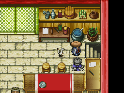
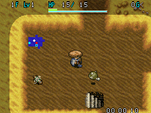
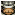

  

Time attack dungeon where the main objective is to reach the goal within 2 hours. 10 minutes gets added to your time as a penalty if you don't have at least 10,000 Gitan at the end. A timer is displayed in the lower right, and you're unable to suspend the game inside the dungeon. You're allowed to bring 1 item, but if you collapse, you won't be able to request a rescue. Overall, the idea of a time attack dungeon is novel, but carry-in items don't mesh with the design, so it ends up feeling rather forgettable instead of having a distinct flavor.

<ul class="quickLinksUL">
  <li><a href="#overview">Overview</a></li>
  <li><a href="#strategy">Strategy</a></li>
  <li><a href="#floor-guide">Floor Guide</a></li>
  <li><a href="#monsters">Monsters</a></li>
  <li><a href="#items">Items</a></li>
  <li><a href="#traps">Traps</a></li>
</ul>

# Overview

<table class="dungeonOverview">
  <tr>
    <th>Unlock</th>
    <td class="highlightYellow">1. Clear Depths of the Abyss. 2. Go to Obaba's House.</td>
  </tr>
  <tr>
    <th>Entrance</th>
    <td class="highlightYellow">Town of Ilpa (Obaba's House)</td>
  </tr>
</table>

<table class="dungeonTable">
  <tr>
    <th>JP Name</th>
    <td colspan="3">オババの家の隠し穴</td>
  </tr>
  <tr>
    <th>Floors</th>
    <td colspan="3">30F (first) / 50F</td>
  </tr>
  <tr>
    <th>Bring Items</th>
    <td>Yes (1 item)</td>
    <th>Allies</th>
    <td>No</td>
  </tr>
  <tr>
    <th>Bring Gitan</th>
    <td>No</td>
    <th>Bring Level Ups</th>
    <td>No</td>
  </tr>
  <tr>
    <th>Starting Item</th>
    <td colspan="3">Onigiri</td>
  </tr>
  <tr>
    <th>Unidentified</th>
    <td colspan="3">Weapons, Shields, Pots, Staves</td>
  </tr>
  <tr>
    <th>Shops</th>
    <td>1-50F</td>
    <th>Monster Houses</th>
    <td>1-50F</td>
  </tr>
  <tr>
    <th>Clear Icon</th>
    <td class="clearIcon"></td>
    <th>Reward</th>
    <td>Time Attack Unlocked</td>
  </tr>
</table>

※ You can't suspend or request rescues in this dungeon.

# Strategy

### General

Monsters are on the stronger side in this dungeon, so you'll likely struggle if you enter without items. The carry-in limit is 1 item, but items inside a Storage Pot aren't counted, so you can actually bring 5 items. Example: Storage Pot (Weapon, Shield, Bracelet, Blank Scroll, Revival Grass)

If you need to take a break, you can put the DS in sleep mode to pause the timer.

### Items

#### Weapon / Shield

It's not worth risking irreplaceable items like Fiery Fuuma, so bring an upgraded Mamel or Katana set. You'll want a shield with 竜 (Dragon Shield), 身 (Dodge Shield), and プ (Prism Shield) runes at minimum.

- 竜 - For Sky Dragon (45F, 48F), Archdragon (46F, 49F), and Abyss Dragon (47F, 50F) floors.
- 身 - For Bored Kappa (14-16F) and Mesmerikon (47-50F) floors.
- プ - For Nigiri Morph (19-20F), Nigiri Boss (33-34F), and Cell Armor (31-34F) floors.

#### Bracelet

##### Gold Bracelet (Scout + Vision + Heal + Nirvana)

|Rune|Item|Notes|
|-|-|-|
|見|Scout Bracelet|Reveals the locations of items and monsters.|
|目|Vision Bracelet|Lets you see things that are normally hidden.|
|悟|Nirvana Bracelet|Natural fullness depletion stops.|
|回|Heal Bracelet|Restore 5 HP per turn, but double hunger rate.|

#### Other

- Blank Scroll - Be able to write Escape Scroll, at the very least.
- Revival Grass - Bless it so you get 2 uses out of it.

# Floor Guide

### 1-20F

Bored Kappa (14-16F), Slurp Leech (16-18F), Bat Kangaroo (17-19F), Nigiri Morph (19-20F), etc.

You shouldn't really have issues with strong equipment.

### 21-30F

Dragon (21-27F), Mini Mixer (27-34F), Blessing Plant (28-35F), Eagle Tengu (29-34F), Phoenix Tengu (35-39F), etc.

You might be tempted to synthesize or bless items using Mini Mixer or Blessing Plant, but starting on 29F there's a chance it's a diguised Eagle Tengu or Phoenix Tengu, so don't bother.

Tricky Tanuki (25-29F) is also around, so keep that in mind when you find items.

### 31-40F

Cell Armor (31-34F), Nigiri Boss (33-34F), Evil Kangaroo (34-35F), Crafty Tanuki (35-40F), Upgrade Plant (39-40F), etc.

Still nothing too scary if you have a good set of runes synthesized. Bellthoven (36-37F) can summon up to three Lv3 monsters at a time, so use hallways.

Upgrade Plants on 39F might be disguised Phoenix Tengus (35-39F), so don't throw valuable items.

### 41-44F

Sludge (41-44F), Devil Kangaroo (43-45F), Shopin (43-46F), Slinger Beetle (43-47F), etc.

Strongly recommended to rush stairs.

Devil Kangaroo can create Enraged and Swift Sludges, potentially causing significant rune loss. Shopin summons 1\~3 Lv4 monsters when adjacent, so be sure to disable it with items. Slinger Beetle can throw other monsters at Shiren, and has a throwing range of 15 tiles.

### 45-50F

Lv2-4 Dragons (45-50F), Lv3-4 Bat Kangaroos (43-47F), Shifty Tanuki (45-50F), Mesmerikon (47-50F), etc.

Flames from Lv3-4 Dragon monsters will hit you from anywhere on the floor, so rush stairs. Mesmerikon throws Sleep Grass within 3 tiles, but should be harmless if you have Dodge Shield synthesized. Mirage Devil (48-50F) should be visible thanks to your bracelet.

# Monsters

F Colors: Shop is possible H Colors: Monster House is possible Spawn Rates: Low Medium High Enemy Colors: Farming Destroys Items Dangerous Very Dangerous

<table class="monsterTable">
  <thead>
    <tr>
      <th class="highlightPurple">F</th>
      <th class="highlightPurple">H</th>
      <th colspan="9" class="highlightPurple">Monsters</th>
    </tr>
  </thead>
  <tbody>
    <tr>
      <th rowspan="2" class="highlightShop">1</th>
      <th rowspan="2" class="highlightMH"></th>
      <td>Baby Mage</td>
      <td>Minion Mouse</td>
      <td>Mamel</td>
      <td>Pit Mamel</td>
      <td>Chintala</td>
    </tr>
    <tr>
      <td>Bad Froggo</td>
      <td>Shady Wisp</td>
      <td>Fog Hermit</td>
      <td class="highlightGray"></td>
      <td class="highlightGray"></td>
    </tr>
    <tr>
      <th colspan="7"></th>
    </tr>
    <tr>
      <th rowspan="2" class="highlightShop">2</th>
      <th rowspan="2" class="highlightMH"></th>
      <td>Baby Mage</td>
      <td>Minion Mouse</td>
      <td>Mamel</td>
      <td>Pit Mamel</td>
      <td>Chintala</td>
    </tr>
    <tr>
      <td>Bad Froggo</td>
      <td>Shady Wisp</td>
      <td>Fog Hermit</td>
      <td class="highlightGray"></td>
      <td class="highlightGray"></td>
    </tr>
    <tr>
      <th colspan="7"></th>
    </tr>
    <tr>
      <th rowspan="2" class="highlightShop">3</th>
      <th rowspan="2" class="highlightMH"></th>
      <td>Boy Mage</td>
      <td>Doze Mage</td>
      <td>Mobster Mouse</td>
      <td>Pit Mamel</td>
      <td>Chintala</td>
    </tr>
    <tr>
      <td>Bad Froggo</td>
      <td>Shady Wisp</td>
      <td>Fog Hermit</td>
      <td>Impact Boar</td>
      <td>Jungarian</td>
    </tr>
    <tr>
      <th colspan="7"></th>
    </tr>
    <tr>
      <th rowspan="2" class="highlightShop">4</th>
      <th rowspan="2" class="highlightMH"></th>
      <td>Boy Mage</td>
      <td>Doze Mage</td>
      <td>Mobster Mouse</td>
      <td>Teaser Monkey</td>
      <td>Curse Girl</td>
    </tr>
    <tr>
      <td>Trap Genin</td>
      <td>Shady Wisp</td>
      <td>Fog Hermit</td>
      <td>Impact Boar</td>
      <td>Jungarian</td>
    </tr>
    <tr>
      <th colspan="7"></th>
    </tr>
    <tr>
      <th rowspan="2" class="highlightShop">5</th>
      <th rowspan="2" class="highlightMH"></th>
      <td>Bow Boy</td>
      <td>Dagyan</td>
      <td>Mobster Mouse</td>
      <td>Teaser Monkey</td>
      <td>Curse Girl</td>
    </tr>
    <tr>
      <td>Trap Genin</td>
      <td>Brat Mage</td>
      <td>Fog Hermit</td>
      <td>Skull Mage</td>
      <td>Sheep Priest</td>
    </tr>
    <tr>
      <th colspan="7"></th>
    </tr>
    <tr>
      <th rowspan="2" class="highlightShop">6</th>
      <th rowspan="2" class="highlightMH"></th>
      <td>Bow Boy</td>
      <td>Dagyan</td>
      <td>Morabi</td>
      <td>Pitcher Plant</td>
      <td>Curse Girl</td>
    </tr>
    <tr>
      <td>Trap Genin</td>
      <td>Brat Mage</td>
      <td>Glare Snake</td>
      <td>Skull Mage</td>
      <td>Sheep Priest</td>
    </tr>
    <tr>
      <th colspan="7"></th>
    </tr>
    <tr>
      <th rowspan="2" class="highlightShop">7</th>
      <th rowspan="2" class="highlightMH"></th>
      <td>Bow Boy</td>
      <td>Dagyan</td>
      <td>Morabi</td>
      <td>Pitcher Plant</td>
      <td>Pumphantasm</td>
    </tr>
    <tr>
      <td>Trap Genin</td>
      <td>Bat Kangaroo</td>
      <td>Glare Snake</td>
      <td>Skull Mage</td>
      <td>Sheep Priest</td>
    </tr>
    <tr>
      <th colspan="7"></th>
    </tr>
    <tr>
      <th rowspan="2" class="highlightShop">8</th>
      <th rowspan="2" class="highlightMH"></th>
      <td>Wolf Droid</td>
      <td>Dagyan</td>
      <td>Death Reaper</td>
      <td>Pitcher Plant</td>
      <td>Pumphantasm</td>
    </tr>
    <tr>
      <td>Warabi</td>
      <td>Bat Kangaroo</td>
      <td>Glare Snake</td>
      <td>Fearful Wisp</td>
      <td>Bully Mage</td>
    </tr>
    <tr>
      <th colspan="7"></th>
    </tr>
    <tr>
      <th rowspan="2" class="highlightShop">9</th>
      <th rowspan="2" class="highlightMH"></th>
      <td>Wolf Droid</td>
      <td>Crossbow Boy</td>
      <td>Death Reaper</td>
      <td>Pitcher Plant</td>
      <td>Pumphantasm</td>
    </tr>
    <tr>
      <td>Warabi</td>
      <td>Bat Kangaroo</td>
      <td>Porko</td>
      <td>Fearful Wisp</td>
      <td>Bully Mage</td>
    </tr>
    <tr>
      <th colspan="7"></th>
    </tr>
    <tr>
      <th rowspan="2" class="highlightShop">10</th>
      <th rowspan="2" class="highlightMH"></th>
      <td>Wolf Droid</td>
      <td>Crossbow Boy</td>
      <td>Death Reaper</td>
      <td>Zen Monk</td>
      <td>Ether Devil</td>
    </tr>
    <tr>
      <td>Warabi</td>
      <td>Goggler</td>
      <td>Porko</td>
      <td>Pot Angler</td>
      <td>Alert Fly</td>
    </tr>
    <tr>
      <th colspan="7"></th>
    </tr>
    <tr>
      <th rowspan="2" class="highlightShop">11</th>
      <th rowspan="2" class="highlightMH"></th>
      <td>Healer Rabbit</td>
      <td>Crossbow Boy</td>
      <td>Hell Reaper</td>
      <td>Zen Monk</td>
      <td>Ether Devil</td>
    </tr>
    <tr>
      <td>Curse Sister</td>
      <td>Goggler</td>
      <td>Porko</td>
      <td>Pot Angler</td>
      <td>Alert Fly</td>
    </tr>
    <tr>
      <th colspan="7"></th>
    </tr>
    <tr>
      <th rowspan="2" class="highlightShop">12</th>
      <th rowspan="2" class="highlightMH"></th>
      <td>Healer Rabbit</td>
      <td>Crow Tengu</td>
      <td>Hell Reaper</td>
      <td>Zen Monk</td>
      <td>Demon Warrior</td>
    </tr>
    <tr>
      <td>Curse Sister</td>
      <td>King Tusker</td>
      <td>Porko</td>
      <td>Pot Angler</td>
      <td>Alert Fly</td>
    </tr>
    <tr>
      <th colspan="7"></th>
    </tr>
    <tr>
      <th rowspan="2" class="highlightShop">13</th>
      <th rowspan="2" class="highlightMH"></th>
      <td>Vampire Baron</td>
      <td>Crow Tengu</td>
      <td>Hell Reaper</td>
      <td>Nigiri Novice</td>
      <td>Demon Warrior</td>
    </tr>
    <tr>
      <td>Curse Sister</td>
      <td>King Tusker</td>
      <td>Porko</td>
      <td>Pot Angler</td>
      <td>Alert Fly</td>
    </tr>
    <tr>
      <th colspan="7"></th>
    </tr>
    <tr>
      <th rowspan="2" class="highlightShop">14</th>
      <th rowspan="2" class="highlightMH"></th>
      <td>Vampire Baron</td>
      <td>Crow Tengu</td>
      <td>Twisty Hani</td>
      <td>Nigiri Novice</td>
      <td>Demon Warrior</td>
    </tr>
    <tr>
      <td>Curse Sister</td>
      <td>King Tusker</td>
      <td>Sneaky Slasher</td>
      <td>Bored Kappa</td>
      <td>Alert Fly</td>
    </tr>
    <tr>
      <th colspan="7"></th>
    </tr>
    <tr>
      <th rowspan="2" class="highlightShop">15</th>
      <th rowspan="2" class="highlightMH"></th>
      <td>Lobber Beetle</td>
      <td>Squid King</td>
      <td>Twisty Hani</td>
      <td>Gyadon</td>
      <td>Trap Chunin</td>
    </tr>
    <tr>
      <td>Curse Sister</td>
      <td>King Tusker</td>
      <td>Sneaky Slasher</td>
      <td>Bored Kappa</td>
      <td>Alert Fly</td>
    </tr>
    <tr>
      <th colspan="7"></th>
    </tr>
    <tr>
      <th rowspan="2" class="highlightShop">16</th>
      <th rowspan="2" class="highlightMH"></th>
      <td>Lobber Beetle</td>
      <td>Squid King</td>
      <td>Slurp Leech</td>
      <td>Gyadon</td>
      <td>Trap Chunin</td>
    </tr>
    <tr>
      <td>Mini Mixer</td>
      <td>Skull Wizard</td>
      <td>Pumphantom</td>
      <td>Bored Kappa</td>
      <td>Alert Fly</td>
    </tr>
    <tr>
      <th colspan="7"></th>
    </tr>
    <tr>
      <th rowspan="2" class="highlightShop">17</th>
      <th rowspan="2" class="highlightMH"></th>
      <td>Lobber Beetle</td>
      <td>Squid King</td>
      <td>Slurp Leech</td>
      <td>Gyadon</td>
      <td>Trap Chunin</td>
    </tr>
    <tr>
      <td>Mini Mixer</td>
      <td>Skull Wizard</td>
      <td>Pumphantom</td>
      <td>Bat Kangaroo</td>
      <td>Scold Hermit</td>
    </tr>
    <tr>
      <th colspan="7"></th>
    </tr>
    <tr>
      <th rowspan="2" class="highlightShop">18</th>
      <th rowspan="2" class="highlightMH"></th>
      <td>Leer Snake</td>
      <td>Squid King</td>
      <td>Slurp Leech</td>
      <td>Gyadon</td>
      <td>Trap Chunin</td>
    </tr>
    <tr>
      <td>Mini Mixer</td>
      <td>Skull Wizard</td>
      <td>Pumphantom</td>
      <td>Bat Kangaroo</td>
      <td>Scold Hermit</td>
    </tr>
    <tr>
      <th colspan="7"></th>
    </tr>
    <tr>
      <th rowspan="2" class="highlightShop">19</th>
      <th rowspan="2" class="highlightMH"></th>
      <td>Leer Snake</td>
      <td>Nigiri Morph</td>
      <td>Gyairas</td>
      <td>Sleep Warlock</td>
      <td>Trap Chunin</td>
    </tr>
    <tr>
      <td>Goat Pastor</td>
      <td>Skull Wizard</td>
      <td>Pumphantom</td>
      <td>Bat Kangaroo</td>
      <td>Scold Hermit</td>
    </tr>
    <tr>
      <th colspan="7"></th>
    </tr>
    <tr>
      <th rowspan="2" class="highlightShop">20</th>
      <th rowspan="2" class="highlightMH"></th>
      <td>Leer Snake</td>
      <td>Nigiri Morph</td>
      <td>Gyairas</td>
      <td>Sleep Warlock</td>
      <td>Zen Monk</td>
    </tr>
    <tr>
      <td>Goat Pastor</td>
      <td>Vampire Duke</td>
      <td>Campbellan</td>
      <td>Wailing Wisp</td>
      <td>Punter Scarab</td>
    </tr>
    <tr>
      <th colspan="7"></th>
    </tr>
    <tr>
      <th rowspan="2" class="highlightShop">21</th>
      <th rowspan="2" class="highlightMH"></th>
      <td>Leer Snake</td>
      <td>Dragon</td>
      <td>Gyairas</td>
      <td>Sleep Warlock</td>
      <td>Zen Monk</td>
    </tr>
    <tr>
      <td>Goat Pastor</td>
      <td>Vampire Duke</td>
      <td>Campbellan</td>
      <td>Wailing Wisp</td>
      <td>Punter Scarab</td>
    </tr>
    <tr>
      <th colspan="7"></th>
    </tr>
    <tr>
      <th rowspan="2" class="highlightShop">22</th>
      <th rowspan="2" class="highlightMH"></th>
      <td>Grime</td>
      <td>Dragon</td>
      <td>Gyairas</td>
      <td>Sleep Warlock</td>
      <td>Zen Monk</td>
    </tr>
    <tr>
      <td>Goat Pastor</td>
      <td>Vampire Duke</td>
      <td>Campbellan</td>
      <td>Wailing Wisp</td>
      <td>Punter Scarab</td>
    </tr>
    <tr>
      <th colspan="7"></th>
    </tr>
    <tr>
      <th rowspan="2" class="highlightShop">23</th>
      <th rowspan="2" class="highlightMH"></th>
      <td>Grime</td>
      <td>Dragon</td>
      <td>Fink Fly</td>
      <td>Sleep Warlock</td>
      <td>Zen Monk</td>
    </tr>
    <tr>
      <td>Goat Pastor</td>
      <td>Vampire Duke</td>
      <td>Campbellan</td>
      <td>Wailing Wisp</td>
      <td>Punter Scarab</td>
    </tr>
    <tr>
      <th colspan="7"></th>
    </tr>
    <tr>
      <th rowspan="2" class="highlightShop">24</th>
      <th rowspan="2" class="highlightMH"></th>
      <td>Grime</td>
      <td>Dragon</td>
      <td>Fink Fly</td>
      <td>Menbell</td>
      <td>Zen Monk</td>
    </tr>
    <tr>
      <td>Goat Pastor</td>
      <td>Vampire Duke</td>
      <td>Campbellan</td>
      <td>Wailing Wisp</td>
      <td>Punter Scarab</td>
    </tr>
    <tr>
      <th colspan="7"></th>
    </tr>
    <tr>
      <th rowspan="2" class="highlightShop">25</th>
      <th rowspan="2" class="highlightMH"></th>
      <td>Grime</td>
      <td>Dragon</td>
      <td>Snacky</td>
      <td>Menbell</td>
      <td>Explochin</td>
    </tr>
    <tr>
      <td>Takabi</td>
      <td>Tricky Tanuki</td>
      <td>Life Rabbit</td>
      <td>Lantern Puffer</td>
      <td>Haze Hermit</td>
    </tr>
    <tr>
      <th colspan="7"></th>
    </tr>
    <tr>
      <th rowspan="2" class="highlightShop">26</th>
      <th rowspan="2" class="highlightMH"></th>
      <td>Grime</td>
      <td>Dragon</td>
      <td>Snacky</td>
      <td>Menbell</td>
      <td>Explochin</td>
    </tr>
    <tr>
      <td>Takabi</td>
      <td>Tricky Tanuki</td>
      <td>Life Rabbit</td>
      <td>Lantern Puffer</td>
      <td>Haze Hermit</td>
    </tr>
    <tr>
      <th colspan="7"></th>
    </tr>
    <tr>
      <th rowspan="2" class="highlightShop">27</th>
      <th rowspan="2" class="highlightMH"></th>
      <td>Grime</td>
      <td>Dragon</td>
      <td>Mini Mixer</td>
      <td>Menbell</td>
      <td>Explochin</td>
    </tr>
    <tr>
      <td>Takabi</td>
      <td>Tricky Tanuki</td>
      <td>Life Rabbit</td>
      <td>Lantern Puffer</td>
      <td>Haze Hermit</td>
    </tr>
    <tr>
      <th colspan="7"></th>
    </tr>
    <tr>
      <th rowspan="2" class="highlightShop">28</th>
      <th rowspan="2" class="highlightMH"></th>
      <td>Taur</td>
      <td>Super Gazer</td>
      <td>Mini Mixer</td>
      <td>Menbell</td>
      <td>Blessing Plant</td>
    </tr>
    <tr>
      <td>Takabi</td>
      <td>Tricky Tanuki</td>
      <td>Life Rabbit</td>
      <td>Lantern Puffer</td>
      <td>Haze Hermit</td>
    </tr>
    <tr>
      <th colspan="7"></th>
    </tr>
    <tr>
      <th rowspan="2" class="highlightShop">29</th>
      <th rowspan="2" class="highlightMH"></th>
      <td>Taur</td>
      <td>Super Gazer</td>
      <td>Mini Mixer</td>
      <td>Menbell</td>
      <td>Blessing Plant</td>
    </tr>
    <tr>
      <td>Eagle Tengu</td>
      <td>Tricky Tanuki</td>
      <td>Life Rabbit</td>
      <td>Lantern Puffer</td>
      <td>Haze Hermit</td>
    </tr>
    <tr>
      <th colspan="7"></th>
    </tr>
    <tr>
      <th rowspan="2" class="highlightShop">30</th>
      <th rowspan="2" class="highlightMH"></th>
      <td>Taur</td>
      <td>Super Gazer</td>
      <td>Mini Mixer</td>
      <td>Menbell</td>
      <td>Blessing Plant</td>
    </tr>
    <tr>
      <td>Eagle Tengu</td>
      <td>Lockulus</td>
      <td>Crash Boar</td>
      <td>Lantern Puffer</td>
      <td>Haze Hermit</td>
    </tr>
    <tr>
      <th colspan="7"></th>
    </tr>
    <tr>
      <th rowspan="2" class="highlightShop">31</th>
      <th rowspan="2" class="highlightMH"></th>
      <td>Bad Froggucci</td>
      <td>Super Gazer</td>
      <td>Mini Mixer</td>
      <td>Cell Armor</td>
      <td>Blessing Plant</td>
    </tr>
    <tr>
      <td>Eagle Tengu</td>
      <td>Lockulus</td>
      <td>Crash Boar</td>
      <td>Porkon</td>
      <td>Huge Chintala</td>
    </tr>
    <tr>
      <th colspan="7"></th>
    </tr>
    <tr>
      <th rowspan="2" class="highlightShop">32</th>
      <th rowspan="2" class="highlightMH"></th>
      <td>Bad Froggucci</td>
      <td>Nark Fly</td>
      <td>Mini Mixer</td>
      <td>Cell Armor</td>
      <td>Blessing Plant</td>
    </tr>
    <tr>
      <td>Eagle Tengu</td>
      <td>Lockulus</td>
      <td>Crash Boar</td>
      <td>Porkon</td>
      <td>Huge Chintala</td>
    </tr>
    <tr>
      <th colspan="7"></th>
    </tr>
    <tr>
      <th rowspan="2" class="highlightShop">33</th>
      <th rowspan="2" class="highlightMH"></th>
      <td>Bad Froggucci</td>
      <td>Nark Fly</td>
      <td>Mini Mixer</td>
      <td>Cell Armor</td>
      <td>Blessing Plant</td>
    </tr>
    <tr>
      <td>Eagle Tengu</td>
      <td>Nigiri Boss</td>
      <td>Crash Boar</td>
      <td>Porgon</td>
      <td>Huge Chintala</td>
    </tr>
    <tr>
      <th colspan="7"></th>
    </tr>
    <tr>
      <th rowspan="2" class="highlightShop">34</th>
      <th rowspan="2" class="highlightMH"></th>
      <td>Derider Monkey</td>
      <td>Nark Fly</td>
      <td>Mini Mixer</td>
      <td>Cell Armor</td>
      <td>Blessing Plant</td>
    </tr>
    <tr>
      <td>Eagle Tengu</td>
      <td>Nigiri Boss</td>
      <td>Minotaur</td>
      <td>Porgon</td>
      <td>Evil Kangaroo</td>
    </tr>
    <tr>
      <th colspan="7"></th>
    </tr>
    <tr>
      <th rowspan="2" class="highlightShop">35</th>
      <th rowspan="2" class="highlightMH"></th>
      <td>Derider Monkey</td>
      <td>Gang Zalokleft</td>
      <td>Gulp Leech</td>
      <td>Monarch Tusker</td>
      <td>Blessing Plant</td>
    </tr>
    <tr>
      <td>Phoenix Tengu</td>
      <td>Crafty Tanuki</td>
      <td>Minotaur</td>
      <td>Porgon</td>
      <td>Evil Kangaroo</td>
    </tr>
    <tr>
      <th colspan="7"></th>
    </tr>
    <tr>
      <th rowspan="2" class="highlightShop">36</th>
      <th rowspan="2" class="highlightMH"></th>
      <td>Derider Monkey</td>
      <td>Gang Zalokleft</td>
      <td>Gulp Leech</td>
      <td>Monarch Tusker</td>
      <td>Snacky</td>
    </tr>
    <tr>
      <td>Phoenix Tengu</td>
      <td>Crafty Tanuki</td>
      <td>Minotaur</td>
      <td>Leaping Egg</td>
      <td>Bellthoven</td>
    </tr>
    <tr>
      <th colspan="7"></th>
    </tr>
    <tr>
      <th rowspan="2" class="highlightShop">37</th>
      <th rowspan="2" class="highlightMH"></th>
      <td>Derider Monkey</td>
      <td>Mob Zalokleft</td>
      <td>Gulp Leech</td>
      <td>Monarch Tusker</td>
      <td>Snacky</td>
    </tr>
    <tr>
      <td>Phoenix Tengu</td>
      <td>Crafty Tanuki</td>
      <td>Minotaur</td>
      <td>Hiding Egg</td>
      <td>Bellthoven</td>
    </tr>
    <tr>
      <th colspan="7"></th>
    </tr>
    <tr>
      <th rowspan="2" class="highlightShop">38</th>
      <th rowspan="2" class="highlightMH"></th>
      <td>Shadow Slasher</td>
      <td>Mob Zalokleft</td>
      <td>Super Takabi</td>
      <td>Monarch Tusker</td>
      <td>Snacky</td>
    </tr>
    <tr>
      <td>Phoenix Tengu</td>
      <td>Crafty Tanuki</td>
      <td>Phantom Devil</td>
      <td>Leaping Egg</td>
      <td>Trap Jonin</td>
    </tr>
    <tr>
      <th colspan="7"></th>
    </tr>
    <tr>
      <th rowspan="2" class="highlightShop">39</th>
      <th rowspan="2" class="highlightMH"></th>
      <td>Shadow Slasher</td>
      <td>Upgrade Plant</td>
      <td>Super Takabi</td>
      <td>Don Zalokleft</td>
      <td>Snacky</td>
    </tr>
    <tr>
      <td>Phoenix Tengu</td>
      <td>Crafty Tanuki</td>
      <td>Phantom Devil</td>
      <td>Hiding Egg</td>
      <td>Trap Jonin</td>
    </tr>
    <tr>
      <th colspan="7"></th>
    </tr>
    <tr>
      <th rowspan="2" class="highlightShop">40</th>
      <th rowspan="2" class="highlightMH"></th>
      <td>Shadow Slasher</td>
      <td>Upgrade Plant</td>
      <td>Super Takabi</td>
      <td>Don Zalokleft</td>
      <td>Shogun</td>
    </tr>
    <tr>
      <td>Floppy Hani</td>
      <td>Crafty Tanuki</td>
      <td>Phantom Devil</td>
      <td>Leaping Egg</td>
      <td>Trap Jonin</td>
    </tr>
    <tr>
      <th colspan="7"></th>
    </tr>
    <tr>
      <th rowspan="2" class="highlightShop">41</th>
      <th rowspan="2" class="highlightMH"></th>
      <td>Quake Boar</td>
      <td>Sludge</td>
      <td>Tonosamadon</td>
      <td>Don Zalokleft</td>
      <td>Shogun</td>
    </tr>
    <tr>
      <td>Floppy Hani</td>
      <td>Boy Tank</td>
      <td>Vengeful Wisp</td>
      <td>Hiding Egg</td>
      <td>Mist Hermit</td>
    </tr>
    <tr>
      <th colspan="7"></th>
    </tr>
    <tr>
      <th rowspan="2" class="highlightShop">42</th>
      <th rowspan="2" class="highlightMH"></th>
      <td>Quake Boar</td>
      <td>Sludge</td>
      <td>Tonosamadon</td>
      <td>Ramble Hermit</td>
      <td>Shogun</td>
    </tr>
    <tr>
      <td>Floppy Hani</td>
      <td>Boy Tank</td>
      <td>Vengeful Wisp</td>
      <td>Leaping Egg</td>
      <td>Mist Hermit</td>
    </tr>
    <tr>
      <th colspan="7"></th>
    </tr>
    <tr>
      <th rowspan="2" class="highlightShop">43</th>
      <th rowspan="2" class="highlightMH"></th>
      <td>Quake Boar</td>
      <td>Sludge</td>
      <td>Tonosamadon</td>
      <td>Ramble Hermit</td>
      <td>Pop Tank</td>
    </tr>
    <tr>
      <td>Devil Kangaroo</td>
      <td>Shopin</td>
      <td>Vengeful Wisp</td>
      <td>Slinger Beetle</td>
      <td>Mist Hermit</td>
    </tr>
    <tr>
      <th colspan="7"></th>
    </tr>
    <tr>
      <th rowspan="2" class="highlightShop">44</th>
      <th rowspan="2" class="highlightMH"></th>
      <td>Snacky</td>
      <td>Sludge</td>
      <td>Tonosamadon</td>
      <td>Ramble Hermit</td>
      <td>Pop Tank</td>
    </tr>
    <tr>
      <td>Devil Kangaroo</td>
      <td>Shopin</td>
      <td>Sable Vassal</td>
      <td>Slinger Beetle</td>
      <td>Droopy Hani</td>
    </tr>
    <tr>
      <th colspan="7"></th>
    </tr>
    <tr>
      <th rowspan="2" class="highlightShop">45</th>
      <th rowspan="2" class="highlightMH"></th>
      <td>Snacky</td>
      <td>Sky Dragon</td>
      <td>Tonosamadon</td>
      <td>Ramble Hermit</td>
      <td>Shifty Tanuki</td>
    </tr>
    <tr>
      <td>Devil Kangaroo</td>
      <td>Shopin</td>
      <td>Sable Vassal</td>
      <td>Slinger Beetle</td>
      <td>Droopy Hani</td>
    </tr>
    <tr>
      <th colspan="7"></th>
    </tr>
    <tr>
      <th rowspan="2" class="highlightShop">46</th>
      <th rowspan="2" class="highlightMH"></th>
      <td>Snacky</td>
      <td>Archdragon</td>
      <td>Tonosamadon</td>
      <td>Ramble Hermit</td>
      <td>Shifty Tanuki</td>
    </tr>
    <tr>
      <td>Hades Kangaroo</td>
      <td>Shopin</td>
      <td>Sable Vassal</td>
      <td>Slinger Beetle</td>
      <td>Droopy Hani</td>
    </tr>
    <tr>
      <th colspan="7"></th>
    </tr>
    <tr>
      <th rowspan="2" class="highlightShop">47</th>
      <th rowspan="2" class="highlightMH"></th>
      <td>Snacky</td>
      <td>Abyss Dragon</td>
      <td>Gigataur</td>
      <td>Detonachin</td>
      <td>Shifty Tanuki</td>
    </tr>
    <tr>
      <td>Hades Kangaroo</td>
      <td>Doomhead</td>
      <td>Tsar Tusker</td>
      <td>Slinger Beetle</td>
      <td>Mesmerikon</td>
    </tr>
    <tr>
      <th colspan="7"></th>
    </tr>
    <tr>
      <th rowspan="2" class="highlightShop">48</th>
      <th rowspan="2" class="highlightMH"></th>
      <td>Wrinkly Hani</td>
      <td>Sky Dragon</td>
      <td>Gigataur</td>
      <td>Detonachin</td>
      <td>Shifty Tanuki</td>
    </tr>
    <tr>
      <td>Daishogun</td>
      <td>Doomhead</td>
      <td>Tsar Tusker</td>
      <td>Mirage Devil</td>
      <td>Mesmerikon</td>
    </tr>
    <tr>
      <th colspan="7"></th>
    </tr>
    <tr>
      <th rowspan="2" class="highlightShop">49</th>
      <th rowspan="2" class="highlightMH"></th>
      <td>Wrinkly Hani</td>
      <td>Archdragon</td>
      <td>Gigataur</td>
      <td>Detonachin</td>
      <td>Shifty Tanuki</td>
    </tr>
    <tr>
      <td>Daishogun</td>
      <td>Doomhead</td>
      <td>Tsar Tusker</td>
      <td>Mirage Devil</td>
      <td>Mesmerikon</td>
    </tr>
    <tr>
      <th colspan="7"></th>
    </tr>
    <tr>
      <th rowspan="2" class="highlightShop">50</th>
      <th rowspan="2" class="highlightMH"></th>
      <td>Wrinkly Hani</td>
      <td>Abyss Dragon</td>
      <td>Gigataur</td>
      <td>Detonachin</td>
      <td>Shifty Tanuki</td>
    </tr>
    <tr>
      <td>Daishogun</td>
      <td>Doomhead</td>
      <td>Tsar Tusker</td>
      <td>Mirage Devil</td>
      <td>Mesmerikon</td>
    </tr>
  </tbody>
</table>

# Items

The values like "1-50" in columns represent the floor range where the item can appear.

- F = Floor
- S = Shop
- M = Monster
- P = Presto Pot

 

<table class="dungeonItemTable">
  <tr>
    <th colspan="5" class="highlightLightblue">Weapon</th>
    <th rowspan="73"></th>
    <th colspan="5" class="highlightLightblue">Scroll</th>
  </tr>
  <tr>
    <th>Name</th>
    <th>F</th>
    <th>S</th>
    <th>M</th>
    <th>P</th>
    <th>Name</th>
    <th>F</th>
    <th>S</th>
    <th>M</th>
    <th>P</th>
  </tr>
  <tr>
    <td class="leftText">Beetle Axe</td>
    <td></td>
    <td>1-50</td>
    <td></td>
    <td></td>
    <td class="leftText">Navigation Scroll</td>
    <td>1-50</td>
    <td></td>
    <td></td>
    <td></td>
  </tr>
  <tr>
    <td class="leftText">Katana</td>
    <td>1-50</td>
    <td>1-50</td>
    <td></td>
    <td></td>
    <td class="leftText">Great Hall Scroll</td>
    <td>1-50</td>
    <td></td>
    <td></td>
    <td></td>
  </tr>
  <tr>
    <td class="leftText">Mallet</td>
    <td>1-50</td>
    <td></td>
    <td></td>
    <td></td>
    <td class="leftText">Purify Scroll</td>
    <td></td>
    <td>1-50</td>
    <td></td>
    <td></td>
  </tr>
  <tr>
    <td class="leftText">Kabura's Blade</td>
    <td></td>
    <td>1-50</td>
    <td></td>
    <td></td>
    <td class="leftText">Muzzled Scroll</td>
    <td></td>
    <td>1-50</td>
    <td></td>
    <td></td>
  </tr>
  <tr>
    <td class="leftText">Club</td>
    <td>1-50</td>
    <td></td>
    <td></td>
    <td></td>
    <td class="leftText">Confusion Scroll</td>
    <td>1-50</td>
    <td></td>
    <td></td>
    <td></td>
  </tr>
  <tr>
    <td class="leftText">Spark Sword</td>
    <td>1-50</td>
    <td></td>
    <td></td>
    <td></td>
    <td class="leftText">Identify Scroll</td>
    <td>1-50</td>
    <td></td>
    <td></td>
    <td></td>
  </tr>
  <tr>
    <td class="leftText">Bronze Sword</td>
    <td>1-50</td>
    <td></td>
    <td></td>
    <td></td>
    <td class="leftText">Air Slash Scroll</td>
    <td>1-50</td>
    <td></td>
    <td></td>
    <td></td>
  </tr>
  <tr>
    <td class="leftText">Cell Armor Sword</td>
    <td></td>
    <td></td>
    <td>31-34</td>
    <td></td>
    <td class="leftText">Fear Scroll</td>
    <td></td>
    <td>1-50</td>
    <td></td>
    <td></td>
  </tr>
  <tr>
    <td class="leftText">Shoddy Sword</td>
    <td></td>
    <td>1-50</td>
    <td></td>
    <td></td>
    <td class="leftText">Explosion Scroll</td>
    <td>1-50</td>
    <td></td>
    <td></td>
    <td></td>
  </tr>
  <tr>
    <td class="leftText">Pickaxe</td>
    <td>1-50</td>
    <td>1-50</td>
    <td></td>
    <td></td>
    <td class="leftText">Altruism Scroll</td>
    <td></td>
    <td>1-50</td>
    <td></td>
    <td></td>
  </tr>
  <tr>
    <td class="leftText">Dotanuki</td>
    <td></td>
    <td>1-50</td>
    <td></td>
    <td></td>
    <td class="leftText">Earth Scroll</td>
    <td></td>
    <td>1-50</td>
    <td></td>
    <td></td>
  </tr>
  <tr>
    <td class="leftText">Demon Slayer</td>
    <td></td>
    <td>1-50</td>
    <td></td>
    <td></td>
    <td class="leftText">Pot God Scroll</td>
    <td></td>
    <td>1-50</td>
    <td></td>
    <td></td>
  </tr>
  <tr>
    <td class="leftText">Fuuma Katana</td>
    <td></td>
    <td>1-50</td>
    <td></td>
    <td></td>
    <td class="leftText">Heaven Scroll</td>
    <td></td>
    <td>1-50</td>
    <td></td>
    <td></td>
  </tr>
  <tr>
    <td class="leftText">Minotaur's Axe</td>
    <td></td>
    <td></td>
    <td>34-37 47-50</td>
    <td></td>
    <td class="leftText">Slumber Scroll</td>
    <td>1-50</td>
    <td></td>
    <td></td>
    <td></td>
  </tr>
  <tr>
    <th colspan="5" class="highlightLightblue">Shield</th>
    <td class="leftText">Power Up Scroll</td>
    <td>1-50</td>
    <td></td>
    <td></td>
    <td></td>
  </tr>
  <tr>
    <th>Name</th>
    <th>F</th>
    <th>S</th>
    <th>M</th>
    <th>P</th>
    <td class="leftText">Grounded Scroll</td>
    <td></td>
    <td>1-50</td>
    <td></td>
    <td></td>
  </tr>
  <tr>
    <td class="leftText">Beetle Shield</td>
    <td></td>
    <td>1-50</td>
    <td></td>
    <td></td>
    <td class="leftText">Damp Scroll</td>
    <td></td>
    <td>1-50</td>
    <td></td>
    <td></td>
  </tr>
  <tr>
    <td class="leftText">Froggo Shield</td>
    <td>1-50</td>
    <td></td>
    <td></td>
    <td></td>
    <td class="leftText">Inaccurate Scroll</td>
    <td></td>
    <td>1-50</td>
    <td></td>
    <td></td>
  </tr>
  <tr>
    <td class="leftText">Heavy Shield</td>
    <td>1-50</td>
    <td>1-50</td>
    <td></td>
    <td></td>
    <td class="leftText">Plating Scroll</td>
    <td></td>
    <td>1-50</td>
    <td></td>
    <td></td>
  </tr>
  <tr>
    <td class="leftText">Blast Shield</td>
    <td></td>
    <td>1-50</td>
    <td></td>
    <td></td>
    <td class="leftText">Monster Scroll</td>
    <td>1-50</td>
    <td>1-50</td>
    <td></td>
    <td></td>
  </tr>
  <tr>
    <td class="leftText">Bronze Shield</td>
    <td>1-50</td>
    <td></td>
    <td></td>
    <td></td>
    <td class="leftText">Trap Erase Scroll</td>
    <td></td>
    <td>1-50</td>
    <td></td>
    <td></td>
  </tr>
  <tr>
    <td class="leftText">Kabura's Guard</td>
    <td></td>
    <td>1-50</td>
    <td></td>
    <td></td>
    <td class="leftText">Trap Scroll</td>
    <td></td>
    <td>1-50</td>
    <td></td>
    <td></td>
  </tr>
  <tr>
    <td class="leftText">Shoddy Shield</td>
    <td></td>
    <td>1-50</td>
    <td></td>
    <td></td>
    <th colspan="5" class="highlightLightblue">Staff</th>
  </tr>
  <tr>
    <td class="leftText">Iron Shield</td>
    <td>1-50</td>
    <td>1-50</td>
    <td></td>
    <td></td>
    <th>Name</th>
    <th>F</th>
    <th>S</th>
    <th>M</th>
    <th>P</th>
  </tr>
  <tr>
    <td class="leftText">Holy Shield</td>
    <td></td>
    <td>1-50</td>
    <td></td>
    <td></td>
    <td class="leftText">Rage Staff</td>
    <td></td>
    <td>1-50</td>
    <td></td>
    <td></td>
  </tr>
  <tr>
    <td class="leftText">Demon Shield</td>
    <td></td>
    <td>1-50</td>
    <td></td>
    <td></td>
    <td class="leftText">Empathy Staff</td>
    <td>1-50</td>
    <td>1-50</td>
    <td></td>
    <td></td>
  </tr>
  <tr>
    <td class="leftText">Fuuma Shield</td>
    <td></td>
    <td>1-50</td>
    <td></td>
    <td></td>
    <td class="leftText">Transient Staff</td>
    <td>1-50</td>
    <td></td>
    <td></td>
    <td></td>
  </tr>
  <tr>
    <td class="leftText">Wood Shield</td>
    <td>1-50</td>
    <td></td>
    <td></td>
    <td></td>
    <td class="leftText">Paralysis Staff</td>
    <td>1-50</td>
    <td></td>
    <td></td>
    <td></td>
  </tr>
  <tr>
    <th colspan="5" class="highlightLightblue">Bracelet</th>
    <td class="leftText">Miss Staff</td>
    <td></td>
    <td>1-50</td>
    <td></td>
    <td></td>
  </tr>
  <tr>
    <th>Name</th>
    <th>F</th>
    <th>S</th>
    <th>M</th>
    <th>P</th>
    <td class="leftText">Quarter Staff</td>
    <td></td>
    <td>1-50</td>
    <td></td>
    <td></td>
  </tr>
  <tr>
    <td class="leftText">Sturdy Bracelet</td>
    <td></td>
    <td>1-50</td>
    <td></td>
    <td></td>
    <td class="leftText">Balance Staff</td>
    <td></td>
    <td>1-50</td>
    <td></td>
    <td></td>
  </tr>
  <tr>
    <td class="leftText">Gold Bracelet</td>
    <td>1-50</td>
    <td>1-50</td>
    <td></td>
    <td></td>
    <td class="leftText">Invisible Staff</td>
    <td></td>
    <td>1-50</td>
    <td></td>
    <td></td>
  </tr>
  <tr>
    <td class="leftText">Warp Bracelet</td>
    <td>1-50</td>
    <td>1-50</td>
    <td></td>
    <td></td>
    <td class="leftText">Pinning Staff</td>
    <td>1-50</td>
    <td></td>
    <td></td>
    <td></td>
  </tr>
  <tr>
    <td class="leftText">Clumsy Bracelet</td>
    <td>1-50</td>
    <td>1-50</td>
    <td></td>
    <td></td>
    <td class="leftText">Swift Staff</td>
    <td>1-50</td>
    <td></td>
    <td></td>
    <td></td>
  </tr>
  <tr>
    <td class="leftText">Strength Bracelet</td>
    <td>1-50</td>
    <td></td>
    <td></td>
    <td></td>
    <td class="leftText">Swap Staff</td>
    <td>1-50</td>
    <td></td>
    <td></td>
    <td></td>
  </tr>
  <tr>
    <td class="leftText">Strider Bracelet</td>
    <td></td>
    <td>1-50</td>
    <td></td>
    <td></td>
    <td class="leftText">Seal Staff</td>
    <td></td>
    <td>1-50</td>
    <td></td>
    <td></td>
  </tr>
  <tr>
    <td class="leftText">Scout Bracelet</td>
    <td></td>
    <td>1-50</td>
    <td></td>
    <td></td>
    <td class="leftText">Knockback Staff</td>
    <td>1-50</td>
    <td>1-50</td>
    <td></td>
    <td></td>
  </tr>
  <tr>
    <td class="leftText">No Control Bracelet</td>
    <td>1-50</td>
    <td></td>
    <td></td>
    <td></td>
    <td class="leftText">Unlucky Staff</td>
    <td></td>
    <td>1-50</td>
    <td></td>
    <td></td>
  </tr>
  <tr>
    <td class="leftText">Holy Bracelet</td>
    <td>1-50</td>
    <td>1-50</td>
    <td></td>
    <td></td>
    <td class="leftText">Presto Staff</td>
    <td></td>
    <td>1-50</td>
    <td></td>
    <td></td>
  </tr>
  <tr>
    <td class="leftText">Explosion Bracelet</td>
    <td></td>
    <td>1-50</td>
    <td></td>
    <td></td>
    <td class="leftText">Mage Staff</td>
    <td></td>
    <td>1-50</td>
    <td></td>
    <td></td>
  </tr>
  <tr>
    <td class="leftText">Nirvana Bracelet</td>
    <td></td>
    <td>1-50</td>
    <td></td>
    <td></td>
    <td class="leftText">Decoy Staff</td>
    <td>1-50</td>
    <td></td>
    <td></td>
    <td></td>
  </tr>
  <tr>
    <td class="leftText">Hunger Bracelet</td>
    <td></td>
    <td>1-50</td>
    <td></td>
    <td></td>
    <th colspan="5" class="highlightLightblue">Pot</th>
  </tr>
  <tr>
    <td class="leftText">Alarm Bracelet</td>
    <td></td>
    <td>1-50</td>
    <td></td>
    <td></td>
    <th>Name</th>
    <th>F</th>
    <th>S</th>
    <th>M</th>
    <th>P</th>
  </tr>
  <tr>
    <td class="leftText">Vision Bracelet</td>
    <td></td>
    <td>1-50</td>
    <td></td>
    <td></td>
    <td class="leftText">Heal Pot</td>
    <td>1-50</td>
    <td>1-50</td>
    <td></td>
    <td></td>
  </tr>
  <tr>
    <td class="leftText">Cleansing Bracelet</td>
    <td></td>
    <td>1-50</td>
    <td></td>
    <td></td>
    <td class="leftText">Absorb Pot</td>
    <td>1-50</td>
    <td>1-50</td>
    <td></td>
    <td></td>
  </tr>
  <tr>
    <th colspan="5" class="highlightLightblue">Projectile</th>
    <td class="leftText">Upgrade Pot</td>
    <td></td>
    <td>1-50</td>
    <td></td>
    <td></td>
  </tr>
  <tr>
    <th>Name</th>
    <th>F</th>
    <th>S</th>
    <th>M</th>
    <th>P</th>
    <td class="leftText">Synthesis Pot</td>
    <td></td>
    <td>1-50</td>
    <td></td>
    <td></td>
  </tr>
  <tr>
    <td class="leftText">Wood Arrow</td>
    <td></td>
    <td></td>
    <td>5-7</td>
    <td></td>
    <td class="leftText">Identify Pot</td>
    <td>1-50</td>
    <td>1-50</td>
    <td></td>
    <td></td>
  </tr>
  <tr>
    <td class="leftText">Iron Arrow</td>
    <td></td>
    <td></td>
    <td>9-11 41-42</td>
    <td></td>
    <td class="leftText">Degrade Pot</td>
    <td>1-50</td>
    <td></td>
    <td></td>
    <td></td>
  </tr>
  <tr>
    <th colspan="5" class="highlightLightblue">Food</th>
    <td class="leftText">Blessing Pot</td>
    <td></td>
    <td>1-50</td>
    <td></td>
    <td></td>
  </tr>
  <tr>
    <th>Name</th>
    <th>F</th>
    <th>S</th>
    <th>M</th>
    <th>P</th>
    <td class="leftText">Cannon Pot</td>
    <td>1-50</td>
    <td></td>
    <td></td>
    <td></td>
  </tr>
  <tr>
    <td class="leftText">Large Onigiri</td>
    <td>1-50</td>
    <td></td>
    <td></td>
    <td></td>
    <td class="leftText">Curse Pot</td>
    <td>1-50</td>
    <td></td>
    <td></td>
    <td></td>
  </tr>
  <tr>
    <td class="leftText">Onigiri</td>
    <td>1-50</td>
    <td></td>
    <td></td>
    <td></td>
    <td class="leftText">Storage Pot</td>
    <td>1-50</td>
    <td>1-50</td>
    <td></td>
    <td></td>
  </tr>
  <tr>
    <td class="leftText">Spoiled Onigiri</td>
    <td>1-50</td>
    <td></td>
    <td></td>
    <td></td>
    <td class="leftText">Water Pot</td>
    <td></td>
    <td>1-50</td>
    <td></td>
    <td></td>
  </tr>
  <tr>
    <th colspan="5" class="highlightLightblue">Grass</th>
    <td rowspan="17" colspan="5"></td>
  </tr>
  <tr>
    <th>Name</th>
    <th>F</th>
    <th>S</th>
    <th>M</th>
    <th>P</th>
  </tr>
  <tr>
    <td class="leftText">Expand Seed</td>
    <td></td>
    <td>1-50</td>
    <td></td>
    <td></td>
  </tr>
  <tr>
    <td class="leftText">Life Grass</td>
    <td>1-50</td>
    <td>1-50</td>
    <td></td>
    <td></td>
  </tr>
  <tr>
    <td class="leftText">Otogiriso</td>
    <td>1-50</td>
    <td>1-50</td>
    <td></td>
    <td></td>
  </tr>
  <tr>
    <td class="leftText">Dizzy Grass</td>
    <td>1-50</td>
    <td>1-50</td>
    <td></td>
    <td></td>
  </tr>
  <tr>
    <td class="leftText">Weeds</td>
    <td></td>
    <td></td>
    <td></td>
    <td>1-50</td>
  </tr>
  <tr>
    <td class="leftText">Sleep Grass</td>
    <td></td>
    <td>1-50</td>
    <td></td>
    <td></td>
  </tr>
  <tr>
    <td class="leftText">Swift Grass</td>
    <td>1-50</td>
    <td></td>
    <td></td>
    <td></td>
  </tr>
  <tr>
    <td class="leftText">Strength Grass</td>
    <td></td>
    <td>1-50</td>
    <td></td>
    <td></td>
  </tr>
  <tr>
    <td class="leftText">Antidote Grass</td>
    <td></td>
    <td>1-50</td>
    <td></td>
    <td></td>
  </tr>
  <tr>
    <td class="leftText">Poison Grass</td>
    <td>1-50</td>
    <td></td>
    <td></td>
    <td></td>
  </tr>
  <tr>
    <td class="leftText">Dragon Grass</td>
    <td>1-50</td>
    <td></td>
    <td></td>
    <td></td>
  </tr>
  <tr>
    <td class="leftText">Unlucky Seed</td>
    <td></td>
    <td>1-50</td>
    <td></td>
    <td></td>
  </tr>
  <tr>
    <td class="leftText">Revival Grass</td>
    <td>1-50</td>
    <td></td>
    <td></td>
    <td></td>
  </tr>
  <tr>
    <td class="leftText">Sight Grass</td>
    <td></td>
    <td>1-50</td>
    <td></td>
    <td></td>
  </tr>
  <tr>
    <td class="leftText">Herb</td>
    <td>1-50</td>
    <td>1-50</td>
    <td></td>
    <td></td>
  </tr>
</table>

※ Cell Armor Sword - Cell Armor (31-34F) ※ Minotaur's Axe - Minotaur (34-37F), Gigataur (47-50F) ※ Wood Arrow - Bow Boy (5-7F) ※ Iron Arrow - Crossbow Boy (9-11F), Boy Tank (41-42F)

# Traps

|F|Traps|
|-|-|
|1-5|Spin, Bind, Wood Arrow, Trip Stone, Strip, Slow, Spring, Log|
|6-10|Spin, Bind, Wood Arrow, Trip Stone, Rust, Strip, Slow, Curse, Spring, Log|
|11-15|Spin, Bind, Wood Arrow, Hunger, Trip Stone, Rust, Landmine, Strip, Spoil, Slow, Curse, Spring|
|16-20|Spin, Bind, Hunger, Trip Stone, Rust, Summon, Landmine, Sleep, Strip, Iron Arrow, Spoil, Slow, Curse, Spring|
|21-25|Spin, Bind, Hunger, Alert, Trip Stone, Rust, Summon, Landmine, Sleep, Strip, Iron Arrow, Spoil, Slow, Curse, Spring, Rockfall|
|26-30|Big Landmine, Spin, Bind, Hunger, Alert, Trip Stone, Rust, Summon, Landmine, Sleep, Strip, Iron Arrow, Spoil, Slow, Curse, Spring, Log, Rockfall|
|31-49|Rage, Big Landmine, Pit, Spin, Bind, Hunger, Alert, Trip Stone, Rust, Summon, Sleep, Strip, Iron Arrow, Spoil, Poison Arrow, Slow, Curse, Spring, Log, Rockfall|
|50|Big Landmine, Spin, Hunger, Landmine, Spoil, Slow, Spring|

