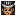

Strong monsters appear from 1F, so you're expected to bring powerful items to have a chance. The monster table is full of enemies that destroy your items, so staves and scrolls are also important. Rare equipment like Prism Shield and Gold Bracelet can be found in shops on deeper floors. Overall, it's basically the Shiren DS2 version of dungeons like Sealed Room and Lost Well.

<ul class="quickLinksUL">
  <li><a href="#overview">Overview</a></li>
  <li><a href="#strategy">Strategy</a></li>
  <li><a href="#floor-guide">Floor Guide</a></li>
  <li><a href="#monsters">Monsters</a></li>
  <li><a href="#items">Items</a></li>
  <li><a href="#traps">Traps</a></li>
</ul>

# Overview

<table class="dungeonOverview">
  <tr>
    <th>Unlock</th>
    <td class="highlightYellow">1. Have Mamo join as an ally. &nbsp;&nbsp;&nbsp;&nbsp;- Use the Blacksmith → Enter a dungeon → Return to town. 2. Clear Jahannam's Gate. 3. Use the Blacksmith without any allies in your party.</td>
  </tr>
  <tr>
    <th>Entrance</th>
    <td class="highlightYellow">Town of Ilpa (Blacksmith)</td>
  </tr>
</table>

<table class="dungeonTable">
  <tr>
    <th>JP Name</th>
    <td colspan="3">鍛冶屋のかまど</td>
  </tr>
  <tr>
    <th>Floors</th>
    <td colspan="3">99F</td>
  </tr>
  <tr>
    <th>Bring Items</th>
    <td>Yes</td>
    <th>Allies</th>
    <td>Yes</td>
  </tr>
  <tr>
    <th>Bring Gitan</th>
    <td>Yes</td>
    <th>Bring Level Ups</th>
    <td>Yes</td>
  </tr>
  <tr>
    <th>Starting Item</th>
    <td colspan="3">Onigiri</td>
  </tr>
  <tr>
    <th>Unidentified</th>
    <td colspan="3">All categories</td>
  </tr>
  <tr>
    <th>Shops</th>
    <td>1-98F</td>
    <th>Monster Houses</th>
    <td>1-98F</td>
  </tr>
  <tr>
    <th>Clear Icon</th>
    <td class="clearIcon"></td>
    <th>Reward</th>
    <td>Helix Shield</td>
  </tr>
</table>

# Strategy

This section assumes you don't have rare items like Gold Bracelet or Bufu's Staff yet.

### Equipment

#### Weapon / Shield

Katana + Iron Shield grants Max HP +20 when equipped together, which significantly helps early on. Both items have solid upgrade limits as well and are easy to obtain, so it's recommended to go with that set. ※ Don't forget to plate your equipment!

<table class="dungeonTable">
  <thead>
    <tr>
      <th>Name</th>
      <th>Power</th>
      <th>Max</th>
      <th>Slot</th>
    </tr>
  </thead>
  <tbody>
    <tr>
      <td class="highlightGray">Katana</td>
      <td class="centeredText">9</td>
      <td class="centeredText">30</td>
      <td class="centeredText">5</td>
    </tr>
    <tr>
      <td class="highlightGray">Iron Shield</td>
      <td class="centeredText">9</td>
      <td class="centeredText">35</td>
      <td class="centeredText">5</td>
    </tr>
  </tbody>
</table>

##### Weapon Runes

These runes can be obtained in Jahannam's Gate aside from 貫 (Town of Ilpa) and ド (Abyssal Depths). Katana has 5 slots, so choose between ド or 竜 for the last slot.

|Rune|Item|Notes|
|-|-|-|
|貫|Aura Spear|Attack up to 2 tiles ahead. (Pierces)|
|ス|Spark Sword|Land a critical hit after missing 2 times.|
|空|Sky Splitter|Deal more damage to Floating types.|
|目|Cyclops Killer|Deal more damage to Cyclops types.|
|竜|Dragon Killer|Deal more damage to Dragon types.|
|ド|Drain Buster|Deal more damage to Drain types.|

##### Shield Runes

These runes can be obtained in Jahannam's Gate aside from 力 (Abyssal Depths). Iron Shield has 5 slots, so choose between 払 or 腹 for the last slot.

|Rune|Item|Notes|
|-|-|-|
|力|Power Shield|Increases your attack power.|
|ト|Walrus Shield|Your items and Gitan will never be stolen.|
|竜|Dragon Shield|Reduces fire damage.|
|地|Blast Shield|Reduces explosion damage.|
|払|Holy Shield|Protects against curses.|
|腹|Diet Shield|Fullness depletes at half speed.|

#### Bracelet

Use Sturdy Bracelet as a base, as it will never break unless you synthesize 避 or 会 runes. These bracelets can all be obtained in Jahannam's Gate.

##### Bracelet Runes

Bracelet 1: Sturdy Bracelet (Scout + Vision)

|Rune|Item|Notes|
|-|-|-|
|見|Scout Bracelet|Reveals the locations of items and monsters.|
|目|Vision Bracelet|Lets you see things that are normally hidden.|

Bracelet 2: Sturdy Bracelet (Nirvana + Heal)

|Rune|Item|Notes|
|-|-|-|
|悟|Nirvana Bracelet|Natural fullness depletion stops.|
|回|Heal Bracelet|Restore 5 HP per turn, but double hunger rate.|

### Other Items

##### General

|Item|Notes|
|-|-|
|Escape Scroll|Keep in a Storage Pot to protect against curses.|
|Revival Grass|Bless it to get 2 uses out of it.|
|Sanctuary Scroll|Nice to have against Hell Gyaza.|
|Confusion Scroll|For Monster Houses or such.|
|Decoy Staff|Bring multiple of these.|
|Transient Staff|Use with a Scout Bracelet to quickly locate stairs.|
|Paralysis Staff|Bring multiple of these.|
|Storage Pot|Needed to bring lots of the above items.|
|Heal Pot|Bring 3 of these, but beware of Gazer's hypnosis.|

##### Blank Scroll

Ideally, you'd also want to read the following scrolls beforehand and bring Blank Scrolls:

|Scroll|Notes|
|-|-|
|Extinction|Makes a single monster vanish from the current adventure. ※ Not the entire monster family.|
|Explosion|Final weapon that defeats all monsters aside from Gyaza.|
|Damp|Shuts down Bomb types that appear between 30~39F.|
|Great Hall|Read before Confusion Scroll if Archdragon or Porkon spawn.|
|Confusion|Read after Great Hall Scroll if Archdragon or Porkon spawn.|

### Miscellaneous

#### Allies

Nfuu is pretty much the only ally worth bringing into this dungeon. Best powers include Abyss Dragon, Squid Kaiser, and Stalkulus. (See [Tonfan's Hole](/dungeons/tonfans-hole) for more ideas)

#### Dojo (Town of Ilpa)

It's recommended to level up at the dojo in Town of Ilpa before entering this dungeon, since 15 HP isn't much to start with against ranged attackers.

# Floor Guide

### 1-15F

Grime (6-9F), Sip Leech (6-9F), Curse Sister (6-15F), Dragon (10-15F), Minotaur (14-15F), etc.

Only Weeds and Poison Grass can be found on the ground until 10F. However, shops with Echo Shield, Spry Shield, or Upgrade Pot for sale can be generated if you're lucky. If you find an Echo Shield, consider reading an Escape Scroll and synthesizing it before continuing.

Grime (6-9F) can weaken Nfuu for the duration of that floor, so keep that in mind if you brought him along. Otherwise, monsters shouldn't pose much of a threat if you synthesized the recommended runes.

The strategy guide lists Minotaur's Axe as a possible drop from Minotaur, so try for it if you want.

### 16-20F

Grim Reaper (16-20F), Captain Ant (16-20F), Boy Tank (16-20F), Ogre Rock (19-24F)

Grim Reaper has swift action speed and can pass through walls, so you're likely to get swarmed at the start. Check for incoming enemies using your bracelet, and read a staff or scroll if you're in danger.

### 21-29F

Cell Armor (21-24F), Monarch Tusker (21-24F), Chrome Armor (25-29F), Mini Tank (25-29F), etc.

Relatively safe floor range, aside from Cell Armor types knocking your items away. Monarch Tusker's magic slows your action speed by 1 stage.

### 30-39F

Pop Tank (30-39F), Bear Borg (30-39F), Concusschin (30-39F), Mist Hermit (30-39F)

Lots of Bomb types, but it shouldn't be too bad if you have a Blast Shield synthesized. Keep your HP topped up using a Heal Bracelet, and read Damp Scrolls if you have some on hand. Mist Hermit casts its spell from anywhere in the room, and the spell lasts 30 turns.

### 40-49F

Titanium Armor (40-49F), Master Chicken (40-49F), Killer Gyaza (40-49F), Chainhead (40-49F), etc.

Basically power type monsters + Titanium Armor, and some monsters that steal items. There's a low chance for Snacky to spawn, which can potentially cause an accident if a power type levels up. Be careful around Titanium Armor, since you don't want to lose items.

### 50-59F

Slinger Beetle (50-69F), Ooze (50-69F), Hyper Gazer (50-59F), Great Chicken (50-54F), Gazelle Pope (55-69F), etc.

Shops with better items like Gold Bracelet can only be generated from 60F\~, so there's no reason to linger.

Unlike Shiren GB2, Slinger Beetle can't throw enemies from outside the room at you in this game. Therefore, the main threats are Ooze (erases plating and runes) and Hyper Gazer (forced item usage). Ooze (65 HP, 40 def) and Hyper Gazer (100 HP, 48 def) are both a bit tanky, so use staves to ensure safety.

Great Chicken provides 4300 exp, but can be tricky to defeat without it leveling down into Chicken. Shoot an arrow first if you want to try for the experience points.

### 60-69F

Slinger Beetle (50-69F), Ooze (50-69F), Devil Kangaroo (60-69F), Dagyagyagan (60-69F), Sable Vassal (60-69F), etc.

Devil Kangaroo grants both Enraged and Swift status to other monsters - It's best to rush stairs. An enraged Dagyagyagan (90 HP, 87 atk, 65 def) will deal \~40 damage to you with an upgraded Iron Shield, and may require upwards of 3 hits for you to defeat it.

Enraged monsters have a 100% chance to use their special attack if they have one, so there's risk of encountering an enraged Ooze and quickly losing lots of runes if you're not careful. If you skipped synthesizing Holy Shield, be prepared to have all of your items become cursed by Curse Mom.

### 70-79F

Snacky (70-98F), Life Rabbit (70-98F), Megataur (70-79F), Gigahead (70-79F), etc.

Much safer floor range than the previous one - Feel free to search for shops.

Life Rabbit warps to other monsters and heals them, so quickly defeat any that you see. You'll likely receive 15\~20 damage or so per hit from power types, which you can heal off with a bracelet. However, consider using items if a power type defeats a Snacky and levels up.

If you want, you can try to hunt Gigataurs using Snacky in hopes of obtaining a Minotaur's Axe.

### 80-89F

Snacky (70-98F), Life Rabbit (70-98F), Sky Dragon (80-98F), Hell Gyaza (80-98F), Blackbelly (80-89F)

The best shops can be generated between 80-98F, so try to search for shops if you can.

Sky Dragon's flame deals 40 damage (20 with Dragon Shield) from anywhere in the same room. It will likely deal \~25 damage with its direct attacks as well, and can tank 5\~6 hits without a Dragon Killer rune. Lure it into a hallway and throw Poison Grass at it to safely defeat it.

If a Snacky results in an Abyss Dragon, use items like Seal Staff + Miss Staff to fully disable it. Hell Gyaza only has 65 attack, so it's not actually that big of a threat despite its ability. Blackbelly is just a cute hamster as long as you have a Walrus Shield synthesized.

### 90-98F

Snacky (70-98F), Life Rabbit (70-98F), Sky Dragon (80-98F), Hell Gyaza (80-98F)

Continue searching for shops if possible.

Same as the previous floor range, but Blackbelly exits the monster table. This means you're more likely to see Sky Dragons → higher chance for Archdragon or Abyss Dragon now. The goal is just ahead, so don't hesitate to use any remaining items you have on hand.

# Monsters

F Colors: Shop is possible H Colors: Monster House is possible Spawn Rates: Low Medium High Enemy Colors: Farming Destroys Items Dangerous Very Dangerous

<table class="monsterTable">
  <thead>
    <tr>
      <th class="highlightPurple">F</th>
      <th class="highlightPurple">H</th>
      <th colspan="8" class="highlightPurple">Monsters</th>
    </tr>
  </thead>
  <tbody>
    <tr>
      <th class="highlightShop">1</th>
      <th class="highlightMH"></th>
      <td class="high">Porky</td>
      <td class="high">Bow Boy</td>
      <td class="high">Crossbow Boy</td>
      <td class="high">Floor Dragon</td>
      <td class="high">Dagyan</td>
      <td class="highlightGray"></td>
      <td class="highlightGray"></td>
      <td class="highlightGray"></td>
    </tr>
    <tr>
      <th class="highlightShop">2</th>
      <th class="highlightMH"></th>
      <td class="high">Porky</td>
      <td class="high">Bow Boy</td>
      <td class="high">Crossbow Boy</td>
      <td class="high">Floor Dragon</td>
      <td class="high">Dagyan</td>
      <td class="highlightGray"></td>
      <td class="highlightGray"></td>
      <td class="highlightGray"></td>
    </tr>
    <tr>
      <th class="highlightShop">3</th>
      <th class="highlightMH"></th>
      <td class="high">Porky</td>
      <td class="high">Bow Boy</td>
      <td class="high">Crossbow Boy</td>
      <td class="high">Floor Dragon</td>
      <td class="high">Dagyan</td>
      <td class="high">Pot Fisher</td>
      <td class="highlightGray"></td>
      <td class="highlightGray"></td>
    </tr>
    <tr>
      <th class="highlightShop">4</th>
      <th class="highlightMH"></th>
      <td class="high">Porky</td>
      <td class="high">Bow Boy</td>
      <td class="high">Crossbow Boy</td>
      <td class="high">Floor Dragon</td>
      <td class="high">Dagyan</td>
      <td class="high">Pot Fisher</td>
      <td class="highlightGray"></td>
      <td class="highlightGray"></td>
    </tr>
    <tr>
      <th class="highlightShop">5</th>
      <th class="highlightMH"></th>
      <td class="high">Porky</td>
      <td class="high">Bow Boy</td>
      <td class="high">Crossbow Boy</td>
      <td class="high">Floor Dragon</td>
      <td class="high">Dagyan</td>
      <td class="high">Pot Fisher</td>
      <td class="highlightGray"></td>
      <td class="highlightGray"></td>
    </tr>
    <tr>
      <th class="highlightShop">6</th>
      <th class="highlightMH"></th>
      <td class="high">Grime</td>
      <td class="high">Sip Leech</td>
      <td class="high">Sneaky Slasher</td>
      <td class="high">Pumphantom</td>
      <td class="high">Curse Sister</td>
      <td class="mid">Pot Fisher</td>
      <td class="mid">Campbellan</td>
      <td class="highlightGray"></td>
    </tr>
    <tr>
      <th class="highlightShop">7</th>
      <th class="highlightMH"></th>
      <td class="high">Grime</td>
      <td class="high">Sip Leech</td>
      <td class="high">Sneaky Slasher</td>
      <td class="high">Pumphantom</td>
      <td class="high">Curse Sister</td>
      <td class="mid">Pot Fisher</td>
      <td class="mid">Campbellan</td>
      <td class="highlightGray"></td>
    </tr>
    <tr>
      <th class="highlightShop">8</th>
      <th class="highlightMH"></th>
      <td class="high">Grime</td>
      <td class="high">Sip Leech</td>
      <td class="high">Sneaky Slasher</td>
      <td class="high">Pumphantom</td>
      <td class="high">Curse Sister</td>
      <td class="mid">Pot Fisher</td>
      <td class="mid">Campbellan</td>
      <td class="highlightGray"></td>
    </tr>
    <tr>
      <th class="highlightShop">9</th>
      <th class="highlightMH"></th>
      <td class="high">Grime</td>
      <td class="high">Sip Leech</td>
      <td class="high">Sneaky Slasher</td>
      <td class="high">Pumphantom</td>
      <td class="high">Curse Sister</td>
      <td class="mid">Pot Fisher</td>
      <td class="mid">Campbellan</td>
      <td class="highlightGray"></td>
    </tr>
    <tr>
      <th class="highlightShop">10</th>
      <th class="highlightMH"></th>
      <td class="high">Taur</td>
      <td class="mid">Dragon</td>
      <td class="low">Bad Zalokleft</td>
      <td class="mid">Lobber Beetle</td>
      <td class="high">Curse Sister</td>
      <td class="low">Gyairas</td>
      <td class="mid">Gawkulus</td>
      <td class="highlightGray"></td>
    </tr>
    <tr>
      <th class="highlightShop">11</th>
      <th class="highlightMH"></th>
      <td class="high">Taur</td>
      <td class="mid">Dragon</td>
      <td class="low">Bad Zalokleft</td>
      <td class="mid">Lobber Beetle</td>
      <td class="high">Curse Sister</td>
      <td class="low">Gyairas</td>
      <td class="mid">Gawkulus</td>
      <td class="highlightGray"></td>
    </tr>
    <tr>
      <th class="highlightShop">12</th>
      <th class="highlightMH"></th>
      <td class="high">Taur</td>
      <td class="mid">Dragon</td>
      <td class="low">Bad Zalokleft</td>
      <td class="mid">Lobber Beetle</td>
      <td class="high">Curse Sister</td>
      <td class="low">Gyairas</td>
      <td class="mid">Gawkulus</td>
      <td class="highlightGray"></td>
    </tr>
    <tr>
      <th class="highlightShop">13</th>
      <th class="highlightMH"></th>
      <td class="high">Taur</td>
      <td class="high">Dragon</td>
      <td class="low">Bad Zalokleft</td>
      <td class="mid">Lobber Beetle</td>
      <td class="mid">Curse Sister</td>
      <td class="low">Gyairas</td>
      <td class="mid">Gawkulus</td>
      <td class="highlightGray"></td>
    </tr>
    <tr>
      <th class="highlightShop">14</th>
      <th class="highlightMH"></th>
      <td class="high">Taur</td>
      <td class="high">Dragon</td>
      <td class="low">Bad Zalokleft</td>
      <td class="mid">Lobber Beetle</td>
      <td class="mid">Curse Sister</td>
      <td class="low">Gyairas</td>
      <td class="mid">Gawkulus</td>
      <td class="low">Minotaur</td>
    </tr>
    <tr>
      <th class="highlightShop">15</th>
      <th class="highlightMH"></th>
      <td class="high">Taur</td>
      <td class="high">Dragon</td>
      <td class="low">Bad Zalokleft</td>
      <td class="mid">Lobber Beetle</td>
      <td class="mid">Curse Sister</td>
      <td class="low">Gyairas</td>
      <td class="mid">Gawkulus</td>
      <td class="low">Minotaur</td>
    </tr>
    <tr>
      <th class="highlightShop">16</th>
      <th class="highlightMH"></th>
      <td class="mid">Boy Tank</td>
      <td class="low">Captain Ant</td>
      <td class="high">Grim Reaper</td>
      <td class="highlightGray"></td>
      <td class="highlightGray"></td>
      <td class="highlightGray"></td>
      <td class="highlightGray"></td>
      <td class="highlightGray"></td>
    </tr>
    <tr>
      <th class="highlightShop">17</th>
      <th class="highlightMH"></th>
      <td class="mid">Boy Tank</td>
      <td class="low">Captain Ant</td>
      <td class="high">Grim Reaper</td>
      <td class="highlightGray"></td>
      <td class="highlightGray"></td>
      <td class="highlightGray"></td>
      <td class="highlightGray"></td>
      <td class="highlightGray"></td>
    </tr>
    <tr>
      <th class="highlightShop">18</th>
      <th class="highlightMH"></th>
      <td class="mid">Boy Tank</td>
      <td class="low">Captain Ant</td>
      <td class="high">Grim Reaper</td>
      <td class="highlightGray"></td>
      <td class="highlightGray"></td>
      <td class="highlightGray"></td>
      <td class="highlightGray"></td>
      <td class="highlightGray"></td>
    </tr>
    <tr>
      <th class="highlightShop">19</th>
      <th class="highlightMH"></th>
      <td class="mid">Boy Tank</td>
      <td class="low">Captain Ant</td>
      <td class="high">Grim Reaper</td>
      <td class="mid">Ogre Rock</td>
      <td class="highlightGray"></td>
      <td class="highlightGray"></td>
      <td class="highlightGray"></td>
      <td class="highlightGray"></td>
    </tr>
    <tr>
      <th class="highlightShop">20</th>
      <th class="highlightMH"></th>
      <td class="mid">Boy Tank</td>
      <td class="low">Captain Ant</td>
      <td class="high">Grim Reaper</td>
      <td class="mid">Ogre Rock</td>
      <td class="highlightGray"></td>
      <td class="highlightGray"></td>
      <td class="highlightGray"></td>
      <td class="highlightGray"></td>
    </tr>
    <tr>
      <th class="highlightShop">21</th>
      <th class="highlightMH"></th>
      <td class="high">Cell Armor</td>
      <td class="highlightGray"></td>
      <td class="mid">Monarch Tusker</td>
      <td class="mid">Ogre Rock</td>
      <td class="highlightGray"></td>
      <td class="highlightGray"></td>
      <td class="highlightGray"></td>
      <td class="highlightGray"></td>
    </tr>
    <tr>
      <th class="highlightShop">22</th>
      <th class="highlightMH"></th>
      <td class="high">Cell Armor</td>
      <td class="highlightGray"></td>
      <td class="mid">Monarch Tusker</td>
      <td class="mid">Ogre Rock</td>
      <td class="highlightGray"></td>
      <td class="highlightGray"></td>
      <td class="highlightGray"></td>
      <td class="highlightGray"></td>
    </tr>
    <tr>
      <th class="highlightShop">23</th>
      <th class="highlightMH"></th>
      <td class="high">Cell Armor</td>
      <td class="highlightGray"></td>
      <td class="mid">Monarch Tusker</td>
      <td class="mid">Ogre Rock</td>
      <td class="highlightGray"></td>
      <td class="highlightGray"></td>
      <td class="highlightGray"></td>
      <td class="highlightGray"></td>
    </tr>
    <tr>
      <th class="highlightShop">24</th>
      <th class="highlightMH"></th>
      <td class="high">Cell Armor</td>
      <td class="highlightGray"></td>
      <td class="mid">Monarch Tusker</td>
      <td class="mid">Ogre Rock</td>
      <td class="highlightGray"></td>
      <td class="highlightGray"></td>
      <td class="highlightGray"></td>
      <td class="highlightGray"></td>
    </tr>
    <tr>
      <th class="highlightShop">25</th>
      <th class="highlightMH"></th>
      <td class="high">Mini Tank</td>
      <td class="high">Chrome Armor</td>
      <td class="low">Gang Zalokleft</td>
      <td class="low">Bad Froggucci</td>
      <td class="highlightGray"></td>
      <td class="highlightGray"></td>
      <td class="highlightGray"></td>
      <td class="highlightGray"></td>
    </tr>
    <tr>
      <th class="highlightShop">26</th>
      <th class="highlightMH"></th>
      <td class="high">Mini Tank</td>
      <td class="high">Chrome Armor</td>
      <td class="low">Gang Zalokleft</td>
      <td class="low">Bad Froggucci</td>
      <td class="highlightGray"></td>
      <td class="highlightGray"></td>
      <td class="highlightGray"></td>
      <td class="highlightGray"></td>
    </tr>
    <tr>
      <th class="highlightShop">27</th>
      <th class="highlightMH"></th>
      <td class="high">Mini Tank</td>
      <td class="high">Chrome Armor</td>
      <td class="low">Gang Zalokleft</td>
      <td class="low">Bad Froggucci</td>
      <td class="highlightGray"></td>
      <td class="highlightGray"></td>
      <td class="highlightGray"></td>
      <td class="highlightGray"></td>
    </tr>
    <tr>
      <th class="highlightShop">28</th>
      <th class="highlightMH"></th>
      <td class="high">Mini Tank</td>
      <td class="high">Chrome Armor</td>
      <td class="low">Gang Zalokleft</td>
      <td class="low">Bad Froggucci</td>
      <td class="highlightGray"></td>
      <td class="highlightGray"></td>
      <td class="highlightGray"></td>
      <td class="highlightGray"></td>
    </tr>
    <tr>
      <th class="highlightShop">29</th>
      <th class="highlightMH"></th>
      <td class="high">Mini Tank</td>
      <td class="high">Chrome Armor</td>
      <td class="low">Gang Zalokleft</td>
      <td class="low">Bad Froggucci</td>
      <td class="highlightGray"></td>
      <td class="highlightGray"></td>
      <td class="highlightGray"></td>
      <td class="highlightGray"></td>
    </tr>
    <tr>
      <th class="highlightShop">30</th>
      <th class="highlightMH"></th>
      <td class="high">Pop Tank</td>
      <td class="high">Bear Borg</td>
      <td class="high">Concusschin</td>
      <td class="low">Mist Hermit</td>
      <td class="highlightGray"></td>
      <td class="highlightGray"></td>
      <td class="highlightGray"></td>
      <td class="highlightGray"></td>
    </tr>
    <tr>
      <th class="highlightShop">31</th>
      <th class="highlightMH"></th>
      <td class="high">Pop Tank</td>
      <td class="high">Bear Borg</td>
      <td class="high">Concusschin</td>
      <td class="low">Mist Hermit</td>
      <td class="highlightGray"></td>
      <td class="highlightGray"></td>
      <td class="highlightGray"></td>
      <td class="highlightGray"></td>
    </tr>
    <tr>
      <th class="highlightShop">32</th>
      <th class="highlightMH"></th>
      <td class="high">Pop Tank</td>
      <td class="high">Bear Borg</td>
      <td class="high">Concusschin</td>
      <td class="low">Mist Hermit</td>
      <td class="highlightGray"></td>
      <td class="highlightGray"></td>
      <td class="highlightGray"></td>
      <td class="highlightGray"></td>
    </tr>
    <tr>
      <th class="highlightShop">33</th>
      <th class="highlightMH"></th>
      <td class="high">Pop Tank</td>
      <td class="high">Bear Borg</td>
      <td class="high">Concusschin</td>
      <td class="low">Mist Hermit</td>
      <td class="highlightGray"></td>
      <td class="highlightGray"></td>
      <td class="highlightGray"></td>
      <td class="highlightGray"></td>
    </tr>
    <tr>
      <th class="highlightShop">34</th>
      <th class="highlightMH"></th>
      <td class="high">Pop Tank</td>
      <td class="high">Bear Borg</td>
      <td class="high">Concusschin</td>
      <td class="low">Mist Hermit</td>
      <td class="highlightGray"></td>
      <td class="highlightGray"></td>
      <td class="highlightGray"></td>
      <td class="highlightGray"></td>
    </tr>
    <tr>
      <th class="highlightShop">35</th>
      <th class="highlightMH"></th>
      <td class="high">Pop Tank</td>
      <td class="high">Bear Borg</td>
      <td class="high">Concusschin</td>
      <td class="low">Mist Hermit</td>
      <td class="highlightGray"></td>
      <td class="highlightGray"></td>
      <td class="highlightGray"></td>
      <td class="highlightGray"></td>
    </tr>
    <tr>
      <th class="highlightShop">36</th>
      <th class="highlightMH"></th>
      <td class="high">Pop Tank</td>
      <td class="high">Bear Borg</td>
      <td class="high">Concusschin</td>
      <td class="low">Mist Hermit</td>
      <td class="highlightGray"></td>
      <td class="highlightGray"></td>
      <td class="highlightGray"></td>
      <td class="highlightGray"></td>
    </tr>
    <tr>
      <th class="highlightShop">37</th>
      <th class="highlightMH"></th>
      <td class="high">Pop Tank</td>
      <td class="high">Bear Borg</td>
      <td class="high">Concusschin</td>
      <td class="low">Mist Hermit</td>
      <td class="highlightGray"></td>
      <td class="highlightGray"></td>
      <td class="highlightGray"></td>
      <td class="highlightGray"></td>
    </tr>
    <tr>
      <th class="highlightShop">38</th>
      <th class="highlightMH"></th>
      <td class="high">Pop Tank</td>
      <td class="high">Bear Borg</td>
      <td class="high">Concusschin</td>
      <td class="low">Mist Hermit</td>
      <td class="highlightGray"></td>
      <td class="highlightGray"></td>
      <td class="highlightGray"></td>
      <td class="highlightGray"></td>
    </tr>
    <tr>
      <th class="highlightShop">39</th>
      <th class="highlightMH"></th>
      <td class="high">Pop Tank</td>
      <td class="high">Bear Borg</td>
      <td class="high">Concusschin</td>
      <td class="low">Mist Hermit</td>
      <td class="highlightGray"></td>
      <td class="highlightGray"></td>
      <td class="highlightGray"></td>
      <td class="highlightGray"></td>
    </tr>
    <tr>
      <th class="highlightShop">40</th>
      <th class="highlightMH"></th>
      <td class="low">Snacky</td>
      <td class="mid">Titanium Armor</td>
      <td class="high">Master Chicken</td>
      <td class="mid">Mob Zalokleft</td>
      <td class="high">Killer Gyaza</td>
      <td class="high">Gyandora</td>
      <td class="high">Chainhead</td>
      <td class="low">Blackbelly</td>
    </tr>
    <tr>
      <th class="highlightShop">41</th>
      <th class="highlightMH"></th>
      <td class="low">Snacky</td>
      <td class="mid">Titanium Armor</td>
      <td class="high">Master Chicken</td>
      <td class="mid">Mob Zalokleft</td>
      <td class="high">Killer Gyaza</td>
      <td class="high">Gyandora</td>
      <td class="high">Chainhead</td>
      <td class="low">Blackbelly</td>
    </tr>
    <tr>
      <th class="highlightShop">42</th>
      <th class="highlightMH"></th>
      <td class="low">Snacky</td>
      <td class="mid">Titanium Armor</td>
      <td class="high">Master Chicken</td>
      <td class="mid">Mob Zalokleft</td>
      <td class="high">Killer Gyaza</td>
      <td class="high">Gyandora</td>
      <td class="high">Chainhead</td>
      <td class="low">Blackbelly</td>
    </tr>
    <tr>
      <th class="highlightShop">43</th>
      <th class="highlightMH"></th>
      <td class="low">Snacky</td>
      <td class="mid">Titanium Armor</td>
      <td class="high">Master Chicken</td>
      <td class="mid">Mob Zalokleft</td>
      <td class="high">Killer Gyaza</td>
      <td class="high">Gyandora</td>
      <td class="high">Chainhead</td>
      <td class="low">Blackbelly</td>
    </tr>
    <tr>
      <th class="highlightShop">44</th>
      <th class="highlightMH"></th>
      <td class="low">Snacky</td>
      <td class="mid">Titanium Armor</td>
      <td class="high">Master Chicken</td>
      <td class="mid">Mob Zalokleft</td>
      <td class="high">Killer Gyaza</td>
      <td class="high">Gyandora</td>
      <td class="high">Chainhead</td>
      <td class="low">Blackbelly</td>
    </tr>
    <tr>
      <th class="highlightShop">45</th>
      <th class="highlightMH"></th>
      <td class="low">Snacky</td>
      <td class="mid">Titanium Armor</td>
      <td class="high">Master Chicken</td>
      <td class="mid">Mob Zalokleft</td>
      <td class="high">Killer Gyaza</td>
      <td class="high">Gyandora</td>
      <td class="high">Chainhead</td>
      <td class="low">Blackbelly</td>
    </tr>
    <tr>
      <th class="highlightShop">46</th>
      <th class="highlightMH"></th>
      <td class="low">Snacky</td>
      <td class="mid">Titanium Armor</td>
      <td class="high">Master Chicken</td>
      <td class="mid">Mob Zalokleft</td>
      <td class="high">Killer Gyaza</td>
      <td class="high">Gyandora</td>
      <td class="high">Chainhead</td>
      <td class="low">Blackbelly</td>
    </tr>
    <tr>
      <th class="highlightShop">47</th>
      <th class="highlightMH"></th>
      <td class="low">Snacky</td>
      <td class="mid">Titanium Armor</td>
      <td class="high">Master Chicken</td>
      <td class="mid">Mob Zalokleft</td>
      <td class="high">Killer Gyaza</td>
      <td class="high">Gyandora</td>
      <td class="high">Chainhead</td>
      <td class="low">Blackbelly</td>
    </tr>
    <tr>
      <th class="highlightShop">48</th>
      <th class="highlightMH"></th>
      <td class="low">Snacky</td>
      <td class="mid">Titanium Armor</td>
      <td class="high">Master Chicken</td>
      <td class="mid">Mob Zalokleft</td>
      <td class="high">Killer Gyaza</td>
      <td class="high">Gyandora</td>
      <td class="high">Chainhead</td>
      <td class="low">Blackbelly</td>
    </tr>
    <tr>
      <th class="highlightShop">49</th>
      <th class="highlightMH"></th>
      <td class="low">Snacky</td>
      <td class="mid">Titanium Armor</td>
      <td class="high">Master Chicken</td>
      <td class="mid">Mob Zalokleft</td>
      <td class="high">Killer Gyaza</td>
      <td class="high">Gyandora</td>
      <td class="high">Chainhead</td>
      <td class="low">Blackbelly</td>
    </tr>
    <tr>
      <th class="highlightShop">50</th>
      <th class="highlightMH"></th>
      <td class="mid">Ooze</td>
      <td class="mid">Slinger Beetle</td>
      <td class="high">Great Chicken</td>
      <td class="mid">Hyper Gazer</td>
      <td class="high">Dragon Head</td>
      <td class="high">Gyandora</td>
      <td class="highlightGray"></td>
      <td class="highlightGray"></td>
    </tr>
    <tr>
      <th class="highlightShop">51</th>
      <th class="highlightMH"></th>
      <td class="mid">Ooze</td>
      <td class="mid">Slinger Beetle</td>
      <td class="high">Great Chicken</td>
      <td class="mid">Hyper Gazer</td>
      <td class="high">Dragon Head</td>
      <td class="mid">Gyandora</td>
      <td class="highlightGray"></td>
      <td class="highlightGray"></td>
    </tr>
    <tr>
      <th class="highlightShop">52</th>
      <th class="highlightMH"></th>
      <td class="mid">Ooze</td>
      <td class="mid">Slinger Beetle</td>
      <td class="high">Great Chicken</td>
      <td class="mid">Hyper Gazer</td>
      <td class="high">Dragon Head</td>
      <td class="mid">Gyandora</td>
      <td class="highlightGray"></td>
      <td class="highlightGray"></td>
    </tr>
    <tr>
      <th class="highlightShop">53</th>
      <th class="highlightMH"></th>
      <td class="mid">Ooze</td>
      <td class="mid">Slinger Beetle</td>
      <td class="high">Great Chicken</td>
      <td class="mid">Hyper Gazer</td>
      <td class="high">Dragon Head</td>
      <td class="mid">Gyandora</td>
      <td class="highlightGray"></td>
      <td class="highlightGray"></td>
    </tr>
    <tr>
      <th class="highlightShop">54</th>
      <th class="highlightMH"></th>
      <td class="mid">Ooze</td>
      <td class="mid">Slinger Beetle</td>
      <td class="high">Great Chicken</td>
      <td class="mid">Hyper Gazer</td>
      <td class="high">Dragon Head</td>
      <td class="mid">Gyandora</td>
      <td class="highlightGray"></td>
      <td class="highlightGray"></td>
    </tr>
    <tr>
      <th class="highlightShop">55</th>
      <th class="highlightMH"></th>
      <td class="low">Ooze</td>
      <td class="mid">Slinger Beetle</td>
      <td class="mid">Gazelle Pope</td>
      <td class="low">Hyper Gazer</td>
      <td class="high">Dragon Head</td>
      <td class="low">Gyandora</td>
      <td class="highlightGray"></td>
      <td class="highlightGray"></td>
    </tr>
    <tr>
      <th class="highlightShop">56</th>
      <th class="highlightMH"></th>
      <td class="low">Ooze</td>
      <td class="mid">Slinger Beetle</td>
      <td class="mid">Gazelle Pope</td>
      <td class="low">Hyper Gazer</td>
      <td class="high">Dragon Head</td>
      <td class="low">Gyandora</td>
      <td class="highlightGray"></td>
      <td class="highlightGray"></td>
    </tr>
    <tr>
      <th class="highlightShop">57</th>
      <th class="highlightMH"></th>
      <td class="low">Ooze</td>
      <td class="mid">Slinger Beetle</td>
      <td class="mid">Gazelle Pope</td>
      <td class="low">Hyper Gazer</td>
      <td class="high">Dragon Head</td>
      <td class="low">Gyandora</td>
      <td class="highlightGray"></td>
      <td class="highlightGray"></td>
    </tr>
    <tr>
      <th class="highlightShop">58</th>
      <th class="highlightMH"></th>
      <td class="low">Ooze</td>
      <td class="mid">Slinger Beetle</td>
      <td class="mid">Gazelle Pope</td>
      <td class="low">Hyper Gazer</td>
      <td class="high">Dragon Head</td>
      <td class="low">Gyandora</td>
      <td class="highlightGray"></td>
      <td class="highlightGray"></td>
    </tr>
    <tr>
      <th class="highlightShop">59</th>
      <th class="highlightMH"></th>
      <td class="low">Ooze</td>
      <td class="mid">Slinger Beetle</td>
      <td class="mid">Gazelle Pope</td>
      <td class="low">Hyper Gazer</td>
      <td class="high">Dragon Head</td>
      <td class="low">Gyandora</td>
      <td class="highlightGray"></td>
      <td class="highlightGray"></td>
    </tr>
    <tr>
      <th class="highlightShop">60</th>
      <th class="highlightMH"></th>
      <td class="mid">Ooze</td>
      <td class="mid">Slinger Beetle</td>
      <td class="mid">Gazelle Pope</td>
      <td class="mid">Devil Kangaroo</td>
      <td class="high">Sable Vassal</td>
      <td class="high">Dagyagyagan</td>
      <td class="mid">Curse Mom</td>
      <td class="highlightGray"></td>
    </tr>
    <tr>
      <th class="highlightShop">61</th>
      <th class="highlightMH"></th>
      <td class="mid">Ooze</td>
      <td class="mid">Slinger Beetle</td>
      <td class="mid">Gazelle Pope</td>
      <td class="mid">Devil Kangaroo</td>
      <td class="high">Sable Vassal</td>
      <td class="high">Dagyagyagan</td>
      <td class="mid">Curse Mom</td>
      <td class="highlightGray"></td>
    </tr>
    <tr>
      <th class="highlightShop">62</th>
      <th class="highlightMH"></th>
      <td class="mid">Ooze</td>
      <td class="mid">Slinger Beetle</td>
      <td class="mid">Gazelle Pope</td>
      <td class="mid">Devil Kangaroo</td>
      <td class="high">Sable Vassal</td>
      <td class="high">Dagyagyagan</td>
      <td class="mid">Curse Mom</td>
      <td class="highlightGray"></td>
    </tr>
    <tr>
      <th class="highlightShop">63</th>
      <th class="highlightMH"></th>
      <td class="mid">Ooze</td>
      <td class="mid">Slinger Beetle</td>
      <td class="mid">Gazelle Pope</td>
      <td class="mid">Devil Kangaroo</td>
      <td class="high">Sable Vassal</td>
      <td class="high">Dagyagyagan</td>
      <td class="mid">Curse Mom</td>
      <td class="highlightGray"></td>
    </tr>
    <tr>
      <th class="highlightShop">64</th>
      <th class="highlightMH"></th>
      <td class="mid">Ooze</td>
      <td class="mid">Slinger Beetle</td>
      <td class="mid">Gazelle Pope</td>
      <td class="mid">Devil Kangaroo</td>
      <td class="high">Sable Vassal</td>
      <td class="high">Dagyagyagan</td>
      <td class="mid">Curse Mom</td>
      <td class="highlightGray"></td>
    </tr>
    <tr>
      <th class="highlightShop">65</th>
      <th class="highlightMH"></th>
      <td class="mid">Ooze</td>
      <td class="mid">Slinger Beetle</td>
      <td class="mid">Gazelle Pope</td>
      <td class="mid">Devil Kangaroo</td>
      <td class="high">Sable Vassal</td>
      <td class="high">Dagyagyagan</td>
      <td class="mid">Curse Mom</td>
      <td class="low">Eagle Tengu</td>
    </tr>
    <tr>
      <th class="highlightShop">66</th>
      <th class="highlightMH"></th>
      <td class="mid">Ooze</td>
      <td class="mid">Slinger Beetle</td>
      <td class="mid">Gazelle Pope</td>
      <td class="mid">Devil Kangaroo</td>
      <td class="high">Sable Vassal</td>
      <td class="high">Dagyagyagan</td>
      <td class="mid">Curse Mom</td>
      <td class="low">Eagle Tengu</td>
    </tr>
    <tr>
      <th class="highlightShop">67</th>
      <th class="highlightMH"></th>
      <td class="mid">Ooze</td>
      <td class="mid">Slinger Beetle</td>
      <td class="mid">Gazelle Pope</td>
      <td class="mid">Devil Kangaroo</td>
      <td class="high">Sable Vassal</td>
      <td class="high">Dagyagyagan</td>
      <td class="mid">Curse Mom</td>
      <td class="low">Eagle Tengu</td>
    </tr>
    <tr>
      <th class="highlightShop">68</th>
      <th class="highlightMH"></th>
      <td class="mid">Ooze</td>
      <td class="mid">Slinger Beetle</td>
      <td class="mid">Gazelle Pope</td>
      <td class="mid">Devil Kangaroo</td>
      <td class="high">Sable Vassal</td>
      <td class="high">Dagyagyagan</td>
      <td class="mid">Curse Mom</td>
      <td class="low">Eagle Tengu</td>
    </tr>
    <tr>
      <th class="highlightShop">69</th>
      <th class="highlightMH"></th>
      <td class="mid">Ooze</td>
      <td class="mid">Slinger Beetle</td>
      <td class="mid">Gazelle Pope</td>
      <td class="mid">Devil Kangaroo</td>
      <td class="high">Sable Vassal</td>
      <td class="high">Dagyagyagan</td>
      <td class="mid">Curse Mom</td>
      <td class="low">Eagle Tengu</td>
    </tr>
    <tr>
      <th class="highlightShop">70</th>
      <th class="highlightMH"></th>
      <td class="low">Snacky</td>
      <td class="low">Life Rabbit</td>
      <td class="high">Megataur</td>
      <td class="high">Gigahead</td>
      <td class="low">Pot Giller</td>
      <td class="highlightGray"></td>
      <td class="highlightGray"></td>
      <td class="low">Eagle Tengu</td>
    </tr>
    <tr>
      <th class="highlightShop">71</th>
      <th class="highlightMH"></th>
      <td class="low">Snacky</td>
      <td class="low">Life Rabbit</td>
      <td class="high">Megataur</td>
      <td class="high">Gigahead</td>
      <td class="low">Pot Giller</td>
      <td class="highlightGray"></td>
      <td class="highlightGray"></td>
      <td class="low">Eagle Tengu</td>
    </tr>
    <tr>
      <th class="highlightShop">72</th>
      <th class="highlightMH"></th>
      <td class="low">Snacky</td>
      <td class="low">Life Rabbit</td>
      <td class="high">Megataur</td>
      <td class="high">Gigahead</td>
      <td class="low">Pot Giller</td>
      <td class="highlightGray"></td>
      <td class="highlightGray"></td>
      <td class="low">Eagle Tengu</td>
    </tr>
    <tr>
      <th class="highlightShop">73</th>
      <th class="highlightMH"></th>
      <td class="low">Snacky</td>
      <td class="low">Life Rabbit</td>
      <td class="high">Megataur</td>
      <td class="high">Gigahead</td>
      <td class="low">Pot Giller</td>
      <td class="highlightGray"></td>
      <td class="highlightGray"></td>
      <td class="low">Eagle Tengu</td>
    </tr>
    <tr>
      <th class="highlightShop">74</th>
      <th class="highlightMH"></th>
      <td class="low">Snacky</td>
      <td class="low">Life Rabbit</td>
      <td class="high">Megataur</td>
      <td class="high">Gigahead</td>
      <td class="low">Pot Giller</td>
      <td class="highlightGray"></td>
      <td class="highlightGray"></td>
      <td class="low">Eagle Tengu</td>
    </tr>
    <tr>
      <th class="highlightShop">75</th>
      <th class="highlightMH"></th>
      <td class="low">Snacky</td>
      <td class="low">Life Rabbit</td>
      <td class="high">Megataur</td>
      <td class="high">Gigahead</td>
      <td class="low">Pot Giller</td>
      <td class="highlightGray"></td>
      <td class="highlightGray"></td>
      <td class="low">Eagle Tengu</td>
    </tr>
    <tr>
      <th class="highlightShop">76</th>
      <th class="highlightMH"></th>
      <td class="low">Snacky</td>
      <td class="low">Life Rabbit</td>
      <td class="high">Megataur</td>
      <td class="high">Gigahead</td>
      <td class="low">Pot Giller</td>
      <td class="highlightGray"></td>
      <td class="highlightGray"></td>
      <td class="highlightGray"></td>
    </tr>
    <tr>
      <th class="highlightShop">77</th>
      <th class="highlightMH"></th>
      <td class="low">Snacky</td>
      <td class="low">Life Rabbit</td>
      <td class="high">Megataur</td>
      <td class="high">Gigahead</td>
      <td class="low">Pot Giller</td>
      <td class="highlightGray"></td>
      <td class="highlightGray"></td>
      <td class="highlightGray"></td>
    </tr>
    <tr>
      <th class="highlightShop">78</th>
      <th class="highlightMH"></th>
      <td class="low">Snacky</td>
      <td class="low">Life Rabbit</td>
      <td class="high">Megataur</td>
      <td class="high">Gigahead</td>
      <td class="low">Pot Giller</td>
      <td class="highlightGray"></td>
      <td class="highlightGray"></td>
      <td class="highlightGray"></td>
    </tr>
    <tr>
      <th class="highlightShop">79</th>
      <th class="highlightMH"></th>
      <td class="low">Snacky</td>
      <td class="low">Life Rabbit</td>
      <td class="high">Megataur</td>
      <td class="high">Gigahead</td>
      <td class="low">Pot Giller</td>
      <td class="highlightGray"></td>
      <td class="highlightGray"></td>
      <td class="highlightGray"></td>
    </tr>
    <tr>
      <th class="highlightShop">80</th>
      <th class="highlightMH"></th>
      <td class="low">Snacky</td>
      <td class="low">Life Rabbit</td>
      <td class="high">Sky Dragon</td>
      <td class="high">Hell Gyaza</td>
      <td class="low">Blackbelly</td>
      <td class="highlightGray"></td>
      <td class="highlightGray"></td>
      <td class="highlightGray"></td>
    </tr>
    <tr>
      <th class="highlightShop">81</th>
      <th class="highlightMH"></th>
      <td class="low">Snacky</td>
      <td class="low">Life Rabbit</td>
      <td class="high">Sky Dragon</td>
      <td class="high">Hell Gyaza</td>
      <td class="low">Blackbelly</td>
      <td class="highlightGray"></td>
      <td class="highlightGray"></td>
      <td class="highlightGray"></td>
    </tr>
    <tr>
      <th class="highlightShop">82</th>
      <th class="highlightMH"></th>
      <td class="low">Snacky</td>
      <td class="low">Life Rabbit</td>
      <td class="high">Sky Dragon</td>
      <td class="high">Hell Gyaza</td>
      <td class="low">Blackbelly</td>
      <td class="highlightGray"></td>
      <td class="highlightGray"></td>
      <td class="highlightGray"></td>
    </tr>
    <tr>
      <th class="highlightShop">83</th>
      <th class="highlightMH"></th>
      <td class="low">Snacky</td>
      <td class="low">Life Rabbit</td>
      <td class="high">Sky Dragon</td>
      <td class="high">Hell Gyaza</td>
      <td class="low">Blackbelly</td>
      <td class="highlightGray"></td>
      <td class="highlightGray"></td>
      <td class="highlightGray"></td>
    </tr>
    <tr>
      <th class="highlightShop">84</th>
      <th class="highlightMH"></th>
      <td class="low">Snacky</td>
      <td class="low">Life Rabbit</td>
      <td class="high">Sky Dragon</td>
      <td class="high">Hell Gyaza</td>
      <td class="low">Blackbelly</td>
      <td class="highlightGray"></td>
      <td class="highlightGray"></td>
      <td class="highlightGray"></td>
    </tr>
    <tr>
      <th class="highlightShop">85</th>
      <th class="highlightMH"></th>
      <td class="low">Snacky</td>
      <td class="low">Life Rabbit</td>
      <td class="high">Sky Dragon</td>
      <td class="high">Hell Gyaza</td>
      <td class="low">Blackbelly</td>
      <td class="highlightGray"></td>
      <td class="highlightGray"></td>
      <td class="highlightGray"></td>
    </tr>
    <tr>
      <th class="highlightShop">86</th>
      <th class="highlightMH"></th>
      <td class="low">Snacky</td>
      <td class="low">Life Rabbit</td>
      <td class="high">Sky Dragon</td>
      <td class="high">Hell Gyaza</td>
      <td class="low">Blackbelly</td>
      <td class="highlightGray"></td>
      <td class="highlightGray"></td>
      <td class="highlightGray"></td>
    </tr>
    <tr>
      <th class="highlightShop">87</th>
      <th class="highlightMH"></th>
      <td class="low">Snacky</td>
      <td class="low">Life Rabbit</td>
      <td class="high">Sky Dragon</td>
      <td class="high">Hell Gyaza</td>
      <td class="low">Blackbelly</td>
      <td class="highlightGray"></td>
      <td class="highlightGray"></td>
      <td class="highlightGray"></td>
    </tr>
    <tr>
      <th class="highlightShop">88</th>
      <th class="highlightMH"></th>
      <td class="low">Snacky</td>
      <td class="low">Life Rabbit</td>
      <td class="high">Sky Dragon</td>
      <td class="high">Hell Gyaza</td>
      <td class="low">Blackbelly</td>
      <td class="highlightGray"></td>
      <td class="highlightGray"></td>
      <td class="highlightGray"></td>
    </tr>
    <tr>
      <th class="highlightShop">89</th>
      <th class="highlightMH"></th>
      <td class="low">Snacky</td>
      <td class="low">Life Rabbit</td>
      <td class="high">Sky Dragon</td>
      <td class="high">Hell Gyaza</td>
      <td class="low">Blackbelly</td>
      <td class="highlightGray"></td>
      <td class="highlightGray"></td>
      <td class="highlightGray"></td>
    </tr>
    <tr>
      <th class="highlightShop">90</th>
      <th class="highlightMH"></th>
      <td class="low">Snacky</td>
      <td class="low">Life Rabbit</td>
      <td class="high">Sky Dragon</td>
      <td class="high">Hell Gyaza</td>
      <td class="highlightGray"></td>
      <td class="highlightGray"></td>
      <td class="highlightGray"></td>
      <td class="highlightGray"></td>
    </tr>
    <tr>
      <th class="highlightShop">91</th>
      <th class="highlightMH"></th>
      <td class="low">Snacky</td>
      <td class="low">Life Rabbit</td>
      <td class="high">Sky Dragon</td>
      <td class="high">Hell Gyaza</td>
      <td class="highlightGray"></td>
      <td class="highlightGray"></td>
      <td class="highlightGray"></td>
      <td class="highlightGray"></td>
    </tr>
    <tr>
      <th class="highlightShop">92</th>
      <th class="highlightMH"></th>
      <td class="low">Snacky</td>
      <td class="low">Life Rabbit</td>
      <td class="high">Sky Dragon</td>
      <td class="high">Hell Gyaza</td>
      <td class="highlightGray"></td>
      <td class="highlightGray"></td>
      <td class="highlightGray"></td>
      <td class="highlightGray"></td>
    </tr>
    <tr>
      <th class="highlightShop">93</th>
      <th class="highlightMH"></th>
      <td class="low">Snacky</td>
      <td class="low">Life Rabbit</td>
      <td class="high">Sky Dragon</td>
      <td class="high">Hell Gyaza</td>
      <td class="highlightGray"></td>
      <td class="highlightGray"></td>
      <td class="highlightGray"></td>
      <td class="highlightGray"></td>
    </tr>
    <tr>
      <th class="highlightShop">94</th>
      <th class="highlightMH"></th>
      <td class="low">Snacky</td>
      <td class="low">Life Rabbit</td>
      <td class="high">Sky Dragon</td>
      <td class="high">Hell Gyaza</td>
      <td class="highlightGray"></td>
      <td class="highlightGray"></td>
      <td class="highlightGray"></td>
      <td class="highlightGray"></td>
    </tr>
    <tr>
      <th class="highlightShop">95</th>
      <th class="highlightMH"></th>
      <td class="low">Snacky</td>
      <td class="low">Life Rabbit</td>
      <td class="high">Sky Dragon</td>
      <td class="high">Hell Gyaza</td>
      <td class="highlightGray"></td>
      <td class="highlightGray"></td>
      <td class="highlightGray"></td>
      <td class="highlightGray"></td>
    </tr>
    <tr>
      <th class="highlightShop">96</th>
      <th class="highlightMH"></th>
      <td class="low">Snacky</td>
      <td class="low">Life Rabbit</td>
      <td class="high">Sky Dragon</td>
      <td class="high">Hell Gyaza</td>
      <td class="highlightGray"></td>
      <td class="highlightGray"></td>
      <td class="highlightGray"></td>
      <td class="highlightGray"></td>
    </tr>
    <tr>
      <th class="highlightShop">97</th>
      <th class="highlightMH"></th>
      <td class="low">Snacky</td>
      <td class="low">Life Rabbit</td>
      <td class="high">Sky Dragon</td>
      <td class="high">Hell Gyaza</td>
      <td class="highlightGray"></td>
      <td class="highlightGray"></td>
      <td class="highlightGray"></td>
      <td class="highlightGray"></td>
    </tr>
    <tr>
      <th class="highlightShop">98</th>
      <th class="highlightMH"></th>
      <td class="low">Snacky</td>
      <td class="low">Life Rabbit</td>
      <td class="high">Sky Dragon</td>
      <td class="high">Hell Gyaza</td>
      <td class="highlightGray"></td>
      <td class="highlightGray"></td>
      <td class="highlightGray"></td>
      <td class="highlightGray"></td>
    </tr>
    <tr>
      <th>99</th>
      <th></th>
      <td colspan="8" class="highlightLightblue">Goal</td>
    </tr>
  </tbody>
</table>

# Items

The values like "1-98" in columns represent the floor range where the item can appear.

- F = Floor
- S = Shop
- M = Monster
- P = Presto Pot

 

<table class="dungeonItemTable">
  <tr>
    <th colspan="5" class="highlightLightblue">Weapon</th>
    <th rowspan="33"></th>
    <th colspan="5" class="highlightLightblue">Grass</th>
  </tr>
  <tr>
    <th>Name</th>
    <th>F</th>
    <th>S</th>
    <th>M</th>
    <th>P</th>
    <th>Name</th>
    <th>F</th>
    <th>S</th>
    <th>M</th>
    <th>P</th>
  </tr>
  <tr>
    <td class="leftText">Chaos Axe</td>
    <td></td>
    <td>30-79</td>
    <td></td>
    <td></td>
    <td class="leftText">Expand Seed</td>
    <td></td>
    <td></td>
    <td></td>
    <td>1-98</td>
  </tr>
  <tr>
    <td class="leftText">Cell Armor Sword</td>
    <td></td>
    <td></td>
    <td>21-29 40-49</td>
    <td></td>
    <td class="leftText">Shrink Seed</td>
    <td></td>
    <td></td>
    <td></td>
    <td>1-98</td>
  </tr>
  <tr>
    <td class="leftText">Soul Sickle</td>
    <td></td>
    <td>30-79</td>
    <td></td>
    <td></td>
    <td class="leftText">Life Grass</td>
    <td></td>
    <td>1-98</td>
    <td></td>
    <td>1-98</td>
  </tr>
  <tr>
    <td class="leftText">Power Pole</td>
    <td></td>
    <td>30-79</td>
    <td></td>
    <td></td>
    <td class="leftText">Otogiriso</td>
    <td></td>
    <td>1-98</td>
    <td></td>
    <td></td>
  </tr>
  <tr>
    <td class="leftText">Mamel Sword</td>
    <td></td>
    <td>80-98</td>
    <td></td>
    <td></td>
    <td class="leftText">Dizzy Grass</td>
    <td></td>
    <td></td>
    <td></td>
    <td>1-98</td>
  </tr>
  <tr>
    <td class="leftText">Minotaur's Axe</td>
    <td></td>
    <td>80-98</td>
    <td>14-15</td>
    <td></td>
    <td class="leftText">Weeds</td>
    <td>1-98</td>
    <td></td>
    <td></td>
    <td>1-98</td>
  </tr>
  <tr>
    <th colspan="5" class="highlightLightblue">Shield</th>
    <td class="leftText">Sleep Grass</td>
    <td></td>
    <td></td>
    <td></td>
    <td>1-98</td>
  </tr>
  <tr>
    <th>Name</th>
    <th>F</th>
    <th>S</th>
    <th>M</th>
    <th>P</th>
    <td class="leftText">Swift Grass</td>
    <td></td>
    <td></td>
    <td></td>
    <td>1-98</td>
  </tr>
  <tr>
    <td class="leftText">Nirvana Shield</td>
    <td></td>
    <td>70-98</td>
    <td></td>
    <td></td>
    <td class="leftText">Antidote Grass</td>
    <td></td>
    <td></td>
    <td></td>
    <td>1-98</td>
  </tr>
  <tr>
    <td class="leftText">Bronze Shield</td>
    <td></td>
    <td>70-98</td>
    <td></td>
    <td></td>
    <td class="leftText">Poison Grass</td>
    <td>1-98</td>
    <td>1-98</td>
    <td></td>
    <td>1-98</td>
  </tr>
  <tr>
    <td class="leftText">Kabura's Guard</td>
    <td></td>
    <td>70-98</td>
    <td></td>
    <td></td>
    <td class="leftText">Dragon Grass</td>
    <td></td>
    <td></td>
    <td></td>
    <td>1-98</td>
  </tr>
  <tr>
    <td class="leftText">Iron Shield</td>
    <td></td>
    <td>70-98</td>
    <td></td>
    <td></td>
    <td class="leftText">Unlucky Seed</td>
    <td></td>
    <td></td>
    <td></td>
    <td>1-98</td>
  </tr>
  <tr>
    <td class="leftText">Dragon Shield</td>
    <td></td>
    <td>70-98</td>
    <td></td>
    <td></td>
    <td class="leftText">Sight Grass</td>
    <td></td>
    <td></td>
    <td></td>
    <td>1-98</td>
  </tr>
  <tr>
    <td class="leftText">Holy Shield</td>
    <td></td>
    <td>70-98</td>
    <td></td>
    <td></td>
    <td class="leftText">Herb</td>
    <td></td>
    <td>1-98</td>
    <td></td>
    <td></td>
  </tr>
  <tr>
    <td class="leftText">Counter Shield</td>
    <td></td>
    <td>70-98</td>
    <td></td>
    <td></td>
    <th colspan="5" class="highlightLightblue">Staff</th>
  </tr>
  <tr>
    <td class="leftText">Reflect Shield</td>
    <td></td>
    <td>70-98</td>
    <td></td>
    <td></td>
    <th>Name</th>
    <th>F</th>
    <th>S</th>
    <th>M</th>
    <th>P</th>
  </tr>
  <tr>
    <td class="leftText">Diet Shield</td>
    <td></td>
    <td>70-98</td>
    <td></td>
    <td></td>
    <td class="leftText">Grass Gainer</td>
    <td>10-59</td>
    <td></td>
    <td></td>
    <td></td>
  </tr>
  <tr>
    <td class="leftText">Demon Shield</td>
    <td></td>
    <td>70-98</td>
    <td></td>
    <td></td>
    <td class="leftText">Grass Tosser</td>
    <td>10-59</td>
    <td></td>
    <td></td>
    <td></td>
  </tr>
  <tr>
    <td class="leftText">Prism Shield</td>
    <td></td>
    <td>80-98</td>
    <td></td>
    <td></td>
    <th colspan="5" class="highlightLightblue">Pot</th>
  </tr>
  <tr>
    <td class="leftText">Mamel Shield</td>
    <td></td>
    <td>80-98</td>
    <td></td>
    <td></td>
    <th>Name</th>
    <th>F</th>
    <th>S</th>
    <th>M</th>
    <th>P</th>
  </tr>
  <tr>
    <td class="leftText">Dodge Shield</td>
    <td></td>
    <td>70-98</td>
    <td></td>
    <td></td>
    <td class="leftText">Upgrade Pot</td>
    <td></td>
    <td>1-29</td>
    <td></td>
    <td></td>
  </tr>
  <tr>
    <td class="leftText">Spry Shield</td>
    <td></td>
    <td>1-29 70-98</td>
    <td></td>
    <td></td>
    <td class="leftText">Degrade Pot</td>
    <td></td>
    <td>1-29</td>
    <td></td>
    <td></td>
  </tr>
  <tr>
    <td class="leftText">Wood Shield</td>
    <td></td>
    <td>70-98</td>
    <td></td>
    <td></td>
    <th colspan="5" class="highlightLightblue">Projectile</th>
  </tr>
  <tr>
    <td class="leftText">Echo Shield</td>
    <td></td>
    <td>1-29 70-98</td>
    <td></td>
    <td></td>
    <th>Name</th>
    <th>F</th>
    <th>S</th>
    <th>M</th>
    <th>P</th>
  </tr>
  <tr>
    <th colspan="5" class="highlightLightblue">Bracelet</th>
    <td class="leftText">Wood Arrow</td>
    <td></td>
    <td></td>
    <td>1-5</td>
    <td></td>
  </tr>
  <tr>
    <th>Name</th>
    <th>F</th>
    <th>S</th>
    <th>M</th>
    <th>P</th>
    <td class="leftText">Silver Arrow</td>
    <td></td>
    <td></td>
    <td>25-29</td>
    <td></td>
  </tr>
  <tr>
    <td class="leftText">Bad Aim Bracelet</td>
    <td></td>
    <td>60-89</td>
    <td></td>
    <td></td>
    <td class="leftText">Iron Arrow</td>
    <td></td>
    <td></td>
    <td>1-5 16-20</td>
    <td></td>
  </tr>
  <tr>
    <td class="leftText">Gold Bracelet</td>
    <td></td>
    <td>60-89</td>
    <td></td>
    <td></td>
    <th colspan="5" class="highlightLightblue">Food</th>
  </tr>
  <tr>
    <td class="leftText">Clumsy Bracelet</td>
    <td></td>
    <td>60-89</td>
    <td></td>
    <td></td>
    <th>Name</th>
    <th>F</th>
    <th>S</th>
    <th>M</th>
    <th>P</th>
  </tr>
  <tr>
    <td class="leftText">Regret Bracelet</td>
    <td></td>
    <td>60-89</td>
    <td></td>
    <td></td>
    <td class="leftText">Onigiri</td>
    <td></td>
    <td>1-29 40-79</td>
    <td></td>
    <td></td>
  </tr>
  <tr>
    <td class="leftText">Bend Bracelet</td>
    <td></td>
    <td>60-89</td>
    <td></td>
    <td></td>
    <td colspan="5"></td>
  </tr>
</table>

※ Minotaur's Axe - Minotaur (14-15F) ※ Cell Armor Sword - Cell Armor (21-24F), Chrome Armor (25-29F), Titanium Armor (40-49F) ※ Wood Arrow - Bow Boy (1-5F) ※ Iron Arrow - Crossbow Boy (1-5F), Boy Tank (16-20F) ※ Silver Arrow - Mini Tank (25-29F)

# Traps

|F|Traps|
|-|-|
|1-4|Rage, Spin, Bind, Alert, Summon, Iron Arrow, Poison Arrow, Slow, Curse|
|5-9|Rage, Spin, Bind, Alert, Rust, Summon, Poison Arrow, Slow, Curse|
|10-14|Rage, Spin, Bind, Alert, Summon, Iron Arrow, Poison Arrow, Slow, Curse|
|15-19|Rage, Spin, Bind, Alert, Rust, Summon, Poison Arrow, Slow, Curse|
|20|Rage, Spin, Bind, Alert, Summon, Iron Arrow, Poison Arrow, Slow, Curse|
|21-29|Rage, Spin, Bind, Alert, Rust, Summon, Poison Arrow, Slow, Curse|
|30-39|Rage, Spin, Bind, Alert, Summon, Iron Arrow, Slow, Curse|
|40-59|Rage, Spin, Bind, Alert, Rust, Summon, Slow, Curse|
|60-69|Rage, Spin, Bind, Alert, Summon, Slow, Curse|
|70-79|Rage, Spin, Bind, Alert, Rust, Summon, Slow, Curse|
|80-89|Rage, Spin, Bind, Alert, Summon, Slow, Curse|
|90-98|Rage, Spin, Bind, Alert, Rust, Summon, Slow, Curse|
