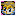

Dungeon where you team up with an ally named Nfuu, who can learn monster powers by eating meat. Shiren starts with a Bufu's Cleaver, which allows the player to obtain meat by defeating enemies. Nfuu must survive until the end for the 1st clear or else the adventure immediately ends in failure. Despite this, the 1st clear isn't very difficult, since Nfuu retains learned powers between runs.

<ul class="quickLinksUL">
  <li><a href="#overview">Overview</a></li>
  <li><a href="#strategy">Strategy</a></li>
  <li><a href="#floor-guide">Floor Guide</a></li>
  <li><a href="#monsters">Monsters</a></li>
  <li><a href="#items">Items</a></li>
  <li><a href="#traps">Traps</a></li>
</ul>

# Overview

<table class="dungeonOverview">
  <tr>
    <th>Unlock</th>
    <td class="highlightYellow">Clear Jahannam's Gate.</td>
  </tr>
  <tr>
    <th>Entrance</th>
    <td class="highlightYellow">Town of Ilpa (Inside Tonfan Restaurant)</td>
  </tr>
</table>

<table class="dungeonTable">
  <tr>
    <th>JP Name</th>
    <td colspan="3">トンファンの穴</td>
  </tr>
  <tr>
    <th>Floors</th>
    <td colspan="3">20F (first) / 99F</td>
  </tr>
  <tr>
    <th>Bring Items</th>
    <td>No</td>
    <th>Allies</th>
    <td>Nfuu</td>
  </tr>
  <tr>
    <th>Bring Gitan</th>
    <td>No</td>
    <th>Bring Level Ups</th>
    <td>No</td>
  </tr>
  <tr>
    <th>Starting Item</th>
    <td colspan="3">Bufu's Cleaver, Onigiri</td>
  </tr>
  <tr>
    <th>Unidentified</th>
    <td colspan="3">Weapons, Shields</td>
  </tr>
  <tr>
    <th>Shops</th>
    <td>1-79F</td>
    <th>Monster Houses</th>
    <td>5-98F</td>
  </tr>
  <tr>
    <th>Clear Icon</th>
    <td class="clearIcon"></td>
    <th>Reward</th>
    <td></td>
  </tr>
</table>

# Strategy

### General

#### Bufu's Cleaver

The player always begins this dungeon with 1 Bufu's Cleaver and 1 Onigiri. Monster Meat can be obtained by having Shiren defeat enemies while equipped with a Bufu's Cleaver. ※ Bufu's Cleaver normally has a chance to break when used, but inside this dungeon, it will never break.

#### Monster Meat

Monster Meat is mainly obtained by defeating monsters while equipped with a Bufu's Cleaver.

Utilizing Monster Meat:

- Eat
    - Eating meat replenishes 15 fullness.
    - Shiren transforms into the corresponding monster and can use their special power.
- Throw
    - Throw at an enemy to turn the enemy into the monster indicated by the meat.
    - Throw at Nfuu to have Nfuu learn the power of the monster indicated by the meat.

#### Nigiri Morph Warning

Nigiri Morph's special attack makes ally characters instantly collapse in this game. If Nfuu collapses in this dungeon during a 1st clear attempt, the adventure immediately ends in failure. Therefore, DO NOT let Nfuu become adjacent to Nigiri Morphs (17-20F) during the 1st clear of the dungeon. ※ Once you've cleared the dungeon one time, you can continue playing even if Nfuu collapses in subsequent runs.

### Nfuu Powers

See [Monster Meat](/items/monster-meat) for a complete list of powers.

Nfuu can learn up to 10 powers, and the oldest power is forgotten if he learns an 11th power. If you want him to forget a specific power, throw the meat that grants that power at him a second time. Once a power is learned, Nfuu won't forget it even when returning from a dungeon.

#### First Clear

Nfuu's attacks are reliable early on, so avoid learning lots of powers to keep his direct attack usage rate high.

|Power|Floor|Notes|
|-|-|-|
|Gazer|5 - 7|Inflict Afraid status.|
|Doze Mage|7 - 9|Inflict Asleep status.|
|Healer Rabbit|12 - 14|Restore 10 HP to Shiren.|
|Porko|13 - 15|Throw a rock within a 5 tile radius.|

#### Second Clear

Some recommended sets for specialized Nfuu builds - Not all of them use all 10 slots. Having multiple powers of the same type will effectively raise that power's activation rate. Examples: Archdragon + Abyss Dragon, Ooze + Sludge, Squid Emperor + Squid Kaiser, Hawkulus + Stalkulus.

##### Direct Attacker

|Power|Notes|
|-|-|
|Great Chicken Miracle Chicken Gitan Mamel|Attack 2 times in a row.|
|Pot Fisher Pot Giller Pot Angler Pot Piscator|Attack, defeated enemy might drop a pot.|
|Nigiri Morph|Attack, defeated enemy might drop an Onigiri.|
|Nigiri Boss|Attack, defeated enemy might drop a Large Onigiri.|
|Nigiri Master|Attack, defeated enemy might drop a Huge Onigiri.|

##### Ranged Attacker

|Power|Notes|
|-|-|
|Porko|Throw a rock within a 5 tile radius.|
|Porkon|Throw a rock within a 10 tile radius.|
|Porgon|Throw a rock within a 15 tile radius.|
|Sky Dragon|Spew fire (40 damage) at a target in the room.|
|Archdragon|Spew fire (50 damage) at a target on the floor.|
|Abyss Dragon|Spew fire (60 damage) at a target on the floor.|

※ Some players prefer to skip the Porky type powers.

##### Support - Choose 10 powers you'd like based on your playstyle.

|Power|Notes|
|-|-|
|Life Rabbit|Restore 20 HP to Shiren.|
|Squid Emperor Squid Kaiser|Blind all targets in the room.|
|Daze Hermit|Inflicts Inaccurate status for 5 turns.|
|Dozikon Mesmerikon|Throw Sleep Grass 3 tiles ahead.|
|Skull Wraith|Fires a magic bullet with a random effect in a line. (Paralysis, Slow, Sealed, Level-1, Bufu, Decoy)|
|Skull Demon|Fires a magic bullet with a random effect in a line. (Asleep, Blind, 40 damage, Bufu, Level-3)|
|Gazer Super Gazer Hyper Gazer Ultra Gazer|Inflict Afraid status.|
|Emperor Tusker|Fire a magic bullet. (Reduce HP to 1/4)|
|Hawkulus Stalkulus|Inflict Confused status on all targets in the room.|
|Doze Mage Sleep Warlock Slumber Wizard Sopor Sorcerer|Inflict Asleep status.|
|Ooze Sludge|Reduce a target's attack and defense to 0.|

##### Theft - Specialized for obtaining items.

|Power|Notes|
|-|-|
|Jungarian Campbellan Blackbelly Roborovsky|Steals an item and places it on the ground.|
|Tsar Tusker|An enemy hit by the magic bullet drops an item.|
|Bad Zalokleft Gang Zalokleft Mob Zalokleft Don Zalokleft|Steals an item and warps.|

# Floor Guide

### 1-7F

Hunting Cave Mamels (see below) near the start significantly helps with consistency, but isn't required. Throw Gazer (5-7F) meat at Nfuu to have him learn Gazer's power, which inflicts Afraid status. Throw Doze Mage (7-9F) meat at Nfuu to have him learn Doze Mage's power, which inflicts Asleep status.

Pumphantasm (6-8F) can be a problem for Nfuu in hallways - Use an Absorb Pot to remove its Wall Clip ability.

#### Cave Mamel Hunting

1. Obtain Pit Mamel meat between 1-2F.
2. Obtain Gazer meat on 5F.
3. Lure 2 monsters toward you, such as near a room entrance.
4. Turn the adjacent monster into a Pit Mamel by throwing Pit Mamel meat at it.
5. Eat Gazer and use its power to inflict Afraid status on Pit Mamel.
6. Wait until Pit Mamel defeats the other monster, leveling up into a Cave Mamel.
7. Use Gazer's power again to inflict Afraid status.
8. Safely defeat the Cave Mamel while it has Afraid status.

### 8-11F

Nothing very noteworthy aside from Bat Kangaroo (7-9F) granting monsters Enraged status. If you hunted Cave Mamels, you shouldn't have any issues.

### 12-13F

Throw Healer Rabbit (12-14F) meat at Nfuu to have him learn Healer Rabbit's power, which restores 10 HP to Shiren. You could try to learn Life Rabbit's power instead by utilizing Ghost Warrior to level up a Healer Rabbit, but it's risky due to Life Rabbit's higher attack stat.

Demon Warrior (12-14F) and Ghost Warrior meats are very useful, so try to stock up if possible. You can also use an Absorb Pot on Ghost Warrior to copy its ability.

### 14-16F

Schubell (14-16F) can be used to farm monster meat. (Throw Poison Grass or use Sheep Priest's power for safety) You might want to be around Lv25 with a shield strength of 10+ to reduce risk even further. That said, Schubell farming should only be done when aiming for 99F - it's completely overkill for the 1st clear.

### 17-20F

Nigiri Morph (17-20F) can instantly defeat Nfuu with its special attack, so don't let Nfuu become adjacent to it. It's best to rush stairs, especially if Nfuu lacks ranged attacks and you're still aiming for the 1st clear.

# Monsters

F Colors: Shop is possible H Colors: Monster House is possible Spawn Rates: Low Medium High Enemy Colors: Farming Destroys Items Dangerous Very Dangerous

<table class="monsterTable">
  <thead>
    <tr>
      <th class="highlightPurple">F</th>
      <th class="highlightPurple">H</th>
      <th colspan="9" class="highlightPurple">Monsters</th>
    </tr>
  </thead>
  <tbody>
    <tr>
      <th class="highlightShop">1</th>
      <th></th>
      <td class="high">Mamel</td>
      <td class="high">Pit Mamel</td>
      <td class="mid">Baby Mage</td>
      <td class="mid">Minion Mouse</td>
      <td class="highlightGray"></td>
      <td class="highlightGray"></td>
      <td class="highlightGray"></td>
      <td class="highlightGray"></td>
      <td class="highlightGray"></td>
    </tr>
    <tr>
      <th class="highlightShop">2</th>
      <th></th>
      <td class="mid">Mamel</td>
      <td class="mid">Pit Mamel</td>
      <td class="mid">Baby Mage</td>
      <td class="mid">Minion Mouse</td>
      <td class="mid">Shady Wisp</td>
      <td class="mid">Teaser Monkey</td>
      <td class="low">Fog Hermit</td>
      <td class="highlightGray"></td>
      <td class="highlightGray"></td>
    </tr>
    <tr>
      <th class="highlightShop">3</th>
      <th></th>
      <td class="high">Chintala</td>
      <td class="mid">Impact Boar</td>
      <td class="mid">Curse Girl</td>
      <td class="high">Mobster Mouse</td>
      <td class="mid">Shady Wisp</td>
      <td class="mid">Teaser Monkey</td>
      <td class="mid">Fog Hermit</td>
      <td class="highlightGray"></td>
      <td class="highlightGray"></td>
    </tr>
    <tr>
      <th class="highlightShop">4</th>
      <th></th>
      <td class="mid">Chintala</td>
      <td class="mid">Impact Boar</td>
      <td class="mid">Curse Girl</td>
      <td class="mid">Death Reaper</td>
      <td class="mid">Dagyan</td>
      <td class="highlightGray"></td>
      <td class="highlightGray"></td>
      <td class="highlightGray"></td>
      <td class="highlightGray"></td>
    </tr>
    <tr>
      <th class="highlightShop">5</th>
      <th class="highlightMH"></th>
      <td class="mid">Gazer</td>
      <td class="high">Glare Snake</td>
      <td class="mid">Trap Genin</td>
      <td class="mid">Death Reaper</td>
      <td class="mid">Dagyan</td>
      <td class="mid">Sheep Priest</td>
      <td class="highlightGray"></td>
      <td class="highlightGray"></td>
      <td class="highlightGray"></td>
    </tr>
    <tr>
      <th class="highlightShop">6</th>
      <th class="highlightMH"></th>
      <td class="mid">Gazer</td>
      <td class="high">Glare Snake</td>
      <td class="high">Trap Genin</td>
      <td class="mid">Pumphantasm</td>
      <td class="highlightGray"></td>
      <td class="mid">Sheep Priest</td>
      <td class="highlightGray"></td>
      <td class="highlightGray"></td>
      <td class="highlightGray"></td>
    </tr>
    <tr>
      <th class="highlightShop">7</th>
      <th class="highlightMH"></th>
      <td class="mid">Gazer</td>
      <td class="high">Glare Snake</td>
      <td class="mid">Doze Mage</td>
      <td class="mid">Pumphantasm</td>
      <td class="mid">Bat Kangaroo</td>
      <td class="highlightGray"></td>
      <td class="highlightGray"></td>
      <td class="highlightGray"></td>
      <td class="highlightGray"></td>
    </tr>
    <tr>
      <th class="highlightShop">8</th>
      <th class="highlightMH"></th>
      <td class="high">Bow Boy</td>
      <td class="mid">Dozy Genie</td>
      <td class="high">Doze Mage</td>
      <td class="high">Pumphantasm</td>
      <td class="mid">Bat Kangaroo</td>
      <td class="highlightGray"></td>
      <td class="highlightGray"></td>
      <td class="highlightGray"></td>
      <td class="highlightGray"></td>
    </tr>
    <tr>
      <th class="highlightShop">9</th>
      <th class="highlightMH"></th>
      <td class="high">Bow Boy</td>
      <td class="mid">Dozy Genie</td>
      <td class="high">Doze Mage</td>
      <td class="highlightGray"></td>
      <td class="mid">Bat Kangaroo</td>
      <td class="highlightGray"></td>
      <td class="highlightGray"></td>
      <td class="highlightGray"></td>
      <td class="highlightGray"></td>
    </tr>
    <tr>
      <th class="highlightShop">10</th>
      <th class="highlightMH"></th>
      <td class="high">Warabi</td>
      <td class="mid">Dozy Genie</td>
      <td class="mid">Goggler</td>
      <td class="mid">Crossbow Boy</td>
      <td class="high">Ether Devil</td>
      <td class="high">Floor Dragon</td>
      <td class="mid">Zen Guru</td>
      <td class="low">Wily Tanuki</td>
      <td class="highlightGray"></td>
    </tr>
    <tr>
      <th class="highlightShop">11</th>
      <th class="highlightMH"></th>
      <td class="mid">Warabi</td>
      <td class="highlightGray"></td>
      <td class="mid">Goggler</td>
      <td class="mid">Crossbow Boy</td>
      <td class="high">Ether Devil</td>
      <td class="high">Floor Dragon</td>
      <td class="high">Zen Guru</td>
      <td class="low">Wily Tanuki</td>
      <td class="highlightGray"></td>
    </tr>
    <tr>
      <th class="highlightShop">12</th>
      <th class="highlightMH"></th>
      <td class="highlightGray"></td>
      <td class="mid">Dark Slasher</td>
      <td class="mid">Goggler</td>
      <td class="mid">Demon Warrior</td>
      <td class="low">Healer Rabbit</td>
      <td class="high">Floor Dragon</td>
      <td class="mid">Zen Guru</td>
      <td class="low">Wily Tanuki</td>
      <td class="highlightGray"></td>
    </tr>
    <tr>
      <th class="highlightShop">13</th>
      <th class="highlightMH"></th>
      <td class="mid">Porko</td>
      <td class="high">Dark Slasher</td>
      <td class="low">Alert Fly</td>
      <td class="mid">Demon Warrior</td>
      <td class="low">Healer Rabbit</td>
      <td class="mid">Vampire Baron</td>
      <td class="highlightGray"></td>
      <td class="low">Wily Tanuki</td>
      <td class="highlightGray"></td>
    </tr>
    <tr>
      <th class="highlightShop">14</th>
      <th class="highlightMH"></th>
      <td class="mid">Porko</td>
      <td class="mid">Dark Slasher</td>
      <td class="low">Alert Fly</td>
      <td class="mid">Demon Warrior</td>
      <td class="low">Healer Rabbit</td>
      <td class="mid">Vampire Baron</td>
      <td class="mid">Schubell</td>
      <td class="low">Wily Tanuki</td>
      <td class="highlightGray"></td>
    </tr>
    <tr>
      <th class="highlightShop">15</th>
      <th class="highlightMH"></th>
      <td class="high">Porko</td>
      <td class="low">Captain Ant</td>
      <td class="low">Alert Fly</td>
      <td class="mid">Lobber Beetle</td>
      <td class="mid">Trap Chunin</td>
      <td class="mid">Vampire Baron</td>
      <td class="mid">Schubell</td>
      <td class="low">Wily Tanuki</td>
      <td class="highlightGray"></td>
    </tr>
    <tr>
      <th class="highlightShop">16</th>
      <th class="highlightMH"></th>
      <td class="highlightGray"></td>
      <td class="low">Captain Ant</td>
      <td class="low">Alert Fly</td>
      <td class="high">Lobber Beetle</td>
      <td class="high">Trap Chunin</td>
      <td class="mid">Vampire Baron</td>
      <td class="mid">Schubell</td>
      <td class="low">Wily Tanuki</td>
      <td class="highlightGray"></td>
    </tr>
    <tr>
      <th class="highlightShop">17</th>
      <th class="highlightMH"></th>
      <td class="mid">Nigiri Morph</td>
      <td class="low">Captain Ant</td>
      <td class="mid">Scold Hermit</td>
      <td class="mid">Lobber Beetle</td>
      <td class="mid">Trap Chunin</td>
      <td class="high">Pumphantom</td>
      <td class="low">Schubell</td>
      <td class="low">Wily Tanuki</td>
      <td class="highlightGray"></td>
    </tr>
    <tr>
      <th class="highlightShop">18</th>
      <th class="highlightMH"></th>
      <td class="mid">Nigiri Morph</td>
      <td class="low">Captain Ant</td>
      <td class="mid">Scold Hermit</td>
      <td class="mid">Lobber Beetle</td>
      <td class="mid">Trap Chunin</td>
      <td class="mid">Demon Vassal</td>
      <td class="mid">Dark Vassal</td>
      <td class="mid">Leer Snake</td>
      <td class="mid">Gawkulus</td>
    </tr>
    <tr>
      <th class="highlightShop">19</th>
      <th class="highlightMH"></th>
      <td class="high">Nigiri Morph</td>
      <td class="low">Captain Ant</td>
      <td class="mid">Scold Hermit</td>
      <td class="mid">Goat Pastor</td>
      <td class="mid">Gyadon</td>
      <td class="mid">Demon Vassal</td>
      <td class="mid">Dark Vassal</td>
      <td class="mid">Leer Snake</td>
      <td class="mid">Gawkulus</td>
    </tr>
    <tr>
      <th>20</th>
      <th></th>
      <td colspan="9" class="highlightLightblue">Goal (1st Clear)</td>
    </tr>
    <tr>
      <th class="highlightShop">20</th>
      <th class="highlightMH"></th>
      <td class="high">Nigiri Morph</td>
      <td class="high">Dragon</td>
      <td class="high">Sneaky Slasher</td>
      <td class="mid">Goat Pastor</td>
      <td class="low">Gyadon</td>
      <td class="mid">Demon Vassal</td>
      <td class="mid">Dark Vassal</td>
      <td class="mid">Leer Snake</td>
      <td class="mid">Gawkulus</td>
    </tr>
    <tr>
      <th class="highlightShop">21</th>
      <th class="highlightMH"></th>
      <td class="highlightGray"></td>
      <td class="high">Dragon</td>
      <td class="high">Sneaky Slasher</td>
      <td class="mid">Goat Pastor</td>
      <td class="low">Gyadon</td>
      <td class="highlightGray"></td>
      <td class="highlightGray"></td>
      <td class="mid">Leer Snake</td>
      <td class="highlightGray"></td>
    </tr>
    <tr>
      <th class="highlightShop">22</th>
      <th class="highlightMH"></th>
      <td class="mid">Grime</td>
      <td class="high">Dragon</td>
      <td class="high">Sneaky Slasher</td>
      <td class="low">Goat Pastor</td>
      <td class="low">Gyadon</td>
      <td class="highlightGray"></td>
      <td class="highlightGray"></td>
      <td class="highlightGray"></td>
      <td class="highlightGray"></td>
    </tr>
    <tr>
      <th class="highlightShop">23</th>
      <th class="highlightMH"></th>
      <td class="mid">Grime</td>
      <td class="high">Dragon</td>
      <td class="high">Sneaky Slasher</td>
      <td class="low">Goat Pastor</td>
      <td class="highlightGray"></td>
      <td class="highlightGray"></td>
      <td class="highlightGray"></td>
      <td class="highlightGray"></td>
      <td class="highlightGray"></td>
    </tr>
    <tr>
      <th class="highlightShop">24</th>
      <th class="highlightMH"></th>
      <td class="mid">Grime</td>
      <td class="high">Dragon</td>
      <td class="highlightGray"></td>
      <td class="low">Goat Pastor</td>
      <td class="highlightGray"></td>
      <td class="highlightGray"></td>
      <td class="highlightGray"></td>
      <td class="highlightGray"></td>
      <td class="highlightGray"></td>
    </tr>
    <tr>
      <th class="highlightShop">25</th>
      <th class="highlightMH"></th>
      <td class="high">Grime</td>
      <td class="high">Haze Hermit</td>
      <td class="high">Sleep Warlock</td>
      <td class="high">Lantern Puffer</td>
      <td class="high">Slurp Leech</td>
      <td class="highlightGray"></td>
      <td class="highlightGray"></td>
      <td class="highlightGray"></td>
      <td class="highlightGray"></td>
    </tr>
    <tr>
      <th class="highlightShop">26</th>
      <th class="highlightMH"></th>
      <td class="high">Grime</td>
      <td class="high">Haze Hermit</td>
      <td class="high">Sleep Warlock</td>
      <td class="high">Lantern Puffer</td>
      <td class="high">Slurp Leech</td>
      <td class="highlightGray"></td>
      <td class="low">Snacky</td>
      <td class="highlightGray"></td>
      <td class="highlightGray"></td>
    </tr>
    <tr>
      <th class="highlightShop">27</th>
      <th class="highlightMH"></th>
      <td class="mid">Grime</td>
      <td class="mid">Haze Hermit</td>
      <td class="mid">Sleep Warlock</td>
      <td class="mid">Lantern Puffer</td>
      <td class="high">Slurp Leech</td>
      <td class="low">Vampire Duke</td>
      <td class="low">Snacky</td>
      <td class="high">Takabi</td>
      <td class="highlightGray"></td>
    </tr>
    <tr>
      <th class="highlightShop">28</th>
      <th class="highlightMH"></th>
      <td class="mid">Fink Fly</td>
      <td class="mid">Haze Hermit</td>
      <td class="mid">Super Gazer</td>
      <td class="mid">Lantern Puffer</td>
      <td class="high">Slurp Leech</td>
      <td class="low">Vampire Duke</td>
      <td class="low">Snacky</td>
      <td class="high">Takabi</td>
      <td class="highlightGray"></td>
    </tr>
    <tr>
      <th class="highlightShop">29</th>
      <th class="highlightMH"></th>
      <td class="mid">Fink Fly</td>
      <td class="mid">Haze Hermit</td>
      <td class="mid">Super Gazer</td>
      <td class="mid">Lantern Puffer</td>
      <td class="high">Slurp Leech</td>
      <td class="low">Vampire Duke</td>
      <td class="low">Snacky</td>
      <td class="high">Takabi</td>
      <td class="highlightGray"></td>
    </tr>
    <tr>
      <th class="highlightShop">30</th>
      <th class="highlightMH"></th>
      <td class="mid">Fink Fly</td>
      <td class="mid">Haze Hermit</td>
      <td class="mid">Super Gazer</td>
      <td class="mid">Lantern Puffer</td>
      <td class="high">Slurp Leech</td>
      <td class="low">Vampire Duke</td>
      <td class="low">Snacky</td>
      <td class="high">Takabi</td>
      <td class="highlightGray"></td>
    </tr>
    <tr>
      <th class="highlightShop">31</th>
      <th class="highlightMH"></th>
      <td class="high">Porkon</td>
      <td class="high">Crash Boar</td>
      <td class="high">Super Gazer</td>
      <td class="high">Monarch Tusker</td>
      <td class="mid">Bad Froggucci</td>
      <td class="mid">Vampire Duke</td>
      <td class="low">Snacky</td>
      <td class="high">Ironhead</td>
      <td class="highlightGray"></td>
    </tr>
    <tr>
      <th class="highlightShop">32</th>
      <th class="highlightMH"></th>
      <td class="high">Porkon</td>
      <td class="high">Crash Boar</td>
      <td class="high">Super Gazer</td>
      <td class="high">Monarch Tusker</td>
      <td class="mid">Bad Froggucci</td>
      <td class="high">Vampire Duke</td>
      <td class="low">Snacky</td>
      <td class="high">Ironhead</td>
      <td class="highlightGray"></td>
    </tr>
    <tr>
      <th class="highlightShop">33</th>
      <th class="highlightMH"></th>
      <td class="mid">Porkon</td>
      <td class="mid">Crash Boar</td>
      <td class="mid">Super Gazer</td>
      <td class="mid">Monarch Tusker</td>
      <td class="mid">Gang Zalokleft</td>
      <td class="low">Vampire Duke</td>
      <td class="mid">Falcon Tengu</td>
      <td class="mid">Ironhead</td>
      <td class="highlightGray"></td>
    </tr>
    <tr>
      <th class="highlightShop">34</th>
      <th class="highlightMH"></th>
      <td class="mid">Boy Tank</td>
      <td class="mid">Crash Boar</td>
      <td class="high">Evil Kangaroo</td>
      <td class="mid">Mocker Monkey</td>
      <td class="mid">Bad Froggucci</td>
      <td class="highlightGray"></td>
      <td class="mid">Falcon Tengu</td>
      <td class="mid">Ironhead</td>
      <td class="highlightGray"></td>
    </tr>
    <tr>
      <th class="highlightShop">35</th>
      <th class="highlightMH"></th>
      <td class="mid">Boy Tank</td>
      <td class="mid">Crash Boar</td>
      <td class="high">Evil Kangaroo</td>
      <td class="mid">Mocker Monkey</td>
      <td class="mid">Gang Zalokleft</td>
      <td class="highlightGray"></td>
      <td class="mid">Falcon Tengu</td>
      <td class="mid">Ironhead</td>
      <td class="highlightGray"></td>
    </tr>
    <tr>
      <th class="highlightShop">36</th>
      <th class="highlightMH"></th>
      <td class="mid">Boy Tank</td>
      <td class="high">Bellthoven</td>
      <td class="highlightGray"></td>
      <td class="mid">Mocker Monkey</td>
      <td class="mid">Bad Froggucci</td>
      <td class="highlightGray"></td>
      <td class="mid">Falcon Tengu</td>
      <td class="highlightGray"></td>
      <td class="highlightGray"></td>
    </tr>
    <tr>
      <th class="highlightShop">37</th>
      <th class="highlightMH"></th>
      <td class="high">Boy Tank</td>
      <td class="high">Bellthoven</td>
      <td class="highlightGray"></td>
      <td class="high">Mocker Monkey</td>
      <td class="mid">Gang Zalokleft</td>
      <td class="highlightGray"></td>
      <td class="mid">Falcon Tengu</td>
      <td class="highlightGray"></td>
      <td class="highlightGray"></td>
    </tr>
    <tr>
      <th class="highlightShop">38</th>
      <th class="highlightMH"></th>
      <td class="mid">Fink Fly</td>
      <td class="mid">Skull Wraith</td>
      <td class="high">Wild Slasher</td>
      <td class="highlightGray"></td>
      <td class="highlightGray"></td>
      <td class="highlightGray"></td>
      <td class="mid">Falcon Tengu</td>
      <td class="highlightGray"></td>
      <td class="highlightGray"></td>
    </tr>
    <tr>
      <th class="highlightShop">39</th>
      <th class="highlightMH"></th>
      <td class="mid">Fink Fly</td>
      <td class="mid">Skull Wraith</td>
      <td class="high">Wild Slasher</td>
      <td class="highlightGray"></td>
      <td class="highlightGray"></td>
      <td class="highlightGray"></td>
      <td class="mid">Falcon Tengu</td>
      <td class="highlightGray"></td>
      <td class="highlightGray"></td>
    </tr>
    <tr>
      <th class="highlightShop">40</th>
      <th class="highlightMH"></th>
      <td class="mid">Fink Fly</td>
      <td class="mid">Skull Wraith</td>
      <td class="high">Wild Slasher</td>
      <td class="highlightGray"></td>
      <td class="highlightGray"></td>
      <td class="highlightGray"></td>
      <td class="highlightGray"></td>
      <td class="highlightGray"></td>
      <td class="highlightGray"></td>
    </tr>
    <tr>
      <th class="highlightShop">41</th>
      <th class="highlightMH"></th>
      <td class="mid">Mutaikon</td>
      <td class="mid">Spry Hermit</td>
      <td class="mid">Sleepy Genie</td>
      <td class="low">General Ant</td>
      <td class="mid">Taishodon</td>
      <td class="mid">Trap Jonin</td>
      <td class="high">Shogun</td>
      <td class="highlightGray"></td>
      <td class="highlightGray"></td>
    </tr>
    <tr>
      <th class="highlightShop">42</th>
      <th class="highlightMH"></th>
      <td class="mid">Mutaikon</td>
      <td class="mid">Spry Hermit</td>
      <td class="mid">Sleepy Genie</td>
      <td class="low">General Ant</td>
      <td class="mid">Taishodon</td>
      <td class="mid">Trap Jonin</td>
      <td class="high">Shogun</td>
      <td class="highlightGray"></td>
      <td class="highlightGray"></td>
    </tr>
    <tr>
      <th class="highlightShop">43</th>
      <th class="highlightMH"></th>
      <td class="mid">Mutaikon</td>
      <td class="mid">Spry Hermit</td>
      <td class="mid">Sleepy Genie</td>
      <td class="low">General Ant</td>
      <td class="mid">Taishodon</td>
      <td class="mid">Trap Jonin</td>
      <td class="high">Shogun</td>
      <td class="low">Tricky Tanuki</td>
      <td class="highlightGray"></td>
    </tr>
    <tr>
      <th class="highlightShop">44</th>
      <th class="highlightMH"></th>
      <td class="mid">Mutaikon</td>
      <td class="mid">Spry Hermit</td>
      <td class="highlightGray"></td>
      <td class="low">General Ant</td>
      <td class="mid">Taishodon</td>
      <td class="mid">Trap Jonin</td>
      <td class="high">Shogun</td>
      <td class="low">Tricky Tanuki</td>
      <td class="highlightGray"></td>
    </tr>
    <tr>
      <th class="highlightShop">45</th>
      <th class="highlightMH"></th>
      <td class="mid">Mutaikon</td>
      <td class="mid">Spry Hermit</td>
      <td class="highlightGray"></td>
      <td class="low">General Ant</td>
      <td class="mid">Taishodon</td>
      <td class="mid">Trap Jonin</td>
      <td class="high">Shogun</td>
      <td class="low">Tricky Tanuki</td>
      <td class="highlightGray"></td>
    </tr>
    <tr>
      <th class="highlightShop">46</th>
      <th class="highlightMH"></th>
      <td class="mid">Mutaikon</td>
      <td class="highlightGray"></td>
      <td class="highlightGray"></td>
      <td class="low">General Ant</td>
      <td class="mid">Taishodon</td>
      <td class="mid">Trap Jonin</td>
      <td class="high">Shogun</td>
      <td class="low">Tricky Tanuki</td>
      <td class="highlightGray"></td>
    </tr>
    <tr>
      <th class="highlightShop">47</th>
      <th class="highlightMH"></th>
      <td class="mid">Dazikon</td>
      <td class="low">Kappa Pest</td>
      <td class="mid">Tonosamadon</td>
      <td class="low">General Ant</td>
      <td class="highlightGray"></td>
      <td class="highlightGray"></td>
      <td class="high">Shogun</td>
      <td class="low">Tricky Tanuki</td>
      <td class="highlightGray"></td>
    </tr>
    <tr>
      <th class="highlightShop">48</th>
      <th class="highlightMH"></th>
      <td class="mid">Dazikon</td>
      <td class="low">Kappa Pest</td>
      <td class="mid">Tonosamadon</td>
      <td class="low">General Ant</td>
      <td class="highlightGray"></td>
      <td class="highlightGray"></td>
      <td class="high">Shogun</td>
      <td class="low">Tricky Tanuki</td>
      <td class="highlightGray"></td>
    </tr>
    <tr>
      <th class="highlightShop">49</th>
      <th class="highlightMH"></th>
      <td class="mid">Dazikon</td>
      <td class="low">Kappa Pest</td>
      <td class="mid">Tonosamadon</td>
      <td class="low">General Ant</td>
      <td class="highlightGray"></td>
      <td class="highlightGray"></td>
      <td class="high">Shogun</td>
      <td class="low">Tricky Tanuki</td>
      <td class="highlightGray"></td>
    </tr>
    <tr>
      <th class="highlightShop">50</th>
      <th class="highlightMH"></th>
      <td class="mid">Chainhead</td>
      <td class="low">Kappa Pest</td>
      <td class="high">Phantom Devil</td>
      <td class="highlightGray"></td>
      <td class="highlightGray"></td>
      <td class="highlightGray"></td>
      <td class="highlightGray"></td>
      <td class="low">Tricky Tanuki</td>
      <td class="highlightGray"></td>
    </tr>
    <tr>
      <th class="highlightShop">51</th>
      <th class="highlightMH"></th>
      <td class="mid">Chainhead</td>
      <td class="low">Kappa Pest</td>
      <td class="high">Phantom Devil</td>
      <td class="highlightGray"></td>
      <td class="highlightGray"></td>
      <td class="highlightGray"></td>
      <td class="highlightGray"></td>
      <td class="low">Tricky Tanuki</td>
      <td class="highlightGray"></td>
    </tr>
    <tr>
      <th class="highlightShop">52</th>
      <th class="highlightMH"></th>
      <td class="mid">Chainhead</td>
      <td class="highlightGray"></td>
      <td class="high">Phantom Devil</td>
      <td class="highlightGray"></td>
      <td class="highlightGray"></td>
      <td class="highlightGray"></td>
      <td class="highlightGray"></td>
      <td class="low">Tricky Tanuki</td>
      <td class="highlightGray"></td>
    </tr>
    <tr>
      <th class="highlightShop">53</th>
      <th class="highlightMH"></th>
      <td class="mid">Chainhead</td>
      <td class="mid">Mini Tank</td>
      <td class="high">Phantom Devil</td>
      <td class="high">Master Chicken</td>
      <td class="highlightGray"></td>
      <td class="highlightGray"></td>
      <td class="highlightGray"></td>
      <td class="highlightGray"></td>
      <td class="highlightGray"></td>
    </tr>
    <tr>
      <th class="highlightShop">54</th>
      <th class="highlightMH"></th>
      <td class="mid">Chainhead</td>
      <td class="mid">Mini Tank</td>
      <td class="high">Phantom Devil</td>
      <td class="high">Master Chicken</td>
      <td class="highlightGray"></td>
      <td class="highlightGray"></td>
      <td class="highlightGray"></td>
      <td class="highlightGray"></td>
      <td class="highlightGray"></td>
    </tr>
    <tr>
      <th class="highlightShop">55</th>
      <th class="highlightMH"></th>
      <td class="mid">Chainhead</td>
      <td class="mid">Mini Tank</td>
      <td class="high">Phantom Devil</td>
      <td class="high">Master Chicken</td>
      <td class="mid">Mob Zalokleft</td>
      <td class="highlightGray"></td>
      <td class="highlightGray"></td>
      <td class="highlightGray"></td>
      <td class="highlightGray"></td>
    </tr>
    <tr>
      <th class="highlightShop">56</th>
      <th class="highlightMH"></th>
      <td class="mid">Killer Gyaza</td>
      <td class="mid">Gigahead</td>
      <td class="mid">Beacon Puffer</td>
      <td class="high">Squid Emperor</td>
      <td class="mid">Mob Zalokleft</td>
      <td class="highlightGray"></td>
      <td class="highlightGray"></td>
      <td class="highlightGray"></td>
      <td class="highlightGray"></td>
    </tr>
    <tr>
      <th class="highlightShop">57</th>
      <th class="highlightMH"></th>
      <td class="mid">Killer Gyaza</td>
      <td class="mid">Gigahead</td>
      <td class="mid">Beacon Puffer</td>
      <td class="high">Squid Emperor</td>
      <td class="mid">Mob Zalokleft</td>
      <td class="highlightGray"></td>
      <td class="highlightGray"></td>
      <td class="highlightGray"></td>
      <td class="highlightGray"></td>
    </tr>
    <tr>
      <th class="highlightShop">58</th>
      <th class="highlightMH"></th>
      <td class="high">Killer Gyaza</td>
      <td class="mid">Gigahead</td>
      <td class="mid">Fulminachin</td>
      <td class="high">Squid Emperor</td>
      <td class="mid">Mob Zalokleft</td>
      <td class="highlightGray"></td>
      <td class="highlightGray"></td>
      <td class="highlightGray"></td>
      <td class="highlightGray"></td>
    </tr>
    <tr>
      <th class="highlightShop">59</th>
      <th class="highlightMH"></th>
      <td class="high">Killer Gyaza</td>
      <td class="mid">Gigahead</td>
      <td class="mid">Fulminachin</td>
      <td class="high">Squid Emperor</td>
      <td class="low">Scurry Egg</td>
      <td class="highlightGray"></td>
      <td class="highlightGray"></td>
      <td class="highlightGray"></td>
      <td class="highlightGray"></td>
    </tr>
    <tr>
      <th class="highlightShop">60</th>
      <th class="highlightMH"></th>
      <td class="mid">Pop Tank</td>
      <td class="mid">Bear Borg</td>
      <td class="mid">Fulminachin</td>
      <td class="highlightGray"></td>
      <td class="low">Scurry Egg</td>
      <td class="highlightGray"></td>
      <td class="highlightGray"></td>
      <td class="highlightGray"></td>
      <td class="highlightGray"></td>
    </tr>
    <tr>
      <th class="highlightShop">61</th>
      <th class="highlightMH"></th>
      <td class="mid">Pop Tank</td>
      <td class="mid">Bear Borg</td>
      <td class="mid">Fulminachin</td>
      <td class="highlightGray"></td>
      <td class="low">Scurry Egg</td>
      <td class="highlightGray"></td>
      <td class="highlightGray"></td>
      <td class="highlightGray"></td>
      <td class="highlightGray"></td>
    </tr>
    <tr>
      <th class="highlightShop">62</th>
      <th class="highlightMH"></th>
      <td class="mid">Pop Tank</td>
      <td class="mid">Bear Borg</td>
      <td class="mid">Fulminachin</td>
      <td class="mid">Bat Kangaroo</td>
      <td class="low">Scurry Egg</td>
      <td class="mid">Hawkulus</td>
      <td class="low">Ooze</td>
      <td class="mid">Demon Rock</td>
      <td class="highlightGray"></td>
    </tr>
    <tr>
      <th class="highlightShop">63</th>
      <th class="highlightMH"></th>
      <td class="mid">Pop Tank</td>
      <td class="mid">Bear Borg</td>
      <td class="mid">Fulminachin</td>
      <td class="mid">Evil Kangaroo</td>
      <td class="low">Scurry Egg</td>
      <td class="mid">Hawkulus</td>
      <td class="low">Ooze</td>
      <td class="mid">Demon Rock</td>
      <td class="highlightGray"></td>
    </tr>
    <tr>
      <th class="highlightShop">64</th>
      <th class="highlightMH"></th>
      <td class="mid">Pop Tank</td>
      <td class="mid">Bear Borg</td>
      <td class="highlightGray"></td>
      <td class="mid">Bat Kangaroo</td>
      <td class="low">Scurry Egg</td>
      <td class="mid">Hawkulus</td>
      <td class="low">Ooze</td>
      <td class="mid">Demon Rock</td>
      <td class="highlightGray"></td>
    </tr>
    <tr>
      <th class="highlightShop">65</th>
      <th class="highlightMH"></th>
      <td class="mid">Pop Tank</td>
      <td class="mid">Bear Borg</td>
      <td class="highlightGray"></td>
      <td class="mid">Evil Kangaroo</td>
      <td class="low">Scurry Egg</td>
      <td class="mid">Hawkulus</td>
      <td class="low">Ooze</td>
      <td class="mid">Demon Rock</td>
      <td class="highlightGray"></td>
    </tr>
    <tr>
      <th class="highlightShop">66</th>
      <th class="highlightMH"></th>
      <td class="mid">Pop Tank</td>
      <td class="mid">Bear Borg</td>
      <td class="highlightGray"></td>
      <td class="mid">Bat Kangaroo</td>
      <td class="low">Scurry Egg</td>
      <td class="mid">Hawkulus</td>
      <td class="low">Ooze</td>
      <td class="mid">Demon Rock</td>
      <td class="highlightGray"></td>
    </tr>
    <tr>
      <th class="highlightShop">67</th>
      <th class="highlightMH"></th>
      <td class="mid">Ogle Snake</td>
      <td class="low">Life Rabbit</td>
      <td class="high">Dragon Head</td>
      <td class="mid">Eagle Tengu</td>
      <td class="highlightGray"></td>
      <td class="highlightGray"></td>
      <td class="highlightGray"></td>
      <td class="highlightGray"></td>
      <td class="highlightGray"></td>
    </tr>
    <tr>
      <th class="highlightShop">68</th>
      <th class="highlightMH"></th>
      <td class="mid">Ogle Snake</td>
      <td class="low">Snacky</td>
      <td class="high">Dragon Head</td>
      <td class="mid">Eagle Tengu</td>
      <td class="highlightGray"></td>
      <td class="highlightGray"></td>
      <td class="highlightGray"></td>
      <td class="highlightGray"></td>
      <td class="highlightGray"></td>
    </tr>
    <tr>
      <th class="highlightShop">69</th>
      <th class="highlightMH"></th>
      <td class="mid">Ogle Snake</td>
      <td class="low">Life Rabbit</td>
      <td class="high">Dragon Head</td>
      <td class="mid">Eagle Tengu</td>
      <td class="highlightGray"></td>
      <td class="highlightGray"></td>
      <td class="highlightGray"></td>
      <td class="highlightGray"></td>
      <td class="highlightGray"></td>
    </tr>
    <tr>
      <th class="highlightShop">70</th>
      <th class="highlightMH"></th>
      <td class="high">Sable Vassal</td>
      <td class="low">Snacky</td>
      <td class="high">Gazelle Pope</td>
      <td class="mid">Eagle Tengu</td>
      <td class="high">Emperor Tusker</td>
      <td class="high">Vampire Tyrant</td>
      <td class="high">Slinger Beetle</td>
      <td class="highlightGray"></td>
      <td class="highlightGray"></td>
    </tr>
    <tr>
      <th class="highlightShop">71</th>
      <th class="highlightMH"></th>
      <td class="high">Sable Vassal</td>
      <td class="low">Life Rabbit</td>
      <td class="high">Gazelle Pope</td>
      <td class="mid">Eagle Tengu</td>
      <td class="high">Emperor Tusker</td>
      <td class="high">Vampire Tyrant</td>
      <td class="high">Slinger Beetle</td>
      <td class="highlightGray"></td>
      <td class="highlightGray"></td>
    </tr>
    <tr>
      <th class="highlightShop">72</th>
      <th class="highlightMH"></th>
      <td class="high">Sable Vassal</td>
      <td class="low">Snacky</td>
      <td class="high">Gazelle Pope</td>
      <td class="highlightGray"></td>
      <td class="high">Emperor Tusker</td>
      <td class="high">Vampire Tyrant</td>
      <td class="high">Slinger Beetle</td>
      <td class="highlightGray"></td>
      <td class="highlightGray"></td>
    </tr>
    <tr>
      <th class="highlightShop">73</th>
      <th class="highlightMH"></th>
      <td class="high">Sable Vassal</td>
      <td class="low">Life Rabbit</td>
      <td class="high">Gazelle Pope</td>
      <td class="highlightGray"></td>
      <td class="high">Emperor Tusker</td>
      <td class="high">Vampire Tyrant</td>
      <td class="high">Slinger Beetle</td>
      <td class="highlightGray"></td>
      <td class="highlightGray"></td>
    </tr>
    <tr>
      <th class="highlightShop">74</th>
      <th class="highlightMH"></th>
      <td class="high">Sable Vassal</td>
      <td class="low">Snacky</td>
      <td class="high">Gazelle Pope</td>
      <td class="highlightGray"></td>
      <td class="high">Emperor Tusker</td>
      <td class="high">Vampire Tyrant</td>
      <td class="high">Slinger Beetle</td>
      <td class="highlightGray"></td>
      <td class="highlightGray"></td>
    </tr>
    <tr>
      <th class="highlightShop">75</th>
      <th class="highlightMH"></th>
      <td class="mid">Gyandora</td>
      <td class="low">Life Rabbit</td>
      <td class="high">Kicker Scarab</td>
      <td class="highlightGray"></td>
      <td class="high">Dagyagyagan</td>
      <td class="mid">Vampire Tyrant</td>
      <td class="mid">Slinger Beetle</td>
      <td class="mid">Gulp Leech</td>
      <td class="mid">Curse Mom</td>
    </tr>
    <tr>
      <th class="highlightShop">76</th>
      <th class="highlightMH"></th>
      <td class="mid">Gyandora</td>
      <td class="low">Snacky</td>
      <td class="mid">Kicker Scarab</td>
      <td class="low">Devil Kangaroo</td>
      <td class="high">Dagyagyagan</td>
      <td class="mid">Vampire Tyrant</td>
      <td class="mid">Slinger Beetle</td>
      <td class="mid">Gulp Leech</td>
      <td class="mid">Curse Mom</td>
    </tr>
    <tr>
      <th class="highlightShop">77</th>
      <th class="highlightMH"></th>
      <td class="mid">Gyandora</td>
      <td class="low">Life Rabbit</td>
      <td class="mid">Kicker Scarab</td>
      <td class="low">Devil Kangaroo</td>
      <td class="high">Dagyagyagan</td>
      <td class="mid">Hyper Gazer</td>
      <td class="mid">Slinger Beetle</td>
      <td class="mid">Gulp Leech</td>
      <td class="mid">Curse Mom</td>
    </tr>
    <tr>
      <th class="highlightShop">78</th>
      <th class="highlightMH"></th>
      <td class="mid">Gyandora</td>
      <td class="low">Life Rabbit</td>
      <td class="mid">Kicker Scarab</td>
      <td class="low">Devil Kangaroo</td>
      <td class="high">Dagyagyagan</td>
      <td class="mid">Hyper Gazer</td>
      <td class="mid">Slinger Beetle</td>
      <td class="mid">Gulp Leech</td>
      <td class="mid">Curse Mom</td>
    </tr>
    <tr>
      <th class="highlightShop">79</th>
      <th class="highlightMH"></th>
      <td class="mid">Gyandora</td>
      <td class="low">Snacky</td>
      <td class="mid">Kicker Scarab</td>
      <td class="low">Devil Kangaroo</td>
      <td class="high">Dagyagyagan</td>
      <td class="mid">Hyper Gazer</td>
      <td class="mid">Slinger Beetle</td>
      <td class="mid">Gulp Leech</td>
      <td class="highlightGray"></td>
    </tr>
    <tr>
      <th>80</th>
      <th class="highlightMH"></th>
      <td class="mid">Gyandora</td>
      <td class="low">Life Rabbit</td>
      <td class="mid">Mirage Devil</td>
      <td class="low">Devil Kangaroo</td>
      <td class="low">Crafty Tanuki</td>
      <td class="mid">Hyper Gazer</td>
      <td class="mid">Slinger Beetle</td>
      <td class="high">Megataur</td>
      <td class="highlightGray"></td>
    </tr>
    <tr>
      <th>81</th>
      <th class="highlightMH"></th>
      <td class="high">Gyandora</td>
      <td class="highlightGray"></td>
      <td class="high">Mirage Devil</td>
      <td class="low">Devil Kangaroo</td>
      <td class="low">Crafty Tanuki</td>
      <td class="highlightGray"></td>
      <td class="high">Slinger Beetle</td>
      <td class="high">Megataur</td>
      <td class="highlightGray"></td>
    </tr>
    <tr>
      <th>82</th>
      <th class="highlightMH"></th>
      <td class="high">Gyandora</td>
      <td class="low">Snacky</td>
      <td class="high">Mirage Devil</td>
      <td class="high">Pumpanshee</td>
      <td class="low">Crafty Tanuki</td>
      <td class="highlightGray"></td>
      <td class="high">Slinger Beetle</td>
      <td class="high">Megataur</td>
      <td class="highlightGray"></td>
    </tr>
    <tr>
      <th>83</th>
      <th class="highlightMH"></th>
      <td class="high">Gyandora</td>
      <td class="low">Life Rabbit</td>
      <td class="high">Mirage Devil</td>
      <td class="high">Pumpanshee</td>
      <td class="low">Crafty Tanuki</td>
      <td class="highlightGray"></td>
      <td class="high">Slinger Beetle</td>
      <td class="high">Megataur</td>
      <td class="highlightGray"></td>
    </tr>
    <tr>
      <th>84</th>
      <th class="highlightMH"></th>
      <td class="high">Gyandora</td>
      <td class="low">Snacky</td>
      <td class="high">Mirage Devil</td>
      <td class="high">Pumpanshee</td>
      <td class="low">Crafty Tanuki</td>
      <td class="highlightGray"></td>
      <td class="high">Slinger Beetle</td>
      <td class="high">Megataur</td>
      <td class="highlightGray"></td>
    </tr>
    <tr>
      <th>85</th>
      <th class="highlightMH"></th>
      <td class="high">Nark Fly</td>
      <td class="low">Life Rabbit</td>
      <td class="high">Mirage Devil</td>
      <td class="high">Pumpanshee</td>
      <td class="low">Crafty Tanuki</td>
      <td class="high">Nigiri Master</td>
      <td class="high">Droopy Hani</td>
      <td class="high">Megataur</td>
      <td class="highlightGray"></td>
    </tr>
    <tr>
      <th>86</th>
      <th class="highlightMH"></th>
      <td class="high">Nark Fly</td>
      <td class="low">Snacky</td>
      <td class="high">Mirage Devil</td>
      <td class="high">Pumpanshee</td>
      <td class="low">Crafty Tanuki</td>
      <td class="high">Nigiri Master</td>
      <td class="high">Droopy Hani</td>
      <td class="high">Megataur</td>
      <td class="highlightGray"></td>
    </tr>
    <tr>
      <th>87</th>
      <th class="highlightMH"></th>
      <td class="low">Eagle Tengu</td>
      <td class="low">Snacky</td>
      <td class="high">Mirage Devil</td>
      <td class="high">Pumpanshee</td>
      <td class="low">Crafty Tanuki</td>
      <td class="high">Nigiri Master</td>
      <td class="high">Droopy Hani</td>
      <td class="high">Megataur</td>
      <td class="highlightGray"></td>
    </tr>
    <tr>
      <th>88</th>
      <th class="highlightMH"></th>
      <td class="highlightGray"></td>
      <td class="low">Snacky</td>
      <td class="high">Mirage Devil</td>
      <td class="highlightGray"></td>
      <td class="low">Crafty Tanuki</td>
      <td class="high">Nigiri Master</td>
      <td class="high">Droopy Hani</td>
      <td class="high">Megataur</td>
      <td class="highlightGray"></td>
    </tr>
    <tr>
      <th>89</th>
      <th class="highlightMH"></th>
      <td class="low">Eagle Tengu</td>
      <td class="low">Snacky</td>
      <td class="high">Mirage Devil</td>
      <td class="highlightGray"></td>
      <td class="low">Crafty Tanuki</td>
      <td class="high">Nigiri Master</td>
      <td class="high">Droopy Hani</td>
      <td class="high">Megataur</td>
      <td class="highlightGray"></td>
    </tr>
    <tr>
      <th>90</th>
      <th class="highlightMH"></th>
      <td class="highlightGray"></td>
      <td class="low">Snacky</td>
      <td class="high">Sky Dragon</td>
      <td class="high">Hell Gyaza</td>
      <td class="mid">Nark Fly</td>
      <td class="highlightGray"></td>
      <td class="high">Droopy Hani</td>
      <td class="highlightGray"></td>
      <td class="highlightGray"></td>
    </tr>
    <tr>
      <th>91</th>
      <th class="highlightMH"></th>
      <td class="low">Eagle Tengu</td>
      <td class="low">Snacky</td>
      <td class="high">Sky Dragon</td>
      <td class="high">Hell Gyaza</td>
      <td class="mid">Nark Fly</td>
      <td class="highlightGray"></td>
      <td class="high">Droopy Hani</td>
      <td class="highlightGray"></td>
      <td class="highlightGray"></td>
    </tr>
    <tr>
      <th>92</th>
      <th class="highlightMH"></th>
      <td class="low">Eagle Tengu</td>
      <td class="low">Snacky</td>
      <td class="high">Sky Dragon</td>
      <td class="high">Hell Gyaza</td>
      <td class="highlightGray"></td>
      <td class="highlightGray"></td>
      <td class="high">Droopy Hani</td>
      <td class="highlightGray"></td>
      <td class="highlightGray"></td>
    </tr>
    <tr>
      <th>93</th>
      <th class="highlightMH"></th>
      <td class="highlightGray"></td>
      <td class="low">Snacky</td>
      <td class="high">Sky Dragon</td>
      <td class="high">Hell Gyaza</td>
      <td class="highlightGray"></td>
      <td class="highlightGray"></td>
      <td class="high">Droopy Hani</td>
      <td class="highlightGray"></td>
      <td class="highlightGray"></td>
    </tr>
    <tr>
      <th>94</th>
      <th class="highlightMH"></th>
      <td class="mid">Nark Fly</td>
      <td class="low">Snacky</td>
      <td class="high">Sky Dragon</td>
      <td class="high">Hell Gyaza</td>
      <td class="high">Devil Kangaroo</td>
      <td class="highlightGray"></td>
      <td class="highlightGray"></td>
      <td class="highlightGray"></td>
      <td class="highlightGray"></td>
    </tr>
    <tr>
      <th>95</th>
      <th class="highlightMH"></th>
      <td class="mid">Nark Fly</td>
      <td class="low">Snacky</td>
      <td class="high">Sky Dragon</td>
      <td class="high">Hell Gyaza</td>
      <td class="high">Devil Kangaroo</td>
      <td class="highlightGray"></td>
      <td class="highlightGray"></td>
      <td class="highlightGray"></td>
      <td class="highlightGray"></td>
    </tr>
    <tr>
      <th>96</th>
      <th class="highlightMH"></th>
      <td class="highlightGray"></td>
      <td class="low">Snacky</td>
      <td class="high">Sky Dragon</td>
      <td class="high">Hell Gyaza</td>
      <td class="high">Devil Kangaroo</td>
      <td class="highlightGray"></td>
      <td class="highlightGray"></td>
      <td class="highlightGray"></td>
      <td class="highlightGray"></td>
    </tr>
    <tr>
      <th>97</th>
      <th class="highlightMH"></th>
      <td class="highlightGray"></td>
      <td class="low">Snacky</td>
      <td class="high">Sky Dragon</td>
      <td class="high">Hell Gyaza</td>
      <td class="high">Devil Kangaroo</td>
      <td class="highlightGray"></td>
      <td class="highlightGray"></td>
      <td class="highlightGray"></td>
      <td class="highlightGray"></td>
    </tr>
    <tr>
      <th>98</th>
      <th class="highlightMH"></th>
      <td class="mid">Nark Fly</td>
      <td class="low">Snacky</td>
      <td class="high">Sky Dragon</td>
      <td class="high">Hell Gyaza</td>
      <td class="high">Devil Kangaroo</td>
      <td class="highlightGray"></td>
      <td class="highlightGray"></td>
      <td class="highlightGray"></td>
      <td class="highlightGray"></td>
    </tr>
    <tr>
      <th>99</th>
      <th></th>
      <td colspan="9" class="highlightLightblue">Goal</td>
    </tr>
  </tbody>
</table>

# Items

The values like "1-98" in columns represent the floor range where the item can appear.

- F = Floor
- S = Shop
- M = Monster

 

<table class="dungeonItemTable">
  <tr>
    <th colspan="4" class="highlightLightblue">Weapon</th>
    <th rowspan="26"></th>
    <th colspan="4" class="highlightLightblue">Grass</th>
  </tr>
  <tr>
    <th>Name</th>
    <th>F</th>
    <th>S</th>
    <th>M</th>
    <th>Name</th>
    <th>F</th>
    <th>S</th>
    <th>M</th>
  </tr>
  <tr>
    <td class="leftText">Bufu's Cleaver</td>
    <td>6-98</td>
    <td></td>
    <td></td>
    <td class="leftText">Life Grass</td>
    <td></td>
    <td>1-79</td>
    <td></td>
  </tr>
  <tr>
    <th colspan="4" class="highlightLightblue">Shield</th>
    <td class="leftText">Otogiriso</td>
    <td></td>
    <td>1-79</td>
    <td></td>
  </tr>
  <tr>
    <th>Name</th>
    <th>F</th>
    <th>S</th>
    <th>M</th>
    <td class="leftText">Dizzy Grass</td>
    <td></td>
    <td>1-79</td>
    <td></td>
  </tr>
  <tr>
    <td class="leftText">Beetle Shield</td>
    <td>1-98</td>
    <td></td>
    <td></td>
    <td class="leftText">Sleep Grass</td>
    <td></td>
    <td>1-79</td>
    <td></td>
  </tr>
  <tr>
    <td class="leftText">Bronze Shield</td>
    <td>1-98</td>
    <td></td>
    <td></td>
    <td class="leftText">Swift Grass</td>
    <td></td>
    <td>1-79</td>
    <td></td>
  </tr>
  <tr>
    <td class="leftText">Iron Shield</td>
    <td>1-98</td>
    <td></td>
    <td></td>
    <td class="leftText">Poison Grass</td>
    <td></td>
    <td>1-79</td>
    <td></td>
  </tr>
  <tr>
    <td class="leftText">Fuuma Shield</td>
    <td>25-98</td>
    <td></td>
    <td></td>
    <td class="leftText">Revival Grass</td>
    <td></td>
    <td>1-79</td>
    <td></td>
  </tr>
  <tr>
    <th colspan="4" class="highlightLightblue">Projectile</th>
    <td class="leftText">Herb</td>
    <td></td>
    <td>1-79</td>
    <td></td>
  </tr>
  <tr>
    <th>Name</th>
    <th>F</th>
    <th>S</th>
    <th>M</th>
    <th colspan="4" class="highlightLightblue">Staff</th>
  </tr>
  <tr>
    <td class="leftText">Wood Arrow</td>
    <td></td>
    <td></td>
    <td>8-9</td>
    <th>Name</th>
    <th>F</th>
    <th>S</th>
    <th>M</th>
  </tr>
  <tr>
    <td class="leftText">Silver Arrow</td>
    <td></td>
    <td></td>
    <td>53-55</td>
    <td class="leftText">Transient Staff</td>
    <td>1-20</td>
    <td></td>
    <td></td>
  </tr>
  <tr>
    <td class="leftText">Iron Arrow</td>
    <td></td>
    <td></td>
    <td>10-11 34-37</td>
    <td class="leftText">Paralysis Staff</td>
    <td>1-20</td>
    <td></td>
    <td></td>
  </tr>
  <tr>
    <th colspan="4" class="highlightLightblue">Food</th>
    <td class="leftText">Quarter Staff</td>
    <td></td>
    <td></td>
    <td>70-74</td>
  </tr>
  <tr>
    <th>Name</th>
    <th>F</th>
    <th>S</th>
    <th>M</th>
    <td class="leftText">Happy Staff</td>
    <td>21-98</td>
    <td></td>
    <td></td>
  </tr>
  <tr>
    <td class="leftText">Onigiri</td>
    <td></td>
    <td></td>
    <td>59-66</td>
    <td class="leftText">Pinning Staff</td>
    <td>1-98</td>
    <td></td>
    <td></td>
  </tr>
  <tr>
    <th colspan="4" class="highlightLightblue">Pot</th>
    <td class="leftText">Swap Staff</td>
    <td>1-98</td>
    <td></td>
    <td></td>
  </tr>
  <tr>
    <th>Name</th>
    <th>F</th>
    <th>S</th>
    <th>M</th>
    <td class="leftText">Knockback Staff</td>
    <td>1-98</td>
    <td></td>
    <td></td>
  </tr>
  <tr>
    <td class="leftText">Heal Pot</td>
    <td>21-98</td>
    <td></td>
    <td></td>
    <td class="leftText">Unlucky Staff</td>
    <td>21-98</td>
    <td></td>
    <td></td>
  </tr>
  <tr>
    <td class="leftText">Absorb Pot</td>
    <td>1-98</td>
    <td></td>
    <td></td>
    <td class="leftText">Bufu's Staff</td>
    <td>25-98</td>
    <td></td>
    <td></td>
  </tr>
  <tr>
    <td class="leftText">Teleport Pot</td>
    <td>21-98</td>
    <td></td>
    <td></td>
    <td class="leftText">Presto Staff</td>
    <td>21-79</td>
    <td></td>
    <td></td>
  </tr>
  <tr>
    <th colspan="4" class="highlightLightblue">Scroll</th>
    <td rowspan="4" colspan="4"></td>
  </tr>
  <tr>
    <th>Name</th>
    <th>F</th>
    <th>S</th>
    <th>M</th>
  </tr>
  <tr>
    <td class="leftText">Attraction Scroll</td>
    <td></td>
    <td>1-79</td>
    <td></td>
  </tr>
  <tr>
    <td class="leftText">Escape Scroll</td>
    <td></td>
    <td>21-79</td>
    <td></td>
  </tr>
</table>

※ Wood Arrow - Bow Boy (8-9F) ※ Iron Arrow - Crossbow Boy (10-11F), Boy Tank (34-37F) ※ Silver Arrow - Mini Tank (53-55F) ※ Onigiri - Scurry Egg (59-66F) ※ Quarter Staff - Emperor Tusker (70-74F)

# Traps

|F|Traps|
|-|-|
|1-9|Spin, Trip Stone, Sleep, Slow|
|10-20|Spin, Trip Stone, Sleep, Slow, Log|
|21-29|Rage, Spin, Landmine, Sleep, Iron Arrow, Slow, Spring, Log|
|30-39|Rage, Big Landmine, Spin, Trip Stone, Sleep, Slow, Spring|
|40-49|Rage, Spin, Trip Stone, Landmine, Sleep, Slow, Spring|
|50-59|Rage, Big Landmine, Spin, Trip Stone, Sleep, Slow, Spring|
|60-69|Rage, Spin, Trip Stone, Landmine, Sleep, Slow, Spring|
|70-79|Rage, Big Landmine, Spin, Trip Stone, Sleep, Slow, Spring|
|80-89|Rage, Spin, Trip Stone, Landmine, Sleep, Slow, Spring|
|90-98|Rage, Big Landmine, Spin, Trip Stone, Sleep, Slow, Spring|
