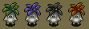

※ English names might change as the translation project progresses.

# Monster List

<table id="monsterList" class="monsterPageTable">
  <tr>
    <th colspan="8">Monster (Family)</th>
  </tr>
  <tr>
    <th class="highlightNormal">1</th>
    <th class="highlightNormal">2</th>
    <th class="highlightNormal">3</th>
    <th class="highlightNormal">4</th>
    <th class="highlightNormal">5</th>
    <th class="highlightNormal">6</th>
    <th class="highlightNormal">7</th>
    <th class="highlightNormal">8</th>
  </tr>
  <tr>
    <td class="highlightYellow"><a href="#ironhead">Ironhead</a></td>
    <td class="highlightYellow2"><a href="#skull-mage">Skull Mage</a></td>
    <td class="highlightYellow"><a href="#fog-hermit">Fog Hermit</a></td>
    <td class="highlightYellow2"><a href="#schubell">Schubell</a></td>
    <td class="highlightYellow"><a href="#baby-mage">Baby Mage</a></td>
    <td class="highlightYellow2"><a href="#explochin">Explochin</a></td>
    <td class="highlightYellow"><a href="#boy-tank">Boy Tank</a></td>
    <td class="highlightYellow2"><a href="#bad-froggo">Bad Froggo</a></td>
  </tr>
  <tr>
    <td class="highlightYellow"><a href="#vampire-baron">Vampire Baron</a></td>
    <td class="highlightYellow2"><a href="#wily-tanuki">Wily Tanuki</a></td>
    <td class="highlightYellow"><a href="#twisty-hani">Twisty Hani</a></td>
    <td class="highlightYellow2"><a href="#rock-head">Rock Head</a></td>
    <td class="highlightYellow"><a href="#pot-fisher">Pot Fisher</a></td>
    <td class="highlightYellow2"><a href="#pumphantasm">Pumphantasm</a></td>
    <td class="highlightYellow"><a href="#pop-tank">Pop Tank</a></td>
    <td class="highlightYellow2"><a href="#bad-zalokleft">Bad Zalokleft</a></td>
  </tr>
  <tr>
    <td class="highlightYellow"><a href="#shady-wisp">Shady Wisp</a></td>
    <td class="highlightYellow2"><a href="#impact-boar">Impact Boar</a></td>
    <td class="highlightYellow"><a href="#gazer">Gazer</a></td>
    <td class="highlightYellow2"><a href="#sip-leech">Sip Leech</a></td>
    <td class="highlightYellow"><a href="#porky">Porky</a></td>
    <td class="highlightYellow2"><a href="#punter-scarab">Punter Scarab</a></td>
    <td class="highlightYellow"><a href="#doze-mage">Doze Mage</a></td>
    <td class="highlightYellow2"><a href="#other-group">Other Group</a></td>
  </tr>
  <tr>
    <td class="highlightYellow"><a href="#squid-king">Squid King</a></td>
    <td class="highlightYellow2"><a href="#teaser-monkey">Teaser Monkey</a></td>
    <td class="highlightYellow"><a href="#alert-fly">Alert Fly</a></td>
    <td class="highlightYellow2"><a href="#cell-armor">Cell Armor</a></td>
    <td class="highlightYellow"><a href="#floor-dragon">Floor Dragon</a></td>
    <td class="highlightYellow2"><a href="#bat-kangaroo">Bat Kangaroo</a></td>
    <td class="highlightYellow"><a href="#mamel">Mamel</a></td>
    <td class="highlightYellow2"><a href="#boss-group">Boss Group</a></td>
  </tr>
  <tr>
    <td class="highlightYellow"><a href="#dozy-genie">Dozy Genie</a></td>
    <td class="highlightYellow2"><a href="#crow-tengu">Crow Tengu</a></td>
    <td class="highlightYellow"><a href="#goggler">Goggler</a></td>
    <td class="highlightYellow2"><a href="#taur">Taur</a></td>
    <td class="highlightYellow"><a href="#dragon">Dragon</a></td>
    <td class="highlightYellow2"><a href="#scurry-egg">Scurry Egg</a></td>
    <td class="highlightYellow"><a href="#slime">Slime</a></td>
    <td class="highlightYellow2"></td>
  </tr>
  <tr>
    <td class="highlightYellow"><a href="#healer-rabbit">Healer Rabbit</a></td>
    <td class="highlightYellow2"><a href="#daze-hermit">Daze Hermit</a></td>
    <td class="highlightYellow"><a href="#lobber-beetle">Lobber Beetle</a></td>
    <td class="highlightYellow2"><a href="#dagyan">Dagyan</a></td>
    <td class="highlightYellow"><a href="#nigiri-novice">Nigiri Novice</a></td>
    <td class="highlightYellow2"><a href="#sheep-priest">Sheep Priest</a></td>
    <td class="highlightYellow"><a href="#mini-mixer">Mini Mixer</a></td>
    <td class="highlightYellow2"></td>
  </tr>
  <tr>
    <td class="highlightYellow"><a href="#pitcher-plant">Pitcher Plant</a></td>
    <td class="highlightYellow2"><a href="#demon-warrior">Demon Warrior</a></td>
    <td class="highlightYellow"><a href="#zen-guru">Zen Guru</a></td>
    <td class="highlightYellow2"><a href="#snacky">Snacky</a></td>
    <td class="highlightYellow"><a href="#glare-snake">Glare Snake</a></td>
    <td class="highlightYellow2"><a href="#bored-kappa">Bored Kappa</a></td>
    <td class="highlightYellow"><a href="#morabi">Morabi</a></td>
    <td class="highlightYellow2"></td>
  </tr>
  <tr>
    <td class="highlightYellow"><a href="#wolf-droid">Wolf Droid</a></td>
    <td class="highlightYellow2"><a href="#ghost-warrior">Ghost Warrior</a></td>
    <td class="highlightYellow"><a href="#samuraidon">Samuraidon</a></td>
    <td class="highlightYellow2"><a href="#chicken">Chicken</a></td>
    <td class="highlightYellow"><a href="#minion-mouse">Minion Mouse</a></td>
    <td class="highlightYellow2"><a href="#gawkulus">Gawkulus</a></td>
    <td class="highlightYellow"><a href="#dark-slasher">Dark Slasher</a></td>
    <td class="highlightYellow2"></td>
  </tr>
  <tr>
    <td class="highlightYellow"><a href="#ether-devil">Ether Devil</a></td>
    <td class="highlightYellow2"><a href="#gyaza">Gyaza</a></td>
    <td class="highlightYellow"><a href="#death-reaper">Death Reaper</a></td>
    <td class="highlightYellow2"><a href="#lamp-puffer">Lamp Puffer</a></td>
    <td class="highlightYellow"><a href="#curse-girl">Curse Girl</a></td>
    <td class="highlightYellow2"><a href="#soldier-ant">Soldier Ant</a></td>
    <td class="highlightYellow"><a href="#dark-vassal">Dark Vassal</a></td>
    <td class="highlightYellow2"></td>
  </tr>
  <tr>
    <td class="highlightYellow"><a href="#mutaikon">Mutaikon</a></td>
    <td class="highlightYellow2"><a href="#gyadon">Gyadon</a></td>
    <td class="highlightYellow"><a href="#jungarian">Jungarian</a></td>
    <td class="highlightYellow2"><a href="#chintala">Chintala</a></td>
    <td class="highlightYellow"><a href="#king-tusker">King Tusker</a></td>
    <td class="highlightYellow2"><a href="#bow-boy">Bow Boy</a></td>
    <td class="highlightYellow"><a href="#trap-genin">Trap Genin</a></td>
    <td class="highlightYellow2"></td>
  </tr>
</table>

# Details

### Table Explanation

- Lv = Monster level.
- HP = Monster's hit points.
- Atk = Monster's attack power.
- Def = Monster's defense.
- Exp = Experience points awarded when the monster is defeated.
- Elem. = Element or type.
    - Slow = Half speed.
    - Swift 1 = Double speed, 1 attack.
    - Swift 2 = Double speed, 2 attacks.
    - Prism = Special attack can be blocked by a Prism Shield.
    - Magic = Special attack can be blocked by an Echo Shield.
    - Theft = Special attack can be blocked by a Walrus Shield.
    - Weapon = Water Pot reduces the monster's attack power.
    - Drain = Weak to ド (Drain Buster) rune.
    - Dragon = Weak to 竜 (Dragon Killer) rune.
    - Cyclops = Weak to 目 (Cyclops Killer) rune.
    - Ghost = Weak to 仏 (Ghost Sickle) rune, HP restoring items deal damage.
    - Bomb = Weak to 月 (Crescent Arm) rune.
    - Floating = Weak to 空 (Sky Splitter) rune, can move across water tiles.

### Ironhead

  

<table class="monsterPageTable">
  <tr>
    <th>Lv</th>
    <th>Name</th>
    <th>HP</th>
    <th>Atk</th>
    <th>Def</th>
    <th>Exp</th>
    <th>Elem.</th>
    <th>Notes</th>
  </tr>
  <tr>
    <td>1</td>
    <td>Ironhead</td>
    <td>70</td>
    <td>51</td>
    <td>48</td>
    <td>1500</td>
    <td rowspan="4">Cyclops</td>
    <td rowspan="4">Attacks 2 tiles ahead.</td>
  </tr>
  <tr>
    <td>2</td>
    <td>Chainhead</td>
    <td>68</td>
    <td>67</td>
    <td>60</td>
    <td>4000</td>
  </tr>
  <tr>
    <td>3</td>
    <td>Gigahead</td>
    <td>90</td>
    <td>70</td>
    <td>65</td>
    <td>4400</td>
  </tr>
  <tr>
    <td>4</td>
    <td>Doomhead</td>
    <td>95</td>
    <td>77</td>
    <td>72</td>
    <td>6000</td>
  </tr>
</table>

### Vampire Baron

  

<table class="monsterPageTable">
  <tr>
    <th>Lv</th>
    <th>Name</th>
    <th>HP</th>
    <th>Atk</th>
    <th>Def</th>
    <th>Exp</th>
    <th>Elem.</th>
    <th>Notes</th>
  </tr>
  <tr>
    <td>1</td>
    <td>Vampire Baron</td>
    <td>39</td>
    <td>16</td>
    <td>26</td>
    <td>52</td>
    <td rowspan="4">Ghost</td>
    <td rowspan="4">Uses the special attack of an adjacent monster.</td>
  </tr>
  <tr>
    <td>2</td>
    <td>Vampire Duke</td>
    <td>55</td>
    <td>38</td>
    <td>45</td>
    <td>400</td>
  </tr>
  <tr>
    <td>3</td>
    <td>Vampire Tyrant</td>
    <td>90</td>
    <td>70</td>
    <td>66</td>
    <td>4600</td>
  </tr>
  <tr>
    <td>4</td>
    <td>Vampire Lord</td>
    <td>99</td>
    <td>99</td>
    <td>66</td>
    <td>6660</td>
  </tr>
</table>

### Shady Wisp

  

<table class="monsterPageTable">
  <tr>
    <th>Lv</th>
    <th>Name</th>
    <th>HP</th>
    <th>Atk</th>
    <th>Def</th>
    <th>Exp</th>
    <th>Elem.</th>
    <th>Notes</th>
  </tr>
  <tr>
    <td>1</td>
    <td>Shady Wisp</td>
    <td>14</td>
    <td>7</td>
    <td>3</td>
    <td>6</td>
    <td rowspan="4">Floating Ghost</td>
    <td rowspan="4">No abilities.</td>
  </tr>
  <tr>
    <td>2</td>
    <td>Fearful Wisp</td>
    <td>34</td>
    <td>18</td>
    <td>24</td>
    <td>40</td>
  </tr>
  <tr>
    <td>3</td>
    <td>Wailing Wisp</td>
    <td>60</td>
    <td>23</td>
    <td>29</td>
    <td>70</td>
  </tr>
  <tr>
    <td>4</td>
    <td>Vengeful Wisp</td>
    <td>72</td>
    <td>53</td>
    <td>44</td>
    <td>2400</td>
  </tr>
</table>

### Squid King

  

<table class="monsterPageTable">
  <tr>
    <th>Lv</th>
    <th>Name</th>
    <th>HP</th>
    <th>Atk</th>
    <th>Def</th>
    <th>Exp</th>
    <th>Elem.</th>
    <th>Notes</th>
  </tr>
  <tr>
    <td>1</td>
    <td>Squid King</td>
    <td>69</td>
    <td>30</td>
    <td>35</td>
    <td>160</td>
    <td rowspan="4">Prism</td>
    <td rowspan="2">Blinds an adjacent target.</td>
  </tr>
  <tr>
    <td>2</td>
    <td>Squid Lord</td>
    <td>80</td>
    <td>60</td>
    <td>55</td>
    <td>3500</td>
  </tr>
  <tr>
    <td>3</td>
    <td>Squid Emperor</td>
    <td>84</td>
    <td>62</td>
    <td>56</td>
    <td>4000</td>
    <td rowspan="2">Blinds all targets in the room.</td>
  </tr>
  <tr>
    <td>4</td>
    <td>Squid Kaiser</td>
    <td>92</td>
    <td>65</td>
    <td>57</td>
    <td>4500</td>
  </tr>
</table>

### Dozy Genie

  

<table class="monsterPageTable">
  <tr>
    <th>Lv</th>
    <th>Name</th>
    <th>HP</th>
    <th>Atk</th>
    <th>Def</th>
    <th>Exp</th>
    <th>Elem.</th>
    <th>Notes</th>
  </tr>
  <tr>
    <td>1</td>
    <td>Dozy Genie</td>
    <td>20</td>
    <td>4</td>
    <td>50</td>
    <td>23</td>
    <td rowspan="4">-</td>
    <td>Occasionally falls asleep for 5 turns in hallways.</td>
  </tr>
  <tr>
    <td>2</td>
    <td>Groggy Genie</td>
    <td>33</td>
    <td>10</td>
    <td>50</td>
    <td>40</td>
    <td>Same as Dozy Genie, but 10 turns.</td>
  </tr>
  <tr>
    <td>3</td>
    <td>Sleepy Genie</td>
    <td>50</td>
    <td>20</td>
    <td>80</td>
    <td>1500</td>
    <td>Same as Dozy Genie, but 15 turns.</td>
  </tr>
  <tr>
    <td>4</td>
    <td>Drowsy Genie</td>
    <td>56</td>
    <td>30</td>
    <td>85</td>
    <td>3200</td>
    <td>Same as Dozy Genie, but 20 turns.</td>
  </tr>
</table>

### Healer Rabbit

  

<table class="monsterPageTable">
  <tr>
    <th>Lv</th>
    <th>Name</th>
    <th>HP</th>
    <th>Atk</th>
    <th>Def</th>
    <th>Exp</th>
    <th>Elem.</th>
    <th>Notes</th>
  </tr>
  <tr>
    <td>1</td>
    <td>Healer Rabbit</td>
    <td>30</td>
    <td>17</td>
    <td>30</td>
    <td>35</td>
    <td rowspan="2">-</td>
    <td>Restores 50 HP to an adjacent monster.</td>
  </tr>
  <tr>
    <td>2</td>
    <td>Life Rabbit</td>
    <td>90</td>
    <td>60</td>
    <td>46</td>
    <td>85</td>
    <td>Same as Healer Rabbit, but also warps to hurt monsters.</td>
  </tr>
</table>

### Pitcher Plant

  

<table class="monsterPageTable">
  <tr>
    <th>Lv</th>
    <th>Name</th>
    <th>HP</th>
    <th>Atk</th>
    <th>Def</th>
    <th>Exp</th>
    <th>Elem.</th>
    <th>Notes</th>
  </tr>
  <tr>
    <td>1</td>
    <td>Pitcher Plant</td>
    <td>20</td>
    <td>6</td>
    <td>18</td>
    <td>10</td>
    <td rowspan="4">-</td>
    <td>Eats and transforms a thrown item into grass.</td>
  </tr>
  <tr>
    <td>2</td>
    <td>Identify Plant</td>
    <td>61</td>
    <td>35</td>
    <td>38</td>
    <td>500</td>
    <td>Eats and identifies a thrown item.</td>
  </tr>
  <tr>
    <td>3</td>
    <td>Blessing Plant</td>
    <td>63</td>
    <td>35</td>
    <td>39</td>
    <td>500</td>
    <td>Eats and blesses a thrown item.</td>
  </tr>
  <tr>
    <td>4</td>
    <td>Upgrade Plant</td>
    <td>82</td>
    <td>40</td>
    <td>40</td>
    <td>1000</td>
    <td>Eats and upgrades a thrown item. Weapon or shield upgrade value, staff uses, or arrow count = +5. Repairs a cracked bracelet, turns any scroll into a Blank Scroll. An onigiri item is upgraded to a bigger onigiri.</td>
  </tr>
</table>

### Wolf Droid

  

<table class="monsterPageTable">
  <tr>
    <th>Lv</th>
    <th>Name</th>
    <th>HP</th>
    <th>Atk</th>
    <th>Def</th>
    <th>Exp</th>
    <th>Elem.</th>
    <th>Notes</th>
  </tr>
  <tr>
    <td>1</td>
    <td>Wolf Droid</td>
    <td>30</td>
    <td>15</td>
    <td>20</td>
    <td>35</td>
    <td rowspan="4">Bomb</td>
    <td>Lobs bombs that home in on a target within 2 tiles, dealing 10 damage. Bombs damage other characters and destroy wall tiles in a 1 tile radius.</td>
  </tr>
  <tr>
    <td>2</td>
    <td>Gorilla Bot</td>
    <td>35</td>
    <td>20</td>
    <td>22</td>
    <td>50</td>
    <td>Same as Wolf Droid, but range of 3 tiles and 15 damage.</td>
  </tr>
  <tr>
    <td>3</td>
    <td>Bear Borg</td>
    <td>85</td>
    <td>65</td>
    <td>62</td>
    <td>3600</td>
    <td>Same as Wolf Droid, but range of 5 tiles and 20 damage.</td>
  </tr>
  <tr>
    <td>4</td>
    <td>Gao Tiger</td>
    <td>95</td>
    <td>70</td>
    <td>65</td>
    <td>4400</td>
    <td>Same as Wolf Droid, but range of 6 tiles and 25 damage.</td>
  </tr>
</table>

### Ether Devil

  

<table class="monsterPageTable">
  <tr>
    <th>Lv</th>
    <th>Name</th>
    <th>HP</th>
    <th>Atk</th>
    <th>Def</th>
    <th>Exp</th>
    <th>Elem.</th>
    <th>Notes</th>
  </tr>
  <tr>
    <td>1</td>
    <td>Ether Devil</td>
    <td>26</td>
    <td>18</td>
    <td>26</td>
    <td>27</td>
    <td rowspan="2">Floating Ghost</td>
    <td>Invisible, and unpredictable movement. Nullifies magic bullets.</td>
  </tr>
  <tr>
    <td>2</td>
    <td>Phantom Devil</td>
    <td>79</td>
    <td>55</td>
    <td>55</td>
    <td>1800</td>
    <td>Same as Ether Devil, but reflects magic bullets in a straight line.</td>
  </tr>
  <tr>
    <td>3</td>
    <td>Mirage Devil</td>
    <td>95</td>
    <td>70</td>
    <td>65</td>
    <td>3300</td>
    <td rowspan="2">Floating Ghost Swift 2</td>
    <td rowspan="2">Same as Ether Devil, but reflects magic bullets in a random direction. Double speed (2 attacks).</td>
  </tr>
  <tr>
    <td>4</td>
    <td>Astral Devil</td>
    <td>100</td>
    <td>85</td>
    <td>75</td>
    <td>4200</td>
  </tr>
</table>

### Mutaikon

  

<table class="monsterPageTable">
  <tr>
    <th>Lv</th>
    <th>Name</th>
    <th>HP</th>
    <th>Atk</th>
    <th>Def</th>
    <th>Exp</th>
    <th>Elem.</th>
    <th>Notes</th>
  </tr>
  <tr>
    <td>1</td>
    <td>Mutaikon</td>
    <td>65</td>
    <td>41</td>
    <td>47</td>
    <td>1800</td>
    <td rowspan="4">-</td>
    <td>Throws Poison Grass 2 tiles ahead.</td>
  </tr>
  <tr>
    <td>2</td>
    <td>Dazikon</td>
    <td>70</td>
    <td>43</td>
    <td>52</td>
    <td>2000</td>
    <td>Throws Dizzy Grass within a 2 tile radius, or Poison Grass if Shiren is already Confused.</td>
  </tr>
  <tr>
    <td>3</td>
    <td>Dozikon</td>
    <td>75</td>
    <td>45</td>
    <td>53</td>
    <td>3000</td>
    <td>Throws Sleep Grass within a 3 tile radius, or Poison Grass if Shiren is already Asleep.</td>
  </tr>
  <tr>
    <td>4</td>
    <td>Mesmerikon</td>
    <td>80</td>
    <td>50</td>
    <td>58</td>
    <td>3500</td>
    <td>Throws Sleep Grass within a 3 tile radius, or Poison Grass if Shiren is already Asleep.</td>
  </tr>
</table>

### Skull Mage

  

<table class="monsterPageTable">
  <tr>
    <th>Lv</th>
    <th>Name</th>
    <th>HP</th>
    <th>Atk</th>
    <th>Def</th>
    <th>Exp</th>
    <th>Elem.</th>
    <th>Notes</th>
  </tr>
  <tr>
    <td>1</td>
    <td>Skull Mage</td>
    <td>25</td>
    <td>15</td>
    <td>15</td>
    <td>20</td>
    <td rowspan="4">Floating Ghost Magic</td>
    <td>Fires a magic bullet with a random effect in a line. (Warp, Knockback, Switch positions, Swift)</td>
  </tr>
  <tr>
    <td>2</td>
    <td>Skull Wizard</td>
    <td>40</td>
    <td>25</td>
    <td>40</td>
    <td>280</td>
    <td>Fires a magic bullet with a random effect in a line. (Presto, Confused, Transient, 25 damage)</td>
  </tr>
  <tr>
    <td>3</td>
    <td>Skull Wraith</td>
    <td>75</td>
    <td>43</td>
    <td>47</td>
    <td>2500</td>
    <td>Fires a magic bullet with a random effect in a line. (Onigiri, Paralyzed, Confused, Slow, Sealed, Level-1)</td>
  </tr>
  <tr>
    <td>4</td>
    <td>Skull Demon</td>
    <td>80</td>
    <td>52</td>
    <td>60</td>
    <td>3200</td>
    <td>Fires a magic bullet with a random effect in a line. (Onigiri, Asleep, Blind, 40 damage, Level-3)</td>
  </tr>
</table>

### Wily Tanuki

  

<table class="monsterPageTable">
  <tr>
    <th>Lv</th>
    <th>Name</th>
    <th>HP</th>
    <th>Atk</th>
    <th>Def</th>
    <th>Exp</th>
    <th>Elem.</th>
    <th>Notes</th>
  </tr>
  <tr>
    <td>1</td>
    <td>Wily Tanuki</td>
    <td>16</td>
    <td>20</td>
    <td>15</td>
    <td>5</td>
    <td rowspan="4">-</td>
    <td rowspan="4">Disguised as an item, attacks if you try to use it. Item's name changes to the monster's name if you change floors.</td>
  </tr>
  <tr>
    <td>2</td>
    <td>Tricky Tanuki</td>
    <td>52</td>
    <td>55</td>
    <td>42</td>
    <td>300</td>
  </tr>
  <tr>
    <td>3</td>
    <td>Crafty Tanuki</td>
    <td>95</td>
    <td>75</td>
    <td>50</td>
    <td>1500</td>
  </tr>
  <tr>
    <td>4</td>
    <td>Shifty Tanuki</td>
    <td>110</td>
    <td>77</td>
    <td>55</td>
    <td>2000</td>
  </tr>
</table>

### Impact Boar

  

<table class="monsterPageTable">
  <tr>
    <th>Lv</th>
    <th>Name</th>
    <th>HP</th>
    <th>Atk</th>
    <th>Def</th>
    <th>Exp</th>
    <th>Elem.</th>
    <th>Notes</th>
  </tr>
  <tr>
    <td>1</td>
    <td>Impact Boar</td>
    <td>15</td>
    <td>7</td>
    <td>12</td>
    <td>8</td>
    <td rowspan="4">Prism</td>
    <td rowspan="4">Lunge deals 5 damage and 5 tiles of knockback, and makes Shiren trip and drop items if he isn't against a wall.</td>
  </tr>
  <tr>
    <td>2</td>
    <td>Crash Boar</td>
    <td>64</td>
    <td>45</td>
    <td>42</td>
    <td>800</td>
  </tr>
  <tr>
    <td>3</td>
    <td>Wrecker Boar</td>
    <td>70</td>
    <td>48</td>
    <td>48</td>
    <td>1900</td>
  </tr>
  <tr>
    <td>4</td>
    <td>Quake Boar</td>
    <td>76</td>
    <td>53</td>
    <td>53</td>
    <td>2200</td>
  </tr>
</table>

### Teaser Monkey

  

<table class="monsterPageTable">
  <tr>
    <th>Lv</th>
    <th>Name</th>
    <th>HP</th>
    <th>Atk</th>
    <th>Def</th>
    <th>Exp</th>
    <th>Elem.</th>
    <th>Notes</th>
  </tr>
  <tr>
    <td>1</td>
    <td>Teaser Monkey</td>
    <td>12</td>
    <td>5</td>
    <td>12</td>
    <td>10</td>
    <td rowspan="4">-</td>
    <td rowspan="4">Moves away from Shiren while inside rooms. Repeatedly approaches and backs away in hallways.</td>
  </tr>
  <tr>
    <td>2</td>
    <td>Derider Monkey</td>
    <td>68</td>
    <td>43</td>
    <td>49</td>
    <td>1250</td>
  </tr>
  <tr>
    <td>3</td>
    <td>Mocker Monkey</td>
    <td>72</td>
    <td>49</td>
    <td>52</td>
    <td>1550</td>
  </tr>
  <tr>
    <td>4</td>
    <td>Scorner Monkey</td>
    <td>80</td>
    <td>55</td>
    <td>58</td>
    <td>1850</td>
  </tr>
</table>

### Crow Tengu

  

<table class="monsterPageTable">
  <tr>
    <th>Lv</th>
    <th>Name</th>
    <th>HP</th>
    <th>Atk</th>
    <th>Def</th>
    <th>Exp</th>
    <th>Elem.</th>
    <th>Notes</th>
  </tr>
  <tr>
    <td>1</td>
    <td>Crow Tengu</td>
    <td>50</td>
    <td>15</td>
    <td>20</td>
    <td>100</td>
    <td rowspan="4">-</td>
    <td rowspan="4">Disguised as a monster from the floor's monster table. It can't use abilities of the monster it's disguised as.</td>
  </tr>
  <tr>
    <td>2</td>
    <td>Falcon Tengu</td>
    <td>60</td>
    <td>15</td>
    <td>25</td>
    <td>500</td>
  </tr>
  <tr>
    <td>3</td>
    <td>Eagle Tengu</td>
    <td>70</td>
    <td>15</td>
    <td>30</td>
    <td>600</td>
  </tr>
  <tr>
    <td>4</td>
    <td>Phoenix Tengu</td>
    <td>80</td>
    <td>15</td>
    <td>35</td>
    <td>800</td>
  </tr>
</table>

### Daze Hermit

  

<table class="monsterPageTable">
  <tr>
    <th>Lv</th>
    <th>Name</th>
    <th>HP</th>
    <th>Atk</th>
    <th>Def</th>
    <th>Exp</th>
    <th>Elem.</th>
    <th>Notes</th>
  </tr>
  <tr>
    <td>1</td>
    <td>Daze Hermit</td>
    <td>33</td>
    <td>16</td>
    <td>24</td>
    <td>46</td>
    <td rowspan="2">Prism</td>
    <td>Inflicts Inaccurate on an adjacent target.</td>
  </tr>
  <tr>
    <td>2</td>
    <td>Scold Hermit</td>
    <td>32</td>
    <td>18</td>
    <td>32</td>
    <td>46</td>
    <td>Inflicts Asleep on an adjacent target.</td>
  </tr>
  <tr>
    <td>3</td>
    <td>Spry Hermit</td>
    <td>60</td>
    <td>46</td>
    <td>51</td>
    <td>2000</td>
    <td>-</td>
    <td>Evades all direct attacks. 必 (Homing Blade) rune and Spark Sword's critical hit are effective.</td>
  </tr>
  <tr>
    <td>4</td>
    <td>Ramble Hermit</td>
    <td>75</td>
    <td>54</td>
    <td>58</td>
    <td>2300</td>
    <td>Prism</td>
    <td>Inflicts Confused on an adjacent target.</td>
  </tr>
</table>

### Demon Warrior

  

<table class="monsterPageTable">
  <tr>
    <th>Lv</th>
    <th>Name</th>
    <th>HP</th>
    <th>Atk</th>
    <th>Def</th>
    <th>Exp</th>
    <th>Elem.</th>
    <th>Notes</th>
  </tr>
  <tr>
    <td>1</td>
    <td>Demon Warrior</td>
    <td>40</td>
    <td>18</td>
    <td>22</td>
    <td>47</td>
    <td rowspan="4">Weapon</td>
    <td>Ghost Warrior appears 3 turns after it's defeated.</td>
  </tr>
  <tr>
    <td>2</td>
    <td>Hannya Warrior</td>
    <td>65</td>
    <td>60</td>
    <td>50</td>
    <td>1300</td>
    <td>Ghost Hannya appears 3 turns after it's defeated. Reflects direct attacks.</td>
  </tr>
  <tr>
    <td>3</td>
    <td>Shogun</td>
    <td>70</td>
    <td>60</td>
    <td>60</td>
    <td>1350</td>
    <td>Ghost Shogun appears 3 turns after it's defeated.</td>
  </tr>
  <tr>
    <td>4</td>
    <td>Daishogun</td>
    <td>80</td>
    <td>70</td>
    <td>60</td>
    <td>2250</td>
    <td>Ghost Daishogun appears 3 turns after it's defeated.</td>
  </tr>
</table>

### Ghost Warrior

  

<table class="monsterPageTable">
  <tr>
    <th>Lv</th>
    <th>Name</th>
    <th>HP</th>
    <th>Atk</th>
    <th>Def</th>
    <th>Exp</th>
    <th>Elem.</th>
    <th>Notes</th>
  </tr>
  <tr>
    <td>1</td>
    <td>Ghost Warrior</td>
    <td>4</td>
    <td>0</td>
    <td>250</td>
    <td>1</td>
    <td rowspan="4">Ghost</td>
    <td>Possesses a monster and raises their level by 1. Takes 1 damage from direct attacks.</td>
  </tr>
  <tr>
    <td>2</td>
    <td>Ghost Hannya</td>
    <td>4</td>
    <td>12</td>
    <td>250</td>
    <td>1</td>
    <td>Approaches Shiren, and reflects direct attacks.</td>
  </tr>
  <tr>
    <td>3</td>
    <td>Ghost Shogun</td>
    <td>4</td>
    <td>0</td>
    <td>250</td>
    <td>1</td>
    <td rowspan="2">Follows an enemy and revives them if they collapse. Takes 1 damage from direct attacks.</td>
  </tr>
  <tr>
    <td>4</td>
    <td>Ghost Daishogun</td>
    <td>4</td>
    <td>36</td>
    <td>250</td>
    <td>1</td>
  </tr>
</table>

### Gyaza

  

<table class="monsterPageTable">
  <tr>
    <th>Lv</th>
    <th>Name</th>
    <th>HP</th>
    <th>Atk</th>
    <th>Def</th>
    <th>Exp</th>
    <th>Elem.</th>
    <th>Notes</th>
  </tr>
  <tr>
    <td>1</td>
    <td>Gyaza</td>
    <td>50</td>
    <td>20</td>
    <td>34</td>
    <td>180</td>
    <td rowspan="4">-</td>
    <td rowspan="4">Converts all attacks and effects other than direct attacks or explosions into 2 damage.</td>
  </tr>
  <tr>
    <td>2</td>
    <td>Killer Gyaza</td>
    <td>60</td>
    <td>40</td>
    <td>55</td>
    <td>5000</td>
  </tr>
  <tr>
    <td>3</td>
    <td>Hell Gyaza</td>
    <td>81</td>
    <td>65</td>
    <td>65</td>
    <td>6100</td>
  </tr>
  <tr>
    <td>4</td>
    <td>Doom Gyaza</td>
    <td>91</td>
    <td>71</td>
    <td>71</td>
    <td>7200</td>
  </tr>
</table>

### Gyadon

  

<table class="monsterPageTable">
  <tr>
    <th>Lv</th>
    <th>Name</th>
    <th>HP</th>
    <th>Atk</th>
    <th>Def</th>
    <th>Exp</th>
    <th>Elem.</th>
    <th>Notes</th>
  </tr>
  <tr>
    <td>1</td>
    <td>Gyadon</td>
    <td>60</td>
    <td>31</td>
    <td>39</td>
    <td>165</td>
    <td rowspan="4">Floating Theft Prism</td>
    <td>Reduces a staff's remaining uses to 0. (Can't peck staves that are inside pots)</td>
  </tr>
  <tr>
    <td>2</td>
    <td>Gyairas</td>
    <td>65</td>
    <td>32</td>
    <td>40</td>
    <td>165</td>
    <td>Reduces a pot's capacity to 0. All items in the pot vanish.</td>
  </tr>
  <tr>
    <td>3</td>
    <td>Gyandora</td>
    <td>80</td>
    <td>77</td>
    <td>61</td>
    <td>4200</td>
    <td>Erases 1 rune from a weapon or shield. (Can peck equipped items as well)</td>
  </tr>
  <tr>
    <td>4</td>
    <td>Gyandoron</td>
    <td>90</td>
    <td>82</td>
    <td>65</td>
    <td>4800</td>
    <td>Turns a grass or seed item into Weeds.</td>
  </tr>
</table>

### Fog Hermit

  

<table class="monsterPageTable">
  <tr>
    <th>Lv</th>
    <th>Name</th>
    <th>HP</th>
    <th>Atk</th>
    <th>Def</th>
    <th>Exp</th>
    <th>Elem.</th>
    <th>Notes</th>
  </tr>
  <tr>
    <td>1</td>
    <td>Fog Hermit</td>
    <td>13</td>
    <td>6</td>
    <td>8</td>
    <td>8</td>
    <td rowspan="4">Drain Magic Prism</td>
    <td>Casts a spell when adjacent that stops HP regeneration for 10 turns. If you get hit by the spell again, it changes to HP Drain.</td>
  </tr>
  <tr>
    <td>2</td>
    <td>Haze Hermit</td>
    <td>56</td>
    <td>30</td>
    <td>30</td>
    <td>350</td>
    <td>Same as Fog Hermit, but casts the spell in a straight line, and lasts 20 turns.</td>
  </tr>
  <tr>
    <td>3</td>
    <td>Mist Hermit</td>
    <td>80</td>
    <td>60</td>
    <td>55</td>
    <td>2000</td>
    <td>Same as Fog Hermit, but casts the spell in the same room, and lasts 30 turns.</td>
  </tr>
  <tr>
    <td>4</td>
    <td>Cloud Hermit</td>
    <td>92</td>
    <td>72</td>
    <td>65</td>
    <td>2800</td>
    <td>Same as Fog Hermit, but casts the spell from anywhere, and lasts 40 turns.</td>
  </tr>
</table>

### Twisty Hani

  

<table class="monsterPageTable">
  <tr>
    <th>Lv</th>
    <th>Name</th>
    <th>HP</th>
    <th>Atk</th>
    <th>Def</th>
    <th>Exp</th>
    <th>Elem.</th>
    <th>Notes</th>
  </tr>
  <tr>
    <td>1</td>
    <td>Twisty Hani</td>
    <td>25</td>
    <td>18</td>
    <td>15</td>
    <td>35</td>
    <td rowspan="4">Drain Prism</td>
    <td rowspan="4">Decreases an adjacent target's level by 1.</td>
  </tr>
  <tr>
    <td>2</td>
    <td>Floppy Hani</td>
    <td>40</td>
    <td>34</td>
    <td>38</td>
    <td>1200</td>
  </tr>
  <tr>
    <td>3</td>
    <td>Droopy Hani</td>
    <td>80</td>
    <td>80</td>
    <td>75</td>
    <td>4000</td>
  </tr>
  <tr>
    <td>4</td>
    <td>Wrinkly Hani</td>
    <td>20</td>
    <td>96</td>
    <td>150</td>
    <td>6000</td>
  </tr>
</table>

### Gazer

  

<table class="monsterPageTable">
  <tr>
    <th>Lv</th>
    <th>Name</th>
    <th>HP</th>
    <th>Atk</th>
    <th>Def</th>
    <th>Exp</th>
    <th>Elem.</th>
    <th>Notes</th>
  </tr>
  <tr>
    <td>1</td>
    <td>Gazer</td>
    <td>19</td>
    <td>10</td>
    <td>17</td>
    <td>20</td>
    <td rowspan="4">Cyclops Magic Prism</td>
    <td rowspan="3">Hypnotizes an adjacent target.</td>
  </tr>
  <tr>
    <td>2</td>
    <td>Super Gazer</td>
    <td>75</td>
    <td>39</td>
    <td>29</td>
    <td>600</td>
  </tr>
  <tr>
    <td>3</td>
    <td>Hyper Gazer</td>
    <td>100</td>
    <td>80</td>
    <td>48</td>
    <td>4000</td>
  </tr>
  <tr>
    <td>4</td>
    <td>Ultra Gazer</td>
    <td>120</td>
    <td>85</td>
    <td>54</td>
    <td>4700</td>
    <td>Same as Gazer, but always drops 5000 Gitan.</td>
  </tr>
</table>

### Alert Fly

  

<table class="monsterPageTable">
  <tr>
    <th>Lv</th>
    <th>Name</th>
    <th>HP</th>
    <th>Atk</th>
    <th>Def</th>
    <th>Exp</th>
    <th>Elem.</th>
    <th>Notes</th>
  </tr>
  <tr>
    <td>1</td>
    <td>Alert Fly</td>
    <td>34</td>
    <td>17</td>
    <td>20</td>
    <td>48</td>
    <td rowspan="4">Floating</td>
    <td rowspan="4">Wakes up all monsters on the floor if you move next to it.</td>
  </tr>
  <tr>
    <td>2</td>
    <td>Fink Fly</td>
    <td>56</td>
    <td>35</td>
    <td>40</td>
    <td>450</td>
  </tr>
  <tr>
    <td>3</td>
    <td>Nark Fly</td>
    <td>60</td>
    <td>60</td>
    <td>50</td>
    <td>850</td>
  </tr>
  <tr>
    <td>4</td>
    <td>Snitch Fly</td>
    <td>70</td>
    <td>65</td>
    <td>60</td>
    <td>1500</td>
  </tr>
</table>

### Goggler

  

<table class="monsterPageTable">
  <tr>
    <th>Lv</th>
    <th>Name</th>
    <th>HP</th>
    <th>Atk</th>
    <th>Def</th>
    <th>Exp</th>
    <th>Elem.</th>
    <th>Notes</th>
  </tr>
  <tr>
    <td>1</td>
    <td>Goggler</td>
    <td>35</td>
    <td>20</td>
    <td>15</td>
    <td>30</td>
    <td rowspan="4">-</td>
    <td rowspan="4">Doesn't approach unless you step within 2 tiles of it. Lv2~4 can't be found naturally.</td>
  </tr>
  <tr>
    <td>2</td>
    <td>Worth Goggler</td>
    <td>66</td>
    <td>51</td>
    <td>51</td>
    <td>2000</td>
  </tr>
  <tr>
    <td>3</td>
    <td>Glenn Goggler</td>
    <td>77</td>
    <td>84</td>
    <td>60</td>
    <td>4000</td>
  </tr>
  <tr>
    <td>4</td>
    <td>Arch Goggler</td>
    <td>88</td>
    <td>88</td>
    <td>77</td>
    <td>4900</td>
  </tr>
</table>

### Lobber Beetle

  

<table class="monsterPageTable">
  <tr>
    <th>Lv</th>
    <th>Name</th>
    <th>HP</th>
    <th>Atk</th>
    <th>Def</th>
    <th>Exp</th>
    <th>Elem.</th>
    <th>Notes</th>
  </tr>
  <tr>
    <td>1</td>
    <td>Lobber Beetle</td>
    <td>45</td>
    <td>18</td>
    <td>33</td>
    <td>85</td>
    <td rowspan="4">-</td>
    <td>Throws an adjacent creature at Shiren, or throws Shiren at another creature, onto a trap, or into a Monster House. Throwing range of 5 tiles, deals 5 damage.</td>
  </tr>
  <tr>
    <td>2</td>
    <td>Heaver Beetle</td>
    <td>75</td>
    <td>76</td>
    <td>65</td>
    <td>3000</td>
    <td>Same as Lobber Beetle, but range of 10 tiles.</td>
  </tr>
  <tr>
    <td>3</td>
    <td>Slinger Beetle</td>
    <td>76</td>
    <td>85</td>
    <td>65</td>
    <td>3500</td>
    <td>Same as Lobber Beetle, but range of 15 tiles.</td>
  </tr>
  <tr>
    <td>4</td>
    <td>Flinger Beetle</td>
    <td>88</td>
    <td>88</td>
    <td>70</td>
    <td>4100</td>
    <td>Same as Lobber Beetle, but range of 20 tiles.</td>
  </tr>
</table>

### Zen Guru

  

<table class="monsterPageTable">
  <tr>
    <th>Lv</th>
    <th>Name</th>
    <th>HP</th>
    <th>Atk</th>
    <th>Def</th>
    <th>Exp</th>
    <th>Elem.</th>
    <th>Notes</th>
  </tr>
  <tr>
    <td>1</td>
    <td>Zen Guru</td>
    <td>40</td>
    <td>14</td>
    <td>18</td>
    <td>22</td>
    <td rowspan="4">Floating</td>
    <td rowspan="4">No abilities.</td>
  </tr>
  <tr>
    <td>2</td>
    <td>Zen Monk</td>
    <td>50</td>
    <td>27</td>
    <td>25</td>
    <td>75</td>
  </tr>
  <tr>
    <td>3</td>
    <td>Zen Priest</td>
    <td>55</td>
    <td>30</td>
    <td>35</td>
    <td>150</td>
  </tr>
  <tr>
    <td>4</td>
    <td>Zen God</td>
    <td>110</td>
    <td>65</td>
    <td>80</td>
    <td>5200</td>
  </tr>
</table>

### Samuraidon

  

<table class="monsterPageTable">
  <tr>
    <th>Lv</th>
    <th>Name</th>
    <th>HP</th>
    <th>Atk</th>
    <th>Def</th>
    <th>Exp</th>
    <th>Elem.</th>
    <th>Notes</th>
  </tr>
  <tr>
    <td>1</td>
    <td>Samuraidon</td>
    <td>29</td>
    <td>13</td>
    <td>21</td>
    <td>26</td>
    <td rowspan="4">Weapon</td>
    <td>Reflects a portion of damage received from direct attacks.</td>
  </tr>
  <tr>
    <td>2</td>
    <td>Taishodon</td>
    <td>72</td>
    <td>40</td>
    <td>44</td>
    <td>2150</td>
    <td>Reflects magic bullets.</td>
  </tr>
  <tr>
    <td>3</td>
    <td>Tonosamadon</td>
    <td>80</td>
    <td>50</td>
    <td>58</td>
    <td>2100</td>
    <td>Reflects all projectiles that don't have piercing properties.</td>
  </tr>
  <tr>
    <td>4</td>
    <td>Daimyodon</td>
    <td>90</td>
    <td>60</td>
    <td>21</td>
    <td>5200</td>
    <td>Has all Lv1~3 abilities.</td>
  </tr>
</table>

### Death Reaper

  

<table class="monsterPageTable">
  <tr>
    <th>Lv</th>
    <th>Name</th>
    <th>HP</th>
    <th>Atk</th>
    <th>Def</th>
    <th>Exp</th>
    <th>Elem.</th>
    <th>Notes</th>
  </tr>
  <tr>
    <td>1</td>
    <td>Death Reaper</td>
    <td>17</td>
    <td>6</td>
    <td>13</td>
    <td>12</td>
    <td>Floating Ghost Weapon Swift 1</td>
    <td>Double speed, 1 attack.</td>
  </tr>
  <tr>
    <td>2</td>
    <td>Hell Reaper</td>
    <td>20</td>
    <td>15</td>
    <td>15</td>
    <td>15</td>
    <td rowspan="3">Floating Ghost Weapon Swift 2</td>
    <td>Double speed, 2 attacks.</td>
  </tr>
  <tr>
    <td>3</td>
    <td>Grim Reaper</td>
    <td>70</td>
    <td>30</td>
    <td>41</td>
    <td>1800</td>
    <td rowspan="2">Double speed, 2 attacks. Can pass through walls.</td>
  </tr>
  <tr>
    <td>4</td>
    <td>Death Keeper</td>
    <td>80</td>
    <td>62</td>
    <td>24</td>
    <td>4200</td>
  </tr>
</table>

### Jungarian

  

<table class="monsterPageTable">
  <tr>
    <th>Lv</th>
    <th>Name</th>
    <th>HP</th>
    <th>Atk</th>
    <th>Def</th>
    <th>Exp</th>
    <th>Elem.</th>
    <th>Notes</th>
  </tr>
  <tr>
    <td>1</td>
    <td>Jungarian</td>
    <td>13</td>
    <td>6</td>
    <td>11</td>
    <td>8</td>
    <td rowspan="4">Theft Prism</td>
    <td rowspan="4">Steals an item and flings it 5 tiles behind itself.</td>
  </tr>
  <tr>
    <td>2</td>
    <td>Campbellan</td>
    <td>50</td>
    <td>25</td>
    <td>37</td>
    <td>165</td>
  </tr>
  <tr>
    <td>3</td>
    <td>Blackbelly</td>
    <td>100</td>
    <td>67</td>
    <td>53</td>
    <td>2500</td>
  </tr>
  <tr>
    <td>4</td>
    <td>Roborovsky</td>
    <td>110</td>
    <td>70</td>
    <td>56</td>
    <td>3500</td>
  </tr>
</table>

### Schubell

  

<table class="monsterPageTable">
  <tr>
    <th>Lv</th>
    <th>Name</th>
    <th>HP</th>
    <th>Atk</th>
    <th>Def</th>
    <th>Exp</th>
    <th>Elem.</th>
    <th>Notes</th>
  </tr>
  <tr>
    <td>1</td>
    <td>Schubell</td>
    <td>28</td>
    <td>15</td>
    <td>20</td>
    <td>35</td>
    <td rowspan="4">-</td>
    <td>Summons 1 level 1 monster when adjacent.</td>
  </tr>
  <tr>
    <td>2</td>
    <td>Menbell</td>
    <td>45</td>
    <td>30</td>
    <td>26</td>
    <td>100</td>
    <td>Summons 1 level 2 monster when adjacent.</td>
  </tr>
  <tr>
    <td>3</td>
    <td>Bellthoven</td>
    <td>55</td>
    <td>42</td>
    <td>50</td>
    <td>1600</td>
    <td>Summons 1~3 level 3 monsters when adjacent.</td>
  </tr>
  <tr>
    <td>4</td>
    <td>Shopin</td>
    <td>65</td>
    <td>54</td>
    <td>62</td>
    <td>2100</td>
    <td>Summons 1~3 level 4 monsters when adjacent.</td>
  </tr>
</table>

### Rock Head

  

<table class="monsterPageTable">
  <tr>
    <th>Lv</th>
    <th>Name</th>
    <th>HP</th>
    <th>Atk</th>
    <th>Def</th>
    <th>Exp</th>
    <th>Elem.</th>
    <th>Notes</th>
  </tr>
  <tr>
    <td>1</td>
    <td>Rock Head</td>
    <td>25</td>
    <td>12</td>
    <td>12</td>
    <td>21</td>
    <td rowspan="4">-</td>
    <td>Doesn't act unless you attack or become adjacent. Occasionally drops an Escape Scroll.</td>
  </tr>
  <tr>
    <td>2</td>
    <td>Ogre Rock</td>
    <td>55</td>
    <td>40</td>
    <td>36</td>
    <td>450</td>
    <td rowspan="3">Doesn't act unless you attack or become adjacent.</td>
  </tr>
  <tr>
    <td>3</td>
    <td>Demon Rock</td>
    <td>70</td>
    <td>70</td>
    <td>70</td>
    <td>2500</td>
  </tr>
  <tr>
    <td>4</td>
    <td>Devil Moai</td>
    <td>80</td>
    <td>80</td>
    <td>80</td>
    <td>3500</td>
  </tr>
</table>

### Sip Leech

  

<table class="monsterPageTable">
  <tr>
    <th>Lv</th>
    <th>Name</th>
    <th>HP</th>
    <th>Atk</th>
    <th>Def</th>
    <th>Exp</th>
    <th>Elem.</th>
    <th>Notes</th>
  </tr>
  <tr>
    <td>1</td>
    <td>Sip Leech</td>
    <td>15</td>
    <td>14</td>
    <td>19</td>
    <td>24</td>
    <td rowspan="4">Drain Cyclops Prism</td>
    <td>Lowers strength by 1 when adjacent.</td>
  </tr>
  <tr>
    <td>2</td>
    <td>Slurp Leech</td>
    <td>55</td>
    <td>28</td>
    <td>38</td>
    <td>330</td>
    <td>Lowers strength by 2 when adjacent.</td>
  </tr>
  <tr>
    <td>3</td>
    <td>Gulp Leech</td>
    <td>80</td>
    <td>55</td>
    <td>52</td>
    <td>1560</td>
    <td>Lowers strength by 3 when adjacent.</td>
  </tr>
  <tr>
    <td>4</td>
    <td>Guzzle Leech</td>
    <td>92</td>
    <td>60</td>
    <td>57</td>
    <td>2140</td>
    <td>Lowers strength by 4 when adjacent.</td>
  </tr>
</table>

### Cell Armor

  

<table class="monsterPageTable">
  <tr>
    <th>Lv</th>
    <th>Name</th>
    <th>HP</th>
    <th>Atk</th>
    <th>Def</th>
    <th>Exp</th>
    <th>Elem.</th>
    <th>Notes</th>
  </tr>
  <tr>
    <td>1</td>
    <td>Cell Armor</td>
    <td>65</td>
    <td>37</td>
    <td>50</td>
    <td>1050</td>
    <td rowspan="4">Floating Weapon Prism</td>
    <td rowspan="4">Knocks away an item when adjacent, including equipped items. Can't disarm cursed equipment, and item flies 10 tiles. Occasionally drops Cell Armor Sword.</td>
  </tr>
  <tr>
    <td>2</td>
    <td>Chrome Armor</td>
    <td>70</td>
    <td>52</td>
    <td>55</td>
    <td>2500</td>
  </tr>
  <tr>
    <td>3</td>
    <td>Titanium Armor</td>
    <td>85</td>
    <td>55</td>
    <td>60</td>
    <td>3900</td>
  </tr>
  <tr>
    <td>4</td>
    <td>Metal Armor</td>
    <td>90</td>
    <td>58</td>
    <td>70</td>
    <td>4400</td>
  </tr>
</table>

### Taur

  

<table class="monsterPageTable">
  <tr>
    <th>Lv</th>
    <th>Name</th>
    <th>HP</th>
    <th>Atk</th>
    <th>Def</th>
    <th>Exp</th>
    <th>Elem.</th>
    <th>Notes</th>
  </tr>
  <tr>
    <td>1</td>
    <td>Taur</td>
    <td>66</td>
    <td>30</td>
    <td>45</td>
    <td>150</td>
    <td rowspan="4">Weapon</td>
    <td rowspan="4">Occasionally deals a powerful brutal hit.</td>
  </tr>
  <tr>
    <td>2</td>
    <td>Minotaur</td>
    <td>66</td>
    <td>40</td>
    <td>50</td>
    <td>1000</td>
  </tr>
  <tr>
    <td>3</td>
    <td>Megataur</td>
    <td>85</td>
    <td>85</td>
    <td>69</td>
    <td>5500</td>
  </tr>
  <tr>
    <td>4</td>
    <td>Gigataur</td>
    <td>105</td>
    <td>100</td>
    <td>75</td>
    <td>6800</td>
  </tr>
</table>

### Dagyan

  

<table class="monsterPageTable">
  <tr>
    <th>Lv</th>
    <th>Name</th>
    <th>HP</th>
    <th>Atk</th>
    <th>Def</th>
    <th>Exp</th>
    <th>Elem.</th>
    <th>Notes</th>
  </tr>
  <tr>
    <td>1</td>
    <td>Dagyan</td>
    <td>18</td>
    <td>9</td>
    <td>14</td>
    <td>13</td>
    <td rowspan="4">Dragon</td>
    <td rowspan="4">No abilities.</td>
  </tr>
  <tr>
    <td>2</td>
    <td>Dagyagan</td>
    <td>84</td>
    <td>72</td>
    <td>63</td>
    <td>3000</td>
  </tr>
  <tr>
    <td>3</td>
    <td>Dagyagyagan</td>
    <td>90</td>
    <td>87</td>
    <td>65</td>
    <td>3200</td>
  </tr>
  <tr>
    <td>4</td>
    <td>Dagyaaaaaah</td>
    <td>96</td>
    <td>94</td>
    <td>71</td>
    <td>4300</td>
  </tr>
</table>

### Snacky

  

<table class="monsterPageTable">
  <tr>
    <th>Lv</th>
    <th>Name</th>
    <th>HP</th>
    <th>Atk</th>
    <th>Def</th>
    <th>Exp</th>
    <th>Elem.</th>
    <th>Notes</th>
  </tr>
  <tr>
    <td>1</td>
    <td>Snacky</td>
    <td>6</td>
    <td>0</td>
    <td>2</td>
    <td>1</td>
    <td>Slow</td>
    <td>Half speed. Runs away from other creatures. Monsters attack Snacky instead of Shiren if one is visible. If a monster defeats Snacky, that monster will level up.</td>
  </tr>
</table>

### Chicken

  

<table class="monsterPageTable">
  <tr>
    <th>Lv</th>
    <th>Name</th>
    <th>HP</th>
    <th>Atk</th>
    <th>Def</th>
    <th>Exp</th>
    <th>Elem.</th>
    <th>Notes</th>
  </tr>
  <tr>
    <td>1</td>
    <td>Chicken</td>
    <td>8</td>
    <td>0</td>
    <td>6</td>
    <td>12</td>
    <td>Swift 1</td>
    <td>Runs away from Shiren at double speed.</td>
  </tr>
  <tr>
    <td>2</td>
    <td>Master Chicken</td>
    <td>80</td>
    <td>59</td>
    <td>55</td>
    <td>3000</td>
    <td>-</td>
    <td>Transforms into Chicken when HP &le; 15.</td>
  </tr>
  <tr>
    <td>3</td>
    <td>Great Chicken</td>
    <td>90</td>
    <td>50</td>
    <td>59</td>
    <td>4300</td>
    <td rowspan="2">Swift 2</td>
    <td rowspan="2">Transforms into Chicken when HP &le; 15. Double speed, 2 attacks.</td>
  </tr>
  <tr>
    <td>4</td>
    <td>Miracle Chicken</td>
    <td>100</td>
    <td>65</td>
    <td>50</td>
    <td>5100</td>
  </tr>
</table>

### Lamp Puffer

  

<table class="monsterPageTable">
  <tr>
    <th>Lv</th>
    <th>Name</th>
    <th>HP</th>
    <th>Atk</th>
    <th>Def</th>
    <th>Exp</th>
    <th>Elem.</th>
    <th>Notes</th>
  </tr>
  <tr>
    <td>1</td>
    <td>Lamp Puffer</td>
    <td>40</td>
    <td>30</td>
    <td>25</td>
    <td>115</td>
    <td rowspan="4">Drain Prism</td>
    <td>Lowers fullness by 10 when adjacent.</td>
  </tr>
  <tr>
    <td>2</td>
    <td>Lantern Puffer</td>
    <td>65</td>
    <td>45</td>
    <td>30</td>
    <td>240</td>
    <td>Lowers fullness by 30 when adjacent.</td>
  </tr>
  <tr>
    <td>3</td>
    <td>Beacon Puffer</td>
    <td>70</td>
    <td>35</td>
    <td>48</td>
    <td>1000</td>
    <td>Lowers max fullness by 5 when adjacent.</td>
  </tr>
  <tr>
    <td>4</td>
    <td>Pharos Puffer</td>
    <td>75</td>
    <td>45</td>
    <td>48</td>
    <td>1400</td>
    <td>Lowers max fullness by 10 when adjacent.</td>
  </tr>
</table>

### Chintala

  

<table class="monsterPageTable">
  <tr>
    <th>Lv</th>
    <th>Name</th>
    <th>HP</th>
    <th>Atk</th>
    <th>Def</th>
    <th>Exp</th>
    <th>Elem.</th>
    <th>Notes</th>
  </tr>
  <tr>
    <td>1</td>
    <td>Chintala</td>
    <td>11</td>
    <td>4</td>
    <td>11</td>
    <td>6</td>
    <td rowspan="4">-</td>
    <td rowspan="4">No abilities.</td>
  </tr>
  <tr>
    <td>2</td>
    <td>Mid Chintala</td>
    <td>45</td>
    <td>20</td>
    <td>23</td>
    <td>50</td>
  </tr>
  <tr>
    <td>3</td>
    <td>Big Chintala</td>
    <td>70</td>
    <td>45</td>
    <td>29</td>
    <td>240</td>
  </tr>
  <tr>
    <td>4</td>
    <td>Huge Chintala</td>
    <td>140</td>
    <td>50</td>
    <td>12</td>
    <td>820</td>
  </tr>
</table>

### Baby Mage

  

<table class="monsterPageTable">
  <tr>
    <th>Lv</th>
    <th>Name</th>
    <th>HP</th>
    <th>Atk</th>
    <th>Def</th>
    <th>Exp</th>
    <th>Elem.</th>
    <th>Notes</th>
  </tr>
  <tr>
    <td>1</td>
    <td>Baby Mage</td>
    <td>7</td>
    <td>4</td>
    <td>5</td>
    <td>5</td>
    <td rowspan="4">Magic</td>
    <td>Fires magic that switches positions with a target.</td>
  </tr>
  <tr>
    <td>2</td>
    <td>Boy Mage</td>
    <td>12</td>
    <td>5</td>
    <td>13</td>
    <td>7</td>
    <td>Fires magic that deals knockback to a target.</td>
  </tr>
  <tr>
    <td>3</td>
    <td>Brat Mage</td>
    <td>13</td>
    <td>6</td>
    <td>14</td>
    <td>9</td>
    <td>Fires magic that paralyzes a target.</td>
  </tr>
  <tr>
    <td>4</td>
    <td>Bully Mage</td>
    <td>14</td>
    <td>7</td>
    <td>15</td>
    <td>11</td>
    <td>Fires magic that warps a target.</td>
  </tr>
</table>

### Pot Fisher

  

<table class="monsterPageTable">
  <tr>
    <th>Lv</th>
    <th>Name</th>
    <th>HP</th>
    <th>Atk</th>
    <th>Def</th>
    <th>Exp</th>
    <th>Elem.</th>
    <th>Notes</th>
  </tr>
  <tr>
    <td>1</td>
    <td>Pot Fisher</td>
    <td>22</td>
    <td>15</td>
    <td>20</td>
    <td>25</td>
    <td rowspan="4">Theft Prism</td>
    <td rowspan="2">Steals a pot, then runs away at double speed. Drops the pot it stole when defeated.</td>
  </tr>
  <tr>
    <td>2</td>
    <td>Pot Angler</td>
    <td>25</td>
    <td>16</td>
    <td>21</td>
    <td>28</td>
  </tr>
  <tr>
    <td>3</td>
    <td>Pot Giller</td>
    <td>100</td>
    <td>60</td>
    <td>50</td>
    <td>4000</td>
    <td rowspan="2">Same as Pot Fisher, but stolen pot turns into a Curse Pot.</td>
  </tr>
  <tr>
    <td>4</td>
    <td>Pot Piscator</td>
    <td>120</td>
    <td>65</td>
    <td>55</td>
    <td>4750</td>
  </tr>
</table>

### Porky

  

<table class="monsterPageTable">
  <tr>
    <th>Lv</th>
    <th>Name</th>
    <th>HP</th>
    <th>Atk</th>
    <th>Def</th>
    <th>Exp</th>
    <th>Elem.</th>
    <th>Notes</th>
  </tr>
  <tr>
    <td>1</td>
    <td>Porky</td>
    <td>20</td>
    <td>10</td>
    <td>15</td>
    <td>18</td>
    <td rowspan="4">-</td>
    <td>Throws rocks within a 2 tile radius.</td>
  </tr>
  <tr>
    <td>2</td>
    <td>Porko</td>
    <td>60</td>
    <td>15</td>
    <td>18</td>
    <td>50</td>
    <td>Throws rocks within a 5 tile radius.</td>
  </tr>
  <tr>
    <td>3</td>
    <td>Porkon</td>
    <td>61</td>
    <td>30</td>
    <td>42</td>
    <td>950</td>
    <td>Throws rocks within a 10 tile radius.</td>
  </tr>
  <tr>
    <td>4</td>
    <td>Porgon</td>
    <td>68</td>
    <td>35</td>
    <td>48</td>
    <td>1350</td>
    <td>Throws rocks within a 15 tile radius.</td>
  </tr>
</table>

### Floor Dragon

  

<table class="monsterPageTable">
  <tr>
    <th>Lv</th>
    <th>Name</th>
    <th>HP</th>
    <th>Atk</th>
    <th>Def</th>
    <th>Exp</th>
    <th>Elem.</th>
    <th>Notes</th>
  </tr>
  <tr>
    <td>1</td>
    <td>Floor Dragon</td>
    <td>36</td>
    <td>18</td>
    <td>21</td>
    <td>30</td>
    <td rowspan="4">Dragon</td>
    <td rowspan="4">Tunnels to the other side of Shiren if an enemy is behind it.</td>
  </tr>
  <tr>
    <td>2</td>
    <td>Dragon Head</td>
    <td>100</td>
    <td>80</td>
    <td>65</td>
    <td>3750</td>
  </tr>
  <tr>
    <td>3</td>
    <td>Tunnel Dragon</td>
    <td>110</td>
    <td>95</td>
    <td>71</td>
    <td>4500</td>
  </tr>
  <tr>
    <td>4</td>
    <td>Earth Dragon</td>
    <td>115</td>
    <td>98</td>
    <td>73</td>
    <td>5250</td>
  </tr>
</table>

### Dragon

  

<table class="monsterPageTable">
  <tr>
    <th>Lv</th>
    <th>Name</th>
    <th>HP</th>
    <th>Atk</th>
    <th>Def</th>
    <th>Exp</th>
    <th>Elem.</th>
    <th>Notes</th>
  </tr>
  <tr>
    <td>1</td>
    <td>Dragon</td>
    <td>70</td>
    <td>37</td>
    <td>38</td>
    <td>350</td>
    <td rowspan="4">Dragon</td>
    <td>Breathes 30 damage fire in a straight line.</td>
  </tr>
  <tr>
    <td>2</td>
    <td>Sky Dragon</td>
    <td>125</td>
    <td>120</td>
    <td>72</td>
    <td>6500</td>
    <td>Breathes 40 damage fire from anywhere in the room.</td>
  </tr>
  <tr>
    <td>3</td>
    <td>Archdragon</td>
    <td>135</td>
    <td>150</td>
    <td>80</td>
    <td>8000</td>
    <td>Breathes 50 damage fire from anywhere in the room, or within a 10 tile radius outside of rooms.</td>
  </tr>
  <tr>
    <td>4</td>
    <td>Abyss Dragon</td>
    <td>155</td>
    <td>160</td>
    <td>94</td>
    <td>9500</td>
    <td>Breathes 60 damage fire from anywhere in the room, or within a 10 tile radius outside of rooms.</td>
  </tr>
</table>

### Nigiri Novice

  

<table class="monsterPageTable">
  <tr>
    <th>Lv</th>
    <th>Name</th>
    <th>HP</th>
    <th>Atk</th>
    <th>Def</th>
    <th>Exp</th>
    <th>Elem.</th>
    <th>Notes</th>
  </tr>
  <tr>
    <td>1</td>
    <td>Nigiri Novice</td>
    <td>22</td>
    <td>25</td>
    <td>29</td>
    <td>65</td>
    <td>-</td>
    <td>No abilities. This monster family instantly collapses if hit by an onigiri.</td>
  </tr>
  <tr>
    <td>2</td>
    <td>Nigiri Morph</td>
    <td>50</td>
    <td>40</td>
    <td>30</td>
    <td>150</td>
    <td rowspan="3">Prism</td>
    <td>Turns an item into a Large Onigiri, excluding equipped items.</td>
  </tr>
  <tr>
    <td>3</td>
    <td>Nigiri Boss</td>
    <td>80</td>
    <td>76</td>
    <td>62</td>
    <td>900</td>
    <td>Inflicts Shiren with Onigiri status for 10 turns.</td>
  </tr>
  <tr>
    <td>4</td>
    <td>Nigiri Master</td>
    <td>100</td>
    <td>96</td>
    <td>74</td>
    <td>2600</td>
    <td>Turns a pot into a Large Onigiri, or if there are no pots, inflicts Shiren with Onigiri status for 10 turns.</td>
  </tr>
</table>

### Glare Snake

  

<table class="monsterPageTable">
  <tr>
    <th>Lv</th>
    <th>Name</th>
    <th>HP</th>
    <th>Atk</th>
    <th>Def</th>
    <th>Exp</th>
    <th>Elem.</th>
    <th>Notes</th>
  </tr>
  <tr>
    <td>1</td>
    <td>Glare Snake</td>
    <td>24</td>
    <td>10</td>
    <td>6</td>
    <td>17</td>
    <td rowspan="4">Dragon</td>
    <td rowspan="4">No abilities.</td>
  </tr>
  <tr>
    <td>2</td>
    <td>Leer Snake</td>
    <td>50</td>
    <td>35</td>
    <td>34</td>
    <td>140</td>
  </tr>
  <tr>
    <td>3</td>
    <td>Ogle Snake</td>
    <td>70</td>
    <td>80</td>
    <td>59</td>
    <td>3120</td>
  </tr>
  <tr>
    <td>4</td>
    <td>Scowl Snake</td>
    <td>76</td>
    <td>91</td>
    <td>65</td>
    <td>3760</td>
  </tr>
</table>

### Minion Mouse

  

<table class="monsterPageTable">
  <tr>
    <th>Lv</th>
    <th>Name</th>
    <th>HP</th>
    <th>Atk</th>
    <th>Def</th>
    <th>Exp</th>
    <th>Elem.</th>
    <th>Notes</th>
  </tr>
  <tr>
    <td>1</td>
    <td>Minion Mouse</td>
    <td>6</td>
    <td>3</td>
    <td>6</td>
    <td>4</td>
    <td rowspan="4">-</td>
    <td rowspan="4">No abilities.</td>
  </tr>
  <tr>
    <td>2</td>
    <td>Mobster Mouse</td>
    <td>10</td>
    <td>4</td>
    <td>6</td>
    <td>7</td>
  </tr>
  <tr>
    <td>3</td>
    <td>Skipper Mouse</td>
    <td>30</td>
    <td>10</td>
    <td>10</td>
    <td>20</td>
  </tr>
  <tr>
    <td>4</td>
    <td>Capo Mouse</td>
    <td>40</td>
    <td>16</td>
    <td>16</td>
    <td>80</td>
  </tr>
</table>

### Curse Girl

  

<table class="monsterPageTable">
  <tr>
    <th>Lv</th>
    <th>Name</th>
    <th>HP</th>
    <th>Atk</th>
    <th>Def</th>
    <th>Exp</th>
    <th>Elem.</th>
    <th>Notes</th>
  </tr>
  <tr>
    <td>1</td>
    <td>Curse Girl</td>
    <td>17</td>
    <td>6</td>
    <td>11</td>
    <td>13</td>
    <td rowspan="4">Prism</td>
    <td>Curses 1 item.</td>
  </tr>
  <tr>
    <td>2</td>
    <td>Curse Sister</td>
    <td>32</td>
    <td>15</td>
    <td>17</td>
    <td>35</td>
    <td>Curses 2 items.</td>
  </tr>
  <tr>
    <td>3</td>
    <td>Curse Mom</td>
    <td>88</td>
    <td>79</td>
    <td>51</td>
    <td>3800</td>
    <td>Curses 3 items.</td>
  </tr>
  <tr>
    <td>4</td>
    <td>Curse Gramma</td>
    <td>94</td>
    <td>85</td>
    <td>62</td>
    <td>4100</td>
    <td>Curses 4 items.</td>
  </tr>
</table>

### King Tusker

  

<table class="monsterPageTable">
  <tr>
    <th>Lv</th>
    <th>Name</th>
    <th>HP</th>
    <th>Atk</th>
    <th>Def</th>
    <th>Exp</th>
    <th>Elem.</th>
    <th>Notes</th>
  </tr>
  <tr>
    <td>1</td>
    <td>King Tusker</td>
    <td>40</td>
    <td>25</td>
    <td>28</td>
    <td>83</td>
    <td rowspan="4">Magic</td>
    <td>Fires magic that inflicts Muzzled status. (Can't use Eat or Read commands)</td>
  </tr>
  <tr>
    <td>2</td>
    <td>Monarch Tusker</td>
    <td>56</td>
    <td>46</td>
    <td>44</td>
    <td>1200</td>
    <td>Fires magic that slows action speed by 1 stage.</td>
  </tr>
  <tr>
    <td>3</td>
    <td>Emperor Tusker</td>
    <td>70</td>
    <td>55</td>
    <td>63</td>
    <td>4500</td>
    <td>Fires magic that reduces a target's HP to 1/4. Occasionally drops a Quarter Staff.</td>
  </tr>
  <tr>
    <td>4</td>
    <td>Tsar Tusker</td>
    <td>82</td>
    <td>62</td>
    <td>71</td>
    <td>5200</td>
    <td>Fires magic that inflicts Clumsy status. (Makes you drop items as you walk)</td>
  </tr>
</table>

### Explochin

  

<table class="monsterPageTable">
  <tr>
    <th>Lv</th>
    <th>Name</th>
    <th>HP</th>
    <th>Atk</th>
    <th>Def</th>
    <th>Exp</th>
    <th>Elem.</th>
    <th>Notes</th>
  </tr>
  <tr>
    <td>1</td>
    <td>Explochin</td>
    <td>120</td>
    <td>16</td>
    <td>30</td>
    <td>200</td>
    <td rowspan="4">Bomb Cyclops</td>
    <td>Prepares to explode when it detects Shiren. Explodes 4 turns after the preparation message. Explosion deals damage equal to 50% HP.</td>
  </tr>
  <tr>
    <td>2</td>
    <td>Concusschin</td>
    <td>120</td>
    <td>50</td>
    <td>35</td>
    <td>2000</td>
    <td>Same as Explochin, but explosion sets HP to 1.</td>
  </tr>
  <tr>
    <td>3</td>
    <td>Fulminachin</td>
    <td>120</td>
    <td>50</td>
    <td>35</td>
    <td>3000</td>
    <td rowspan="2">Same as Concusschin, but warps near Shiren as well.</td>
  </tr>
  <tr>
    <td>4</td>
    <td>Detonachin</td>
    <td>130</td>
    <td>50</td>
    <td>35</td>
    <td>4000</td>
  </tr>
</table>

### Pumphantasm

  

<table class="monsterPageTable">
  <tr>
    <th>Lv</th>
    <th>Name</th>
    <th>HP</th>
    <th>Atk</th>
    <th>Def</th>
    <th>Exp</th>
    <th>Elem.</th>
    <th>Notes</th>
  </tr>
  <tr>
    <td>1</td>
    <td>Pumphantasm</td>
    <td>30</td>
    <td>13</td>
    <td>8</td>
    <td>22</td>
    <td rowspan="4">Floating Ghost</td>
    <td rowspan="4">Can pass through walls. Unpredictable movement, sometimes doesn't attack.</td>
  </tr>
  <tr>
    <td>2</td>
    <td>Pumphantom</td>
    <td>54</td>
    <td>27</td>
    <td>18</td>
    <td>90</td>
  </tr>
  <tr>
    <td>3</td>
    <td>Pumpanshee</td>
    <td>80</td>
    <td>110</td>
    <td>43</td>
    <td>3400</td>
  </tr>
  <tr>
    <td>4</td>
    <td>Pumptergeist</td>
    <td>85</td>
    <td>135</td>
    <td>48</td>
    <td>4500</td>
  </tr>
</table>

### Punter Scarab

  

<table class="monsterPageTable">
  <tr>
    <th>Lv</th>
    <th>Name</th>
    <th>HP</th>
    <th>Atk</th>
    <th>Def</th>
    <th>Exp</th>
    <th>Elem.</th>
    <th>Notes</th>
  </tr>
  <tr>
    <td>1</td>
    <td>Punter Scarab</td>
    <td>42</td>
    <td>20</td>
    <td>35</td>
    <td>60</td>
    <td rowspan="4">-</td>
    <td rowspan="4">Prioritizes moving toward the stairs when Shiren isn't adjacent. Kicks the stairs, sending it flying until it hits a wall, waterway, or character.</td>
  </tr>
  <tr>
    <td>2</td>
    <td>Striker Scarab</td>
    <td>80</td>
    <td>82</td>
    <td>61</td>
    <td>3500</td>
  </tr>
  <tr>
    <td>3</td>
    <td>Kicker Scarab</td>
    <td>82</td>
    <td>83</td>
    <td>62</td>
    <td>3500</td>
  </tr>
  <tr>
    <td>4</td>
    <td>Blooter Scarab</td>
    <td>85</td>
    <td>92</td>
    <td>74</td>
    <td>3800</td>
  </tr>
</table>

### Bat Kangaroo

  

<table class="monsterPageTable">
  <tr>
    <th>Lv</th>
    <th>Name</th>
    <th>HP</th>
    <th>Atk</th>
    <th>Def</th>
    <th>Exp</th>
    <th>Elem.</th>
    <th>Notes</th>
  </tr>
  <tr>
    <td>1</td>
    <td>Bat Kangaroo</td>
    <td>25</td>
    <td>10</td>
    <td>12</td>
    <td>20</td>
    <td rowspan="4">-</td>
    <td>Swings a Rage Staff at other monsters. Doesn't leave the room.</td>
  </tr>
  <tr>
    <td>2</td>
    <td>Evil Kangaroo</td>
    <td>65</td>
    <td>35</td>
    <td>22</td>
    <td>1300</td>
    <td>Same as Bat Kangaroo, but swings a Swift Staff.</td>
  </tr>
  <tr>
    <td>3</td>
    <td>Devil Kangaroo</td>
    <td>80</td>
    <td>75</td>
    <td>32</td>
    <td>2900</td>
    <td rowspan="2">Same as Bat Kangaroo, but staff grants both Enraged and Swift statuses.</td>
  </tr>
  <tr>
    <td>4</td>
    <td>Hades Kangaroo</td>
    <td>88</td>
    <td>95</td>
    <td>42</td>
    <td>3500</td>
  </tr>
</table>

### Scurry Egg

  

<table class="monsterPageTable">
  <tr>
    <th>Lv</th>
    <th>Name</th>
    <th>HP</th>
    <th>Atk</th>
    <th>Def</th>
    <th>Exp</th>
    <th>Elem.</th>
    <th>Notes</th>
  </tr>
  <tr>
    <td>1</td>
    <td>Scurry Egg</td>
    <td>8</td>
    <td>0</td>
    <td>6</td>
    <td>12</td>
    <td rowspan="4">Cyclops Swift 1</td>
    <td>Runs away at double speed. Always drops an Onigiri when defeated.</td>
  </tr>
  <tr>
    <td>2</td>
    <td>Scamper Egg</td>
    <td>8</td>
    <td>0</td>
    <td>6</td>
    <td>12</td>
    <td>Runs away at double speed, warps when attacked. Always drops a Large Onigiri when defeated.</td>
  </tr>
  <tr>
    <td>3</td>
    <td>Leaping Egg</td>
    <td>8</td>
    <td>0</td>
    <td>6</td>
    <td>12</td>
    <td rowspan="2">Runs away at double speed, warps when you get within 3 tiles. Always drops an item when defeated.</td>
  </tr>
  <tr>
    <td>4</td>
    <td>Hiding Egg</td>
    <td>8</td>
    <td>0</td>
    <td>6</td>
    <td>12</td>
  </tr>
</table>

### Sheep Priest

  

<table class="monsterPageTable">
  <tr>
    <th>Lv</th>
    <th>Name</th>
    <th>HP</th>
    <th>Atk</th>
    <th>Def</th>
    <th>Exp</th>
    <th>Elem.</th>
    <th>Notes</th>
  </tr>
  <tr>
    <td>1</td>
    <td>Sheep Priest</td>
    <td>20</td>
    <td>9</td>
    <td>18</td>
    <td>15</td>
    <td rowspan="4">Drain Magic Prism</td>
    <td rowspan="4">Halves an adjacent target's attack power. The spell lasts around 25 turns.</td>
  </tr>
  <tr>
    <td>2</td>
    <td>Goat Pastor</td>
    <td>60</td>
    <td>19</td>
    <td>30</td>
    <td>180</td>
  </tr>
  <tr>
    <td>3</td>
    <td>Gazelle Pope</td>
    <td>80</td>
    <td>69</td>
    <td>55</td>
    <td>2200</td>
  </tr>
  <tr>
    <td>4</td>
    <td>Lion Pontiff</td>
    <td>95</td>
    <td>78</td>
    <td>76</td>
    <td>2900</td>
  </tr>
</table>

### Bored Kappa

  

<table class="monsterPageTable">
  <tr>
    <th>Lv</th>
    <th>Name</th>
    <th>HP</th>
    <th>Atk</th>
    <th>Def</th>
    <th>Exp</th>
    <th>Elem.</th>
    <th>Notes</th>
  </tr>
  <tr>
    <td>1</td>
    <td>Bored Kappa</td>
    <td>40</td>
    <td>20</td>
    <td>25</td>
    <td>120</td>
    <td rowspan="4">-</td>
    <td>Stands on an item, throws it at Shiren if he gets within 5 tiles. Shiren might automatically equip the thrown item. Thrown item can fall into an open pot.</td>
  </tr>
  <tr>
    <td>2</td>
    <td>Kappa Pest</td>
    <td>60</td>
    <td>40</td>
    <td>53</td>
    <td>1500</td>
    <td>Same as Bored Kappa, but throwing range of 10 tiles.</td>
  </tr>
  <tr>
    <td>3</td>
    <td>Vexing Kappa</td>
    <td>70</td>
    <td>46</td>
    <td>54</td>
    <td>2900</td>
    <td rowspan="2">Same as Bored Kappa, but throwing range of anywhere in the room.</td>
  </tr>
  <tr>
    <td>4</td>
    <td>Kappa Troll</td>
    <td>80</td>
    <td>52</td>
    <td>55</td>
    <td>3400</td>
  </tr>
</table>

### Gawkulus

  

<table class="monsterPageTable">
  <tr>
    <th>Lv</th>
    <th>Name</th>
    <th>HP</th>
    <th>Atk</th>
    <th>Def</th>
    <th>Exp</th>
    <th>Elem.</th>
    <th>Notes</th>
  </tr>
  <tr>
    <td>1</td>
    <td>Gawkulus</td>
    <td>40</td>
    <td>23</td>
    <td>32</td>
    <td>155</td>
    <td rowspan="4">Magic Prism</td>
    <td rowspan="2">Inflicts Confused status on an adjacent target (10 turns).</td>
  </tr>
  <tr>
    <td>2</td>
    <td>Lockulus</td>
    <td>60</td>
    <td>35</td>
    <td>45</td>
    <td>800</td>
  </tr>
  <tr>
    <td>3</td>
    <td>Hawkulus</td>
    <td>80</td>
    <td>45</td>
    <td>56</td>
    <td>2980</td>
    <td rowspan="2">Inflicts Confused status from anywhere in the room (10 turns).</td>
  </tr>
  <tr>
    <td>4</td>
    <td>Stalkulus</td>
    <td>100</td>
    <td>55</td>
    <td>67</td>
    <td>3620</td>
  </tr>
</table>

### Soldier Ant

  

<table class="monsterPageTable">
  <tr>
    <th>Lv</th>
    <th>Name</th>
    <th>HP</th>
    <th>Atk</th>
    <th>Def</th>
    <th>Exp</th>
    <th>Elem.</th>
    <th>Notes</th>
  </tr>
  <tr>
    <td>1</td>
    <td>Soldier Ant</td>
    <td>23</td>
    <td>15</td>
    <td>14</td>
    <td>16</td>
    <td rowspan="2">Weapon</td>
    <td rowspan="2">Digs out wall tiles.</td>
  </tr>
  <tr>
    <td>2</td>
    <td>Captain Ant</td>
    <td>40</td>
    <td>24</td>
    <td>20</td>
    <td>82</td>
  </tr>
  <tr>
    <td>3</td>
    <td>General Ant</td>
    <td>80</td>
    <td>40</td>
    <td>40</td>
    <td>1500</td>
    <td rowspan="2">Weapon Swift 2</td>
    <td rowspan="2">Digs out wall tiles. Double speed, 2 attacks.</td>
  </tr>
  <tr>
    <td>4</td>
    <td>Marshal Ant</td>
    <td>85</td>
    <td>45</td>
    <td>72</td>
    <td>2400</td>
  </tr>
</table>

### Bow Boy

  

<table class="monsterPageTable">
  <tr>
    <th>Lv</th>
    <th>Name</th>
    <th>HP</th>
    <th>Atk</th>
    <th>Def</th>
    <th>Exp</th>
    <th>Elem.</th>
    <th>Notes</th>
  </tr>
  <tr>
    <td>1</td>
    <td>Bow Boy</td>
    <td>28</td>
    <td>12</td>
    <td>18</td>
    <td>28</td>
    <td rowspan="2">-</td>
    <td>Shoots Wood Arrows.</td>
  </tr>
  <tr>
    <td>2</td>
    <td>Crossbow Boy</td>
    <td>28</td>
    <td>16</td>
    <td>20</td>
    <td>33</td>
    <td>Shoots Iron Arrows.</td>
  </tr>
</table>

### Boy Tank

  

<table class="monsterPageTable">
  <tr>
    <th>Lv</th>
    <th>Name</th>
    <th>HP</th>
    <th>Atk</th>
    <th>Def</th>
    <th>Exp</th>
    <th>Elem.</th>
    <th>Notes</th>
  </tr>
  <tr>
    <td>1</td>
    <td>Boy Tank</td>
    <td>60</td>
    <td>49</td>
    <td>48</td>
    <td>1800</td>
    <td rowspan="2">Swift 1</td>
    <td>Shoots Iron Arrows.</td>
  </tr>
  <tr>
    <td>2</td>
    <td>Mini Tank</td>
    <td>72</td>
    <td>55</td>
    <td>54</td>
    <td>3700</td>
    <td>Shoots Silver Arrows.</td>
  </tr>
</table>

### Pop Tank

  

<table class="monsterPageTable">
  <tr>
    <th>Lv</th>
    <th>Name</th>
    <th>HP</th>
    <th>Atk</th>
    <th>Def</th>
    <th>Exp</th>
    <th>Elem.</th>
    <th>Notes</th>
  </tr>
  <tr>
    <td>1</td>
    <td>Pop Tank</td>
    <td>80</td>
    <td>20</td>
    <td>40</td>
    <td>2500</td>
    <td>Bomb Slow</td>
    <td>1 action every 2 turns. Fires 20 damage cannonballs. Cannonball blasts deal damage in a 1 tile radius.</td>
  </tr>
  <tr>
    <td>2</td>
    <td>Grampa Tank</td>
    <td>90</td>
    <td>20</td>
    <td>58</td>
    <td>3000</td>
    <td>Bomb</td>
    <td>Same as Pop Tank, but regular speed, 30 damage.</td>
  </tr>
  <tr>
    <td>3</td>
    <td>Ornery Tank</td>
    <td>100</td>
    <td>20</td>
    <td>60</td>
    <td>5500</td>
    <td rowspan="2">Bomb Swift 2</td>
    <td>Same as Pop Tank, but double speed (2 attacks), 40 damage.</td>
  </tr>
  <tr>
    <td>4</td>
    <td>Cranky Tank</td>
    <td>110</td>
    <td>20</td>
    <td>70</td>
    <td>7700</td>
    <td>Same as Pop Tank, but double speed (2 attacks), 50 damage.</td>
  </tr>
</table>

### Doze Mage

  

<table class="monsterPageTable">
  <tr>
    <th>Lv</th>
    <th>Name</th>
    <th>HP</th>
    <th>Atk</th>
    <th>Def</th>
    <th>Exp</th>
    <th>Elem.</th>
    <th>Notes</th>
  </tr>
  <tr>
    <td>1</td>
    <td>Doze Mage</td>
    <td>16</td>
    <td>5</td>
    <td>7</td>
    <td>15</td>
    <td rowspan="4">Cyclops Magic</td>
    <td rowspan="4">Inflicts Asleep on an adjacent target.</td>
  </tr>
  <tr>
    <td>2</td>
    <td>Sleep Warlock</td>
    <td>60</td>
    <td>20</td>
    <td>35</td>
    <td>300</td>
  </tr>
  <tr>
    <td>3</td>
    <td>Slumber Wizard</td>
    <td>80</td>
    <td>35</td>
    <td>52</td>
    <td>2700</td>
  </tr>
  <tr>
    <td>4</td>
    <td>Sopor Sorcerer</td>
    <td>100</td>
    <td>50</td>
    <td>69</td>
    <td>3800</td>
  </tr>
</table>

### Mamel

  

<table class="monsterPageTable">
  <tr>
    <th>Lv</th>
    <th>Name</th>
    <th>HP</th>
    <th>Atk</th>
    <th>Def</th>
    <th>Exp</th>
    <th>Elem.</th>
    <th>Notes</th>
  </tr>
  <tr>
    <td>1</td>
    <td>Mamel</td>
    <td>5</td>
    <td>2</td>
    <td>5</td>
    <td>2</td>
    <td rowspan="3">-</td>
    <td rowspan="3">No abilities.</td>
  </tr>
  <tr>
    <td>2</td>
    <td>Pit Mamel</td>
    <td>6</td>
    <td>4</td>
    <td>6</td>
    <td>3</td>
  </tr>
  <tr>
    <td>3</td>
    <td>Cave Mamel</td>
    <td>5</td>
    <td>75</td>
    <td>100</td>
    <td>1900</td>
  </tr>
  <tr>
    <td>4</td>
    <td>Gitan Mamel</td>
    <td>6</td>
    <td>100</td>
    <td>150</td>
    <td>3400</td>
    <td>Swift 2</td>
    <td>Double speed, 2 attacks. Always drops 2000 Gitan when defeated.</td>
  </tr>
</table>

### Slime

  

<table class="monsterPageTable">
  <tr>
    <th>Lv</th>
    <th>Name</th>
    <th>HP</th>
    <th>Atk</th>
    <th>Def</th>
    <th>Exp</th>
    <th>Elem.</th>
    <th>Notes</th>
  </tr>
  <tr>
    <td>1</td>
    <td>Slime</td>
    <td>35</td>
    <td>0</td>
    <td>15</td>
    <td>30</td>
    <td rowspan="4">Drain Prism</td>
    <td>Lowers upgrade value of weapon or shield by 1.</td>
  </tr>
  <tr>
    <td>2</td>
    <td>Grime</td>
    <td>55</td>
    <td>0</td>
    <td>35</td>
    <td>150</td>
    <td>Lowers upgrade value of weapon or shield by 2.</td>
  </tr>
  <tr>
    <td>3</td>
    <td>Ooze</td>
    <td>65</td>
    <td>0</td>
    <td>40</td>
    <td>1350</td>
    <td rowspan="2">Lowers upgrade value of weapon or shield by 3, removes plating, or erases 1 synthesized rune.</td>
  </tr>
  <tr>
    <td>4</td>
    <td>Sludge</td>
    <td>75</td>
    <td>0</td>
    <td>45</td>
    <td>1700</td>
  </tr>
</table>

### Mini Mixer

  

<table class="monsterPageTable">
  <tr>
    <th>Lv</th>
    <th>Name</th>
    <th>HP</th>
    <th>Atk</th>
    <th>Def</th>
    <th>Exp</th>
    <th>Elem.</th>
    <th>Notes</th>
  </tr>
  <tr>
    <td>1</td>
    <td>Mini Mixer</td>
    <td>62</td>
    <td>30</td>
    <td>35</td>
    <td>450</td>
    <td rowspan="4">-</td>
    <td>Eats up to 2 thrown items and synthesizes them. Spits out items that can't be synthesized. Attack power increases per item eaten. Drops eaten items when defeated.</td>
  </tr>
  <tr>
    <td>2</td>
    <td>Mini Mixermon</td>
    <td>70</td>
    <td>50</td>
    <td>46</td>
    <td>1900</td>
    <td>Same as Mini Mixer, but eats up to 3 items.</td>
  </tr>
  <tr>
    <td>3</td>
    <td>Mini Mixergon</td>
    <td>90</td>
    <td>68</td>
    <td>60</td>
    <td>3000</td>
    <td>Same as Mini Mixer, but eats up to 4 items.</td>
  </tr>
  <tr>
    <td>4</td>
    <td>Mini Mixerdon</td>
    <td>100</td>
    <td>72</td>
    <td>74</td>
    <td>3600</td>
    <td>Same as Mini Mixer, but eats up to 5 items.</td>
  </tr>
</table>

### Morabi

  

<table class="monsterPageTable">
  <tr>
    <th>Lv</th>
    <th>Name</th>
    <th>HP</th>
    <th>Atk</th>
    <th>Def</th>
    <th>Exp</th>
    <th>Elem.</th>
    <th>Notes</th>
  </tr>
  <tr>
    <td>1</td>
    <td>Morabi</td>
    <td>20</td>
    <td>10</td>
    <td>14</td>
    <td>14</td>
    <td rowspan="4">-</td>
    <td rowspan="4">No abilities.</td>
  </tr>
  <tr>
    <td>2</td>
    <td>Warabi</td>
    <td>30</td>
    <td>16</td>
    <td>21</td>
    <td>36</td>
  </tr>
  <tr>
    <td>3</td>
    <td>Takabi</td>
    <td>65</td>
    <td>37</td>
    <td>40</td>
    <td>500</td>
  </tr>
  <tr>
    <td>4</td>
    <td>Super Takabi</td>
    <td>80</td>
    <td>52</td>
    <td>59</td>
    <td>1300</td>
  </tr>
</table>

### Dark Slasher

  

<table class="monsterPageTable">
  <tr>
    <th>Lv</th>
    <th>Name</th>
    <th>HP</th>
    <th>Atk</th>
    <th>Def</th>
    <th>Exp</th>
    <th>Elem.</th>
    <th>Notes</th>
  </tr>
  <tr>
    <td>1</td>
    <td>Dark Slasher</td>
    <td>37</td>
    <td>23</td>
    <td>29</td>
    <td>52</td>
    <td rowspan="4">Weapon</td>
    <td rowspan="4">Waits for Shiren to approach from 1 tile away.</td>
  </tr>
  <tr>
    <td>2</td>
    <td>Sneaky Slasher</td>
    <td>50</td>
    <td>32</td>
    <td>37</td>
    <td>210</td>
  </tr>
  <tr>
    <td>3</td>
    <td>Shadow Slasher</td>
    <td>60</td>
    <td>45</td>
    <td>42</td>
    <td>1800</td>
  </tr>
  <tr>
    <td>4</td>
    <td>Wild Slasher</td>
    <td>65</td>
    <td>55</td>
    <td>45</td>
    <td>2300</td>
  </tr>
</table>

### Dark Vassal

  

<table class="monsterPageTable">
  <tr>
    <th>Lv</th>
    <th>Name</th>
    <th>HP</th>
    <th>Atk</th>
    <th>Def</th>
    <th>Exp</th>
    <th>Elem.</th>
    <th>Notes</th>
  </tr>
  <tr>
    <td>1</td>
    <td>Dark Vassal</td>
    <td>55</td>
    <td>24</td>
    <td>33</td>
    <td>130</td>
    <td rowspan="4">Ghost</td>
    <td>Nullifies magic bullets.</td>
  </tr>
  <tr>
    <td>2</td>
    <td>Demon Vassal</td>
    <td>55</td>
    <td>24</td>
    <td>33</td>
    <td>130</td>
    <td>Nullifies scroll effects. (Bomber Scroll is effective)</td>
  </tr>
  <tr>
    <td>3</td>
    <td>Sable Vassal</td>
    <td>65</td>
    <td>70</td>
    <td>63</td>
    <td>4000</td>
    <td>Dodges all projectiles, including items with piercing properties.</td>
  </tr>
  <tr>
    <td>4</td>
    <td>Hell Vassal</td>
    <td>75</td>
    <td>95</td>
    <td>68</td>
    <td>5200</td>
    <td>Restores 10 HP when hit by a projectile.</td>
  </tr>
</table>

### Trap Genin

  

<table class="monsterPageTable">
  <tr>
    <th>Lv</th>
    <th>Name</th>
    <th>HP</th>
    <th>Atk</th>
    <th>Def</th>
    <th>Exp</th>
    <th>Elem.</th>
    <th>Notes</th>
  </tr>
  <tr>
    <td>1</td>
    <td>Trap Genin</td>
    <td>24</td>
    <td>11</td>
    <td>15</td>
    <td>18</td>
    <td rowspan="4">-</td>
    <td rowspan="4">Occasionally sets a trap when defeated.</td>
  </tr>
  <tr>
    <td>2</td>
    <td>Trap Chunin</td>
    <td>44</td>
    <td>19</td>
    <td>25</td>
    <td>70</td>
  </tr>
  <tr>
    <td>3</td>
    <td>Trap Jonin</td>
    <td>66</td>
    <td>52</td>
    <td>52</td>
    <td>1400</td>
  </tr>
  <tr>
    <td>4</td>
    <td>Trap Kage</td>
    <td>88</td>
    <td>62</td>
    <td>62</td>
    <td>2100</td>
  </tr>
</table>

### Bad Froggo

  

<table class="monsterPageTable">
  <tr>
    <th>Lv</th>
    <th>Name</th>
    <th>HP</th>
    <th>Atk</th>
    <th>Def</th>
    <th>Exp</th>
    <th>Elem.</th>
    <th>Notes</th>
  </tr>
  <tr>
    <td>1</td>
    <td>Bad Froggo</td>
    <td>13</td>
    <td>0</td>
    <td>5</td>
    <td>5</td>
    <td rowspan="4">Theft Prism</td>
    <td rowspan="2">Steals Gitan, warps, then places the Gitan where it lands. Stands on Gitan if it finds some on the ground.</td>
  </tr>
  <tr>
    <td>2</td>
    <td>Bad Froggucci</td>
    <td>54</td>
    <td>0</td>
    <td>37</td>
    <td>500</td>
  </tr>
  <tr>
    <td>3</td>
    <td>Bad Froggon</td>
    <td>74</td>
    <td>0</td>
    <td>45</td>
    <td>2000</td>
    <td rowspan="2">Same as Bad Froggo, but hides stolen Gitan in walls.</td>
  </tr>
  <tr>
    <td>4</td>
    <td>Bad Kleptoad</td>
    <td>86</td>
    <td>0</td>
    <td>52</td>
    <td>2500</td>
  </tr>
</table>

### Bad Zalokleft

  

<table class="monsterPageTable">
  <tr>
    <th>Lv</th>
    <th>Name</th>
    <th>HP</th>
    <th>Atk</th>
    <th>Def</th>
    <th>Exp</th>
    <th>Elem.</th>
    <th>Notes</th>
  </tr>
  <tr>
    <td>1</td>
    <td>Bad Zalokleft</td>
    <td>40</td>
    <td>20</td>
    <td>35</td>
    <td>75</td>
    <td rowspan="4">Theft Prism</td>
    <td>Steals 1 item from Shiren or the ground, then warps. Runs from Shiren after warping. Doesn't steal merchandise.</td>
  </tr>
  <tr>
    <td>2</td>
    <td>Gang Zalokleft</td>
    <td>50</td>
    <td>40</td>
    <td>60</td>
    <td>600</td>
    <td rowspan="2">Same as Zalokleft, but can multiply when attacked.</td>
  </tr>
  <tr>
    <td>3</td>
    <td>Mob Zalokleft</td>
    <td>60</td>
    <td>40</td>
    <td>60</td>
    <td>1200</td>
  </tr>
  <tr>
    <td>4</td>
    <td>Don Zalokleft</td>
    <td>70</td>
    <td>50</td>
    <td>70</td>
    <td>1600</td>
    <td>Same as Zalokleft, but vanishes after stealing. Can multiply when attacked.</td>
  </tr>
</table>

### Other Group

### Rookie Guard

<table class="monsterPageTable">
  <tr>
    <th>Lv</th>
    <th>Name</th>
    <th>HP</th>
    <th>Atk</th>
    <th>Def</th>
    <th>Exp</th>
    <th>Elem.</th>
    <th>Notes</th>
  </tr>
  <tr>
    <td>1</td>
    <td>Rookie Guard</td>
    <td>5</td>
    <td>1</td>
    <td>1</td>
    <td>0</td>
    <td rowspan="2">Weapon</td>
    <td rowspan="2">No abilities.</td>
  </tr>
  <tr>
    <td>2</td>
    <td>Strong Guard</td>
    <td>50</td>
    <td>1</td>
    <td>1</td>
    <td>0</td>
  </tr>
  <tr>
    <td>3</td>
    <td>Dragon Guard</td>
    <td>50</td>
    <td>1</td>
    <td>30</td>
    <td>0</td>
    <td>Dragon Weapon</td>
    <td>No abilities. Always drops an Escape Scroll.</td>
  </tr>
  <tr>
    <td>4</td>
    <td>Elite Guard</td>
    <td>50</td>
    <td>2</td>
    <td>50</td>
    <td>0</td>
    <td>Weapon</td>
    <td>No abilities.</td>
  </tr>
</table>

### Shopkeeper

<table class="monsterPageTable">
  <tr>
    <th>Lv</th>
    <th>Name</th>
    <th>HP</th>
    <th>Atk</th>
    <th>Def</th>
    <th>Exp</th>
    <th>Elem.</th>
    <th>Notes</th>
  </tr>
  <tr>
    <td>1</td>
    <td>Shopkeeper (Red)</td>
    <td>200</td>
    <td>150</td>
    <td>100</td>
    <td>0</td>
    <td rowspan="4">Swift 2</td>
    <td rowspan="4">Double speed, 2 attacks.</td>
  </tr>
  <tr>
    <td>2</td>
    <td>Shopkeeper (Green)</td>
    <td>200</td>
    <td>160</td>
    <td>150</td>
    <td>0</td>
  </tr>
  <tr>
    <td>3</td>
    <td>Shopkeeper (Black)</td>
    <td>200</td>
    <td>170</td>
    <td>200</td>
    <td>0</td>
  </tr>
  <tr>
    <td>4</td>
    <td>Shopkeeper (Purple)</td>
    <td>200</td>
    <td>180</td>
    <td>250</td>
    <td>0</td>
  </tr>
</table>

### Guard Dog

<table class="monsterPageTable">
  <tr>
    <th>Lv</th>
    <th>Name</th>
    <th>HP</th>
    <th>Atk</th>
    <th>Def</th>
    <th>Exp</th>
    <th>Elem.</th>
    <th>Notes</th>
  </tr>
  <tr>
    <td>1</td>
    <td>Guard Dog</td>
    <td>100</td>
    <td>50</td>
    <td>50</td>
    <td>0</td>
    <td rowspan="4">Swift 2</td>
    <td rowspan="4">Double speed, 2 attacks.</td>
  </tr>
  <tr>
    <td>2</td>
    <td>Fierce Dog</td>
    <td>150</td>
    <td>60</td>
    <td>70</td>
    <td>0</td>
  </tr>
  <tr>
    <td>3</td>
    <td>Fighter Dog</td>
    <td>200</td>
    <td>70</td>
    <td>90</td>
    <td>0</td>
  </tr>
  <tr>
    <td>4</td>
    <td>Bloodhound</td>
    <td>200</td>
    <td>80</td>
    <td>100</td>
    <td>0</td>
  </tr>
</table>

### Sheriff

<table class="monsterPageTable">
  <tr>
    <th>Lv</th>
    <th>Name</th>
    <th>HP</th>
    <th>Atk</th>
    <th>Def</th>
    <th>Exp</th>
    <th>Elem.</th>
    <th>Notes</th>
  </tr>
  <tr>
    <td>1</td>
    <td>Sheriff</td>
    <td>150</td>
    <td>150</td>
    <td>100</td>
    <td>0</td>
    <td rowspan="4">-</td>
    <td rowspan="4">No abilities.</td>
  </tr>
  <tr>
    <td>2</td>
    <td>Detective</td>
    <td>150</td>
    <td>150</td>
    <td>100</td>
    <td>0</td>
  </tr>
  <tr>
    <td>3</td>
    <td>Jitte</td>
    <td>150</td>
    <td>150</td>
    <td>100</td>
    <td>0</td>
  </tr>
  <tr>
    <td>4</td>
    <td>Cop</td>
    <td>150</td>
    <td>150</td>
    <td>100</td>
    <td>0</td>
  </tr>
</table>

### Mole

<table class="monsterPageTable">
  <tr>
    <th>Lv</th>
    <th>Name</th>
    <th>HP</th>
    <th>Atk</th>
    <th>Def</th>
    <th>Exp</th>
    <th>Elem.</th>
    <th>Notes</th>
  </tr>
  <tr>
    <td>1</td>
    <td>Mole</td>
    <td>8</td>
    <td>0</td>
    <td>0</td>
    <td>5</td>
    <td rowspan="2">-</td>
    <td>Vanishes after 7 turns.</td>
  </tr>
  <tr>
    <td>2</td>
    <td>Blue Mole</td>
    <td>18</td>
    <td>0</td>
    <td>0</td>
    <td>40</td>
    <td>Vanishes after 5 turns.</td>
  </tr>
</table>

### Boss Group

### Zagan

  

<table class="monsterPageTable">
  <tr>
    <th>Name</th>
    <th>HP</th>
    <th>Atk</th>
    <th>Def</th>
    <th>Exp</th>
    <th>Elem.</th>
    <th>Notes</th>
  </tr>
  <tr>
    <td>Zagan</td>
    <td>151</td>
    <td>30</td>
    <td>35</td>
    <td>0</td>
    <td>-</td>
    <td>Direct attacks only. Nullifies projectiles, reflects magic bullets. Powers up when hit by Dragon Grass.</td>
  </tr>
</table>

### Lord

  

<table class="monsterPageTable">
  <tr>
    <th>Name</th>
    <th>HP</th>
    <th>Atk</th>
    <th>Def</th>
    <th>Exp</th>
    <th>Elem.</th>
    <th>Notes</th>
  </tr>
  <tr>
    <td>Lord</td>
    <td>151</td>
    <td>40</td>
    <td>45</td>
    <td>0</td>
    <td>-</td>
    <td>Direct attacks only.</td>
  </tr>
</table>

### Curas

  

<table class="monsterPageTable">
  <tr>
    <th>Name</th>
    <th>HP</th>
    <th>Atk</th>
    <th>Def</th>
    <th>Exp</th>
    <th>Elem.</th>
    <th>Notes</th>
  </tr>
  <tr>
    <td>Curas</td>
    <td>201</td>
    <td>50</td>
    <td>60</td>
    <td>0</td>
    <td>-</td>
    <td>Nullifies scrolls, staves, and projectiles. Deals knockback, and can drain 25 HP from Shiren. Eaten items like Swift Grass and Dragon Grass are effective.</td>
  </tr>
</table>

### Evil God

  

<table class="monsterPageTable">
  <tr>
    <th>Name</th>
    <th>HP</th>
    <th>Atk</th>
    <th>Def</th>
    <th>Exp</th>
    <th>Elem.</th>
    <th>Notes</th>
  </tr>
  <tr>
    <td>Evil God (Part A)</td>
    <td>80</td>
    <td>0</td>
    <td>33</td>
    <td>0</td>
    <td rowspan="3">-</td>
    <td rowspan="2">Evil God doesn't attack. Dark Vassal type monsters appear when a part is destroyed.</td>
  </tr>
  <tr>
    <td>Evil God (Part B)</td>
    <td>120</td>
    <td>0</td>
    <td>40</td>
    <td>0</td>
  </tr>
  <tr>
    <td>Evil God (Core)</td>
    <td>201</td>
    <td>1</td>
    <td>20</td>
    <td>0</td>
    <td>The fight ends once the core is destroyed.</td>
  </tr>
</table>

### Geronimamel

  

<table class="monsterPageTable">
  <tr>
    <th>Name</th>
    <th>HP</th>
    <th>Atk</th>
    <th>Def</th>
    <th>Exp</th>
    <th>Elem.</th>
    <th>Notes</th>
  </tr>
  <tr>
    <td>Geronimamel</td>
    <td>500</td>
    <td>100</td>
    <td>45</td>
    <td>0</td>
    <td>Swift 2</td>
    <td>Direct attacks only. Double speed, 2 attacks.</td>
  </tr>
</table>
