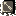

 

※ English names might change as the translation project progresses.

# Overview

- Traps are found on the ground and activate when stepped on.
    - They generally apply a negative effect, but some can be utilized to your advantage.
- Traps are normally hidden, and are revealed when you step on them or do a direct attack above them.
    - They become visible if you eat Sight Grass, equip a Vision Bracelet, or have Trapper status.
    - Springs needed to escape islands or rooms without hallways are always visible.

# Trap List

<table class="trapTable">
  <thead>
    <tr>
      <th>Image</th>
      <th>Name</th>
      <th>Shiren</th>
      <th>Monster</th>
    </tr>
  </thead>
  <tbody>
    <tr>
      <td></td>
      <td>Rage</td>
      <td>Monsters on the floor gain Enraged status. Trapper: Shiren gains Enraged status.</td>
      <td>The monster gains Enraged status.</td>
    </tr>
    <tr>
      <td></td>
      <td>Big Landmine</td>
      <td>Reduces current HP to 1. Nearby foes, items, and walls are destroyed. Onigiri: Instantly collapse.</td>
      <td>The monster vanishes (no experience). Chicken turns into Chicken Meat. Explochin explodes in a chain reaction.</td>
    </tr>
    <tr>
      <td></td>
      <td>Pit</td>
      <td>Descend to the floor below, take 5 damage.</td>
      <td>The monster vanishes (no experience).</td>
    </tr>
    <tr>
      <td></td>
      <td>Spin</td>
      <td>Inflicts Confused status.</td>
      <td>Inflicts Confused status.</td>
    </tr>
    <tr>
      <td></td>
      <td>Bind</td>
      <td>Inflicts Bound status.</td>
      <td>Inflicts Bound status.</td>
    </tr>
    <tr>
      <td></td>
      <td>Wood Arrow</td>
      <td>Take 3~6 damage from a Wood Arrow.</td>
      <td>Take damage equal to Shiren shooting a Wood Arrow.</td>
    </tr>
    <tr>
      <td></td>
      <td>Hunger</td>
      <td>Lower fullness by 10. Effect occurs even with Satiated status.</td>
      <td>The monster vanishes (no experience). Lamp Puffer monsters level up by 1.</td>
    </tr>
    <tr>
      <td></td>
      <td>Alert</td>
      <td>Napping, Asleep, and Slumbering monsters on the current floor all wake up.</td>
      <td>Napping, Asleep, and Slumbering monsters on the current floor all wake up.</td>
    </tr>
    <tr>
      <td></td>
      <td>Trip Stone</td>
      <td>Trip and drop 1~6 items (pots can break). Also receive 2 damage.</td>
      <td>Receive 2 damage.</td>
    </tr>
    <tr>
      <td></td>
      <td>Rust</td>
      <td>Lowers upgrade value of your equipped weapon and shield by 1.</td>
      <td>Lowers defense. Slime monsters level up by 1.</td>
    </tr>
    <tr>
      <td></td>
      <td>Summon</td>
      <td>Up to 4 monsters appear around the trap.</td>
      <td>Up to 4 monsters appear around the trap.</td>
    </tr>
    <tr>
      <td></td>
      <td>Landmine</td>
      <td>Reduces current HP to 1/2. Nearby foes, items, and walls are destroyed. Onigiri: Instantly collapse.</td>
      <td>The monster vanishes (no experience). Chicken turns into Chicken Meat. Explochin explodes in a chain reaction.</td>
    </tr>
    <tr>
      <td></td>
      <td>Sleep</td>
      <td>Inflicts Asleep status.</td>
      <td>Inflicts Asleep status.</td>
    </tr>
    <tr>
      <td></td>
      <td>Strip</td>
      <td>Equipped items become unequipped. (Includes cursed equipment)</td>
      <td>Inflicts Sealed status.</td>
    </tr>
    <tr>
      <td></td>
      <td>Iron Arrow</td>
      <td>Take 9~12 damage from an Iron Arrow.</td>
      <td>Take damage equal to Shiren shooting an Iron Arrow.</td>
    </tr>
    <tr>
      <td></td>
      <td>Spoil</td>
      <td>Onigiri items turn into Spoiled Onigiri. Onigiri: Instantly collapse.</td>
      <td>Monster turns into a Spoiled Onigiri. (no experience)</td>
    </tr>
    <tr>
      <td></td>
      <td>Poison Arrow</td>
      <td>Take 3~6 damage from a Poison Arrow. Also reduces strength by 1.</td>
      <td>Take damage equal to Shiren shooting a Poison Arrow, and lowers attack power.</td>
    </tr>
    <tr>
      <td></td>
      <td>Slow</td>
      <td>Inflicts Slow status.</td>
      <td>Inflicts Slow status.</td>
    </tr>
    <tr>
      <td></td>
      <td>Curse</td>
      <td>1 inventory item gets cursed.</td>
      <td>Inflicts Sealed status. Curse Girl monsters level up by 1.</td>
    </tr>
    <tr>
      <td></td>
      <td>Spring</td>
      <td>Warp to a different spot on the floor.</td>
      <td>Warp to a different spot on the floor.</td>
    </tr>
    <tr>
      <td></td>
      <td>Log</td>
      <td>Log flies at you from the right and deals 5 tiles of knockback and 5 damage.</td>
      <td>Log flies at the monster from the right and deals 5 tiles of knockback and 5 damage.</td>
    </tr>
    <tr>
      <td></td>
      <td>Rockfall</td>
      <td>Receive 20 damage.</td>
      <td>Receive 20 damage.</td>
    </tr>
  </tbody>
</table>
